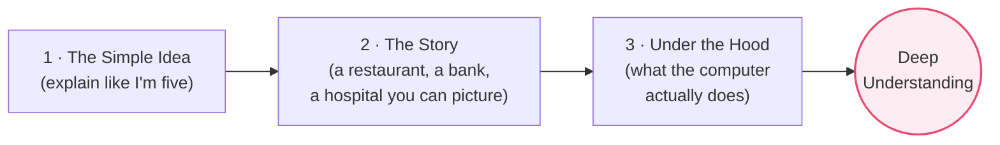
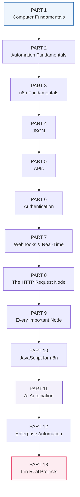

From Absolute Zero to Enterprise AI

# The n8n Automation Handbook

A Feynman-Style Journey from "What is a computer?" to Designing, Debugging, and Deploying Production-Grade AI Workflows

Beginner → Intermediate → Advanced → Enterprise

A complete, visual, story-driven textbook Written to be understood, not memorized

# How to Read This Book Preface

## A promise to you

You picked up this book knowing, perhaps, *nothing*. Maybe you have never written a line of code. Maybe the word "server" makes you picture a waiter in a restaurant. **Good.** That waiter picture is going to help you more than you think — we will use it in Chapter 1.

This book makes one promise: **we will never assume you already know something.** Every technical word is explained in plain English *before* it is used. Every lesson is built on the one before it, like bricks in a wall. If you read the chapters in order, you will never hit a wall you cannot climb.

Our goal is not to make you *memorize* n8n. Tools change. Buttons move. Menus get renamed. The goal is to make you **deeply understand automation** — how computers talk to each other, how data flows, why systems are built the way they are — so that one day you can architect enterprise AI systems with confidence.

## The teaching method

We teach the way the physicist **Richard Feynman** taught: if you cannot explain something simply, you do not truly understand it. So every important idea in this book is explained *at least three times*, in three different ways:

## The anatomy of every lesson

Most core lessons follow the same repeating shape. Once you learn the rhythm, the book becomes easy to navigate — you always know where to look for the story, or the diagram, or the code.

| Section | What you'll find there |
|---------|------------------------|
| 🧒 **What is it?** | The idea explained with zero jargon |
| 💡 **Why was it invented?** | The problem it solves — why we couldn't live without it |
| 📖 **Story** | A memorable scene (airport, pharmacy, bank…) that makes it unforgettable |
| 🔗 **Real-Life Analogy** | The idea mapped onto everyday objects |
| ⚙️ **How It Works** | Tiny step-by-step — we watch the computer *think* |
| 🖥️ **Inside n8n** | Where the node lives, every setting, why each exists |
| 🔬 **Under the Hood** | Protocols, networking, computer science — the real machinery |
| 🏢 **Business Examples** | Ten+ real uses across industries |
| 🛠️ **Complete Workflow** | A full production-quality build, node by node |
| ⚠️ **Common Mistakes** | Beginner, intermediate, and professional traps + debugging |
| 🏆 **Best Practices** | Security, performance, scalability, maintainability |
| ❓ **Review Questions** | Ten questions to test yourself |
| 🚀 **Mini Project** | A hands-on challenge (we don't solve it — you do) |
| 📝 **Summary** | A one-page recap |

## The callout boxes

Throughout the book you will meet colored boxes. Learn them now:

> [!NOTE]
> A **Note** adds helpful context or a definition. Blue means "good to know."

> [!TIP]
> A **Best Practice** is how professionals do it in the real world. Green means "do it this way."

> [!WARNING]
> A **Warning** is a trap that will bite you. Orange means "careful here."

> [!DEBUG]
> A **Debugging Tip** helps you find and fix problems when things break. Pink means "when it's on fire, read this."

> [!BEST]
> A **Production Standard** is a rule you must follow when real money, real patients, or real customers depend on your workflow.

## The full map of the journey

The book is organized into **13 Parts**. Each Part is a milestone. You start not knowing what software is; you finish able to design a hospital appointment system or an AI research agent.

## Master Table of Contents

**PART 1 — Computer Fundamentals**
1.1 What is Software? · 1.2 What is Hardware? · 1.3 Client vs Server · 1.4 The Internet · 1.5 The Browser · 1.6 URL · 1.7 DNS · 1.8 HTTP · 1.9 HTTPS · 1.10 Request · 1.11 Response · 1.12 Status Codes

**PART 2 — Automation Fundamentals**
2.1 What is Automation? · 2.2 What is a Workflow? · 2.3 Trigger · 2.4 Action · 2.5 Logic · 2.6 Data Flow

**PART 3 — n8n Fundamentals**
3.1 Introduction · 3.2 The Interface · 3.3 Executions · 3.4 Nodes · 3.5 Connections · 3.6 Expressions

**PART 4 — JSON**
4.1 What is JSON? · 4.2 Objects · 4.3 Arrays · 4.4 Nested Objects · 4.5 Parsing · 4.6 Transformation

**PART 5 — APIs**
5.1 What is an API? · 5.2 REST · 5.3 SOAP · 5.4 GraphQL · 5.5 Endpoints · 5.6 Headers · 5.7 Query Params · 5.8 Request & Response Bodies · 5.9 Pagination · 5.10 Rate Limits · 5.11 Versioning

**PART 6 — Authentication**
6.1 API Keys · 6.2 Bearer Tokens · 6.3 OAuth 2.0 · 6.4 JWT · 6.5 Access & Refresh Tokens · 6.6 Sessions & Cookies

**PART 7 — Webhooks & Real-Time**
7.1 Polling vs Webhooks · 7.2 Events · 7.3 Real-Time Systems

**PART 8 — The HTTP Request Node** · every field, every option

**PART 9 — Every Important n8n Node** · from Manual Trigger to AI Agent & MCP

**PART 10 — JavaScript for n8n** · only what you need

**PART 11 — AI Automation** · LLMs, Prompting, RAG, Embeddings, Vector DBs, Memory, MCP, Agents

**PART 12 — Enterprise Automation** · Monitoring, Logging, Retries, Queues, Errors, Secrets, Security, CI/CD, Scaling

**PART 13 — Ten Real Projects** · Pharmacy AI, WhatsApp Support, Invoicing, Payroll, Hospital, Inventory, Email AI, Fintech, CRM, Research Agent

> [!NOTE]
> Each Part is delivered as its own numbered PDF chapter so you can print, study, and carry one milestone at a time. This front matter is your map; keep it handy.

---

*Turn the page. We begin where all computing begins — with the difference between the machine you can touch and the ghost that lives inside it.*
