# Computer Fundamentals <span class="kicker">Part 1 · Chapter 1</span>

Before we can automate anything, we must understand the world our automations live in. That world is made of computers talking to other computers. So Part 1 answers the most basic question of all: **when you click a button, what actually happens?**

By the end of this chapter you will understand software, hardware, clients, servers, the internet, browsers, URLs, DNS, HTTP, HTTPS, requests, responses, and status codes — the twelve words that every automation engineer uses every single day.

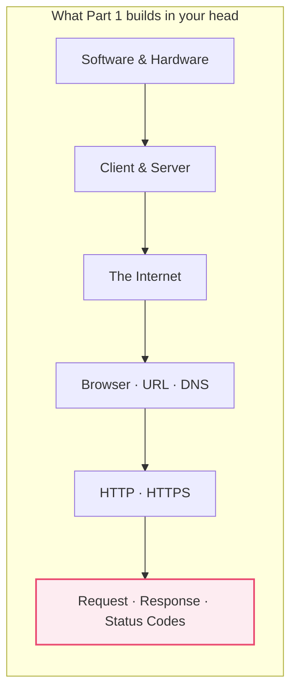

---

## 1.1 What is Software?

### 🧒 What is it?

Imagine you have a **player piano** — a piano that can play itself. The piano is the machine. But a piano sitting there does nothing. To make music, you feed it a long paper roll with holes punched in it. The holes tell the piano which keys to press and when.

**Software is the paper roll. It is a list of instructions that tells a machine what to do.**

Software is not a physical thing you can hold. It is *ideas written down in a language the machine understands*. When people say "an app," "a program," "a website," or "a script" — they are all talking about software: instructions.

### 💡 Why was it invented?

Early machines could do only *one* job. A calculator could only calculate. If you wanted it to do something new, you had to physically rebuild it — rewiring metal by hand. That was slow and expensive.

Software solved this: instead of rebuilding the machine, you just **change the instructions**. The same computer can be a calculator in the morning, a music player at noon, and a pharmacy inventory system at night — simply by feeding it different software.

> [!NOTE]
> This is the single most important idea in all of computing: **the machine is general-purpose; the software gives it a purpose.** Automation, which this whole book is about, is just *the art of writing very good instructions.*

### 📖 Story — The Chef and the Recipe

A kitchen has a chef (the machine) with knives, pans, and a stove (the hardware). The chef is skilled but has no ideas of their own. Every dish they make comes from a **recipe card** (the software).

- Recipe for pancakes → chef makes pancakes.
- Recipe for soup → *same chef, same kitchen* → makes soup.

Change the card, change the result. n8n, which you will master in this book, is a way of **writing recipe cards for computers** — but with pictures instead of words.

### 🔗 Real-Life Analogy

| Everyday thing | Its "software" |
|----------------|----------------|
| Player piano | The punched paper roll |
| Chef | The recipe |
| Actor | The script |
| GPS in your car | The map + routing program |
| Your phone | Every app on the home screen |

### ⚙️ How It Works (watch the computer think)

1. A programmer writes instructions in a **programming language** (words humans can read, like `if temperature > 100 then ringAlarm`).
2. A translator program turns those words into **machine code** — pure numbers, the only language the machine truly understands.
3. The machine's brain reads those numbers one by one and obeys, billions of times per second.

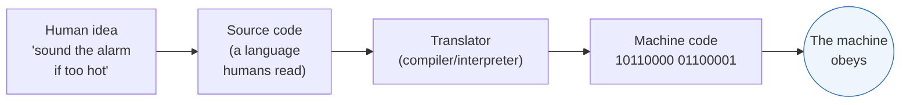

---

## 1.2 What is Hardware?

### 🧒 What is it?

**Hardware is everything you can physically touch.** The screen, the keyboard, the little chips inside, the wires. If software is the *soul* (ideas), hardware is the *body* (the machine that carries out the ideas).

Software without hardware is a recipe with no kitchen — just paper. Hardware without software is a kitchen with no chef and no recipe — it just sits there. **You need both.**

### 🔗 Real-Life Analogy — The Human Body

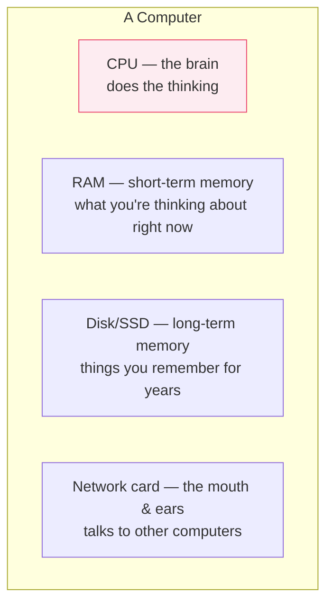

| Hardware part | Human equivalent | Its job |
|---------------|------------------|---------|
| **CPU** (processor) | Brain | Does all the thinking and math |
| **RAM** (memory) | Short-term memory | Holds what you're working on *right now*; forgotten when powered off |
| **Disk / SSD** | Long-term memory | Stores files permanently, even when off |
| **Network card** | Mouth & ears | Sends and receives messages to other computers |

> [!NOTE]
> A **server** (coming next) is just hardware — usually a very powerful computer in a data center — running software whose job is to *serve* other computers. Nothing magical. It's a strong body running a specific recipe.

---

## 1.3 Client vs Server

This is the most important pair of words in this entire book. Automation is almost always one computer (a **client**) asking another computer (a **server**) to do something. Get this, and everything else clicks.

### 🧒 What is it?

- A **client** is the one who *asks*. ("Can I have a burger?")
- A **server** is the one who *serves*. ("Here is your burger.")

That's it. The client makes a **request**; the server sends back a **response**.

### 📖 Story — The Restaurant

Picture a restaurant. You sit at a table. You are the **client**. You don't go into the kitchen; you don't cook. You just *ask*.

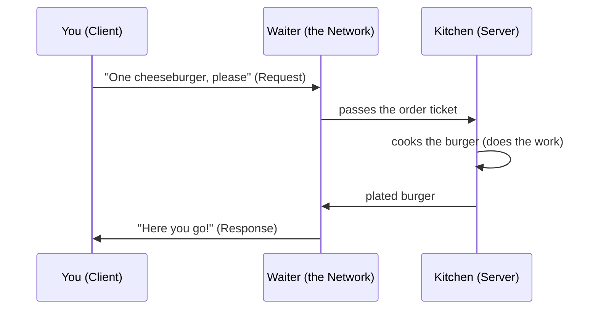

- **You** = the client (a browser, a phone app, or an n8n workflow).
- **The kitchen** = the server (a powerful computer somewhere far away).
- **The waiter** = the internet, carrying messages back and forth.
- **Your order** = the *request*. **The burger** = the *response*.

You don't need to know *how* the kitchen cooks. You only need to know how to *order politely* and *what to expect back*. **That is exactly what an API is** — the menu and the rules for ordering. (We'll get there in Part 5.)

### 🔗 Real-Life Analogy

| Client (asks) | Server (serves) |
|---------------|-----------------|
| You at a restaurant | The kitchen |
| A customer at a bank counter | The bank vault + teller |
| A patient at a pharmacy window | The pharmacist behind it |
| Your web browser | The website's computer |
| Your n8n workflow | The Slack / Google / OpenAI computer |

### ⚙️ How It Works

1. The client opens a connection to the server (like walking up to the counter).
2. The client sends a **request** describing what it wants.
3. The server reads the request, does the work (looks up data, saves a file, runs a calculation).
4. The server sends a **response** back.
5. The connection can close, or stay open for more.

### 🔬 Under the Hood

A single computer can be *both* a client and a server at different moments. When your n8n workflow calls Slack, n8n is the **client** and Slack is the **server**. But when Slack later sends an event *to* your n8n webhook, Slack becomes the **client** and n8n becomes the **server**. **Client and server are roles, not machines** — like "speaker" and "listener" in a conversation. You switch roles constantly.

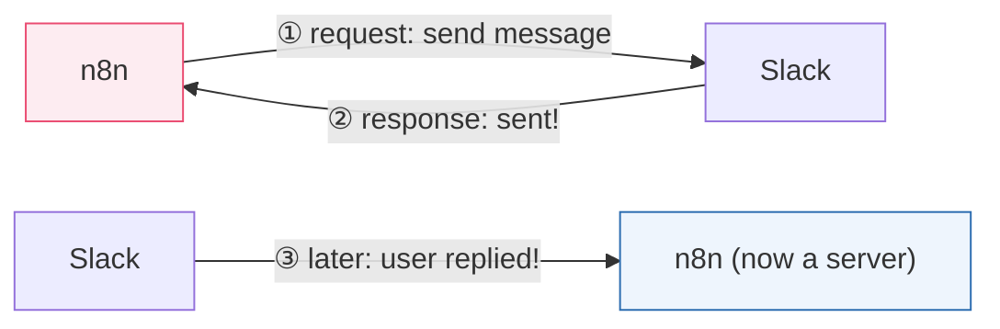

> [!TIP]
> Whenever you're confused about a workflow, ask yourself two questions: **"Who is the client here? Who is the server?"** Nine out of ten confusions dissolve instantly.

---

## 1.4 The Internet

### 🧒 What is it?

The **internet** is a giant network of roads that connects every computer on Earth so they can send messages to each other. It is not a single thing you can point to — it is *millions of cables, radio waves, and machines* all agreeing to pass messages along.

### 📖 Story — The Global Post Office

Imagine every computer in the world has a **postal address**. When you send a letter (a message), you don't need to know the exact route. You drop it in the box, and a chain of post offices (called **routers**) hand it from one to the next until it reaches the right address. The internet is that postal system — but the letters travel around the world in *milliseconds*.

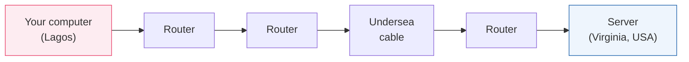

### 🔬 Under the Hood — Packets and IP Addresses

Messages are not sent as one big lump. They are chopped into small pieces called **packets**, like tearing a long letter into numbered postcards. Each packet travels independently and may take a different road. At the destination, they're reassembled in order.

Every device has an **IP address** — its postal address on the internet, like `142.250.72.14`. This is the number the postal system actually uses to deliver packets.

> [!NOTE]
> **IP** stands for *Internet Protocol* — a **protocol** is simply an agreed-upon set of rules everyone follows so communication works. Like agreeing that a red light means stop. Without shared protocols, computers would talk gibberish at each other.

---

## 1.5 The Browser

### 🧒 What is it?

A **browser** (Chrome, Safari, Firefox, Edge) is a program whose whole job is to be a **very polite, very fast client**. You type a web address, and the browser goes and *asks* the right server for that page, receives the response, and *paints it* on your screen so it looks nice.

### ⚙️ How It Works

1. You type `google.com` and press Enter.
2. The browser figures out the server's IP address (via **DNS** — next section).
3. It sends an **HTTP request** to that server.
4. The server sends back an **HTTP response** full of text (HTML, CSS, JavaScript).
5. The browser reads that text and draws the beautiful page you see.

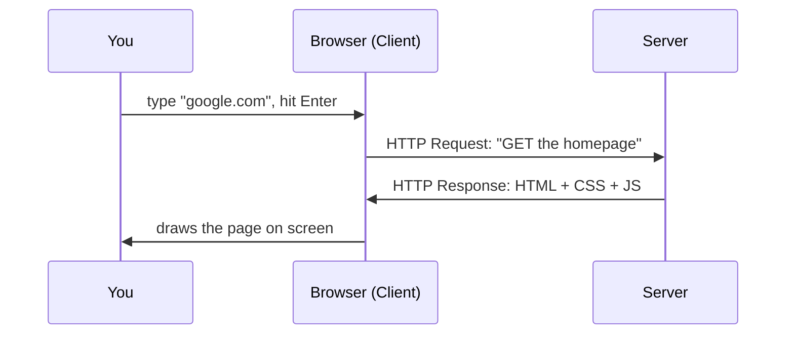

> [!NOTE]
> n8n's **HTTP Request node** (all of Part 8) is essentially "a browser without the screen." It does steps 1–4 — asking a server and receiving the response — but instead of *drawing* the page, it hands the raw data to your workflow to use. Understanding the browser *is* understanding automation.

---

## 1.6 URL

### 🧒 What is it?

A **URL** (Uniform Resource Locator) is the **full address of one specific thing on the internet** — like a complete postal address that names not just the building but the exact apartment, floor, and mailbox.

### 🔬 Anatomy of a URL

Let's dissect a real one, piece by piece:

```
https://api.pharmacy.com:443/v1/orders?status=paid&limit=10#section
└─┬─┘   └──────┬───────┘ └┬┘└───┬────┘ └────────┬────────┘ └──┬──┘
scheme     host/domain   port  path         query string    fragment
```

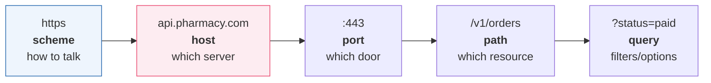

| Part | Example | Plain-English meaning |
|------|---------|-----------------------|
| **Scheme** | `https` | The *language/protocol* to use (secure HTTP) |
| **Host (domain)** | `api.pharmacy.com` | *Which* server you want |
| **Port** | `:443` | Which "door" on that server (like an apartment number) |
| **Path** | `/v1/orders` | *Which* specific resource on that server |
| **Query string** | `?status=paid&limit=10` | Extra options/filters ("only paid ones, max 10") |
| **Fragment** | `#section` | A spot *within* the page (browser-only) |

> [!TIP]
> In automation you will build URLs constantly. Memorize the pattern **scheme → host → path → query**. When an API call fails, walk this list: is the scheme right? the host? the path? the query parameters? It's a checklist that finds most bugs.

---

## 1.7 DNS

### 🧒 What is it?

Computers find each other using numbers (**IP addresses** like `142.250.72.14`). But humans are terrible at remembering numbers. **DNS (Domain Name System) is the phonebook of the internet** — it translates a friendly name like `google.com` into the number the machines actually use.

### 📖 Story — The Contacts App

You don't memorize your best friend's phone number. You just tap "Mom" and your phone looks up the real number for you. DNS is the internet's contacts app: you say `netflix.com`, and DNS quietly looks up `52.6.137.65`.

### ⚙️ How It Works

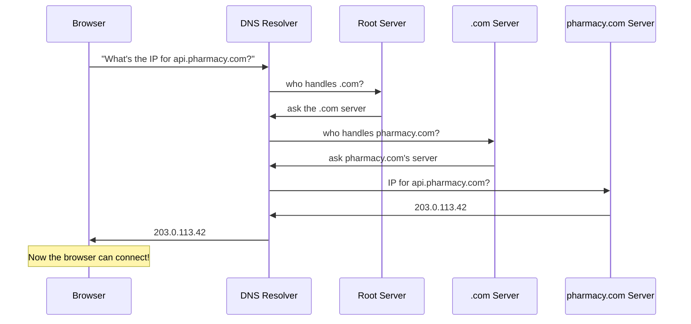

> [!DEBUG]
> "It works in my browser but not in my workflow!" is often a DNS or typo problem. If an automation says *"could not resolve host"* or *"ENOTFOUND"*, the machine couldn't find the address in the phonebook — you probably misspelled the domain. Read the host part of your URL character by character.

---

## 1.8 HTTP

### 🧒 What is it?

**HTTP (HyperText Transfer Protocol) is the language clients and servers use to talk on the web.** Remember the restaurant: the client orders, the server serves. HTTP is the *grammar of that conversation* — the agreed way to phrase an order and phrase a reply.

### 💡 Why was it invented?

Before HTTP, every computer maker had its own way of asking for documents — total chaos, like everyone speaking a different language at the same dinner table. HTTP was invented (1989–1991) so that *any* client could talk to *any* server using one shared, simple set of rules. That shared rule set is why the web could grow to billions of pages.

### 🔬 The HTTP Methods (verbs)

Every HTTP request has a **method** — a verb describing *what kind* of action you want. These map to real-world actions beautifully:

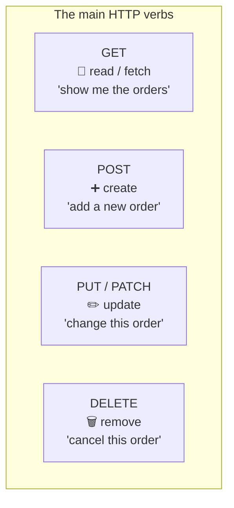

| Verb | Means | Restaurant analogy | Changes data? |
|------|-------|--------------------|:---:|
| **GET** | Read something | "Show me the menu" | No (safe) |
| **POST** | Create something new | "Place a new order" | Yes |
| **PUT** | Replace something entirely | "Redo my whole order" | Yes |
| **PATCH** | Change part of something | "Just swap the fries for salad" | Yes |
| **DELETE** | Remove something | "Cancel my order" | Yes |

> [!NOTE]
> These four verbs (GET, POST, PUT/PATCH, DELETE) are the heart of almost every API you will ever touch. People shorthand them as **CRUD**: **C**reate, **R**ead, **U**pdate, **D**elete.

### 🔬 Under the Hood — What an HTTP message actually looks like

An HTTP request is just **plain text** in a strict format. Here is a real one:

```http
POST /v1/orders HTTP/1.1
Host: api.pharmacy.com
Authorization: Bearer sk_live_9f2...
Content-Type: application/json

{
  "drug": "Amoxicillin 500mg",
  "quantity": 30
}
```

- **Line 1** — the *method*, the *path*, and the HTTP version.
- **The middle lines** — **headers**: extra info about the request (who you are, what format you're sending).
- **A blank line** — separates headers from body.
- **The body** — the actual data you're sending (here, in JSON — all of Part 4).

The response comes back in the same shape (a status line, headers, a blank line, then the body). *That's the whole secret of the web.* It's just formatted text traveling over the internet.

---

## 1.9 HTTPS

### 🧒 What is it?

**HTTPS is HTTP with a lock on it.** The "S" means **Secure**. It's the exact same conversation as HTTP, but scrambled so that nobody sneaking on the wire in between can read it.

### 📖 Story — The Sealed Envelope

Plain **HTTP** is like mailing a **postcard**: every postal worker who handles it can read every word. Fine for "wish you were here" — a disaster for a patient's prescription or a bank password.

**HTTPS** is like sealing your letter in a **tamper-proof, locked envelope** that only the recipient can open. Even if a thief grabs it mid-journey, all they see is scrambled nonsense.

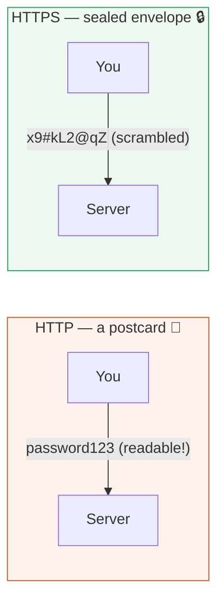

### 🔬 Under the Hood — TLS and certificates

The scrambling is done by a protocol called **TLS** (Transport Layer Security). When your browser connects:

1. The server presents a **certificate** — a digital ID card proving it really is `pharmacy.com` and not an impostor. Certificates are issued by trusted authorities everyone agrees to believe.
2. Client and server perform a **handshake**: they agree on a secret key that only they two know.
3. Everything after that is encrypted with that key. Eavesdroppers see only gibberish.

> [!BEST]
> **Never send data over plain HTTP in production.** Passwords, API keys, patient records, payment details — all must travel over HTTPS. In this book, every URL we call is `https://`. If an API offers only `http://`, treat that as a red flag.

> [!WARNING]
> That little padlock 🔒 in your browser means the *connection* is encrypted — **not** that the website is honest. Scammers can have padlocks too. HTTPS protects the *road*, not the *destination's character*.

---

## 1.10 Request

### 🧒 What is it?

A **request** is the client's message that says *"please do this for me."* It's the customer's order slip. Everything your automations do begins with sending a well-formed request.

### 🔬 The four parts of every request

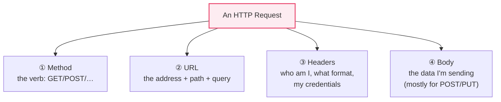

| Part | Question it answers | Example |
|------|---------------------|---------|
| **Method** | *What kind* of action? | `POST` (create) |
| **URL** | *Where* / *which* resource? | `https://api.pharmacy.com/v1/orders` |
| **Headers** | *Who am I* and *what format*? | `Authorization`, `Content-Type: application/json` |
| **Body** | *What data* am I sending? | `{ "drug": "Amoxicillin", "quantity": 30 }` |

> [!NOTE]
> **GET** requests usually have **no body** — you're just asking to read, so you put any filters in the *query string* instead (`?status=paid`). **POST/PUT/PATCH** carry the new data in the **body**. This single fact confuses many beginners; memorize it now.

---

## 1.11 Response

### 🧒 What is it?

A **response** is the server's reply — the burger coming back to your table. It tells you two things: **did it work?** (the status code) and **here is the result** (the body).

### 🔬 The three parts of every response

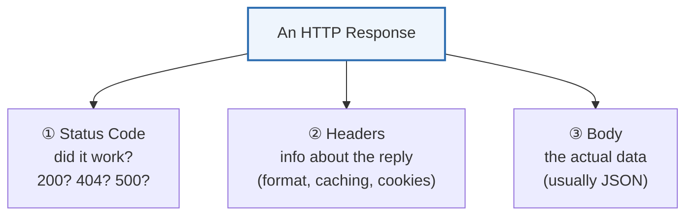

A typical response looks like this:

```http
HTTP/1.1 201 Created
Content-Type: application/json

{
  "id": "ord_10482",
  "drug": "Amoxicillin 500mg",
  "quantity": 30,
  "status": "confirmed"
}
```

The server says `201 Created` ("I made your new order"), then hands back the created order — including the new `id` it assigned. In your workflow, that `id` is gold: you'll use it in the *next* step (to send a confirmation SMS, log it, charge a card…). **This is data flow, the soul of automation** (Part 2).

---

## 1.12 Status Codes

### 🧒 What is it?

A **status code** is a **three-digit number the server sends back to tell you, at a glance, how things went.** Think of it as the server's facial expression: a smile, a shrug, or a panic.

### 🔬 The five families

Status codes are grouped by their first digit. Learn the *families*, not all the numbers:

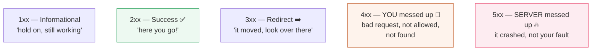

| Family | Meaning | Who's at fault | Feeling |
|:------:|---------|:--------------:|---------|
| **1xx** | Informational, still processing | — | "One moment…" |
| **2xx** | ✅ Success | — | 😀 "Done!" |
| **3xx** | Redirect — it's somewhere else | — | 👉 "Look over there" |
| **4xx** | ❌ **Your** request was wrong | **You (the client)** | 🙋 "You made a mistake" |
| **5xx** | 🔥 **Server** failed | **The server** | 😱 "*I* broke" |

### The codes you must know by heart

| Code | Name | What it really means |
|:----:|------|----------------------|
| **200** | OK | It worked (for GET). |
| **201** | Created | Your POST created a new thing. |
| **204** | No Content | It worked, but there's nothing to send back (common after DELETE). |
| **301 / 302** | Moved | The resource lives at a new URL now. |
| **400** | Bad Request | Your request was malformed — bad JSON, missing field. |
| **401** | Unauthorized | You didn't prove who you are (bad/missing credentials). |
| **403** | Forbidden | We know who you are — you're just *not allowed*. |
| **404** | Not Found | That URL/resource doesn't exist. Check your path. |
| **429** | Too Many Requests | You're going too fast — slow down (rate limits, Part 5). |
| **500** | Internal Server Error | The server crashed. Not your fault. |
| **502 / 503** | Bad Gateway / Unavailable | The server is down or overloaded. Try again later. |

> [!TIP]
> The fastest debugging instinct in all of automation: **read the first digit.** A **4xx** means *fix your request* (wrong URL, missing token, bad data). A **5xx** means *the other server is having a bad day* — retry later; there's nothing wrong with your workflow. This one habit will save you hundreds of hours.

> [!DEBUG]
> **401 vs 403** trips up everyone. **401** = "I don't know who you are" → your API key/token is missing or wrong. **403** = "I know exactly who you are, and you can't do this" → your credentials are valid but lack permission. Different fixes entirely.

---

## 🏢 Business Examples — Part 1 concepts in the real world

To prove these twelve words are not academic, here is how they show up on the job across industries:

1. **Healthcare** — A hospital's booking site (client) sends a `POST` **request** over **HTTPS** to the records **server**; a `201` **status code** confirms the appointment was created.
2. **Pharmacy** — An inventory system does a `GET` on `https://api.supplier.com/stock?drug=insulin`; a `200` returns current stock levels as JSON.
3. **Fintech** — A payment app's **DNS** lookup finds the bank's IP; **TLS** secures the card details; a `402`/`200` decides approve-or-decline.
4. **Education** — An e-learning **browser** requests a lesson **URL**; the **server** responds with video and quiz data.
5. **Government** — A tax portal returns `403 Forbidden` when a citizen tries to view another person's filing — same identity, wrong permission.
6. **Banking** — A `429 Too Many Requests` throttles a login page under a brute-force attack, protecting accounts.
7. **E-commerce** — "Add to cart" sends a `POST` **request**; the response **body** returns the updated cart total.
8. **Manufacturing** — A factory sensor (client) POSTs temperature readings every second to a monitoring **server**.
9. **Logistics** — A courier app GETs `/shipments/{id}` and shows the customer a live status from the response.
10. **Customer Support** — A helpdesk widget uses **HTTPS** to protect a customer's message in transit to the support **server**.
11. **AI Startups** — Your app (client) POSTs a prompt to `https://api.anthropic.com`; the AI **server** responds with generated text and a `200`.

Every single one is just **client → request → server → response → status code**, secured by **HTTPS**, addressed by a **URL**, found via **DNS**. You now understand the machinery under all of it.

---

## ⚠️ Common Mistakes (Chapter 1)

- **Confusing client and server.** Remember: they are *roles*, and the same machine swaps between them.
- **Forgetting the scheme.** Typing `api.pharmacy.com/orders` with no `https://` — the request won't know how to talk.
- **Putting data in the wrong place.** Trying to send a body with a `GET`, or putting filters in the body instead of the query string.
- **Panicking at 5xx.** A `500` is the *server's* problem — don't rewrite your perfectly good request; retry.
- **Ignoring the padlock's limits.** Assuming HTTPS = trustworthy site. It only means the *connection* is private.
- **Reading only the body, never the status.** Professionals check the status code *first*, every time.

## 🏆 Best Practices (Chapter 1)

> [!BEST]
> **Always HTTPS in production.** Never transmit credentials or personal data over plain HTTP.

> [!BEST]
> **Check the status code before the body.** Branch your workflow on 2xx vs 4xx vs 5xx (you'll do this with the IF node in Part 9).

> [!TIP]
> **Keep a mental checklist for every request:** scheme ✓ host ✓ path ✓ headers (auth + content-type) ✓ body ✓. Most failures are one missing item on this list.

---

## ❓ Review Questions

1. In your own words, what is the difference between **software** and **hardware**? Give an everyday analogy.
2. Explain **client** and **server** using a scenario that is *not* a restaurant.
3. A workflow calls Slack, then Slack later notifies the workflow. In each direction, who is the client and who is the server?
4. Label every part of this URL: `https://api.shop.com:443/v2/products?category=shoes&limit=20`.
5. What does **DNS** do, and what everyday app is it most like?
6. List the five main HTTP **methods** and the CRUD action each performs.
7. What are the **four parts** of an HTTP request? Which part usually carries data for a `POST`?
8. Explain the difference between a **401** and a **403** status code with a real example.
9. Your workflow gets a `500`. Is the problem in your request or the server? What should you do?
10. Why is **HTTPS** described as "a sealed envelope" while HTTP is "a postcard"? What protocol does the sealing?

## 🚀 Mini Project (don't peek at a solution — build it in your head or on paper)

**"Trace a Prescription Refill."**

A patient taps **"Refill"** in a pharmacy mobile app. Draw the *complete* journey of that single tap as a sequence diagram, and label **every** Part 1 concept it touches. Your diagram must show and name:

- the **client** and the **server**,
- the **DNS** lookup that finds the pharmacy's server,
- the **HTTPS** connection (and why it matters here specifically),
- the exact **HTTP method** and **URL** you'd expect,
- the **request** parts (method, URL, headers, body),
- the **response** and a realistic **status code** for both the success case *and* one failure case (e.g., the prescription has expired).

Bonus: write, in plain English, what the app should show the patient for a `201`, a `403`, and a `503`.

---

## 📝 Summary — Chapter 1 on one page

- **Software** is instructions (the recipe); **hardware** is the physical machine (the kitchen). You need both.
- Computers talk as **clients** (who ask) and **servers** (who serve). These are *roles*, and machines switch between them.
- The **internet** is a global postal system; messages travel as **packets** to numeric **IP addresses**.
- A **browser** is a polite, screen-drawing client. n8n's HTTP Request node is "a browser without a screen."
- A **URL** is a full address: **scheme → host → port → path → query → fragment**.
- **DNS** is the internet's phonebook, turning `pharmacy.com` into an IP number.
- **HTTP** is the client–server language; its verbs are **GET, POST, PUT, PATCH, DELETE** (= CRUD).
- **HTTPS** is HTTP sealed inside encryption via **TLS + certificates** — a locked envelope, not a postcard.
- A **request** has four parts: **method, URL, headers, body**.
- A **response** has three parts: **status code, headers, body**.
- **Status codes**: **2xx** success, **3xx** redirect, **4xx** *your* mistake, **5xx** *server's* mistake. Read the first digit first.

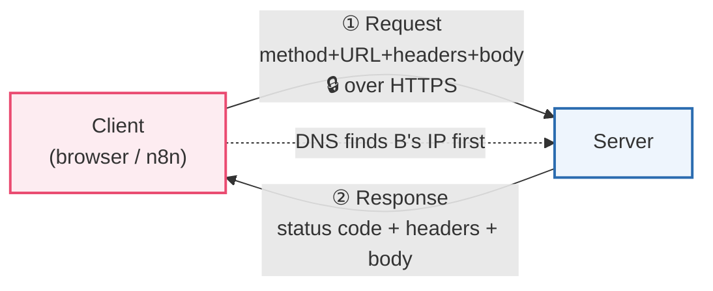

> **You now speak the language of the web.** In Part 2, we take these building blocks and ask the big question: *how do we chain requests and responses together automatically, with no human clicking anything?* That is **automation** — and it's where n8n begins to shine.
