# Automation Fundamentals <span class="kicker">Part 2 · Chapter 2</span>

In Part 1 you learned how *one* computer asks *another* for something — request, response, status code. But a human still had to click "send." **Part 2 removes the human.** We learn how to chain those requests and responses together so that work happens *by itself* — the moment it should, without anyone watching.

This is the beating heart of the entire book. Everything in n8n is just a beautiful way to express the six ideas in this chapter: **Automation, Workflow, Trigger, Action, Logic, and Data Flow.**

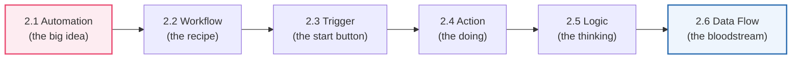

---

## 2.1 What is Automation?

### 🧒 What is it?

Imagine you have a chore you do the same way *every single time*: every morning you wake up, you check if it's raining, and if it is, you bring an umbrella. You do it without thinking. Now imagine a tiny robot helper who watches the weather for you and, the moment it sees rain, silently places an umbrella by your door — **before you even wake up.**

**Automation is teaching a computer to do a repeating task by itself, so a human never has to.** You describe the task *once*, carefully, and the computer repeats it perfectly, forever, day or night, without getting bored, tired, or forgetting.

### 💡 Why was it invented?

Humans are *wonderful* at judgment, creativity, and kindness. Humans are *terrible* at doing the exact same boring thing 10,000 times without a single mistake. We get tired at 4 p.m. We forget step 3. We fat-finger a number. We go home and sleep while the work piles up.

Automation was invented because businesses realized a painful truth:

> The most expensive way to run a company is to pay smart humans to do dumb, repetitive tasks.

Copying data from an email into a spreadsheet. Sending the same reminder. Checking if a payment arrived. These tasks are:

- **Repetitive** — the same steps every time,
- **Rule-based** — no real creativity needed,
- **High-volume** — happening hundreds or thousands of times,
- **Error-prone when done by tired humans.**

That is the *exact* profile of a task a computer should own. Automation frees humans to do the parts only humans can do.

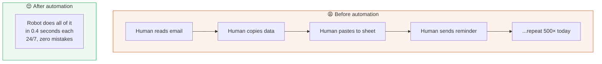

### 📖 Story — The Overwhelmed Pharmacist

Meet Ada, a pharmacist. Every day, prescriptions arrive by email. For each one she must: (1) read the email, (2) check the patient's record, (3) confirm the drug is in stock, (4) log the order in a spreadsheet, and (5) text the patient "your medicine is ready."

Five steps. Two hundred prescriptions a day. That's **1,000 tiny actions**, every day, by hand. By 3 p.m. Ada is exhausted, and mistakes creep in — a wrong dosage logged, a forgotten text. Dangerous.

Then Ada builds an **automation**. Now when a prescription email arrives, a workflow *automatically* reads it, checks stock, logs it, and texts the patient — in under a second, flawlessly. Ada's job transforms: instead of being a human robot, she now *supervises* the robot and spends her real attention on the tricky cases that need a pharmacist's judgment. **That is what automation does: it doesn't replace Ada — it gives Ada her brain back.**

### 🔗 Real-Life Analogy

| Manual life | Automated life |
|-------------|----------------|
| Washing clothes by hand in a river | A washing machine (set it, walk away) |
| Waking up to a rooster and guessing the time | An alarm clock that rings at exactly 6:00 |
| Watering each plant with a cup | A sprinkler on a timer |
| A toll booth worker taking coins from every car | An automatic license-plate toll |
| Ada texting 200 patients by hand | A workflow that texts them instantly |

Notice the pattern: in each case a human once did a repetitive job, and a *machine following instructions* took it over. **The washing machine is automation you can touch. n8n is automation for information.**

### ⚙️ How It Works (the mental model)

Every automation, no matter how fancy, is built from the same three-beat rhythm. Learn this rhythm and you can read any workflow on Earth:

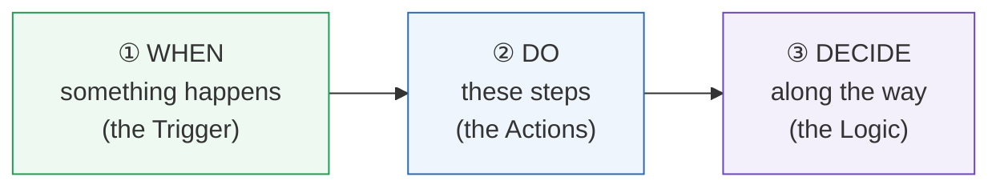

**"WHEN this happens, DO these things, DECIDING as needed."** That's it. That is 100% of automation. A rain sensor (WHEN it rains) places an umbrella (DO) but only if you're going out today (DECIDE). The rest of this chapter zooms into each beat.

### 🔬 Under the Hood

Under the hood, an automation is a **program that runs on a schedule or in response to an event**, rather than in response to a human clicking. The computer keeps a small piece of software *listening* — for a timer, for an incoming message, for a new row in a database. When the listening condition is met, it "fires," and a pre-written sequence of instructions executes.

n8n is what's called a **workflow automation platform** (also "iPaaS" — Integration Platform as a Service). Instead of writing raw code, you draw the instructions as connected boxes. Under those pretty boxes, n8n is running real code, making real HTTP requests (Part 1!), and moving real data. **The boxes are a friendly costume over the same machinery you already understand.**

> [!NOTE]
> Automation is not the same as **AI**. Classic automation follows *fixed rules you wrote* ("if amount > 1000, flag it"). AI automation (Part 11) adds a component that can *reason* about fuzzy things ("is this customer angry?"). You'll master plain automation first — because AI automation is just automation with a smart node dropped in.

---

## 2.2 What is a Workflow?

### 🧒 What is it?

A **workflow is the recipe your automation follows** — the ordered list of steps, drawn as connected boxes, from "start" to "finish." If automation is *the idea of a robot doing your chore*, the workflow is *the exact instruction sheet you hand that robot.*

Each box is a **node** (a single step — you'll meet them formally in Part 3). Arrows connect the boxes to show the order: do this, then this, then this.

### 📖 Story — The Sandwich Recipe

Think of making a sandwich. The *workflow* is:

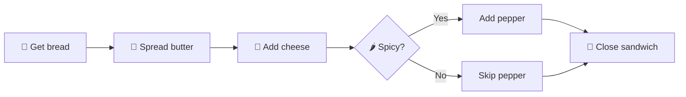

Notice three things this tiny recipe already teaches you:

1. **Order matters.** You butter *before* you close the sandwich. Swap steps and you get a mess. Workflows run **top-to-bottom, left-to-right, following the arrows.**
2. **Each box does one job.** "Get bread" doesn't also make tea. One node, one responsibility.
3. **The path can split.** The `Spicy?` diamond is **logic** — the recipe bends based on a condition. Both paths rejoin at "Close sandwich."

### 🔗 Real-Life Analogy — The Assembly Line

A car factory's assembly line *is* a workflow. A bare chassis enters at one end. Station 1 bolts on the engine. Station 2 adds the doors. Station 3 paints it. Station 4 inspects it — and if it fails, it's routed to a repair bay (logic!). A finished car rolls out the other end.

| Assembly line | Workflow |
|---------------|----------|
| The chassis moving down the belt | The **data** moving through the workflow |
| Each work station | A **node** (one step) |
| The conveyor belt | The **connections** (arrows) |
| The QA inspection gate | A **logic** node (IF/Switch) |
| The finished car | The **result** (email sent, row saved) |

### 🖥️ Inside n8n

In n8n, a workflow is the **canvas** — a big open space where you drag nodes and draw connections between them. It looks like this in spirit:

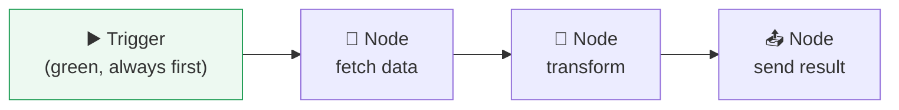

- A workflow **always begins with a trigger node** (the green "start" box). Without a trigger, the workflow has no reason to ever run.
- Nodes are connected by dragging a line from one node's **output dot** (right side) to the next node's **input dot** (left side).
- You can **run the whole workflow manually** to test it, or let its trigger run it automatically.

> [!TIP]
> Give every workflow a clear name ("Pharmacy — Prescription Intake") and a one-line note describing what it does. Six months from now, "My workflow (3)" will mean nothing to you. Professional automation engineers treat workflows like code: named, documented, versioned (Part 12).

### 🔬 Under the Hood

When a workflow runs, n8n walks the graph of nodes in order. Each node receives an input, does its job, and produces an output that becomes the input to the next node. This chained hand-off is exactly the **data flow** we'll dissect in 2.6. Internally, n8n represents your workflow as a **JSON document** (Part 4) describing every node and connection — which is why you can export, back up, and version-control a workflow as a plain text file.

---

## 2.3 Trigger

### 🧒 What is it?

A **trigger is the reason a workflow starts.** It's the answer to the question: *"When should this happen?"* Nothing runs until the trigger says "GO."

Every workflow has **exactly one** starting trigger. It's the green button, the starting pistol, the doorbell.

### 💡 Why was it invented?

Because "do it by itself" needs an answer to *when*. A robot that could act but never knew *when* to act would be useless — it would either do nothing, or do everything constantly. The trigger is the sense organ of the automation: it *watches* the world and wakes the workflow at the right moment.

### 📖 Story — The Doorbell

Your house is the workflow. Most of the time it sleeps. But there's a **doorbell** wired to the front gate. When a visitor presses it, the bell rings, and the house "wakes up" — you get up, walk over, open the door, greet the guest.

- **The visitor arriving** = the event in the outside world.
- **The doorbell** = the trigger.
- **You getting up to answer** = the workflow running.

Without the doorbell, you'd have to *stand at the window all day* watching for visitors. That constant watching is exhausting — and, as we'll see, it's the difference between **polling** and **webhooks** (Part 7).

### 🔬 The three kinds of triggers

Almost every trigger you'll ever use falls into one of three families:

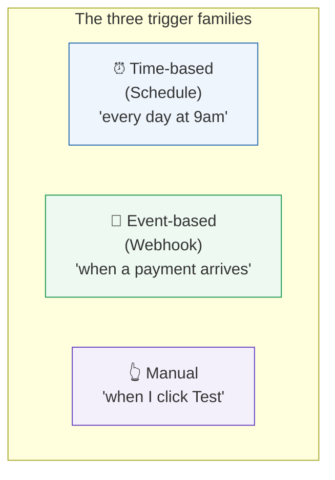

| Trigger type | Fires when… | Real-world example | n8n node |
|--------------|-------------|--------------------|----------|
| **Manual** | *You* click "Test workflow" | Trying out a recipe yourself | Manual Trigger |
| **Schedule (time)** | A clock reaches a set time | "Send the daily report at 8 a.m." | Schedule Trigger |
| **Webhook (event)** | Something *out there* happens | "A customer just paid" | Webhook |
| **App event** | A specific app has news | "New email in Gmail" | Gmail Trigger, etc. |

### 🖥️ Inside n8n

- A trigger node is always the **left-most, green** node on the canvas — the entry point.
- **Manual Trigger** is what you use while *building* and *testing*: click "Test workflow" and it runs once, right now, so you can see what each node produces.
- **Schedule Trigger** has settings for the interval (every N minutes, hourly, a specific time, or a **cron expression** for precise timing like "every Monday at 07:30").
- **Webhook** gives you a unique URL; whenever another system sends a request to that URL, the workflow fires (this is Part 7, and it's how the real-time world works).

> [!WARNING]
> A workflow with **no enabled trigger will never run on its own**, no matter how perfect the rest is. Beginners often build a beautiful workflow, wonder why nothing happens at 9 a.m., and discover the workflow was never *activated*. In n8n, a schedule/webhook trigger only fires automatically when the workflow's **Active** switch is ON. "Test" runs the manual path; "Active" runs the real trigger.

---

## 2.4 Action

### 🧒 What is it?

An **action is a step that actually *does* something** — it changes the world or moves data. If the trigger is "WHEN," the action is the "DO." Sending an email is an action. Saving a row to a database is an action. Charging a credit card is an action.

### 📖 Story — The Waiter's Tasks

Back to our restaurant. Once an order is placed (the trigger), the waiter performs a series of **actions**: carry the ticket to the kitchen, bring bread to the table, refill the water, deliver the plate, drop off the bill. Each of these is a concrete *doing*. Some actions talk to other people (the kitchen = another server, Part 1!). Some just move things around (bread to table = transforming data).

### 🔬 Two flavors of action

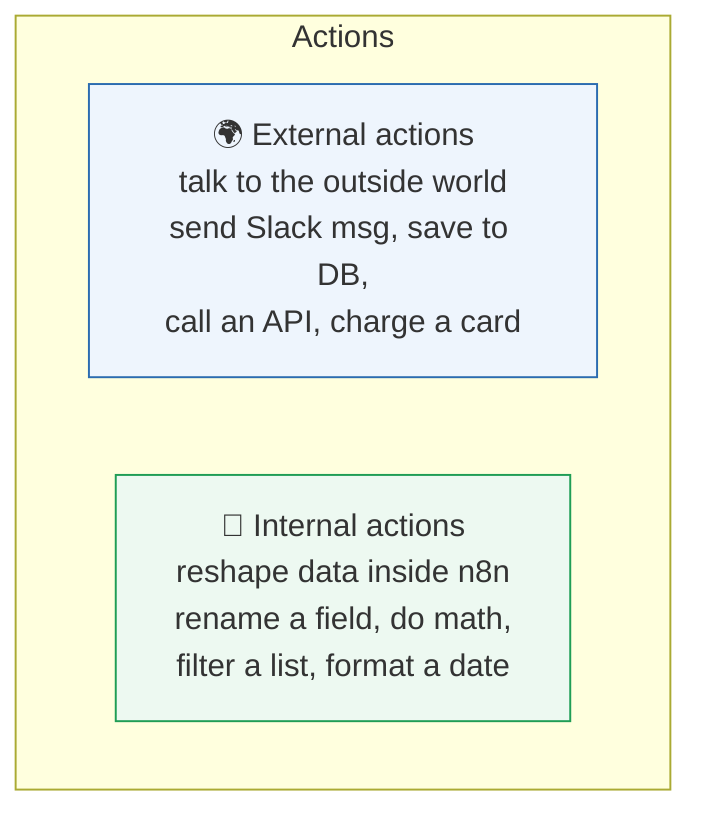

| Flavor | What it does | Examples (n8n nodes) |
|--------|--------------|----------------------|
| **External** | Reaches out to another system (a request → response, Part 1) | HTTP Request, Slack, Gmail, Postgres, OpenAI |
| **Internal** | Transforms data *within* the workflow | Set / Edit Fields, Code, Filter, Sort |

Every external action is *literally* the client–server conversation from Part 1: n8n becomes the **client**, sends a **request**, and reads the **response** and its **status code**. You already understand what happens inside every action node — that's the payoff of learning fundamentals first.

### 🖥️ Inside n8n

Action nodes typically ask you for:

1. **A credential** — how to prove who you are to the other system (Part 6). E.g., your Slack token.
2. **An operation** — *which* action on that app ("Send Message," "Create Row," "Delete User").
3. **Parameters** — the details ("send to channel #alerts", "the message text is…").

Crucially, those parameters can be **filled from earlier data** using expressions (Part 3.6). You don't type the patient's phone number — you say "use the phone number *that came from the trigger*." That dynamic filling is what makes a workflow reusable for every prescription, not just one.

> [!TIP]
> Name your action nodes by *what they accomplish*, not the app: "Notify patient by SMS" reads better than "Twilio1." Future-you, debugging at midnight, will be grateful.

---

## 2.5 Logic

### 🧒 What is it?

**Logic is the workflow's ability to *decide*** — to look at the data and choose a path. Without logic, a workflow is a straight line that treats every case identically. With logic, it can be *smart*: do one thing for VIP customers and another for regular ones; retry on failure; skip weekends.

Logic answers the question: *"It depends — on what?"*

### 📖 Story — The Airport Security Line

At the airport, everyone starts in one line. Then they hit a **decision point**: a security officer checks your ticket.

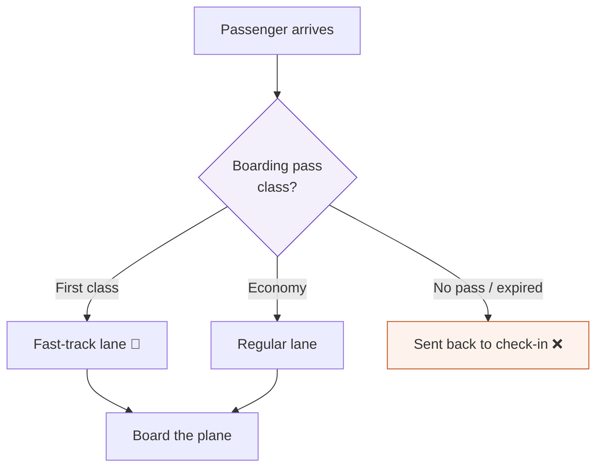

The officer applies **logic**: *based on the data (your ticket), route you down the correct path.* Three different outcomes from one decision. That diamond shape — a question with branching answers — is the single most important symbol in automation.

### 🔬 The building blocks of logic

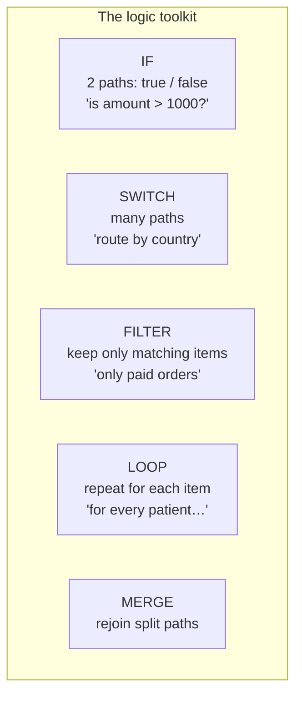

| Logic tool | Question it answers | n8n node |
|------------|---------------------|----------|
| **IF** | "Yes or no?" — two paths | IF |
| **Switch** | "Which of many?" — many paths | Switch |
| **Filter** | "Keep which items?" | Filter |
| **Loop** | "Do this for *each* one" | Loop Over Items |
| **Merge** | "Bring paths back together" | Merge |

### 🔬 Under the Hood — Boolean logic

Every IF decision boils down to a **boolean** — a value that is either **`true`** or **`false`** (named after mathematician George Boole). The computer evaluates your condition (`amount > 1000`) and gets back one of exactly two answers. Conditions can be combined:

- **AND** — *both* must be true (`is VIP` **AND** `amount > 1000`).
- **OR** — *at least one* must be true (`is urgent` **OR** `is VIP`).
- **NOT** — flips it (`NOT paid` = unpaid).

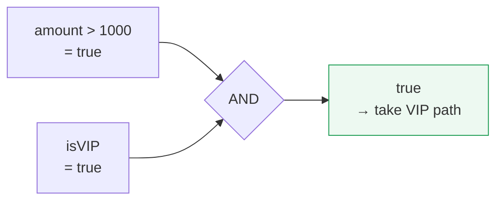

> [!DEBUG]
> The #1 logic bug for beginners: comparing a **number** to **text**. If your data has the amount as the *text* `"1500"` (in quotes) instead of the *number* `1500`, then `"1500" > 1000` may behave strangely. Data *types* matter enormously — you'll master them in Part 4 (JSON). When an IF node "always goes false," suspect a type mismatch first.

---

## 2.6 Data Flow

### 🧒 What is it?

**Data flow is the information moving from node to node** — the stuff that travels down the arrows. If nodes are stations and connections are the conveyor belt, **data is the package riding the belt.** Each node picks up the package, does something to it, and sets it back down for the next node.

This is the concept beginners underestimate the most — and the one professionals obsess over. **Master data flow and you master n8n.**

### 📖 Story — The Hospital Patient Journey

A patient (the data) moves through a hospital (the workflow):

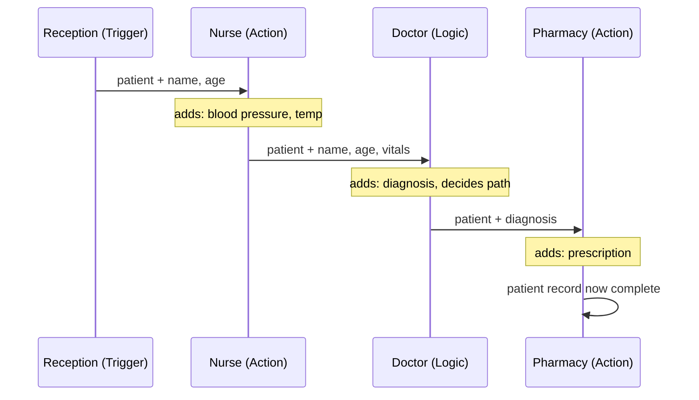

Watch what happens to the **data package** as it travels:

- At **reception**, it holds only `{ name, age }`.
- The **nurse** *adds* vitals: `{ name, age, bloodPressure, temperature }`.
- The **doctor** *adds* a diagnosis and *decides* a route.
- The **pharmacy** *adds* a prescription.

The package **grows and transforms** as it flows. Each station both *reads* what came before and *contributes* something new. **This accumulation is the essence of a workflow.** The final result exists because every station added its piece to the same traveling package.

### 🔬 Under the Hood — items and the shape of n8n data

Here is the one technical fact about n8n you must internalize early: **data in n8n travels as a list of "items," and each item is a little JSON object** (Part 4 makes JSON second nature). If the trigger receives three prescriptions, three items flow down the pipe, and *most nodes run once per item, automatically.*

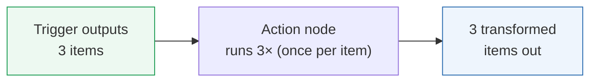

A single item looks like this (don't worry about the exact syntax yet — Part 4):

```json
{
  "json": {
    "name": "Ada",
    "age": 34,
    "diagnosis": "flu"
  }
}
```

Every node reads from the `json` of its incoming item(s) and writes a new `json` for the next node. When you write an **expression** (Part 3.6) like `{{ $json.name }}`, you are reaching into the traveling package and pulling out the `name` field. **That's data flow made concrete.**

### 🖥️ Inside n8n

- Click any node after running, and n8n shows you its **input** (what arrived) and **output** (what it produced) side by side. This input/output panel is your microscope on data flow — you'll live in it.
- Data can be a single item or hundreds. Nodes usually **iterate automatically** — you write the logic once, and it applies to every item.
- Two special moves you'll use constantly: **Split Out** (turn one item containing a list into many items) and **Aggregate** (combine many items back into one). These reshape the flow. (Full treatment in Part 9.)

> [!TIP]
> Before building *any* workflow, sketch the **data shape** at each stage on paper: "Here it has name+age; after the API call it also has vitals; after the doctor node it has a diagnosis." If you know the shape of the package at every station, the nodes practically write themselves.

---

## 🏢 Business Examples — Automation across ten industries

Each example below is the same rhythm — **Trigger → Actions (with Logic) → moving Data** — dressed for a different industry:

1. **Healthcare** — *Trigger:* new lab result posted. *Logic:* if a value is dangerously high. *Action:* page the on-call doctor and log the alert. Data: patient ID + result flows to the alert.
2. **Pharmacy** — *Trigger:* prescription email arrives. *Logic:* in stock? *Action:* log order + SMS the patient; else notify the supplier. (This is Ada's story.)
3. **Fintech** — *Trigger:* a card payment event. *Logic:* amount > threshold or unusual location? *Action:* flag for fraud review; else auto-approve.
4. **Education** — *Trigger:* student submits an assignment. *Action:* timestamp it, store it, email a receipt; *Logic:* if late, apply a penalty tag.
5. **Government** — *Trigger:* a permit application is filed. *Logic:* route by district (Switch). *Action:* assign to the right office and notify the applicant.
6. **Banking** — *Trigger:* schedule, 2 a.m. daily. *Action:* pull yesterday's transactions, reconcile, and email finance the summary report.
7. **E-commerce** — *Trigger:* order paid (webhook). *Actions:* create shipping label, email the customer, decrement inventory; *Logic:* if stock hits zero, alert purchasing.
8. **Manufacturing** — *Trigger:* a machine sensor reports vibration. *Logic:* above safe range? *Action:* create a maintenance ticket and stop the line.
9. **Logistics** — *Trigger:* every 15 minutes. *Action:* poll the carrier API for shipment statuses; *Logic:* if "delayed," text the customer proactively.
10. **Customer Support** — *Trigger:* new support email. *Logic:* detect urgency keywords. *Action:* create a ticket, route to the right team, auto-reply with an ETA.
11. **AI Startups** — *Trigger:* user submits a question. *Action:* send it to an AI model, get an answer, store the conversation; *Logic:* if the AI is unsure, escalate to a human.

---

## 🛠️ Complete Workflow Example — "New Customer Welcome" (built concept-by-concept)

Let's design a complete, production-shaped workflow using *only* the ideas from this chapter. A small online store wants: **when a new customer signs up, save them, send a welcome email, and alert the sales team if the customer is high-value.**

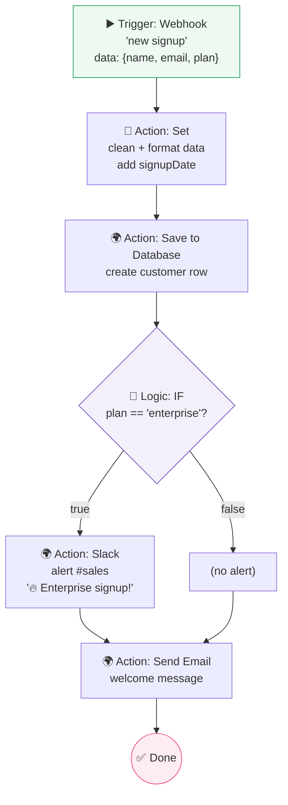

**Why each node exists — narrated as the data flows:**

| # | Node | Type | Why it's here | Data after it |
|---|------|------|---------------|---------------|
| 1 | **Webhook** | Trigger | The signup form POSTs here the instant someone registers (Part 1: n8n is now the *server*) | `{name, email, plan}` |
| 2 | **Set / Edit Fields** | Internal action | Tidy the raw form data; add `signupDate = now` | `{name, email, plan, signupDate}` |
| 3 | **Save to Database** | External action | Persist the customer so the business has a record (Part 1: request → response, gets back a new `id`) | `+ {id}` |
| 4 | **IF** | Logic | Decide: is this a big-money "enterprise" customer? | branches on `plan` |
| 5 | **Slack** | External action | Only on the *true* branch — alert sales to a valuable lead | — |
| 6 | **Send Email** | External action | *Both* branches rejoin here — every customer gets a warm welcome | — |

**Why the workflow works:** the trigger gives it a *reason to run*; the Set node guarantees clean data *shape*; the database node makes the result *durable*; the IF node makes it *smart* (VIPs get special treatment); and the email node ensures *every* path ends with a good customer experience. This is the WHEN → DO → DECIDE rhythm, made real. You will build the actual n8n version of this in Part 3.

---

## ⚠️ Common Mistakes (Chapter 2)

**Beginner:**
- Building a workflow with **no trigger**, then wondering why it never runs.
- Forgetting to flip the workflow to **Active**, so the schedule/webhook never fires.
- Assuming a node runs **once** when the data has many items (it runs *per item*).

**Intermediate:**
- Not thinking about the **data shape** at each step, then being surprised a field is missing.
- Putting **logic** too late — filtering 10,000 items *after* an expensive API call instead of before.
- Comparing a text `"100"` to a number `100` in an IF and getting the wrong branch (type mismatch).

**Professional:**
- No **error path** — when one API call fails, the whole run dies silently (Part 12: error handling).
- Actions with **side effects that can't be undone** (charging a card twice) with no safeguard against double-runs (**idempotency**, Part 12).
- Cramming ten responsibilities into one giant workflow instead of small, composable ones.

## 🏆 Best Practices (Chapter 2)

> [!BEST]
> **One workflow, one clear job.** Small, named, single-purpose workflows are easier to test, debug, reuse, and hand to a teammate. Compose them; don't build a monster.

> [!TIP]
> **Filter early, act late.** Reduce your data to only what matters *before* you make expensive external calls. It's faster, cheaper, and gentler on rate limits (Part 5).

> [!BEST]
> **Design the data shape first, nodes second.** Sketch the traveling package at each stage. Nodes are easy once you know what should be flowing through them.

> [!TIP]
> **Always build with a Manual Trigger while developing**, inspect each node's input/output, and only switch to the real trigger once every step is verified.

---

## ❓ Review Questions

1. In one sentence each, define **automation**, **workflow**, **trigger**, **action**, **logic**, and **data flow**.
2. What is the universal three-beat rhythm of every automation? Give a non-computer example that follows it.
3. Name the three families of triggers and give a real business scenario for each.
4. What is the difference between an **external** action and an **internal** action? Give two examples of each.
5. Why must a workflow be set to **Active** (not just "Test") for a schedule trigger to run on its own?
6. Draw a decision using an **IF** node for: "flag any transaction over ₦500,000 *and* from a new device."
7. Explain, using the hospital story, how the **data package grows** as it flows through nodes.
8. In n8n, if a trigger outputs 5 items, how many times does the next action node run, and why?
9. What is a **boolean**, and how do **AND**, **OR**, and **NOT** combine conditions?
10. Give one beginner, one intermediate, and one professional mistake from this chapter, and how to avoid each.

## 🚀 Mini Project (design it — don't build it yet)

**"The Overdue Invoice Chaser."**

A small business wants to stop chasing late-paying clients by hand. Design (on paper, as a flowchart) a workflow that:

- runs **every morning** (which trigger family?),
- fetches all unpaid invoices from their accounting system (which kind of action?),
- for each invoice, **decides** what to do based on *how* late it is:
  - 1–7 days late → a friendly reminder email,
  - 8–30 days late → a firmer email **and** a Slack ping to the account manager,
  - 30+ days late → escalate to the finance lead and flag the account.

Your deliverable: a labeled flowchart naming every **trigger**, **action**, and **logic** node, plus a note describing the **data shape** (what fields each invoice item carries) at the start and after each major step. *Which logic node fits "many buckets of lateness" better — IF or Switch? Justify your choice.*

---

## 📝 Summary — Chapter 2 on one page

- **Automation** = teaching a computer to do a repetitive, rule-based task by itself, so humans do only what humans are good at.
- Every automation follows one rhythm: **WHEN** something happens (**trigger**) → **DO** steps (**actions**) → **DECIDE** along the way (**logic**), with **data** flowing through it all.
- A **workflow** is the recipe: ordered nodes connected by arrows, running top-to-bottom along the connections. n8n stores it internally as JSON.
- A **trigger** is the single starting point — the reason a workflow runs. Three families: **manual**, **time/schedule**, and **event/webhook**. It must be **Active** to fire on its own.
- An **action** actually *does* something. **External** actions talk to other systems (Part 1's client→server); **internal** actions reshape data inside n8n.
- **Logic** lets the workflow decide and branch (**IF**, **Switch**, **Filter**, **Loop**, **Merge**), built on **booleans** and **AND/OR/NOT**.
- **Data flow** is the traveling package that grows and transforms node by node. In n8n, data is a **list of items**, each a small JSON object; most nodes run **once per item**. Expressions like `{{ $json.field }}` reach into that package.

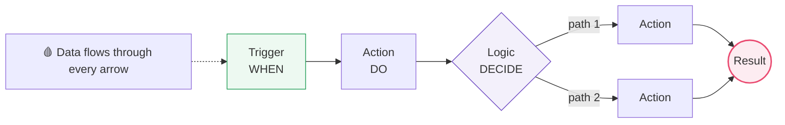

> **You now understand automation itself** — not any one tool, but the timeless ideas beneath every tool. In **Part 3**, we finally open n8n, meet its interface, and turn these six concepts into things you can click, drag, and run.
