# n8n Fundamentals Part 3 · Chapter 3

You now understand the web (Part 1) and automation itself (Part 2). It is finally time to open the tool that turns those ideas into things you can click. This chapter is your guided tour of **n8n**: what it is, the interface you'll live in, how a run (an "execution") actually works, and the three things every workflow is made of — **nodes**, **connections**, and **expressions**.

By the end you'll be able to read any n8n canvas the way you read a sentence.

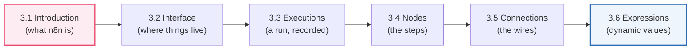

---

## 3.1 Introduction to n8n

### 🧒 What is it?

**n8n is a tool for building automations by connecting boxes instead of writing code.** Remember the recipe from Part 2? n8n lets you *draw* that recipe: you drag a box for each step, draw arrows to show the order, and press play. It's pronounced **"n-eight-n"** — a nerdy shortening of "**n**odematio**n**" (the *8* is the eight letters between the two n's, like i18n for "internationalization").

Think of it as **LEGO for the internet**: each block is a ready-made connector to some service (Gmail, Slack, a database, an AI model), and you snap them together to build machines that move information.

### 💡 Why was it invented?

Before tools like n8n, connecting two apps meant one of two bad options:

1. **Write custom code** — powerful, but you need to be a programmer, handle servers, authentication, retries, errors… weeks of work for a simple "when I get an email, save the attachment to Drive."
2. **Buy a rigid SaaS connector** — easy, but you're locked into whatever the vendor allows, your data lives on *their* servers, and you pay per task forever.

n8n was created (first released 2019 by Jan Oberhauser) to give you **the power of code with the ease of drag-and-drop** — and, crucially, the option to **run it on your own computer or server** (it's *fair-code / source-available*), so your data stays yours. That last point matters enormously in healthcare, finance, and government, where patient and money data legally cannot leave your control.

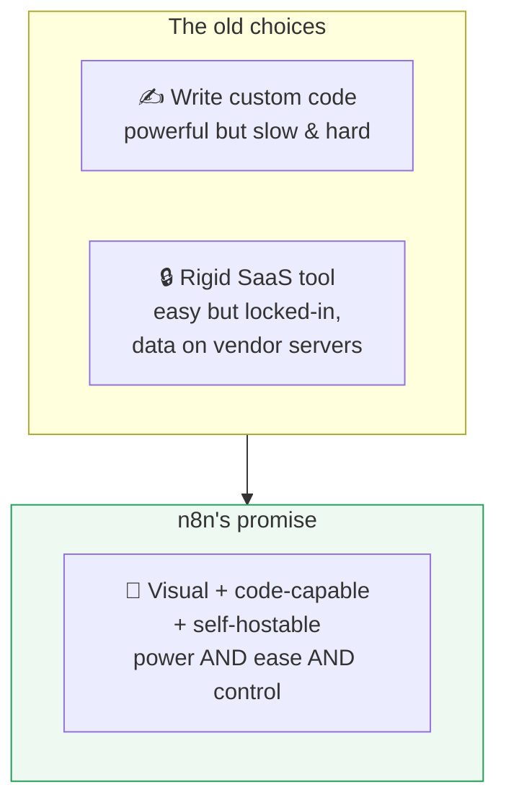

### 📖 Story — The Universal Translator at the Airport

Imagine an international airport where travelers speak 400 different languages (Gmail, Slack, Stripe, Postgres, OpenAI…). Each speaks its own tongue with its own grammar (its API). Chaos.

Now imagine a brilliant multilingual concierge who speaks *all* of them. You tell the concierge, in plain terms, "When a VIP lands, book their car and text their driver." The concierge handles every awkward translation between the airline system, the car service, and the SMS provider. **n8n is that concierge** — it already knows how to talk to hundreds of services, so you only describe *what* you want, not *how* to speak each language.

### 🖥️ Two ways to run n8n

| Flavor | What it is | Best for |
|--------|------------|----------|
| **n8n Cloud** | n8n hosts it for you; sign up and start | Beginners, quick starts, no server skills needed |
| **Self-hosted** | You run n8n on your own machine/server (often via **Docker**) | Full data control, no per-execution cost, enterprise/regulated data |

> [!NOTE]
> **Docker** (which you'll meet properly in Part 12) is a way to run a program in a tidy, self-contained box so it works the same everywhere. `docker run n8n` is the single most common way engineers self-host n8n. For *learning*, n8n Cloud or a local desktop install is perfectly fine — don't let infrastructure slow down your education.

### 🔬 Under the Hood

n8n is a **Node.js** application (Node.js = a way to run JavaScript outside a browser — which is why Part 10's JavaScript matters). It stores your workflows and credentials in a database, exposes a web-based editor (the canvas you'll use), and runs an **execution engine** that walks your nodes in order, calling out to external services via HTTP (Part 1) as needed. Every fancy visual thing you do is compiled down to real code making real requests. **You're not playing with a toy — you're commanding a real automation server through a friendly window.**

---

## 3.2 The Interface

### 🧒 What is it?

The **interface** is the screen you work on — the "cockpit" of n8n. Learn where each control lives now, and you'll never feel lost. Here's the map of the main regions:

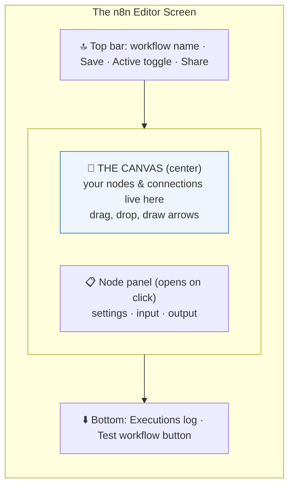

### 🖥️ The regions, one by one

| Region | Where | What you do there |
|--------|-------|-------------------|
| **Canvas** | Center | The infinite whiteboard. Drag nodes, connect them, pan and zoom. This is home base. |
| **Node picker** | Opens with `Tab` or the **+** button | Search 400+ nodes; click to drop one on the canvas. |
| **Node detail panel** | Opens when you click a node | Configure its settings; see **Input** (left) and **Output** (right). |
| **Top bar** | Very top | Rename the workflow, **Save**, toggle **Active** (Part 2!), open Share/Settings. |
| **Executions tab** | Left sidebar / top | The history of every run — your black box recorder (next section). |
| **Test workflow** | Bottom center | The manual "run it now" button used while building. |
| **Credentials** | Left sidebar | Where your saved logins to other apps live (Part 6). |

### ⚙️ How It Works — building your first flow, click by click

Let's narrate the exact clicks to build the "New Customer Welcome" flow you designed in Part 2:

1. **New workflow** → you get a blank canvas with a "+ Add first step" prompt.
2. Click **+**, search "**Manual**", pick **Manual Trigger** (green box appears — every flow needs a start).
3. Hover the trigger's right-side **dot**, drag a wire out, release → the node picker opens.
4. Search "**Edit Fields**" (the Set node), click it — it snaps onto the wire.
5. Click the Set node → the detail panel opens → add a field `signupDate` = an expression (3.6).
6. Repeat: wire → **HTTP Request** (save to DB) → **IF** → **Slack** / **Send Email**.
7. Press **Test workflow** (bottom) → watch each node light up as data flows through.
8. Click any node to inspect its **Input/Output** panels and confirm the data shape.

> [!TIP]
> Learn three keyboard moves and you'll feel like a pro immediately: **`Tab`** opens the node picker, **`Ctrl/Cmd + S`** saves, and dragging on empty canvas **pans** the view. Zoom with the scroll wheel. Small habits, big speed.

> [!NOTE]
> The n8n team refines the UI often, so a button may move or get renamed between versions. This is *why* we anchor on concepts (Part 2) over button locations — the *ideas* never move. When something looks different, ask "which of the six regions is this?" and you'll find it.

---

## 3.3 Executions

### 🧒 What is it?

An **execution is one complete run of your workflow, recorded from start to finish.** Every time your workflow fires — whether you clicked "Test" or a real trigger woke it at 9 a.m. — n8n saves a full recording: which nodes ran, what data went in and out of each, whether it succeeded or failed, and how long it took.

Think of it as the **flight recorder (black box)** of your automation. When something goes wrong, the execution log tells you *exactly* where and why.

### 📖 Story — The Security Camera

Imagine a bank with security cameras on every counter. If money goes missing, the manager doesn't guess — they *replay the tape* and see precisely what happened at 2:47 p.m. at counter 3.

Executions are your security tapes. A patient complains "I never got my SMS!" — instead of guessing, you open that execution, see the SMS node glowing **red** with the message *"Invalid phone number,"* and you've found the problem in ten seconds.

### 🖥️ Inside n8n — reading an execution

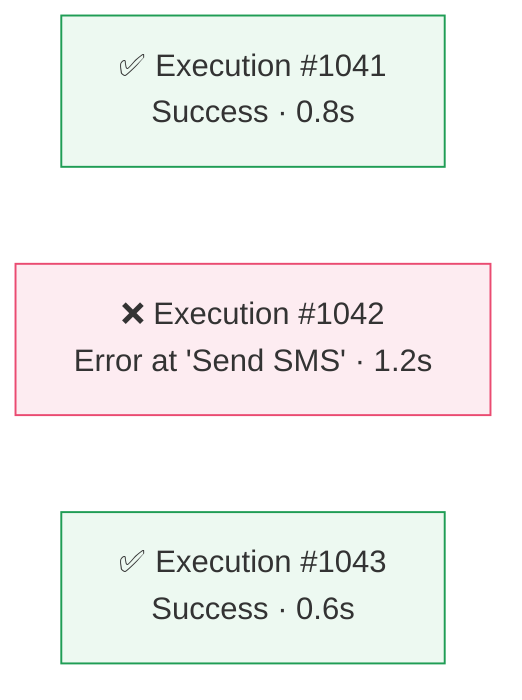

- The **Executions** list shows every run with a **status** (green success / red error), the trigger, timestamp, and duration.
- Click any execution to **open the exact canvas as it ran** — each node shows the real data it processed. Green checkmark = ran fine; red = failed here.
- You can **retry** a failed execution, or **pin** interesting data for testing.

### 🔬 Under the Hood — execution modes and data retention

- **Manual executions** happen when you click Test — great for building, not counted as "production."
- **Production executions** happen when a real trigger (schedule/webhook) fires while the workflow is **Active**.
- n8n can save executions for **all runs**, **errors only**, or **none** — a setting that trades **debuggability** against **storage** and **privacy**.

> [!BEST]
> In production, save **at least all error executions** (many teams save all executions for a limited window). You cannot debug an incident you didn't record. But beware: execution data may contain **sensitive information** (patient data, card numbers). In regulated environments, set retention deliberately and consider not persisting sensitive payloads — this is a real compliance concern, covered in Part 12.

> [!DEBUG]
> **Your #1 debugging tool in all of n8n is the executions view.** When a workflow "doesn't work," never guess. Open the failed execution, find the red node, click it, and read its input and error message. 90% of bugs confess immediately.

---

## 3.4 Nodes

### 🧒 What is it?

A **node is a single step in your workflow — one box that does one job.** A node might fetch data, transform it, make a decision, or send it somewhere. String nodes together with connections and you have a workflow. **Nodes are the vocabulary; workflows are the sentences.**

### 🔬 The anatomy of a node

Every node, whatever it does, shares the same body plan:

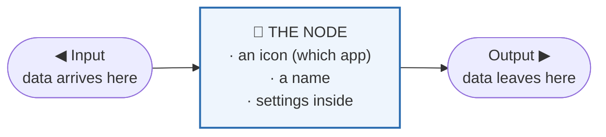

- **Input dot(s)** on the **left** — where data flows *in*.
- **Output dot(s)** on the **right** — where data flows *out* (an IF node has *two* outputs: true and false!).
- **An icon** — tells you at a glance which service/kind it is (the Slack logo, the database symbol).
- **Settings** — revealed when you click it; they control exactly what the node does.

### 🔬 The families of nodes

There are hundreds of nodes, but they come in just a few *kinds*. Recognize the kind, and you know what a node is *for*:

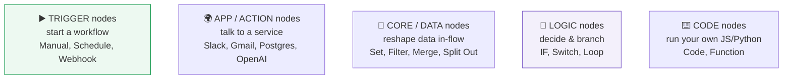

| Kind | Job | Examples | Covered in |
|------|-----|----------|-----------|
| **Trigger** | Start the flow | Manual, Schedule, Webhook | Part 2, 7, 9 |
| **App/Action** | Do something in a service | Slack, Gmail, HTTP Request | Part 8, 9 |
| **Core/Data** | Transform data | Set, Filter, Merge, Aggregate | Part 4, 9 |
| **Logic** | Branch/decide | IF, Switch, Loop | Part 9 |
| **Code** | Custom scripting | Code node | Part 10 |
| **AI** | Reason with an LLM | AI Agent, OpenAI, Anthropic | Part 11 |

### 🖥️ Inside n8n — a node's common settings

Most **app** nodes ask you for three things (you saw this in Part 2.4):

1. **Credential** — the saved login proving who you are (Part 6). *"Which Slack account?"*
2. **Resource + Operation** — the *thing* and the *verb*. *"On a **Message**, do **Send**."* (Notice: this is CRUD from Part 1!)
3. **Fields/Parameters** — the specifics, often filled dynamically with expressions. *"Channel = #sales, Text = {{ …the customer's name… }}."*

> [!TIP]
> When you meet an unfamiliar node, don't panic — click it and read its **Operation** dropdown. It lists everything the node *can* do, in plain verbs. A node is just a menu of actions for one service. Part 9 walks you through the two dozen you'll use most.

---

## 3.5 Connections

### 🧒 What is it?

A **connection is the wire between two nodes** — the arrow that says "after this node finishes, send its output here next." Connections define the **order** and the **path** of your workflow. Data can only travel where a wire exists.

### 📖 Story — The Water Pipes

Picture your workflow as a plumbing system. Each node is a fixture (a tap, a filter, a heater). The **connections are the pipes.** Water (your data) can only reach the heater if a pipe connects the filter's output to the heater's input. No pipe, no water. Draw the pipe wrong, and water goes to the wrong fixture — or floods the floor.

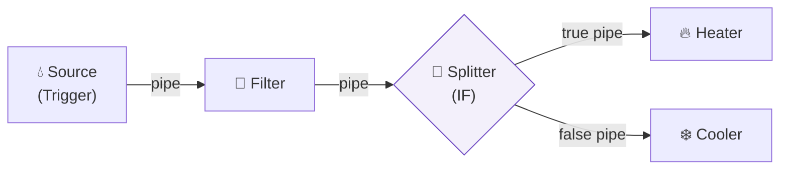

### 🔬 Under the Hood — how data travels a connection

When node A finishes, it produces a **list of items** (Part 2.6). That entire list is handed along the connection to node B's input. Node B then typically runs **once per item**. Key facts that trip up beginners:

- A single output can connect to **multiple** nodes (the data is copied to each — a *fan-out*).
- Multiple nodes can connect **into** one node's input (their items combine — often you'll use **Merge** to control how).
- **Branch nodes** (IF, Switch) have **multiple named outputs**; each item leaves through exactly one branch based on the logic.

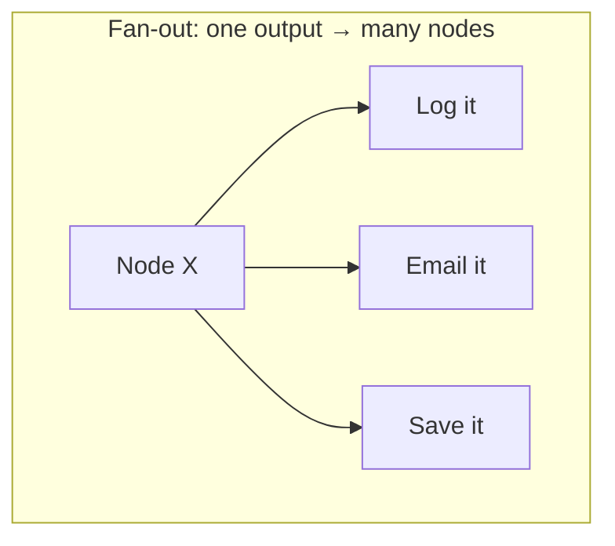

> [!WARNING]
> A node with **no incoming connection** (other than a trigger) will **never run** — data can't reach it. If a node stays gray after a test run, the first thing to check is: *is it actually wired in?* A dangling node is the most common "why didn't this run?" mystery.

> [!TIP]
> Keep your wires flowing **left-to-right, top-to-bottom** and avoid crossing them. A tidy canvas isn't vanity — it's readability. When a teammate (or future-you) opens the workflow, a clean left-to-right flow reads like a story; a tangled one reads like spaghetti.

---

## 3.6 Expressions

### 🧒 What is it?

An **expression is a little piece of dynamic text that gets *replaced* with real data when the workflow runs.** Instead of typing a fixed value like `Ada`, you write an expression that says "*put whatever name came from the previous step here*." Expressions are how a workflow becomes **reusable** — one workflow that works for *every* customer, not just one.

In n8n, expressions live inside double curly braces: **`{{ ... }}`**.

### 📖 Story — The Mail-Merge Wedding Invitation

You're sending 300 wedding invitations. You don't write 300 letters by hand. You write **one template**:

> *"Dear **[GUEST NAME]**, you are invited to celebrate with us on **[DATE]**."*

Then a machine fills `[GUEST NAME]` and `[DATE]` from a list, printing 300 personalized letters. Those `[BRACKETS]` are **expressions.** In n8n you'd write:

> `Dear {{ $json.guestName }}, you are invited on {{ $json.date }}.`

When the workflow runs for Ada, `{{ $json.guestName }}` becomes `Ada`. For Ben, it becomes `Ben`. **One template, infinite personalization.**

### 🔬 Under the Hood — reaching into the data package

Recall from Part 2.6 that data flows as items, each a small JSON object. Expressions are how you *reach into* that traveling package and pull out a value:

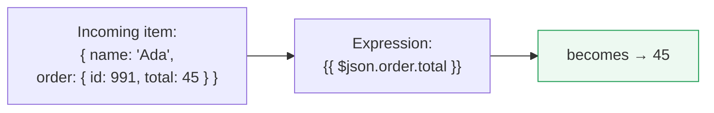

The most important expression building blocks:

| Expression | Means | Example result |
|------------|-------|----------------|
| `{{ $json.name }}` | The `name` field of the **current item** | `Ada` |
| `{{ $json.order.total }}` | Reach into a **nested** object (Part 4) | `45` |
| `{{ $json.items[0] }}` | The **first** element of an array (Part 4) | first item |
| `{{ $node["Webhook"].json.email }}` | A field from a **specific earlier node** | `ada@x.com` |
| `{{ $now }}` | The current date/time | `2026-07-31...` |
| `{{ $json.total * 1.075 }}` | **Math** right inside the expression | `48.375` |
| `{{ $json.name.toUpperCase() }}` | Call a **function** on the value (Part 10) | `ADA` |

- **`$json`** = the current item's data (the most-used variable by far).
- **`$node["Name"]`** = reach back to *any* earlier node's output.
- **`$now`, `$today`** = time helpers.
- Inside `{{ }}` you can do **JavaScript** (Part 10): math, string tricks, conditions.

### 🖥️ Inside n8n — the expression editor

- Any field with a small **toggle** (often labeled *fixed* ↔ *expression*, or a `ƒx` icon) can switch from a typed value to an expression.
- When you open the expression editor, n8n shows a **live preview** of what your expression currently evaluates to, using real data from the last run. This instant feedback is a superpower — you *see* `{{ $json.name }}` turn into `Ada` as you type.
- You can **drag** a field from the Input panel directly into a parameter, and n8n writes the expression for you. Beginners should lean on drag-to-insert heavily.

> [!DEBUG]
> If an expression shows `[undefined]` or empty, the field you asked for **doesn't exist on the incoming item** — usually a **spelling/case** mistake (`Name` vs `name`) or you're reading from the wrong node. Open the previous node's **Output** panel and copy the exact field path. n8n's data is **case-sensitive**: `email` and `Email` are different fields.

> [!TIP]
> Prefer **drag-to-insert** over typing expressions by hand while learning. It guarantees the exact path, avoids typos, and teaches you the structure of your data at the same time.

---

## 🏢 Business Examples — n8n fundamentals at work

1. **Healthcare** — A clinic uses a **Schedule** trigger + app **nodes** to pull overnight lab results; **expressions** insert each patient's name into an alert; **executions** provide an audit trail regulators require.
2. **Pharmacy** — Ada's flow (Part 2) is built on the **canvas**; the **IF node's two outputs** (connections) route in-stock vs out-of-stock prescriptions.
3. **Fintech** — A fraud flow reads `{{ $json.amount }}` in an expression to branch; every run is a recorded **execution** for compliance.
4. **Education** — A grading flow uses `{{ $json.score >= 50 }}` expressions to decide pass/fail and connects to different feedback emails.
5. **Government** — A permit router uses a **Switch node** with several **connections**, one per district office.
6. **Banking** — A nightly reconciliation is a single Active workflow; the **executions** log is the reconciliation evidence.
7. **E-commerce** — Order data fans out via **connections** to three nodes at once: label creation, customer email, inventory update.
8. **Manufacturing** — Sensor readings enter a **Code node**; expressions compute rolling averages before an IF raises an alarm.
9. **Logistics** — A polling flow's **execution history** shows exactly which shipment checks succeeded or timed out.
10. **Customer Support** — `{{ $json.subject.toLowerCase() }}` in an expression detects the word "refund" to route the ticket.
11. **AI Startups** — An **AI node** receives a prompt built with expressions: `Answer this question: {{ $json.question }}`.

---

## 🛠️ Complete Workflow Example — "Daily Weather-Aware Standup Reminder"

A small team wants a Slack message every weekday at 8:55 a.m. that greets them and reminds them of standup — and mentions if it's raining so remote folks dress warm. This tiny flow exercises **every** concept in this chapter.

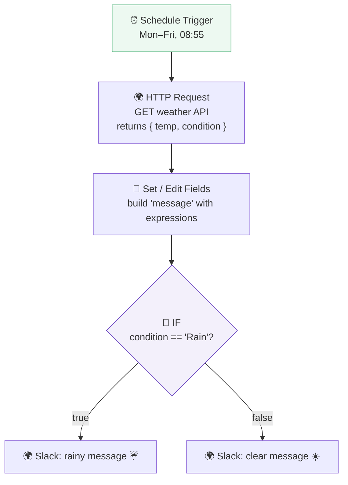

**Node-by-node, with the data shape:**

| # | Node | Kind | Settings / expression | Data out |
|---|------|------|-----------------------|----------|
| 1 | **Schedule Trigger** | Trigger | Cron: `55 8 * * 1-5` (Mon–Fri 08:55) | `{}` (just fires) |
| 2 | **HTTP Request** | App | `GET https://api.weather.com/...` (Part 1 & 8) | `{ temp: 12, condition: "Rain" }` |
| 3 | **Set** | Core | `greeting = "Good morning team!"`; `message = Standup in 5 min. It's {{ $json.temp }}°C.` | adds `greeting`, `message` |
| 4 | **IF** | Logic | Condition: `{{ $json.condition }}` equals `Rain` | routes item to one branch |
| 5a | **Slack** (true) | App | Text: `{{ $json.message }} ☔ Bring a jacket!` | posts to #general |
| 5b | **Slack** (false) | App | Text: `{{ $json.message }} ☀️ Have a great day!` | posts to #general |

**Why it works:** the **Schedule trigger** gives it a reason to run (Part 2); the **HTTP node** is a client→server call (Part 1); **expressions** personalize the message from live data; the **IF node's two outputs** (connections) branch the path; and **executions** let you confirm each morning's run. You've just seen the entire chapter breathe in one diagram.

---

## ⚠️ Common Mistakes (Chapter 3)

**Beginner:**
- Forgetting a node needs an **incoming connection** to run — leaving a node dangling.
- Typing a **fixed value** where an **expression** was needed (hard-coding one customer's name).
- Confusing **Test** (manual) with a real, **Active** production run.

**Intermediate:**
- Reading `$json` when the value actually lives on a **different earlier node** — use `$node["Name"].json`.
- Case/spelling mistakes in field paths giving `[undefined]`.
- Not inspecting the **Output** panel, so you build the next node blind to the real data shape.

**Professional:**
- Leaving **execution data retention** at defaults in a regulated environment (privacy/compliance risk).
- Giant tangled canvases with crossing wires nobody can maintain.
- Hard-coding secrets in expressions instead of using **credentials** (Part 6) — a security hole.

## 🏆 Best Practices (Chapter 3)

> [!BEST]
> **Never hard-code secrets** (API keys, passwords) into a node field or expression. Store them as **credentials** (Part 6); n8n keeps them encrypted and out of your workflow JSON.

> [!TIP]
> **Inspect Input/Output at every step while building.** The data panel is ground truth. Build the *next* node against what you *see*, not what you *assume*.

> [!BEST]
> **Name nodes and workflows meaningfully**, keep wires left-to-right, and add sticky notes explaining tricky logic. Treat the canvas as documentation.

> [!TIP]
> **Drag fields into expressions** rather than typing paths. Fewer typos, faster building, and you learn your data's structure as you go.

---

## ❓ Review Questions

1. What does "n8n" stand for, and what problem was it invented to solve that custom code and rigid SaaS tools each failed to?
2. Name the six main regions of the n8n interface and what you do in each.
3. What is an **execution**, and why is it called the "black box" of your workflow? Where do you go first when debugging?
4. Draw the anatomy of a node: label its input, output, icon, and settings. How many outputs does an **IF** node have?
5. List the six *kinds* of nodes and give one example of each.
6. What does a **connection** carry between nodes, and how many times does the receiving node typically run for a 4-item input?
7. Why will a node with no incoming connection never run? How do you spot this on the canvas?
8. Write an expression that inserts a customer's city from the current item. Now write one that reads the `email` field from a node named "Webhook".
9. An expression returns `[undefined]`. List two likely causes and how you'd confirm each.
10. In the standup workflow, explain the role of the Schedule trigger, the HTTP node, the expression in the Set node, and the IF node's two outputs.

## 🚀 Mini Project (build it in n8n if you have access — or design it fully on paper)

**"Personalized Birthday Greeter."**

Design and, if you can, build a workflow that:

- runs **every day at 07:00** (which trigger?),
- fetches a list of people with their names and birthdays (use a mock HTTP endpoint or a small hard-coded list in a Set node),
- **for each person**, decides with an expression whether *today* is their birthday (`{{ $json.birthday }}` compared to `{{ $today }}`),
- if yes, sends them a **personalized** greeting (Slack, email, or just a NoOp node that outputs the message) using an expression like `Happy Birthday, {{ $json.name }}! 🎉`,
- if no, does nothing for that person.

Deliverables: the canvas (nodes + connections), the exact **expressions** you used, and a screenshot/description of one **execution** showing the input and output of your IF and greeting nodes. *Bonus:* add a Slack summary at the end saying how many birthdays there were today (hint: you'll meet **Aggregate** in Part 9 — think about how you'd count items).

---

## 📝 Summary — Chapter 3 on one page

- **n8n** ("n-eight-n") builds automations by connecting boxes — power of code, ease of drag-and-drop, and (self-hosted) full control of your data. It's a real Node.js automation server behind a friendly canvas.
- The **interface** has six regions: **canvas**, **node picker**, **node detail panel** (with Input/Output), **top bar** (Save + Active), **executions**, and **credentials**.
- An **execution** is one recorded run — your flight recorder. It shows every node's data and where any error occurred. It is your **first stop for debugging**. Set retention deliberately (compliance).
- A **node** is one step; it has **input dots**, **output dots** (IF has two!), an **icon**, and **settings** (credential + operation + parameters). Nodes come in kinds: trigger, app, core/data, logic, code, AI.
- A **connection** is the wire carrying the item-list from one node to the next; the receiver runs once per item. Outputs can fan out; branch nodes have multiple named outputs. No incoming wire → the node never runs.
- An **expression** (`{{ ... }}`) is dynamic text replaced by real data at run time — `{{ $json.field }}` reaches into the current item, `$node["Name"]` reaches back to another node, and you can do math/JS inside. Expressions make one workflow serve everyone.

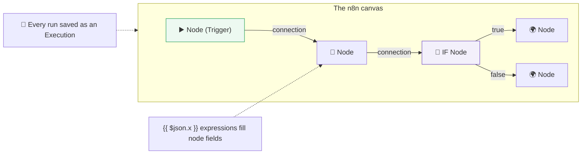

> **You can now read and build in n8n.** But every node's data is shaped like **JSON** — the language the traveling package is written in. Until you can read JSON fluently, expressions feel like guessing. So **Part 4** makes JSON as natural to you as your native tongue.
