# JSON <span class="kicker">Part 4 · Chapter 4</span>

In Part 3 you learned that the data flowing through n8n is a list of **items**, and each item is a little object written in **JSON**. Every expression you write (`{{ $json.name }}`) reaches into JSON. Every API you call (Part 5) speaks JSON. Every AI model (Part 11) returns JSON. **JSON is the single most important data format in this entire book.**

The good news: JSON is *tiny*. There are only a handful of rules, and by the end of this chapter you'll read it as easily as you read a shopping list.

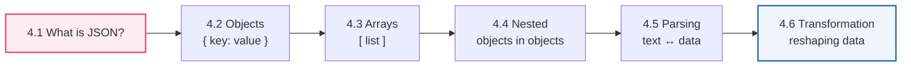

---

## 4.1 What is JSON?

### 🧒 What is it?

**JSON is a way of writing down information so that both humans and computers can read it.** The name stands for **J**ava**S**cript **O**bject **N**otation, but don't let that scare you — you don't need to know JavaScript to read JSON any more than you need to be Italian to read a pizza menu.

JSON writes information as **labels and values**. A label (called a **key**) says *what* something is; the value says *what it is.* Like a name tag:

```json
{
  "name": "Ada",
  "age": 34,
  "isPharmacist": true
}
```

Read it aloud: *"name is Ada, age is 34, isPharmacist is true."* That's it. That's JSON. A bunch of `"label": value` pairs, wrapped in curly braces.

### 💡 Why was it invented?

Computers need to send information to each other constantly (Part 1: request → response). But a computer's *internal* memory is messy binary that other computers — especially ones built by different companies — can't easily read. They needed a **shared, simple, text-based format** that any computer, in any language, could produce and understand.

Earlier attempts (like **XML**) worked but were *heavy* and verbose — lots of repeated tags, hard for humans to read. JSON arrived (popularized ~2001–2005 by Douglas Crockford) and won the world because it is:

- **Simple** — only a few rules,
- **Lightweight** — little wasted space,
- **Human-readable** — you can eyeball it and understand it,
- **Universal** — every programming language can read and write it.

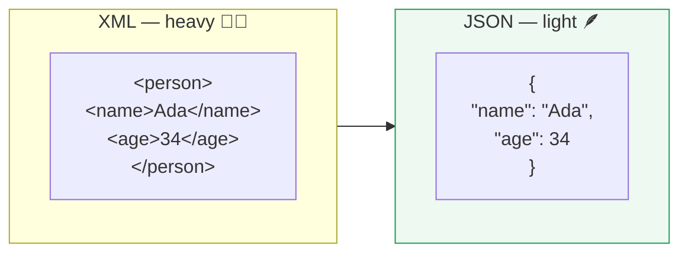

### 📖 Story — The Restaurant Order Ticket

Picture a busy restaurant kitchen. A waiter takes an order and clips a **ticket** to the rail. That ticket has a strict, tidy format everyone in the kitchen understands at a glance:

```json
{
  "table": 7,
  "dish": "Margherita Pizza",
  "size": "large",
  "extraCheese": true,
  "notes": "no basil"
}
```

Every cook, whether they started yesterday or ten years ago, reads that ticket the same way. It doesn't matter that one cook thinks in Italian and another in English — the *ticket format* is the shared language. **JSON is the order ticket of the internet.** When your workflow talks to Stripe, or Gmail, or an AI model, they exchange these tidy tickets.

### 🔬 The six value types JSON allows

A JSON value can only be one of six things. Memorize these — they're the whole alphabet:

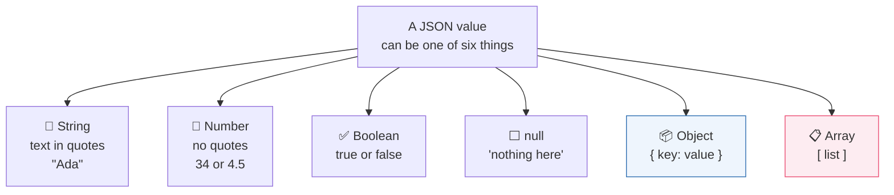

| Type | Looks like | Means | Quotes? |
|------|-----------|-------|:-------:|
| **String** | `"Amoxicillin"` | Text | ✅ Yes |
| **Number** | `500` or `4.5` | A number | ❌ No |
| **Boolean** | `true` / `false` | Yes/no (Part 2's boolean!) | ❌ No |
| **null** | `null` | Deliberately empty | ❌ No |
| **Object** | `{ ... }` | A group of key–value pairs | — |
| **Array** | `[ ... ]` | An ordered list | — |

> [!WARNING]
> The most common beginner bug in all of automation: **`"500"` (a string) is not the same as `500` (a number).** The first is *text that looks like a number*; the second is a real number you can do math with. `"500" + "20"` might glue into `"50020"`; `500 + 20` is `520`. This is the type mismatch that breaks IF nodes (Part 2.5). Always notice the **quotes**.

> [!NOTE]
> JSON keys are **always** strings in double quotes (`"name"`), and you separate pairs with **commas** — but *no* comma after the last pair. These two rules cause 90% of "invalid JSON" errors. We'll see the exact traps in 4.5.

---

## 4.2 Objects

### 🧒 What is it?

An **object is a group of related facts about one thing**, written as `key: value` pairs inside curly braces `{ }`. If you're describing *one* patient, *one* order, *one* customer — you use an object.

```json
{
  "firstName": "Ada",
  "lastName": "Okafor",
  "age": 34,
  "email": "ada@clinic.com"
}
```

The `{ }` means "here is one thing, and here are its properties." Each **key** (`firstName`) is a label; each **value** (`"Ada"`) is the fact.

### 🔗 Real-Life Analogy — The Form You Fill at a Clinic

You've filled out a clinic form: *Name: ____, Age: ____, Blood type: ____.* The blank labels are **keys**; what you write is the **value**. The whole filled form describing *you* is an **object**. Hand in a second form for another patient — that's a second object. A stack of forms is an **array of objects** (next section).

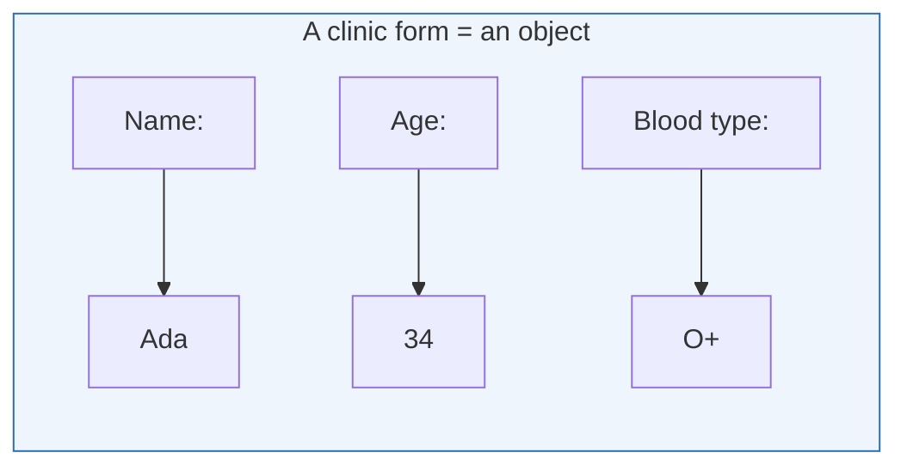

### 🔬 How to read a value out of an object

You reach a value using its key, with a **dot**. This is *exactly* the n8n expression syntax from Part 3.6:

```
person.firstName   →  "Ada"
person.age         →  34
```

In n8n: `{{ $json.firstName }}` means "the `firstName` key of the current item's object." **Objects + dot notation = the foundation of every expression you'll ever write.**

### 🖥️ Inside n8n

- Each item's data *is* a JSON object, shown in the node's **Output** panel. You can view it as a friendly **table**, as **JSON**, or as a **schema** (a tree of keys).
- When you drag a field from that panel into a parameter, n8n writes the dot-path expression for you (Part 3.6's pro tip).
- The **Set / Edit Fields** node is how you *build* or *modify* an object — adding keys, renaming them, setting values.

> [!TIP]
> When you meet unfamiliar data, switch the Output panel to **Schema** view. It shows the shape — every key and its type — as a clean tree, so you instantly know what you can reach with `{{ $json.… }}`.

---

## 4.3 Arrays

### 🧒 What is it?

An **array is an ordered list of things**, written inside square brackets `[ ]`, separated by commas. If an object is *one* thing, an array is *many* things in a row.

```json
["Amoxicillin", "Ibuprofen", "Paracetamol"]
```

That's a list of three drug names. Order matters and is remembered: `Amoxicillin` is first, `Paracetamol` is last.

### 🔗 Real-Life Analogy — The Shopping List

An array is a numbered shopping list. Item **0** is milk, item **1** is bread, item **2** is eggs. (Yes — computers start counting at **0**, not 1. This is the single most surprising thing for beginners, and it trips up everyone once. Memorize it now: **the first item is index 0.**)

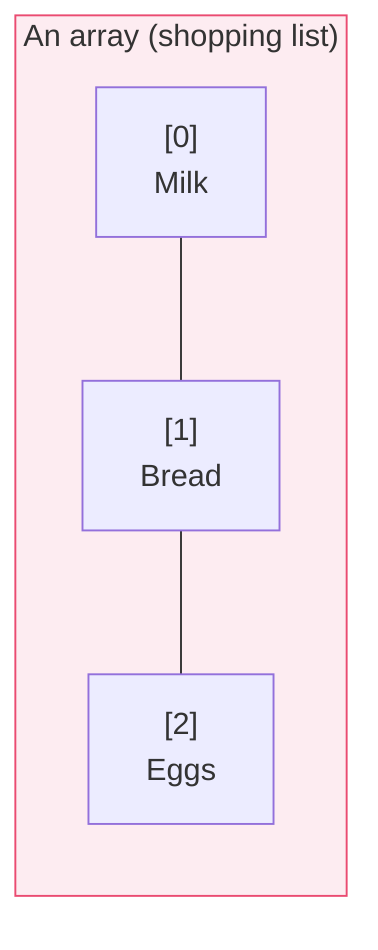

### 🔬 Reaching into an array

You grab an element by its **index** in square brackets:

```
drugs[0]   →  "Amoxicillin"
drugs[2]   →  "Paracetamol"
drugs.length  →  3   (how many items)
```

In n8n: `{{ $json.drugs[0] }}` is "the first drug in the list." Arrays usually hold **objects**, which is where it gets powerful:

```json
[
  { "name": "Ada", "age": 34 },
  { "name": "Ben", "age": 29 },
  { "name": "Cid", "age": 41 }
]
```

This is a list of *three patient objects* — the single most common data shape you'll ever handle. To get Ben's age: `patients[1].age` → `29`. Read it left to right: *"the patients list, element 1, its age key."*

### 🖥️ Inside n8n — arrays and items

Here's a crucial n8n insight. n8n's whole model (Part 2.6) is that data is **a list of items** — which is to say, **an array of objects**. When an API hands your workflow an array of three patients, n8n *usually* turns that into **three items**, so the next node runs three times (once per patient). This automatic "array → items" behavior is the heart of how n8n loops without you writing a loop.

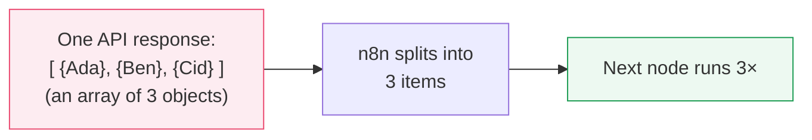

> [!NOTE]
> Sometimes an API returns the array *nested inside* an object, like `{ "results": [ ... ] }`. Then n8n sees **one** item (the wrapper object), not three. To break the inner list into separate items you use the **Split Out** node (Part 9) on the `results` field. Recognizing "is my list wrapped or not?" is a skill that saves hours.

> [!DEBUG]
> "My node only ran once when I expected 5 times!" → your array is probably **wrapped** inside an object. Look at the Output panel: do you see 5 items in the list, or 1 item whose `json` contains an array? If the latter, **Split Out** the array field.

---

## 4.4 Nested Objects

### 🧒 What is it?

**Nesting means putting objects and arrays *inside* other objects and arrays** — boxes within boxes. Real information is rarely flat. A patient has an *address*, and an address itself has a street, city, and country. So the address is an object living *inside* the patient object.

```json
{
  "name": "Ada",
  "age": 34,
  "address": {
    "street": "12 Marina Rd",
    "city": "Lagos",
    "country": "Nigeria"
  },
  "medications": ["Amoxicillin", "Vitamin D"]
}
```

Here the patient object contains a **nested object** (`address`) and a **nested array** (`medications`).

### 🔗 Real-Life Analogy — Russian Nesting Dolls (Matryoshka)

Open a big doll and there's a smaller doll inside; open that and there's another. Nested JSON is the same: open the `patient`, find `address` inside; open `address`, find `city` inside. To reach the innermost value, you open each layer in order.

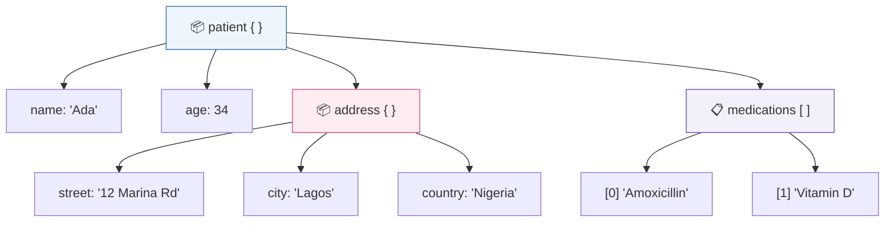

### 🔬 Reaching deep — the path

To reach a nested value, you **chain the dots and brackets**, following the tree from the outside in:

| Goal | Path | Result |
|------|------|--------|
| The city | `patient.address.city` | `"Lagos"` |
| The country | `patient.address.country` | `"Nigeria"` |
| First medication | `patient.medications[0]` | `"Amoxicillin"` |
| Number of meds | `patient.medications.length` | `2` |

In n8n these become `{{ $json.address.city }}` and `{{ $json.medications[0] }}`. **Every deep path is just the address to a value, read outside-in.** This is *the* skill that separates confident n8n users from frustrated ones.

### 🔬 Under the Hood — why data is deep

APIs return nested data because it mirrors reality: an *order* contains a *customer* who has an *address*; the order also contains *line items*, each with a *product* that has a *price*. Flattening all that would lose the relationships. So real API responses look like this — and you must navigate them fearlessly:

```json
{
  "orderId": "ord_991",
  "customer": { "name": "Ada", "email": "ada@x.com" },
  "items": [
    { "product": "Aspirin", "qty": 2, "price": 5.0 },
    { "product": "Bandage", "qty": 1, "price": 3.5 }
  ],
  "total": 13.5
}
```

- Customer's email → `order.customer.email`
- Second item's product → `order.items[1].product` → `"Bandage"`
- First item's price → `order.items[0].price` → `5.0`

> [!TIP]
> When facing scary nested data, **read the tree, not the text.** Switch n8n's Output to **Schema** view; it draws exactly the doll-within-doll tree above. Then click the value you want and drag it in — n8n writes the perfect deep path for you. Never hand-type a long path if you can drag it.

> [!DEBUG]
> A deep expression returns `undefined`? Walk the path **one level at a time**: does `{{ $json.address }}` return the object? Then does `{{ $json.address.city }}` return the string? The level where it first breaks is where a key is misspelled, missing, or `null`. Nesting bugs hide at exactly one layer — find that layer.

---

## 4.5 Parsing

### 🧒 What is it?

Here's a subtle but vital idea. JSON has **two forms**:

1. **A string** — JSON as *plain text*, a line of characters: `'{"name":"Ada"}'`. This is how it travels over the internet (Part 1: the request/response body is text).
2. **An object** — JSON as *live data* the computer can actually reach into with dots: `person.name`.

**Parsing is turning the text form into the live-data form** — so you can *use* it. The reverse — turning live data back into text to send it — is called **stringifying** (or serializing).

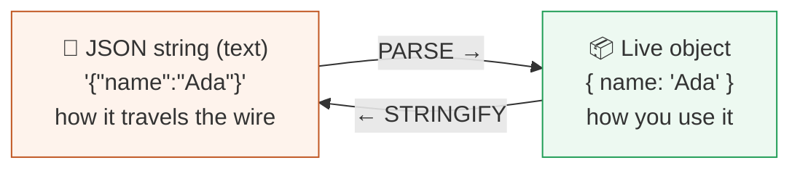

### 📖 Story — The Flat-Pack Furniture

You order a bookshelf online. It arrives as a **flat cardboard box** full of planks and screws — compact, easy to *ship*, but you can't put books on it yet. You **assemble** it (parse!) into a standing bookshelf you can actually use. When you move house, you **disassemble** it back into the flat box (stringify) so it ships easily again.

- The **flat-pack box** = the JSON **string** (great for shipping over the internet).
- The **assembled bookshelf** = the JSON **object** (great for using).
- **Parsing** = assembling; **stringifying** = flat-packing.

### 🔬 Under the Hood

- **`JSON.parse(text)`** — takes a JSON string, returns a live object. *"Assemble the furniture."*
- **`JSON.stringify(object)`** — takes a live object, returns a JSON string. *"Flat-pack it for shipping."*

When you make an HTTP request (Part 8) and set the header `Content-Type: application/json`, you're promising the server "the body I'm sending is JSON text" — n8n stringifies your object for you. When a response comes back, n8n usually **parses it automatically** so you get clean, dot-reachable data. But not always…

### 🖥️ Inside n8n

- Most nodes **auto-parse** JSON responses — you get an object without lifting a finger. 
- But sometimes a value arrives as a **string that contains JSON** (e.g., a database column, or a webhook that sent `Content-Type: text/plain`). It *looks* like `"{\"name\":\"Ada\"}"` in your data. You can't dot into it yet — it's still flat-packed.
- To fix it: use a **Code node** with `JSON.parse($json.field)` (Part 10), or the **Set** node's parsing options, to assemble it into a real object.

> [!DEBUG]
> **Telltale sign you need to parse:** in the Output panel, a field's value is a long text string wrapped in quotes and full of `\"` escaped quotes and `{ }` — but n8n shows it as *one string*, not an expandable tree. That's flat-packed JSON. Parse it, and it becomes a navigable object.

> [!WARNING]
> **Invalid JSON won't parse — it throws an error.** The usual culprits: a **trailing comma** after the last item, **single quotes** instead of double (`'name'` ✗ → `"name"` ✓), **missing quotes** around a key, or an unclosed `{` / `[`. When you see *"Unexpected token in JSON"*, hunt for one of these four. Paste suspicious JSON into a validator to find the exact character.

---

## 4.6 Transformation

### 🧒 What is it?

**Transformation is reshaping data from the form you *got* into the form you *need*.** The data an API gives you is almost never the exact shape the *next* system wants. Transformation is the plumbing that reshapes it in between — rename fields, pick out what matters, combine things, change types, restructure nested data.

This is *most* of what real automation work actually is. **A huge part of being an automation engineer is being a skilled data plumber.**

### 📖 Story — The Airport Baggage Sorting

Bags arrive from a plane in one big jumbled pile (the raw API data). But each bag must reach a *different* destination, in a *specific* format the next system expects. The sorting facility:

- **reads a label** on each bag (picks a field),
- **relabels** some (renames a key: their `first_name` → your `name`),
- **groups** bags going to the same city (aggregates),
- **splits** a container of many bags into individual ones (Split Out),
- **discards** bags that don't belong (filters).

What comes out the other end is *the same luggage, reorganized* for the next leg of the journey. That reorganizing is transformation.

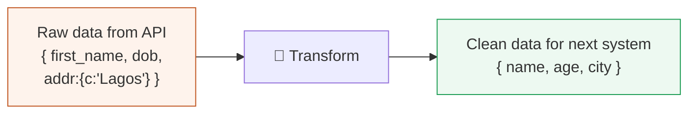

### 🔬 The common transformations (and the n8n node for each)

| Transformation | What it does | Example | n8n tool |
|----------------|--------------|---------|----------|
| **Rename** | Change a key's name | `first_name` → `name` | Set / Edit Fields |
| **Pick / drop** | Keep only some fields | keep `name`, drop `ssn` | Set (keep only set) |
| **Compute** | Make a new value | `age` from `dob`; `total = qty*price` | Set + expression |
| **Change type** | String ↔ number | `"500"` → `500` | expression / Code |
| **Filter** | Remove items | only `status == "paid"` | Filter |
| **Split Out** | One item's array → many items | `{items:[...]}` → N items | Split Out |
| **Aggregate** | Many items → one summary | count, sum, join into a list | Aggregate |
| **Merge** | Combine two streams | orders + customers | Merge |
| **Sort** | Reorder items | newest first | Sort |

### 🔬 A worked transformation

**You got this** from a signup API:

```json
{
  "user": {
    "first_name": "Ada",
    "last_name": "Okafor",
    "registered": "2026-07-31",
    "meta": { "plan": "enterprise", "seats": 25 }
  }
}
```

**The billing system needs this:**

```json
{
  "name": "Ada Okafor",
  "plan": "ENTERPRISE",
  "seats": 25,
  "signupDate": "2026-07-31"
}
```

The transformation, expressed as n8n **Set** node fields with expressions:

```
name       = {{ $json.user.first_name + " " + $json.user.last_name }}
plan       = {{ $json.user.meta.plan.toUpperCase() }}
seats      = {{ $json.user.meta.seats }}
signupDate = {{ $json.user.registered }}
```

Every line is: *reach into the incoming shape (dots + brackets from 4.4), do a little work (join, uppercase), and place it under the new key.* Master this pattern and you can bridge **any** two systems.

### 🖥️ Inside n8n

- The **Set / Edit Fields** node is your primary transformation tool: add fields, each filled by an expression that reshapes incoming data. Toggle "keep only set fields" to *drop* everything you didn't explicitly keep (great for stripping sensitive data before sending onward).
- For heavier reshaping (looping, complex restructuring), the **Code** node (Part 10) gives you full JavaScript over the whole item list.
- **Split Out** and **Aggregate** change the *number* of items — flattening arrays into items or rolling items back into a summary. These reshape the *flow itself*, not just fields.

> [!BEST]
> **Transform to a clean, minimal shape early**, then work with that. Downstream nodes are simpler, expressions are shorter, and you avoid accidentally forwarding sensitive fields (a patient's `ssn`, a card number) to systems that shouldn't see them. Shape your data like you're handing it to a stranger — include only what they need.

---

## 🏢 Business Examples — JSON in the wild

1. **Healthcare** — A lab API returns a **nested** patient object with a `results` **array**; you **Split Out** each result and **transform** it into a clean alert record.
2. **Pharmacy** — A prescription webhook sends JSON `{ drug, dose, patient: { phone } }`; you reach `{{ $json.patient.phone }}` to send the ready-for-pickup SMS.
3. **Fintech** — A payments API returns amounts as **strings** (`"1500.00"`); you **change type** to a number before an IF compares it to a fraud threshold.
4. **Education** — A gradebook returns an **array of student objects**; you **filter** to failing students and **transform** into personalized emails.
5. **Government** — A citizen record has deeply **nested** address data; you extract `address.district` to **Switch**-route to the right office.
6. **Banking** — Transaction exports arrive as a JSON **string** in a file; you **parse** it, then **aggregate** to a daily total.
7. **E-commerce** — An order object nests a `lineItems` **array**; you **Split Out** items to create one shipping row each, then **Aggregate** back for the invoice total.
8. **Manufacturing** — Sensors POST JSON readings; you **transform** raw counts into °C and **filter** out impossible values (`null` sensor faults).
9. **Logistics** — A carrier returns `{ shipments: [ ... ] }` (**wrapped array**); you **Split Out** `shipments` so each becomes its own item to notify one customer per shipment.
10. **Customer Support** — A ticket's JSON nests `requester.email` and a `tags` **array**; you check `{{ $json.tags.includes("urgent") }}` to prioritize.
11. **AI Startups** — An LLM returns its answer as a JSON **string** inside a field; you **parse** it to reach `{{ $json.answer }}` and `{{ $json.confidence }}` (Part 11).

---

## 🛠️ Complete Workflow Example — "Clean & Route Incoming Orders"

An online pharmacy receives raw orders and needs to (a) clean each order, (b) split multi-item orders into individual fulfillment lines, and (c) route out-of-stock items differently. This flow exercises objects, arrays, nesting, parsing, and transformation together.

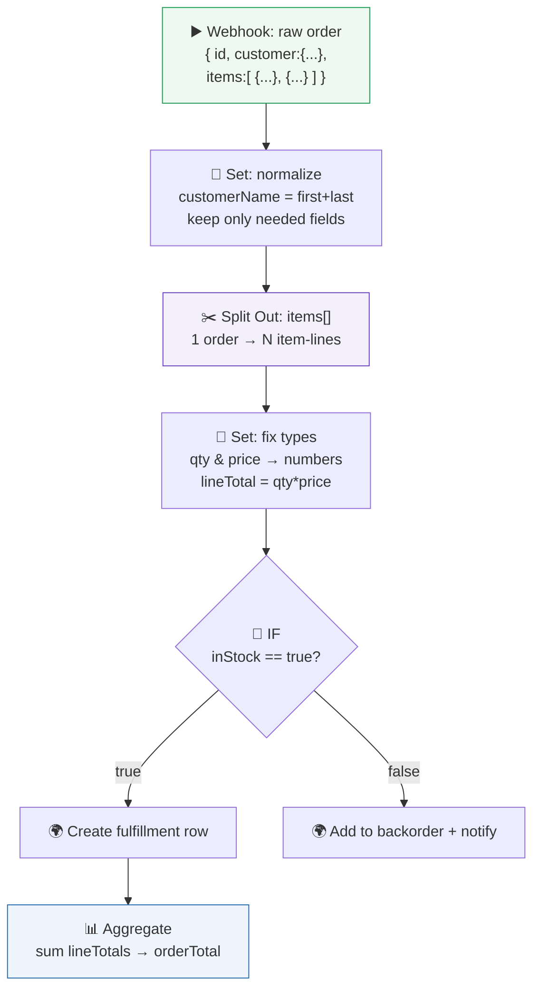

| # | Node | JSON concept used | Why it's here |
|---|------|-------------------|---------------|
| 1 | Webhook | **Nested object + array** | Receives the raw order with a nested customer and an items array |
| 2 | Set (normalize) | **Object transform + rename** | `{{ $json.customer.first + " " + $json.customer.last }}`; strip unneeded fields |
| 3 | Split Out | **Array → items** | Turns `items[]` into one item per product so each can be fulfilled independently |
| 4 | Set (fix types) | **Type change + compute** | `Number($json.qty)`, compute `lineTotal = qty*price` |
| 5 | IF | **Boolean field** | Branches on `{{ $json.inStock }}` |
| 6 | Aggregate | **Items → summary** | Sums each line's `lineTotal` back into one `orderTotal` |

**Why it works:** you *received* deeply nested JSON, *navigated* it (4.4), *reshaped* it (4.6), *split* its array into workable items (4.3), *fixed types* so math and IF behave (4.1), and *aggregated* back to a total. This is a day in the life of real automation.

---

## ⚠️ Common Mistakes (Chapter 4)

**Beginner:**
- Confusing a **string** `"500"` with a **number** `500` → broken math and IF comparisons.
- Forgetting arrays start at **index 0**, so `items[1]` is the *second* item.
- Case errors: `{{ $json.Email }}` vs `{{ $json.email }}` → `undefined`.

**Intermediate:**
- Not noticing a **wrapped array** (`{results:[...]}`) and wondering why a node ran once, not many times → needs **Split Out**.
- Trying to dot into a value that's still a **JSON string** → must **parse** first.
- Trailing commas / single quotes producing "invalid JSON."

**Professional:**
- Forwarding **entire raw objects** downstream, leaking sensitive fields (`ssn`, tokens) → transform to a minimal shape.
- Assuming a nested key always exists; it's sometimes `null` or missing → guard with defaults (`{{ $json.address?.city || "N/A" }}`).
- Relying on field *order* in objects (JSON objects are unordered by key) → never depend on key order, only on key names.

## 🏆 Best Practices (Chapter 4)

> [!BEST]
> **Normalize early to a clean, minimal, well-typed shape.** Fix types, rename to your conventions, drop sensitive/unneeded fields *at the top* of the workflow. Everything downstream gets simpler and safer.

> [!TIP]
> **Use Schema view + drag-to-insert** for every nested path. Don't hand-type deep expressions — let n8n build the exact path so typos and case errors vanish.

> [!BEST]
> **Guard against missing/`null` nested data** with optional chaining (`?.`) and fallbacks (`|| "default"`), so one absent field doesn't crash the whole run.

> [!TIP]
> **Validate suspicious JSON** in a linter/validator before parsing. Catching a trailing comma in two seconds beats debugging a failed execution for twenty minutes.

---

## ❓ Review Questions

1. What does JSON stand for, and why did it beat XML for exchanging data on the web?
2. List the **six** JSON value types. Which two are containers, and which two need quotes?
3. Explain the practical difference between the string `"42"` and the number `42`. Give a bug each could cause.
4. What symbol wraps an **object**? An **array**? What is the index of the *first* element of an array?
5. Given `{ "user": { "name": "Ada", "roles": ["admin","editor"] } }`, write the path to Ada's name and to her *second* role.
6. What is the difference between **parsing** and **stringifying**? Which direction do you need when a database field contains `"{\"x\":1}"`?
7. Name three things that make JSON *invalid* and cause a parse error.
8. What is a **wrapped array**, how do you recognize it in n8n's Output panel, and which node unwraps it?
9. You must turn `{ first_name, last_name }` into `{ fullName }` uppercased. Write the n8n expression.
10. Why is it a best practice to transform data to a **minimal shape early** in a workflow? Give a security reason and a maintainability reason.

## 🚀 Mini Project (do the reshaping — don't just describe it)

**"The Data Translator."**

You are handed this raw response from a fictional CRM's API:

```json
{
  "status": "ok",
  "data": {
    "contacts": [
      { "fname": "Ada", "lname": "Okafor", "info": { "email": "ada@x.com", "vip": true, "spend": "12000" } },
      { "fname": "Ben", "lname": "Ade",    "info": { "email": "ben@x.com", "vip": false, "spend": "300" } },
      { "fname": "Cid", "lname": "Nwosu",  "info": { "email": "cid@x.com", "vip": true, "spend": "8500" } }
    ]
  }
}
```

Design (and build in n8n if you can) a flow that produces **one clean item per contact** in exactly this shape:

```json
{ "fullName": "Ada Okafor", "email": "ada@x.com", "tier": "VIP", "spend": 12000 }
```

Requirements you must handle: the contacts array is **wrapped** two levels deep (`data.contacts`) → which node unwraps it? `spend` arrives as a **string** → convert it to a number. `tier` should be `"VIP"` when `vip` is `true`, else `"Standard"` → which JSON type drives that, and what expression computes it? Finally, **aggregate** to output the *total spend of VIP contacts only*. Write out every expression you use.

---

## 📝 Summary — Chapter 4 on one page

- **JSON** (JavaScript Object Notation) is the universal, lightweight, human-readable text format for exchanging data. It's the "order ticket of the internet."
- A JSON **value** is one of six types: **string** (`"text"`), **number** (`42`), **boolean** (`true`/`false`), **null**, **object** (`{ }`), or **array** (`[ ]`). Quotes distinguish a string `"500"` from a number `500` — a distinction that breaks or fixes your logic.
- An **object** `{ key: value }` describes *one* thing; reach values with **dot notation** (`person.name` → `{{ $json.name }}`).
- An **array** `[ ... ]` is an *ordered list*; reach elements by **index starting at 0** (`list[0]`). n8n usually turns an array into **items**, one per element.
- **Nesting** puts objects/arrays inside each other (matryoshka dolls); reach deep values by chaining dots and brackets **outside-in** (`order.customer.email`, `order.items[1].price`).
- **Parsing** turns JSON *text* into usable *live data* (`JSON.parse`); **stringifying** does the reverse for sending. n8n auto-parses most responses; a field that shows as an unexpandable quoted string is still flat-packed and needs parsing.
- **Transformation** reshapes data from what you *got* to what you *need* — rename, pick, compute, change type, filter, **Split Out**, **Aggregate**, **Merge**. This *is* the bulk of real automation work.

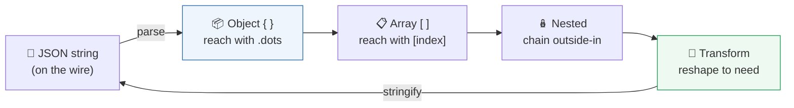

> **You now read and reshape the language of data itself.** In **Part 5**, we learn where all this JSON *comes from* and *goes to* — **APIs**, the menus and rules by which every service on the internet lets your workflow order from it.
