# APIs <span class="kicker">Part 5 · Chapter 5</span>

Everything so far has been leading here. You understand clients and servers (Part 1), automation (Part 2), n8n (Part 3), and JSON (Part 4). Now we answer the question that unlocks the whole internet for your workflows: **how does one program let another program use it — safely, predictably, on purpose?** The answer is the **API**.

If you truly understand APIs, you can automate *anything* that has one — which today means almost everything. This is a long, important chapter. Take it slowly.

```mermaid
flowchart LR
  A["5.1 What is an API?"] --> B["5.2 REST"]
  B --> C["5.3 SOAP"]
  C --> D["5.4 GraphQL"]
  D --> E["5.5 Endpoints"]
  E --> F["5.6 Headers"]
  F --> G["5.7 Query Params"]
  G --> H["5.8 Request &<br/>Response Bodies"]
  H --> I["5.9 Pagination"]
  I --> J["5.10 Rate Limits"]
  J --> K["5.11 Versioning"]
  style A fill:#fdecf1,stroke:#ea4b71,stroke-width:2px
  style K fill:#eef5fd,stroke:#2b6cb0,stroke-width:2px
```

---

## 5.1 What is an API?

### 🧒 What is it?

**An API is a menu of things one program will do for another program, plus the rules for asking.** API stands for **A**pplication **P**rogramming **I**nterface — but forget the scary words. Think **menu**.

When you sit in a restaurant, you don't march into the kitchen and cook. You read a **menu** — a list of things the kitchen has agreed to make — and you order using the menu's rules ("Table 7, one large pizza"). The kitchen does its private work and hands back a finished dish. You never see *how* they cook; you only need the menu and the ordering rules.

**An API is that menu for software.** Stripe's API is a menu of money things ("charge a card," "refund a payment"). Gmail's API is a menu of email things ("send a message," "list my inbox"). Your n8n workflow reads the menu and *orders*.

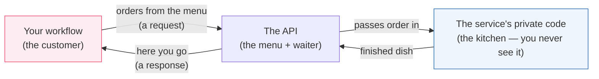

### 💡 Why was it invented?

Imagine if, to send an email from your app, you had to understand Gmail's *entire* internal machinery — their databases, their spam filters, their servers across the world. Impossible. Every company would have to rebuild everything from scratch.

APIs were invented to solve this with one powerful idea: **the contract.** A company says, *"You don't need to know how we work inside. Just send us a request shaped like THIS, and we promise to respond shaped like THAT."* That promise is the API. It lets:

- **Separation of concerns** — you build your thing; they build theirs; you connect via the menu.
- **Reuse** — a million apps can all use Stripe without any of them knowing how Stripe works.
- **Safety** — the API only exposes what the company *wants* to expose. The kitchen stays private.
- **Change without breaking** — the kitchen can renovate; as long as the menu stays the same, your orders still work.

Without APIs, there is no automation, no n8n, no modern internet. **APIs are the joints that let separately-built software connect into one giant nervous system.**

### 📖 Story — The Bank Teller Window

You need cash from your bank. You do **not** get to walk into the vault, count bills, and update the ledger yourself — that would be chaos and theft. Instead, there's a **teller window**: a small, controlled opening with strict rules.

- You fill out a **withdrawal slip** in the exact required format (the **request**).
- You show **ID** to prove who you are (**authentication** — Part 6).
- The teller does the private work behind the counter (checks your balance, opens the drawer).
- You get back **cash and a receipt** (the **response**), or a polite **"insufficient funds"** (an **error response**, Part 1's status codes).

The teller window is the bank's API: a **narrow, controlled, rule-bound doorway** into a system you're otherwise not allowed to touch. Every API on Earth is a teller window for some service.

### 🔬 Under the Hood

Technically, a **web API** is a set of **URLs** (Part 1) you can send **HTTP requests** to (Part 1), which return **JSON** (Part 4). That's the whole thing! Look how everything you learned stacks:

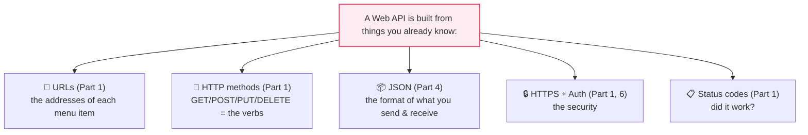

**You already know 80% of what an API is.** An API is just those pieces, *documented and promised* by a company so you can rely on them. The rest of this chapter names the parts precisely.

> [!NOTE]
> **API vs endpoint:** people use "API" for the *whole menu* (all of Stripe's capabilities) and **endpoint** (5.5) for *one specific item* on it (`POST /charges`). "Call the Stripe API" loosely means "hit one of Stripe's endpoints."

---

## 5.2 REST

### 🧒 What is it?

**REST is the most popular *style* of building web APIs** — a set of sensible conventions that make APIs predictable. REST stands for **RE**presentational **S**tate **T**ransfer (ignore the mouthful). The key idea is beautifully simple:

> **Everything is a "resource" (a noun), each resource has a URL, and you act on it with HTTP verbs (Part 1).**

A resource is just a *thing*: a customer, an order, a message, a patient. REST says: give each *kind* of thing a URL, then use the HTTP verbs to Create, Read, Update, Delete them (CRUD, Part 1).

### 🔬 The REST pattern — verbs × nouns

This one table is the Rosetta Stone of REST. Learn it and you can guess how almost any REST API works before reading its docs:

| You want to… | HTTP Verb | URL (endpoint) | CRUD |
|--------------|:---------:|----------------|:----:|
| List all patients | `GET` | `/patients` | Read |
| Get one patient | `GET` | `/patients/42` | Read |
| Create a patient | `POST` | `/patients` | Create |
| Replace patient 42 | `PUT` | `/patients/42` | Update |
| Change part of patient 42 | `PATCH` | `/patients/42` | Update |
| Delete patient 42 | `DELETE` | `/patients/42` | Delete |

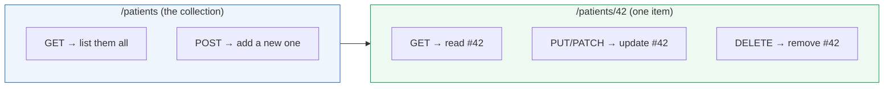

Notice the elegant logic: the URL `/patients` (plural, no ID) means *the whole collection* — GET lists them, POST adds one. The URL `/patients/42` means *one specific patient* — GET reads that one, DELETE removes that one. **The verb tells you the action; the URL tells you the target.**

### 📖 Story — The Library

A library is a perfect REST system:

- `/books` — the **shelf** of all books. `GET /books` → browse the catalog. `POST /books` → donate a new book.
- `/books/991` — one specific book. `GET /books/991` → read its details. `DELETE /books/991` → withdraw it from circulation. `PATCH /books/991` → correct a typo in its title.

Every librarian, in every library, follows the same intuitive rules. That predictability is *exactly* what REST gives programmers: walk up to any REST API and you already know how to browse, fetch, add, and remove.

### 🔬 Under the Hood — the qualities of REST

- **Stateless** — each request carries *everything* the server needs (including who you are). The server doesn't remember you between requests, like a teller who checks your ID *every* time. This makes REST APIs easy to scale (any server can handle any request — Part 12).
- **Uniform** — the same verbs and URL patterns everywhere, so APIs feel familiar.
- **Resource-oriented** — you think in *nouns* (things), and let the *verbs* do the actions.

> [!TIP]
> When exploring a new REST API, look for the **resource nouns** in the docs (`/orders`, `/customers`, `/invoices`) and assume the standard verb table above applies. You'll be right ~90% of the time, and the docs only need to fill in the details. This mental model turns intimidating API docs into a quick skim.

> [!NOTE]
> "**RESTful**" just means "an API that follows REST conventions." Most modern APIs you'll automate — Stripe, GitHub, Slack, Google, OpenAI — are RESTful (or close to it). This is why learning REST *deeply once* pays off across every integration.

---

## 5.3 SOAP

### 🧒 What is it?

**SOAP is an older, stricter, heavier style of API** that predates REST's popularity. SOAP stands for **S**imple **O**bject **A**ccess **P**rotocol (it is not very simple). Where REST is a casual, flexible *style*, SOAP is a rigid *protocol* with lots of rules, and it speaks **XML** (Part 4's heavier cousin) instead of JSON.

### 📖 Story — The Formal Legal Contract vs. the Text Message

Imagine two ways to ask a colleague for a file:

- **REST** is a quick **text message**: "hey, send me order 42? 🙏" — light, fast, flexible.
- **SOAP** is a **formal notarized legal letter**: precise headers, a strict envelope, a signature block, defined error clauses, delivered in triplicate. Slower and heavier — but in a courtroom (a bank, an insurer, a government mainframe), that rigor and guaranteed structure is exactly what's wanted.

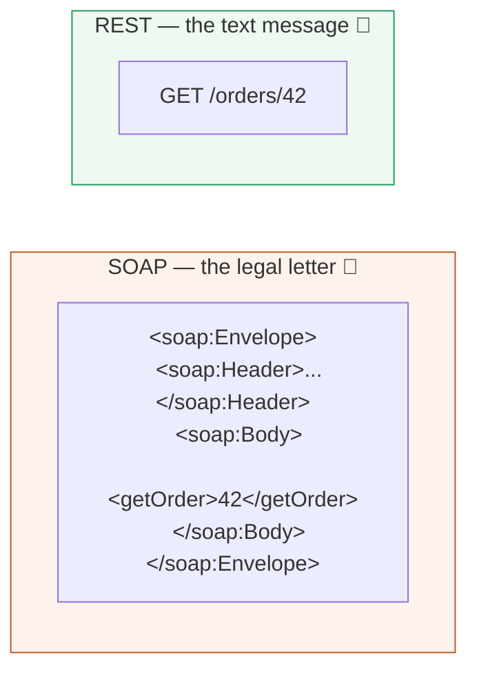

### 🔬 REST vs SOAP — when you'll meet each

| Aspect | REST | SOAP |
|--------|------|------|
| **Data format** | JSON (usually) | XML (always) |
| **Style vs protocol** | Flexible style | Strict protocol |
| **Weight** | Light, fast | Heavy, verbose |
| **Learning curve** | Easy | Steep |
| **Built-in contract** | Docs (e.g., OpenAPI) | **WSDL** (a formal machine-readable contract file) |
| **Where you'll see it** | Modern web/SaaS, AI, mobile | Banks, insurers, telecoms, legacy enterprise, government |
| **Error handling** | HTTP status codes | SOAP Faults (in the XML body) |

### 🖥️ Inside n8n

n8n has no dedicated "SOAP node" — because SOAP is just **HTTP + XML**, you handle it with the **HTTP Request node** (Part 8): POST an XML envelope to the SOAP endpoint, set the right headers (`Content-Type: text/xml`, a `SOAPAction` header), and then **parse the XML response** (often via a Code node or XML node) into JSON you can work with (Part 4.5's parsing, but for XML).

> [!NOTE]
> You will rarely *choose* SOAP for a new project in 2020s+ — but you will absolutely *encounter* it when integrating with older banks, insurers, shipping carriers, and government systems. Don't fear it: underneath, it's still a request and a response (Part 1). It just wears a heavier suit. Read the WSDL to learn the exact envelope shape it expects.

> [!WARNING]
> SOAP errors don't always show up as HTTP `4xx/5xx` (Part 1). A SOAP request can return HTTP `200 OK` while the **XML body contains a `<soap:Fault>`** explaining the real failure. So with SOAP you must inspect the *body*, not just the status code. This trips up engineers used to REST.

---

## 5.4 GraphQL

### 🧒 What is it?

**GraphQL is a newer API style where the *client* asks for exactly the data it wants — no more, no less — in a single request.** With REST, the server decides what each endpoint returns. With GraphQL, *you* write a precise "shopping query," and the server returns exactly that shape.

### 💡 Why was it invented?

REST has two nagging problems on complex apps:

- **Over-fetching** — you call `GET /users/42` to get someone's name, but the endpoint returns their *entire* profile (address, orders, settings…) — a huge payload for one field. Wasteful.
- **Under-fetching (N+1)** — a mobile screen needs a user *and* their last 3 orders *and* each order's items. In REST that might be 1 + 1 + 3 = **5 separate requests**. Slow, especially on mobile.

GraphQL (created at Facebook, 2015) fixes both: **one endpoint, one request, you specify the exact tree of data you need.**

### 📖 Story — The Buffet vs. the Custom Plate

- **REST** is a set of **fixed combo meals**. "Meal #3 comes with fries, a drink, and a toy" — you get the whole combo even if you only wanted fries. Want a drink *and* dessert from meal #5? That's a second order.
- **GraphQL** is a **build-your-own plate**: you walk down the line and say *"just the grilled chicken, a spoon of rice, and one cookie — nothing else."* One trip, exactly what you want, no waste.

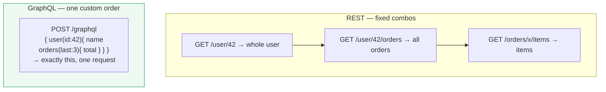

### 🔬 Under the Hood

- A GraphQL API usually has **one single endpoint** (e.g., `POST /graphql`). You don't hit many URLs; you send different **queries** to the same URL.
- You send a **query** (to read) or a **mutation** (to change) in the request body — a little tree describing the fields you want.
- The response mirrors your query's shape exactly, as JSON (Part 4).

A query and its response:

```
query {                          {
  patient(id: 42) {                "data": {
    name                             "patient": {
    medications {                      "name": "Ada",
      drug                             "medications": [
    }                                    { "drug": "Amoxicillin" }
  }                                    ]
}                                    }
                                   }
                                 }
```

### 🖥️ Inside n8n

n8n has a **GraphQL node** (and you can also use the plain HTTP Request node). You paste your query, provide any variables, add auth headers (Part 6), and it returns the JSON. Because the response shape *mirrors your query*, you already know exactly how to navigate it with expressions (Part 4.4).

> [!TIP]
> **Rule of thumb:** if an API gives you many URLs for different resources, it's **REST** — think verbs × nouns. If it gives you *one* URL and asks you to *describe the data you want*, it's **GraphQL** — think custom plate. If it makes you wrap everything in an XML envelope, it's **SOAP** — think legal letter. Identifying the style tells you how to approach it.

---

## 5.5 Endpoints

### 🧒 What is it?

**An endpoint is one specific "door" on an API — one URL you can send a request to, to do one specific thing.** If the API is the whole restaurant, an endpoint is *one item on the menu*. `POST /charges` is Stripe's "charge a card" door. `GET /messages` is Slack's "read messages" door.

An endpoint is really a **verb + path** pair, because the *same path* often does different things depending on the verb (Part 1):

```
GET  /patients      → the "list patients" endpoint
POST /patients      → the "create a patient" endpoint   (same path, different door!)
```

### 🔬 Anatomy of an endpoint call

Let's fully dissect one real endpoint call, tying together everything so far:

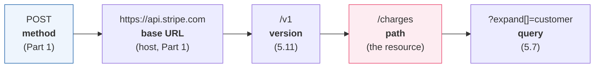

| Part | Example | What it does |
|------|---------|--------------|
| **Base URL** | `https://api.stripe.com` | Which company's server (Part 1's host) |
| **Version** | `/v1` | Which version of the API (5.11) |
| **Path** | `/charges` | Which resource/action |
| **Method** | `POST` | Which verb — read? create? delete? |
| **Query string** | `?limit=10` | Options and filters (5.7) |

The **full endpoint URL** is base + version + path: `https://api.stripe.com/v1/charges`. Combined with the **method** (`POST`), that's the exact door you're knocking on.

### 🖥️ Inside n8n

In the HTTP Request node (Part 8), an endpoint call is literally: pick the **Method**, paste the **URL** (base+version+path), add **query parameters**, **headers** (5.6), and a **body** (5.8) if needed. Every dedicated app node (Slack, Gmail) is just a *friendly wrapper* that fills in the right endpoint for you when you pick an Operation.

> [!TIP]
> Great API docs list every endpoint as a **method + path + description** table. Skim that table first — it's the *menu*. Find the one endpoint that does what you need, then read only *its* required parameters. Don't try to read the whole docs; find your door and study that door.

> [!DEBUG]
> A `404 Not Found` (Part 1) usually means your **endpoint path is wrong** — a typo, a missing `/v1`, a singular where it should be plural (`/patient` vs `/patients`), or a wrong ID. Compare your URL character-by-character against the docs. A `405 Method Not Allowed` means the path exists but you used the **wrong verb** (e.g., GET where POST was required).

---

## 5.6 Headers

### 🧒 What is it?

**Headers are extra pieces of information attached to a request or response — "about" the message, not the message itself.** If the request body is the *letter*, headers are what's written on the *envelope*: who it's from, what language it's in, whether it's fragile.

Headers are simple `Name: Value` pairs that travel with every request and response (you saw them in Part 1's raw HTTP example).

### 🔬 The headers you'll use constantly

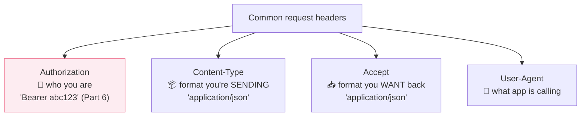

| Header | Direction | Means | Typical value |
|--------|:---------:|-------|---------------|
| **Authorization** | Request | Proves who you are (Part 6) | `Bearer eyJ...` or `Api-Key ...` |
| **Content-Type** | Both | "The *body* I'm sending is in this format" | `application/json` |
| **Accept** | Request | "Please send the response back in this format" | `application/json` |
| **User-Agent** | Request | Identifies the calling app/tool | `n8n` |
| **Content-Length** | Both | Size of the body in bytes | `348` |
| **Set-Cookie** | Response | Server asks client to store a cookie (Part 6) | `session=abc; HttpOnly` |
| **Retry-After** | Response | "You're rate-limited; wait N seconds" (5.10) | `30` |

### 📖 Story — The Envelope Markings

You mail a package. On the *outside* you write: the **recipient** and **return address** (routing), **"FRAGILE"** (handling), **"Contents: documents"** (Content-Type), **customs value** (metadata). The postal workers read these markings to handle your package correctly *without opening it*. Headers are those envelope markings — the post office (servers and proxies) reads them to route, secure, and format your message before anyone opens the letter (the body).

### 🔬 Under the Hood — why two format headers?

Beginners confuse **Content-Type** and **Accept**. They point in *opposite directions*:

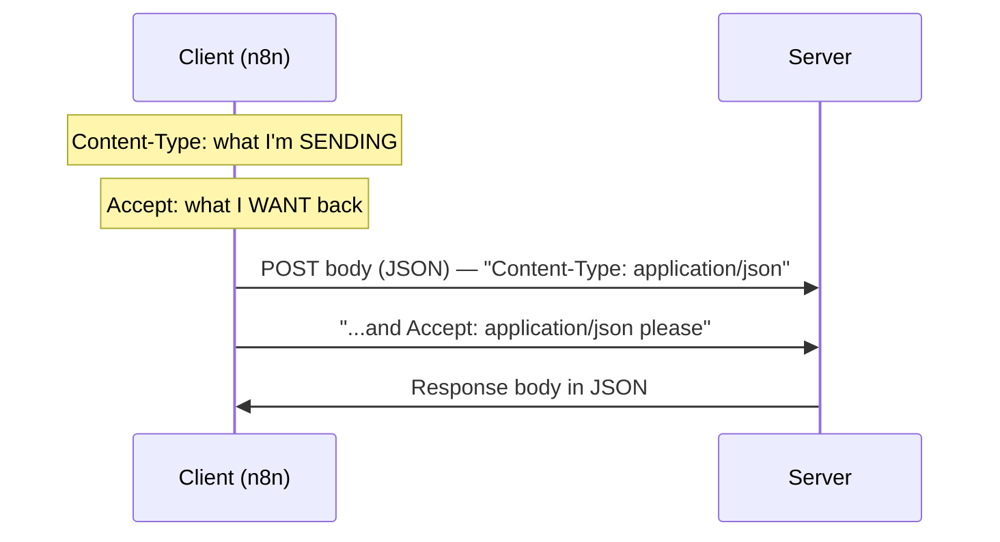

- **Content-Type** describes *your outgoing body*. Send JSON? Say `Content-Type: application/json`, or the server may misread your body (Part 4's parsing depends on this!).
- **Accept** requests the *format of the reply*. Want JSON back? Say `Accept: application/json`.

> [!WARNING]
> Forgetting **`Content-Type: application/json`** when POSTing a JSON body is one of the most common API bugs. The server receives your JSON, but — not told it's JSON — treats it as plain text and fails to parse it, often returning a confusing `400 Bad Request`. **If your POST body "isn't being read," check this header first.**

> [!BEST]
> Never put secrets in the **URL/query string** — put credentials in the **Authorization header** (Part 6). URLs get logged in server logs, browser history, and proxies (Part 1); a secret in a URL is a secret leaked. Headers are far less likely to be logged.

---

## 5.7 Query Parameters

### 🧒 What is it?

**Query parameters are options you tack onto the end of a URL to filter, sort, or page through results** — without changing *which* endpoint you're hitting. They come after a `?`, as `key=value` pairs joined by `&` (you dissected this in Part 1's URL anatomy).

```
GET /patients?status=active&sort=name&limit=20&page=2
              └──────┬──────┘ └───┬───┘ └──┬──┘ └──┬─┘
                   filter        sort      page size  which page
```

### 🔗 Real-Life Analogy — The Coffee Order Modifiers

You order a coffee (the endpoint: `/coffee`). The **modifiers** are query parameters: *large*, *oat milk*, *extra shot*, *no sugar*. You're still ordering coffee — the modifiers just refine *which* coffee. `GET /coffee?size=large&milk=oat&shots=2`. Same door, customized order.

### 🔬 The four things query params usually do

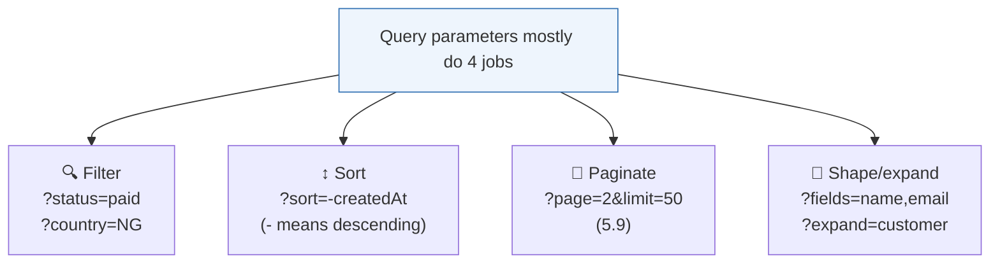

| Job | Example | Effect |
|-----|---------|--------|
| **Filter** | `?status=active` | Only matching records |
| **Search** | `?q=amoxicillin` | Text search |
| **Sort** | `?sort=-date` | Order results (often `-` = descending) |
| **Paginate** | `?page=3&limit=25` | Which slice of results (5.9) |
| **Select fields** | `?fields=id,name` | Return only some fields (REST's answer to over-fetching) |

### 🖥️ Inside n8n

The HTTP Request node has a dedicated **Query Parameters** section: you add each `key`/`value` pair in a little table and n8n assembles the `?a=1&b=2` string for you — correctly **URL-encoded** (see warning). You can fill values with expressions (Part 3.6): `page = {{ $json.nextPage }}`. This is how you build dynamic, looping API calls (5.9, Part 9's Loop).

> [!WARNING]
> Special characters in query values (spaces, `&`, `?`, `/`, `#`, non-English letters) must be **URL-encoded** — e.g., a space becomes `%20`, `&` becomes `%26`. If you type them raw, you'll break the URL (a stray `&` starts a *new* parameter!). **Good news:** use n8n's Query Parameters table (not a hand-typed URL) and it encodes automatically. Hand-build query strings only when you know the encoding rules.

> [!DEBUG]
> If a filter "isn't filtering," check three things: (1) the exact **param name** (docs may want `status`, not `state`); (2) the exact **value** the API expects (`paid` vs `PAID` vs `1`); (3) whether the param belongs in the **query** at all vs. the **body** or **path**. APIs are picky; match the docs exactly.

---

## 5.8 Request & Response Bodies

### 🧒 What is it?

The **body is the actual data payload** of a message — the letter inside the envelope. The **request body** is data you *send* (mostly with POST/PUT/PATCH, Part 1). The **response body** is the data you *get back*. Both are almost always **JSON** (Part 4) in modern APIs.

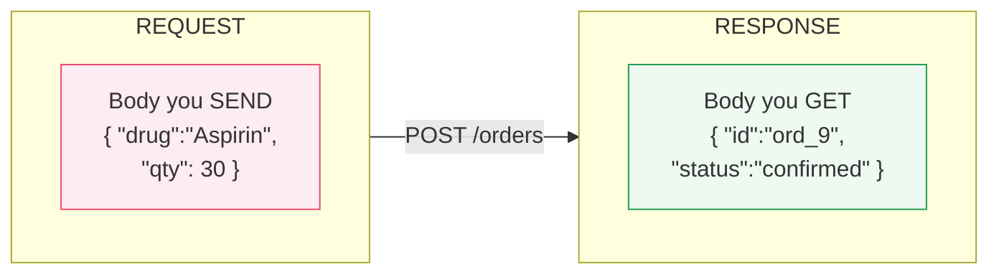

### 🔬 Request body — what you send

When creating or updating a resource, you send its data in the body:

```http
POST /v1/orders HTTP/1.1
Host: api.pharmacy.com
Authorization: Bearer sk_live_...        ← header (5.6, Part 6)
Content-Type: application/json           ← header: "body is JSON" (5.6!)

{                                        ← THE REQUEST BODY starts here
  "drug": "Amoxicillin 500mg",
  "quantity": 30,
  "patient": { "id": 42, "phone": "+234..." }
}
```

Every field here you'd fill in n8n with a value or expression. `quantity` might be `{{ $json.qty }}` from an earlier node. **The request body is where Part 4's transformation pays off** — you shape data into exactly what the endpoint's docs require.

### 🔬 Response body — what you get

The server replies with a status code (Part 1) *and* a body containing the result:

```http
HTTP/1.1 201 Created                     ← status: "I created it" (Part 1)
Content-Type: application/json

{                                        ← THE RESPONSE BODY
  "id": "ord_10482",                     ← the new ID — GOLD for your next step
  "drug": "Amoxicillin 500mg",
  "quantity": 30,
  "status": "confirmed",
  "estimatedReady": "2026-07-31T15:30:00Z"
}
```

That `id` and `estimatedReady` flow into your *next* node (Part 2's data flow!) — to text the patient, log the order, or schedule a follow-up. **Reading the response body correctly is how one API call feeds the next.**

### 🖥️ Inside n8n

- The HTTP Request node's **Body** section lets you choose the format (JSON, form-data, raw) and build it — either as fixed JSON or field-by-field with expressions.
- The **response body** appears in the node's **Output** panel, usually auto-parsed into a navigable object (Part 4.5). You then reach into it: `{{ $json.id }}`, `{{ $json.status }}`.

> [!NOTE]
> **Content types beyond JSON:** some endpoints want **form-encoded** data (`application/x-www-form-urlencoded`, like an HTML form) or **multipart/form-data** (for file uploads). The HTTP node supports these — you pick the body type. But default to **JSON** unless the docs say otherwise; it's the modern norm.

> [!DEBUG]
> A `400 Bad Request` on a POST almost always means your **request body is wrong**: a missing required field, a wrong type (Part 4 — sending `"30"` where `30` is required), a typo in a key, or malformed JSON (Part 4.5). Read the response body — good APIs return a *message* telling you exactly which field is the problem. **Always read the error body; it's usually pointing right at the fix.**

---

## 5.9 Pagination

### 🧒 What is it?

**Pagination is how APIs hand you a huge list in small, manageable pages instead of all at once.** If a pharmacy has 50,000 orders, no sane API returns all 50,000 in one response — it would be gigantic and slow. Instead it gives you *page 1* (say, 50 orders) plus a way to ask for *page 2*, and so on.

### 🔗 Real-Life Analogy — Google Search Results

You search Google and get "10 of about 4,000,000 results," with **Next →** at the bottom. Google never dumps four million links on you. It pages them. To see more, you click Next. An API works the same — except *your workflow* clicks "Next" in a loop.

### 🔬 The three pagination styles

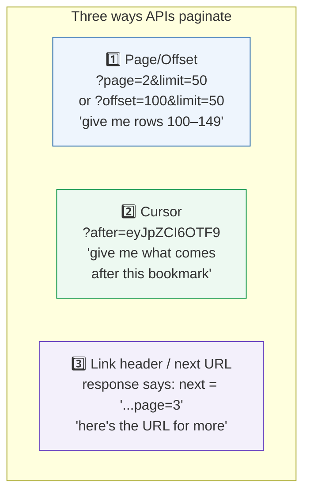

| Style | How you ask for more | Pros / cons |
|-------|----------------------|-------------|
| **Page / Offset** | Increment `?page=N` or `?offset=N` | Simple; can skip/duplicate if data changes mid-paging |
| **Cursor / Token** | Pass the `nextCursor` the API gave you | Stable for changing data; opaque bookmark |
| **Link / Next URL** | Follow the `next` URL in the response/headers | Server tells you exactly where to go |

The universal loop is the same idea regardless of style:

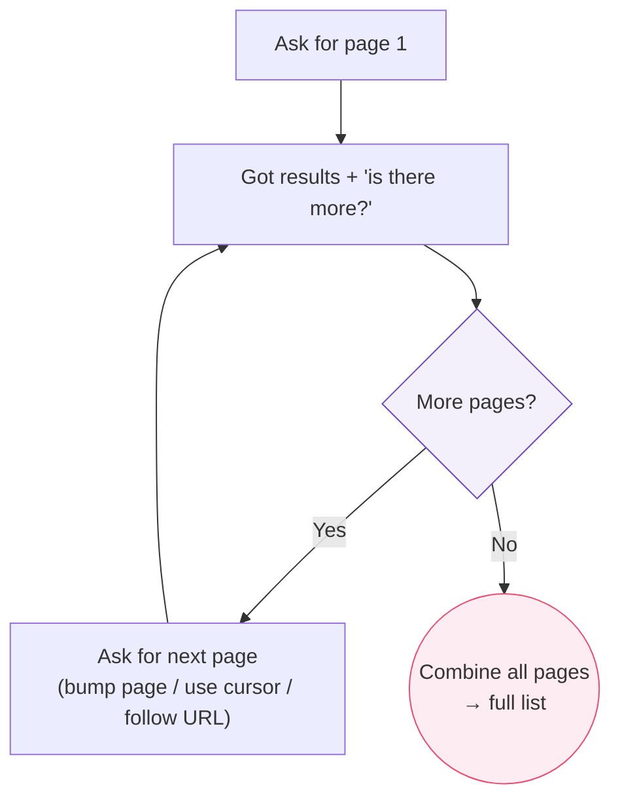

### 🖥️ Inside n8n

The HTTP Request node has a **built-in Pagination** feature (a lifesaver!). You tell it the style — e.g., "increment `page` until the response is empty," or "use the value of `response.nextCursor` as the next `after` parameter, stop when it's null." n8n then loops automatically and returns *all* items combined. For unusual APIs, you build the loop manually with the **Loop** node (Part 9), an expression to compute the next page, and a **stop condition**.

> [!WARNING]
> **Always define a stop condition.** A pagination loop with no exit becomes an **infinite loop** — it hammers the API forever, burns your rate limit (5.10), and may cost real money. Stop when: the returned page is empty, the cursor is `null`, there's no `next` URL, or you hit a sane max-pages safety cap. *Never* ship a paginator without a guaranteed exit.

> [!BEST]
> Request a **reasonable page size** (`limit`) — big enough to reduce round-trips, small enough to stay fast and within limits (50–100 is common). And **filter server-side** with query params (5.7) *before* paginating, so you page through 200 relevant rows, not 50,000 irrelevant ones (Part 2's "filter early").

---

## 5.10 Rate Limits

### 🧒 What is it?

**A rate limit is a cap on how many requests you may send in a period of time** — e.g., "100 requests per minute." APIs enforce limits so no single client can overwhelm their servers (Part 1) and ruin the service for everyone. Go over the limit and you get the `429 Too Many Requests` status code (Part 1).

### 📖 Story — The Theme Park Ride

A popular roller coaster can seat 24 people every 2 minutes. If 5,000 people rushed the gate at once, chaos — injuries, a broken ride, a ruined day for all. So there's a **queue** and a **steady boarding rate**. The ride operator is *protecting the ride and everyone's experience* by limiting throughput. An API's rate limit is that operator: it keeps the service healthy for all its users, including you.

### 🔬 How rate limits are communicated

Well-behaved APIs *tell you* your limit status in **response headers** (5.6) on every call:

| Header | Means |
|--------|-------|
| `X-RateLimit-Limit` | Your total allowance (e.g., 100) |
| `X-RateLimit-Remaining` | How many you have left (e.g., 3) |
| `X-RateLimit-Reset` | When the window resets (a timestamp) |
| `Retry-After` | On a `429`: seconds to wait before retrying |

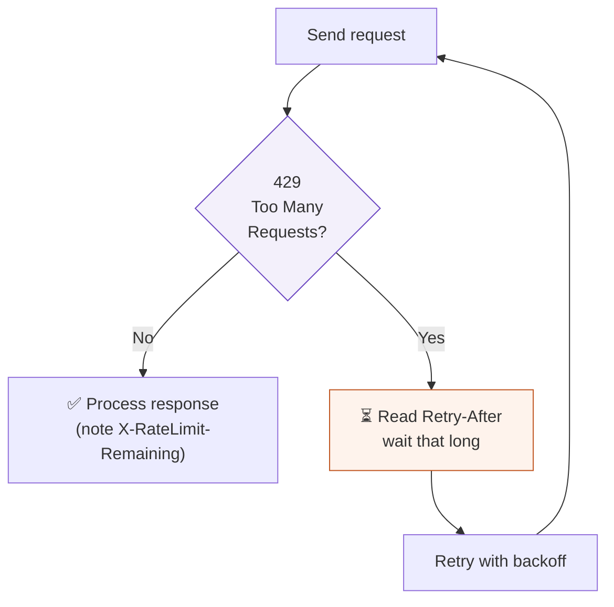

### 🔬 Under the Hood — backoff and jitter

The professional way to handle limits is **exponential backoff with jitter**: on a `429`, wait, then retry; if it fails again, wait *longer* (2s, 4s, 8s, 16s…), adding a little randomness ("jitter") so many clients don't all retry at the exact same instant and re-collide. This is a core resilience pattern you'll formalize in Part 12.

### 🖥️ Inside n8n

- Slow yourself down proactively: add a **Wait** node (Part 9) between calls, use the **Loop** node's batching to process items in small groups, or use the HTTP node's built-in **retry** and **batching/interval** options.
- On a `429`, respect **`Retry-After`** — read it with an expression and feed a **Wait** node.
- For big jobs, **Split in Batches** and pause between batches so you sip the API rather than gulp it.

> [!BEST]
> **Design for rate limits before you hit them.** Estimate your volume (1,000 patients × 1 call each = 1,000 calls; at 100/min that's 10 minutes). Batch and pace accordingly from day one. A workflow that works for 10 test records but floods the API with 10,000 real ones is a classic production failure — and can get your API key suspended.

> [!DEBUG]
> Sudden `429`s in a previously-working flow? You likely (1) increased volume, (2) added a loop that fans out calls, or (3) are sharing the limit with *another* workflow using the same key. Check `X-RateLimit-Remaining` in the response headers to see how close to the edge you are, and add pacing.

---

## 5.11 Versioning

### 🧒 What is it?

**API versioning is how a company changes its API without breaking the thousands of apps already using it.** They release a *new version* (v2) alongside the old one (v1). Your workflow keeps calling v1 and keeps working; new projects can adopt v2 when ready. The version usually appears **in the URL** (`/v1/…`, `/v2/…`) or in a **header** (`Accept: application/vnd.api+json; version=2`).

### 📖 Story — Print Editions of a Textbook

A textbook releases a **2nd edition** with reorganized chapters and new page numbers. Teachers who built a whole syllabus around the **1st edition** don't want their page references to suddenly break — so the publisher keeps the 1st edition available. Both editions coexist; classes migrate to the 2nd edition on their own schedule. API versions are editions: **v1 keeps working so you don't have to rewrite everything the day v2 ships.**

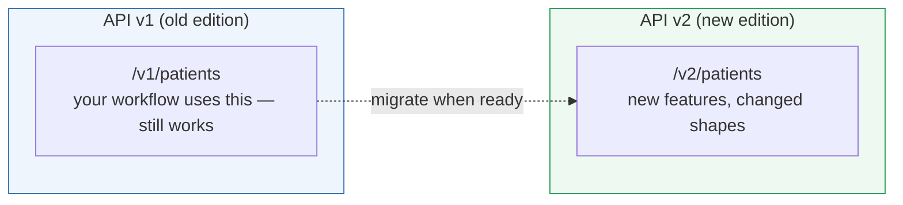

### 🔬 Under the Hood — breaking vs non-breaking changes

- **Non-breaking change** (safe, no new version): *adding* a new optional field or a new endpoint. Your code ignores what it doesn't use, so nothing breaks.
- **Breaking change** (needs a new version): *removing* or *renaming* a field, changing a field's type (Part 4!), or changing required parameters. These would break existing callers, so they go into a new version.
- **Deprecation** — the company announces "v1 will be shut off on [date]; please move to v2." They usually give months of warning, sometimes via a `Deprecation`/`Sunset` response header.

### 🖥️ Inside n8n

- **Pin the version** explicitly in your endpoint URLs (`/v1/…`). Relying on a "latest/default" that silently jumps to v2 one day is how workflows mysteriously break overnight.
- When a provider announces deprecation, **test against the new version in a copy of your workflow** before switching production over.
- n8n's own app nodes are versioned too; when you upgrade n8n, node behavior can change — pin and test (Part 12's change management).

> [!WARNING]
> **Never assume "no version in the URL" is safe.** If an API lets you call `/patients` without a version, you may be silently riding whatever the *current default* is — and the day they bump the default, your untouched workflow can break with no code change on your side. Explicitly specify the version you tested against.

> [!BEST]
> Treat a third-party API as an **external dependency you don't control** (Part 12). Pin its version, subscribe to the provider's changelog/status page, monitor for deprecation headers, and keep a copy of your workflow ready to test against the next version. Professionals plan for the API changing under them — because it will.

---

## 🏢 Business Examples — APIs across ten industries

1. **Healthcare** — A clinic calls a **REST** lab API (`GET /v2/results?patientId=42`), handles **pagination** over thousands of results, respects the lab's **rate limit**, and reads the **response body** to flag abnormal values.
2. **Pharmacy** — Ada's flow `POST`s to a supplier's **endpoint** with a JSON **request body** and an **Authorization header**; a `201` and the returned order `id` drive the patient SMS.
3. **Fintech** — A payments integration uses a **versioned** `/v1/charges` endpoint, sends card data only over HTTPS in the **body**, and implements **exponential backoff** on `429`s during traffic spikes.
4. **Education** — An LMS exposes a **GraphQL** API; the app fetches a student *and* their grades *and* attendance in **one query**, avoiding REST's under-fetching.
5. **Government** — A legacy tax system offers only a **SOAP** API; n8n's HTTP node POSTs an XML envelope and parses the `<soap:Body>` response, checking for `<soap:Fault>`.
6. **Banking** — A nightly job **paginates** through the previous day's transactions using **cursor** pagination, combining all pages before reconciling.
7. **E-commerce** — A store filters products with **query params** (`?category=shoes&inStock=true&limit=100`) and follows the `next` **Link header** to page through the catalog.
8. **Manufacturing** — IoT gateways `POST` sensor readings to a REST **endpoint**; the API returns `429` under load, and devices honor **`Retry-After`**.
9. **Logistics** — A carrier's **REST** API is polled with the right **Accept** header; when the carrier ships **v2**, the team **migrates** after testing, keeping v1 running meanwhile.
10. **Customer Support** — A helpdesk **GraphQL** mutation creates a ticket and returns only the new `ticketId` and `url`, exactly the fields the workflow needs next.
11. **AI Startups** — The app calls an LLM's **REST** endpoint (`POST /v1/messages`) with a JSON **body**, an **Authorization: Bearer** header, and handles **rate limits** and **versioning** as the model provider evolves (Part 11).

---

## 🛠️ Complete Workflow Example — "Sync All Customers from a Paginated REST API"

A common real task: pull *every* customer from a CRM's REST API (which paginates and rate-limits) into your database, transforming each into your clean shape. This exercises endpoints, headers, query params, pagination, rate limits, and bodies together.

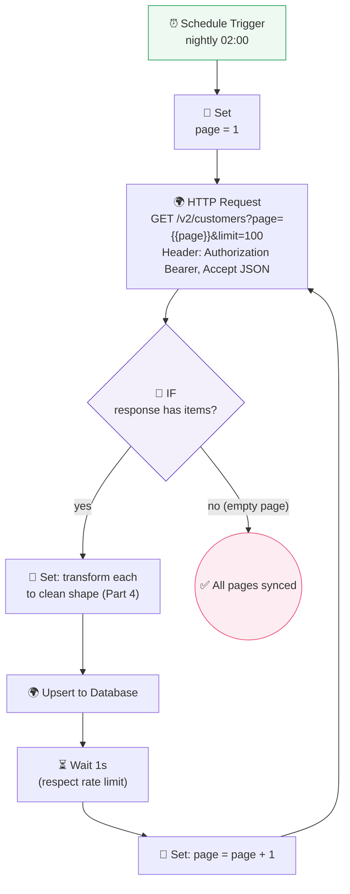

| # | Node | API concept | Why it's here |
|---|------|-------------|---------------|
| 1 | Schedule Trigger | — | Run the sync nightly (Part 2) |
| 2 | Set (page=1) | **Pagination** state | Start at the first page |
| 3 | HTTP Request | **Endpoint + headers + query** | GET the versioned customers endpoint; `Authorization` (Part 6) + `Accept`; `page`/`limit` query params |
| 4 | IF | **Pagination stop condition** | Empty page → we're done (prevents infinite loop!) |
| 5 | Set (transform) | **Response body → clean shape** | Reshape each customer (Part 4.6) |
| 6 | Upsert to DB | **Idempotency** | Insert-or-update so re-runs don't duplicate (Part 12) |
| 7 | Wait 1s | **Rate limit** | Pace the loop to stay under the cap |
| 8 | Set (page+1) | **Pagination** advance | Ask for the next page, loop back |

**Why it works:** it treats the API exactly as this chapter taught — a versioned endpoint, authenticated via a header, filtered/paged via query params, read from the response body, transformed (Part 4), and *paced* to respect the rate limit with a guaranteed stop condition. This is the backbone of nearly every "sync data from X" automation you'll ever build. (In practice you'd use the HTTP node's built-in pagination to collapse steps 2–8 — but building it by hand *once* cements the concept.)

---

## ⚠️ Common Mistakes (Chapter 5)

**Beginner:**
- Forgetting **`Content-Type: application/json`** on a POST → server can't parse your body → `400`.
- Confusing **Content-Type** (what I send) with **Accept** (what I want back).
- Using the wrong **verb** on a valid path (`GET` where `POST` is required) → `405`.

**Intermediate:**
- Putting filters in the **body** when the API wants them in the **query string** (or vice versa).
- Not handling **pagination** — only ever getting page 1 and thinking that's all the data.
- Ignoring **status codes** and blindly reading the body, even on a `4xx`/`5xx` error.

**Professional:**
- No **rate-limit strategy** → floods the API in production, gets `429`s or a suspended key.
- **Pagination loop with no stop condition** → infinite loop, runaway cost.
- Relying on an **unversioned** endpoint → silent breakage when the provider bumps the default.
- Putting **secrets in the URL/query** instead of the Authorization header → leaked in logs.

## 🏆 Best Practices (Chapter 5)

> [!BEST]
> **Read the docs' endpoint table first, match every field exactly.** Method, path, required params, body shape, auth. APIs are unforgiving of "close enough."

> [!BEST]
> **Pin the API version** you tested against, and monitor the provider's changelog. Treat every third-party API as an external dependency that *will* change.

> [!TIP]
> **Pace for rate limits from day one** — batch, wait, honor `Retry-After`, use exponential backoff. Estimate your call volume before you go live.

> [!BEST]
> **Always give paginators a guaranteed stop condition** (empty page / null cursor / no next URL / max-page cap). Never ship an unbounded loop.

> [!TIP]
> **Prefer JSON, HTTPS, headers for secrets, and query params (via n8n's table so it URL-encodes)**. These defaults keep you safe and correct across almost every API.

---

## ❓ Review Questions

1. Explain what an API is using an analogy that is *not* a restaurant. Include the ideas of "menu" and "contract."
2. Fill in the REST verb×noun table: how do you list, read-one, create, replace, patch, and delete `orders`?
3. Give one real situation where you'd expect **SOAP**, one for **REST**, and one for **GraphQL**, and justify each.
4. What problem with REST does GraphQL solve? Explain over-fetching and under-fetching.
5. What is an **endpoint**? Why can the same path be *two* endpoints? What status code suggests a wrong path vs. a wrong verb?
6. Explain the difference between the **Content-Type** and **Accept** headers. What breaks if you omit Content-Type on a JSON POST?
7. Name the four common jobs of **query parameters** and give an example of each. Why must values be URL-encoded?
8. What is the difference between a **request body** and a **response body**? Which HTTP verbs typically send a request body?
9. Describe the three **pagination** styles and the one rule every pagination loop must have.
10. What is a **rate limit**, what status code signals it, and what is **exponential backoff with jitter**? Why does API **versioning** exist, and why should you pin a version?

## 🚀 Mini Project (design the full integration — don't build it yet)

**"The Weather-to-Wardrobe Digest."**

You will integrate a public weather API (assume a REST API that needs an API-key header, supports query params for `city` and `units`, paginates a 7-day forecast, and is on `/v2`). Design a complete workflow, on paper, that every morning:

- calls the correct **endpoint** with the right **method**, **headers** (which one carries the key? which requests JSON back?), and **query params** (city + metric units),
- reads the **response body** and navigates its (nested — Part 4) forecast array,
- if the forecast spans multiple **pages**, **paginates** through all of them with a proper **stop condition**,
- respects a stated **rate limit** of 60 requests/hour (how will you pace a loop over 5 cities?),
- transforms each day into `{ day, high, low, advice }` where `advice` is `"bring an umbrella"` if rain is expected,
- and notes what you'd do when the provider announces **v2 is deprecated** in 6 months.

Deliverable: a labeled flowchart plus a short written answer for each of the seven points above, naming every header, query param, and the exact pagination stop condition you'd use.

---

## 📝 Summary — Chapter 5 on one page

- An **API** is a *menu + contract*: a documented set of things one program will do for another, plus the rules for asking. A web API = **URLs + HTTP methods + JSON + auth + status codes** — everything you already learned, formalized and promised.
- **REST** is the dominant *style*: resources are nouns with URLs, and HTTP **verbs** act on them (verb × noun = the CRUD table). It's stateless and predictable — learn it once, apply it everywhere.
- **SOAP** is the older, strict, XML-based *protocol* (the "legal letter") you'll meet in banks/insurers/government; handle it with the HTTP node and watch for `<soap:Fault>` even on HTTP 200.
- **GraphQL** lets the *client* request exactly the data shape it wants from usually *one* endpoint — solving REST's over/under-fetching (the "custom plate").
- An **endpoint** is one door: **method + base + version + path**, tuned with query params. `404` = wrong path; `405` = wrong verb.
- **Headers** are the envelope markings: **Authorization** (who you are), **Content-Type** (format you send), **Accept** (format you want back). Put secrets in headers, never the URL.
- **Query parameters** (`?key=value&…`) filter, sort, paginate, and shape results without changing the endpoint. Let n8n URL-encode them.
- The **request body** is data you send (POST/PUT/PATCH); the **response body** is what you get back — usually JSON to navigate with Part 4 skills. `400` → check your body.
- **Pagination** delivers big lists in pages (offset / cursor / next-URL); every paginator needs a guaranteed **stop condition**.
- **Rate limits** cap your requests (`429` when exceeded); handle with pacing, `Retry-After`, and **exponential backoff with jitter**.
- **Versioning** (`/v1`, `/v2`) lets APIs evolve without breaking you. **Pin your version**, watch for deprecation, and treat every API as an external dependency that will change.

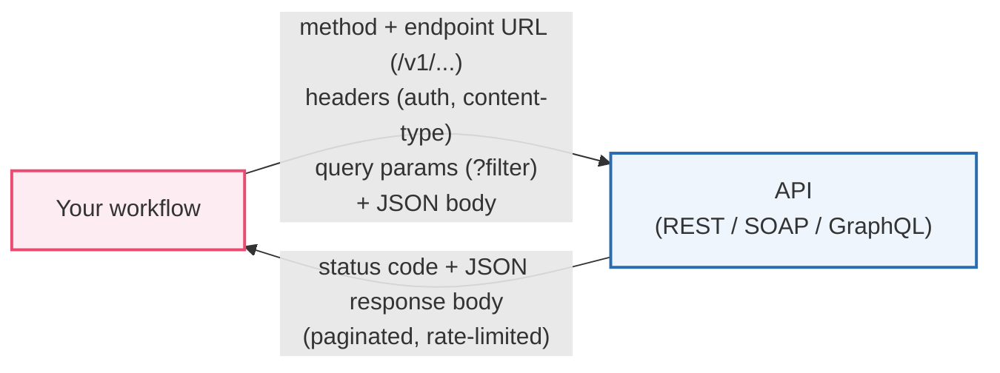

> **You can now speak to any service on the internet.** But almost every API first asks a crucial question: *"Who are you, and are you allowed?"* Answering that safely — API keys, tokens, OAuth, JWT, sessions — is **Part 6: Authentication**, where we learn to prove our identity without ever leaking our secrets.
