# Authentication <span class="kicker">Part 6 · Chapter 6</span>

In Part 5, almost every API call carried a mysterious `Authorization` header. Now we open it up. Before a server does *anything* valuable for you, it asks two questions: **"Who are you?"** (authentication) and **"Are you allowed to do this?"** (authorization). This chapter teaches you every common way to answer the first question safely — and why some ways are far safer than others.

Get authentication wrong and your workflow either doesn't work (`401`, Part 1) or, far worse, leaks a secret that lets a stranger drain a bank account or read patient records. So we go slowly and carefully.

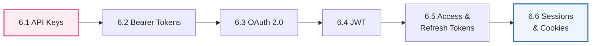

> [!NOTE]
> **Authentication vs Authorization** — remember them as **AuthN** and **AuthZ**. *AuthN* = "who are you?" (proving identity, like showing your passport). *AuthZ* = "what are you allowed to do?" (your permissions, like whether your ticket is economy or first class — Part 1's `403 Forbidden`). This whole chapter is mostly about AuthN; the two always work together.

---

## 6.1 API Keys

### 🧒 What is it?

**An API key is a long secret password that identifies your app to an API.** It's a random-looking string like `sk_live_9f2Kd8Xa...` that you include with every request. The server sees the key and thinks, *"Ah, this is that app I gave key `9f2K...` to — I know who this is."*

It's the simplest form of authentication: *one secret string = your identity.*

### 📖 Story — The Warehouse Keycard

Imagine you work at a giant warehouse. At the entrance, instead of a guard checking your face every time, you're given a **plastic keycard**. Swipe it, the door opens — the system logs "employee #4471 entered." Anyone holding that card is treated as *you*. Convenient! But also the danger: **whoever holds the card *is* you.** Drop it in the parking lot, and a stranger who picks it up walks right in as employee #4471.

An API key is exactly this keycard. Simple and powerful — and dangerous if lost.

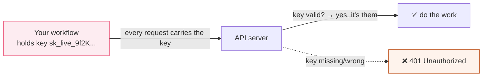

### 🔬 Where the key goes

APIs accept the key in one of a few places (the docs tell you which):

| Placement | Looks like | Safe? |
|-----------|-----------|:-----:|
| **Header** (best) | `Authorization: Bearer sk_...` or `X-API-Key: sk_...` | ✅ Good |
| **Query string** | `?api_key=sk_...` | ⚠️ Risky — logged in URLs (Part 5.6) |
| **Request body** | `{ "api_key": "sk_..." }` | ⚠️ Less common |

### 🖥️ Inside n8n

**You never type an API key directly into a node field.** Instead, you create a **Credential**: n8n stores the key **encrypted**, separate from the workflow, and injects it into requests at run time. When you export or share a workflow, the secret does *not* travel with it — only a reference does.

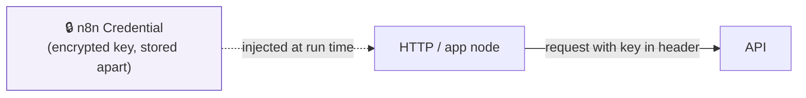

> [!BEST]
> **Never hard-code an API key** into a node parameter, an expression, or (worst of all) a Code node's source. Always use a **Credential**. Hard-coded keys leak through workflow exports, screen-shares, version control, and execution logs. This is the #1 security rule of n8n.

> [!WARNING]
> An API key is a **bearer secret** — "bearer" means *whoever bears (holds) it can use it.* There's no second factor. If it leaks, an attacker has full access until you **rotate** (revoke and reissue) it. Treat keys like cash: minimize copies, never commit them to git, never paste them in chat, and rotate immediately if exposed.

> [!TIP]
> Use **separate keys** for test and production (`sk_test_...` vs `sk_live_...`), give each key the **least privilege** it needs (a read-only key can't delete data even if stolen), and rotate keys on a schedule. Many APIs let you scope and name keys — use that.

---

## 6.2 Bearer Tokens

### 🧒 What is it?

**A Bearer token is a secret string you put in the `Authorization` header to prove your identity — where the word "Bearer" literally means "the bearer of this token is allowed in."** In practice, API keys and other tokens are very often *sent* as Bearer tokens. The format is a standard:

```
Authorization: Bearer <your-token-here>
```

So "Bearer token" is less a *different kind of secret* and more a *standard way of presenting* a secret in the header. The token itself might be a plain API key, an OAuth access token (6.5), or a JWT (6.4).

### 📖 Story — The Concert Wristband

You buy a concert ticket online. At the gate, they scan it and snap a **wristband** on you. Inside the venue, you don't show your ID or ticket again — the wristband *is* your proof. Want a drink? Flash the wristband. Enter the VIP area? The wristband's color decides. **Whoever wears the wristband is treated as the ticket-holder** — that's "bearer." Lose it (or let someone cut it off), and they become you for the night.

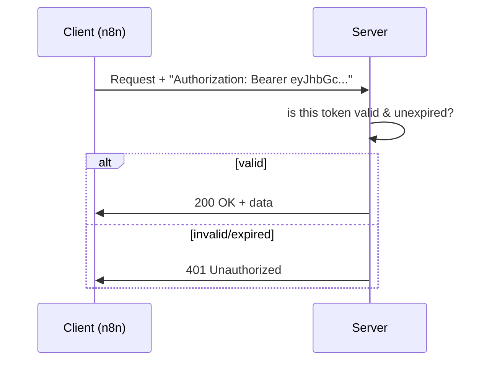

### 🔬 Under the Hood — why "Bearer" matters

The HTTP spec defines several **authentication schemes** for the `Authorization` header. The scheme name is the first word:

| Scheme | Header looks like | Notes |
|--------|-------------------|-------|
| **Bearer** | `Authorization: Bearer <token>` | Most common today (OAuth, JWT, many API keys) |
| **Basic** | `Authorization: Basic <base64(user:pass)>` | Username+password, base64-encoded (**not** encrypted!) |
| **Digest / others** | various | Older/specialized |

> [!WARNING]
> **Basic auth is base64, not encryption.** `base64("user:pass")` is trivially *reversible* — anyone who captures it reads your password instantly. It's only safe *because it rides inside HTTPS* (Part 1). Never use Basic auth over plain HTTP. Prefer Bearer tokens or keys where offered.

### 🖥️ Inside n8n

- Many app nodes handle Bearer tokens automatically once you set up their Credential.
- In the raw **HTTP Request node**, you can choose a **Predefined** or **Generic** credential type — "Header Auth" or "Bearer" — and n8n adds the `Authorization: Bearer …` header for you. You still store the token in a Credential, never in the field.

> [!DEBUG]
> A `401` when you *have* a token usually means one of: the token is **expired** (6.5 — access tokens are short-lived), you forgot the word **`Bearer `** (with the space) before it, there's a **stray space/newline** in the token, or you're using a **test** token against the **production** host. Copy the token freshly and check the exact header format.

---

## 6.3 OAuth 2.0

### 🧒 What is it?

**OAuth 2.0 is the polite way to let one app act on your behalf in another app — *without ever giving it your password.*** When you click "Sign in with Google" or "Connect your Gmail to n8n," and Google asks *"Do you allow n8n to read your email?"* and you click **Allow** — that's OAuth. n8n never sees your Google password. Instead, Google hands n8n a limited **token** (6.5) that says "n8n may read this person's email, nothing more."

OAuth is the answer to a hard question: *how do I let an app use my account without trusting it with my master password?*

### 💡 Why was it invented?

In the old days, to let App B access your App A account, you'd literally **give App B your App A password.** Terrifying:

- App B now has your *full* password — it can do *anything*, not just the one thing you wanted.
- If App B gets hacked, your password leaks.
- To revoke access, you'd have to change your password — breaking every other app too.

OAuth (2.0 finalized ~2012) fixed all of this with **delegated, scoped, revocable access via tokens**:

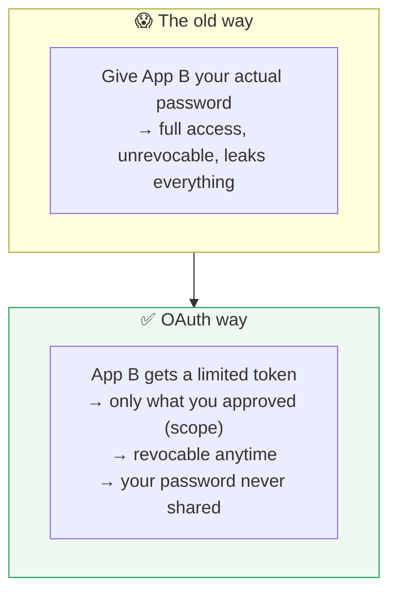

### 📖 Story — The Hotel Valet Key

A fancy car has two keys. The **master key** opens everything — trunk, glovebox, and drives at full speed. The **valet key** *only* starts the engine and drives short distances; it *won't* open the trunk or glovebox where you keep valuables. When you hand your car to a hotel valet, you give the **valet key**, not the master key.

OAuth is the valet key of software:

- **Your password** = the master key (you *never* hand it over).
- **The OAuth token** = the valet key (limited powers — the "**scopes**").
- **The valet** = the app you're connecting (n8n).
- You can **take the valet key back anytime** (revoke access) without changing your master key.

### 🔬 Under the Hood — the Authorization Code flow

The most common OAuth flow (the "Authorization Code" flow) is a carefully choreographed dance between four parties. Follow it once slowly and OAuth stops being mysterious:

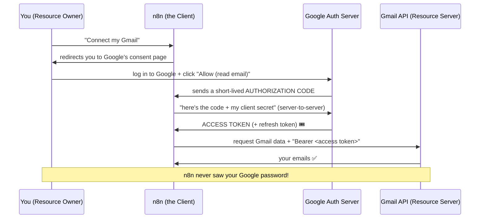

Step by step, in plain words:

1. You tell n8n "connect my Gmail." n8n sends you to **Google's own login page** (not n8n's).
2. You log in *to Google* and see exactly what n8n is asking for ("read your email"). You click **Allow**. (n8n never sees this — you're talking to Google.)
3. Google sends n8n a temporary **authorization code** (a one-time voucher).
4. Behind the scenes, n8n exchanges that code (plus its own secret) for an **access token** (6.5).
5. n8n uses that access token as a **Bearer token** (6.2) on every Gmail request.

### 🔬 Key OAuth vocabulary

| Term | Plain meaning |
|------|---------------|
| **Resource Owner** | *You* — the person who owns the data |
| **Client** | The app wanting access (n8n) |
| **Authorization Server** | Who logs you in and issues tokens (Google's auth) |
| **Resource Server** | Where your data lives (Gmail API) |
| **Scope** | The specific permissions granted (`read email`, not `delete`) |
| **Consent screen** | The "Do you allow…?" page you approve |
| **Redirect URI** | Where the auth server sends the code back (must be pre-registered) |

### 🖥️ Inside n8n

This sounds complex, but n8n does the whole dance *for you*. For OAuth apps, you:

1. Create a **Credential** of that app's OAuth type.
2. Click **"Connect my account"** / "Sign in with…".
3. A popup takes you to the provider's consent screen; you click Allow.
4. n8n stores the resulting tokens (encrypted) and **auto-refreshes** them (6.5) so you rarely think about it again.

> [!NOTE]
> For self-hosted n8n, some OAuth providers require you to register your own **Client ID / Client Secret** and whitelist n8n's **Redirect URI** in the provider's developer console. The provider's docs will name the exact redirect URL to paste (n8n shows it to you in the credential screen). This one-time setup is the most common OAuth stumbling block.

> [!BEST]
> **Request the narrowest scopes** that get the job done (least privilege — the valet key, not the master key). If your workflow only *reads* a calendar, don't grant *write/delete*. Smaller scopes limit the blast radius if the token ever leaks.

> [!TIP]
> OAuth 2.0 is about **authorization (delegated access)**. There's a sibling built on top of it, **OpenID Connect (OIDC)**, that adds *authentication* ("prove who this user is") — it's what powers "Sign in with Google" as a *login*. Same dance, plus an identity token. You'll see OIDC when a login is the goal rather than data access.

---

## 6.4 JWT

### 🧒 What is it?

**A JWT (JSON Web Token, pronounced "jot") is a token that carries information *inside itself*, signed so it can't be secretly altered.** Most tokens are just random strings the server must look up in a database to understand ("who is token `9f2K`? let me check…"). A JWT is different: it's **self-describing** — the identity and permissions are *packed into the token itself*, and a cryptographic **signature** proves nobody tampered with it.

### 📖 Story — The Tamper-Proof Festival Wristband

Compare two wristbands:

- **A plain wristband** with a barcode: the guard must scan it and check a central database to learn "this is Ada, VIP." Needs a lookup every time.
- **A JWT wristband** has your name, access level, and expiry *printed right on it*, plus a **holographic seal** that's impossible to forge. The guard reads it directly — *no database call needed* — and trusts it because the hologram (signature) proves it's genuine and unaltered. Try to scratch "economy" into "VIP" and the hologram breaks; the guard rejects it instantly.

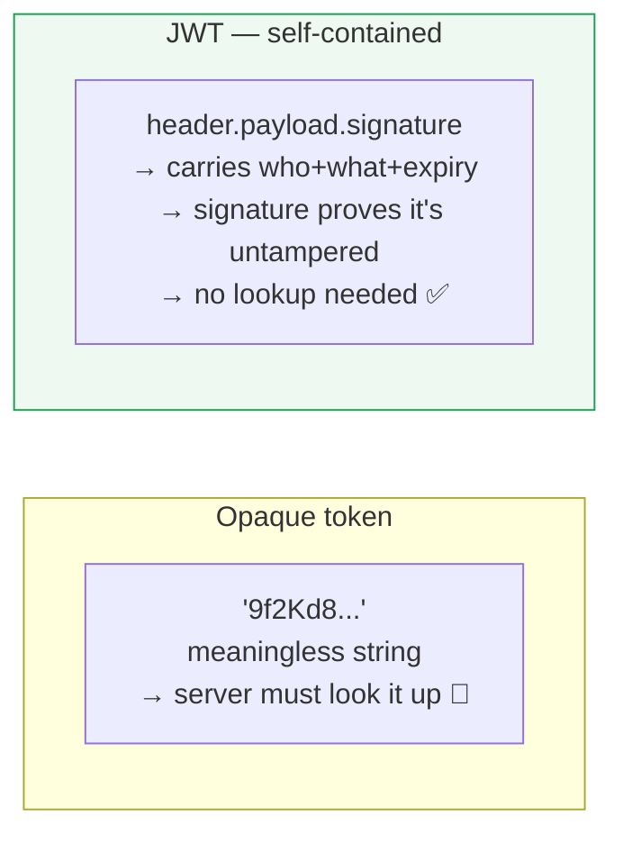

### 🔬 Under the Hood — the three parts of a JWT

A JWT is three base64 chunks separated by dots: **`header.payload.signature`**. It looks like `eyJhbGc...xxx.eyJzdWIi...yyy.SflKxwRJ...zzz`.

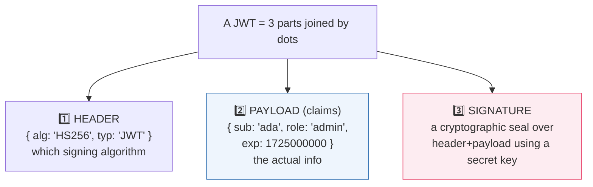

1. **Header** — says how the token is signed (e.g., algorithm `HS256`).
2. **Payload** — the **claims**: facts like `sub` (subject/user), `role`, `exp` (expiry time). This is just JSON (Part 4)!
3. **Signature** — the server computes a hash of header+payload using a **secret key** only it knows. Change even one character of the payload and the signature no longer matches → the token is rejected.

**The magic:** the server can verify a JWT using only the secret key and math — *no database lookup*. That makes JWTs fast and scalable (Part 12). The trade-off: because the info is baked in, you can't easily "un-issue" one before it expires, which is why JWTs are kept **short-lived** (6.5).

> [!WARNING]
> **A JWT's payload is *encoded*, not *encrypted*.** Anyone can base64-decode it and read the claims (`role`, `email`, etc.) — try it on jwt.io. The signature stops *tampering*, not *reading*. **Never put secrets** (passwords, card numbers) in a JWT payload. Assume anyone can read it; trust only that they can't change it.

> [!DEBUG]
> "Invalid signature" errors mean the token was signed with a *different* key than the server is verifying with (wrong secret, wrong environment), or the token was altered/corrupted in transit. "Token expired" means the `exp` claim has passed — you need a fresh one (6.5). Decode the payload at jwt.io (for non-sensitive tokens) to inspect `exp` and `iss`/`aud` claims when debugging.

---

## 6.5 Access & Refresh Tokens

### 🧒 What is it?

These two tokens work as a **pair** to balance security and convenience:

- An **access token** is your short-lived pass that actually gets you into the API (used as a Bearer token, 6.2). It expires quickly — often in minutes to an hour.
- A **refresh token** is a long-lived token whose *only* job is to get you a *new* access token when the old one expires — *without* making you log in again.

### 💡 Why two tokens?

It's a clever security trade-off:

- Access tokens are sent on **every** request, so they're the most "exposed" — many chances to leak. Making them **short-lived** means a stolen one is useless within minutes.
- But forcing you to fully re-login every 15 minutes would be miserable. So the **refresh token** — sent *rarely* (only to renew) and guarded closely — quietly issues fresh access tokens in the background.

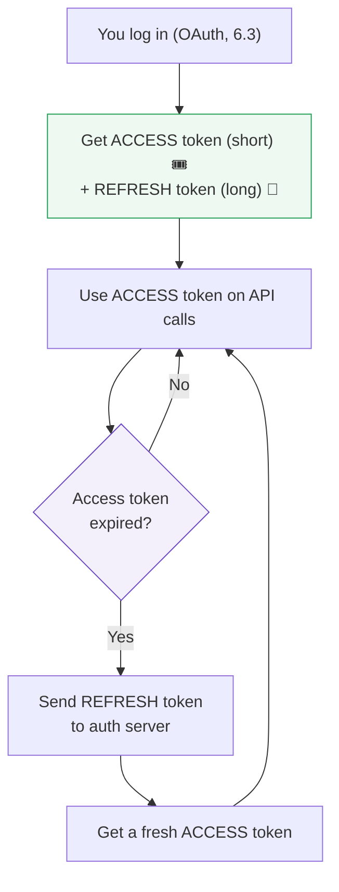

### 🔗 Real-Life Analogy — The Hotel Room Key vs. the Front Desk

Your **room keycard** (access token) opens your room, but it's programmed to **expire at checkout** — if you lose it, a thief has only a short window. The **front desk** holding your **ID and reservation** (refresh token) can print you a *new* room key anytime you ask, without re-verifying everything from scratch. You wouldn't carry your passport to the door every time — you carry the cheap, expiring keycard and let the front desk reissue it.

### 🔬 Under the Hood

| | Access Token | Refresh Token |
|--|--------------|---------------|
| **Lifespan** | Short (minutes–1 hour) | Long (days–months) |
| **Sent on** | *Every* API request | *Only* to the auth server, to renew |
| **If stolen** | Limited damage (expires fast) | Serious — can mint new access tokens |
| **Often a** | JWT (6.4) | Opaque random string |
| **Job** | Get into the resource server | Get a new access token |

### 🖥️ Inside n8n

For OAuth credentials, **n8n manages this pair for you automatically.** It stores both tokens (encrypted), uses the access token on requests, and — when it sees a `401`/expiry — silently uses the refresh token to get a new access token and retries. You typically only re-authenticate manually if the *refresh* token is revoked or expires. This invisible plumbing is a big reason to prefer n8n's built-in credentials over hand-rolling auth in the HTTP node.

> [!BEST]
> **Guard refresh tokens like crown jewels.** A leaked access token expires soon; a leaked refresh token is a long-term skeleton key. Store them only in encrypted credential stores (as n8n does), never in logs, exports, or plain env files committed to git. If you suspect exposure, **revoke** it at the provider immediately.

> [!DEBUG]
> If an OAuth integration "worked yesterday, fails today" with `401`s, the **refresh token may have been revoked or expired** — the user changed their password, an admin revoked access, the app's permissions were withdrawn, or the token hit its max age. Fix: re-run "Connect my account" in the credential to get a fresh token pair.

---

## 6.6 Sessions & Cookies

### 🧒 What is it?

**A cookie is a small piece of data a server asks your browser to store and send back on every future request.** A **session** is the server's memory of *"this particular visitor is logged in as Ada."* Cookies are how that memory is kept connected to *you* across many requests. This is the classic way *websites* (as opposed to APIs) remember you're logged in.

Remember from Part 5.2 that REST is **stateless** — the server forgets you between requests. Cookies+sessions are the trick that adds "memory" back on top of a stateless protocol.

### 📖 Story — The Coat Check Ticket

You arrive at a theater and check your coat. The attendant hangs it up (that's the **session** — your stuff, stored on *their* side) and hands you a little numbered **ticket** (the **cookie**). You wander freely. Every time you want your coat, you show ticket **#42**, and they fetch *your* coat. The ticket itself is meaningless — it's just `#42` — but it *links you to your stored stuff on their side.*

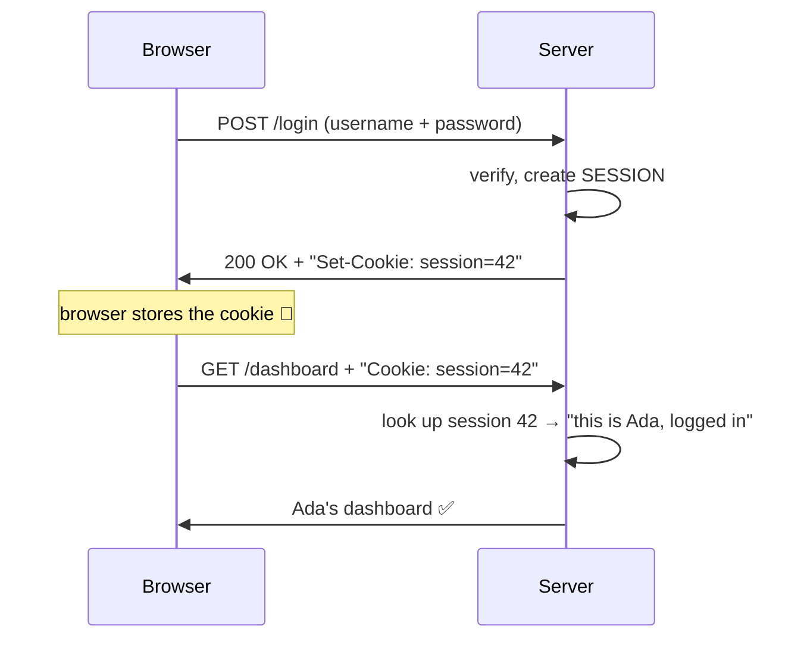

1. You log in with your password once.
2. The server creates a **session** (its record: "session 42 = Ada, logged in") and sends back a **`Set-Cookie: session=42`** header (Part 5.6).
3. Your browser stores the cookie and **automatically attaches it** (`Cookie: session=42`) on every subsequent request.
4. The server reads the cookie, looks up the session, and remembers you — no re-login needed.

### 🔬 Cookies vs Tokens — two philosophies

| | Cookies / Sessions | Bearer Tokens / JWT |
|--|--------------------|---------------------|
| **State lives** | On the **server** (session store) | In the **token** itself (JWT) or a store |
| **Sent** | Automatically by the browser | Manually in the `Authorization` header |
| **Typical use** | Traditional **websites** | **APIs**, mobile apps, automation |
| **Scaling** | Server must share session store | Stateless JWTs scale easily (Part 12) |
| **You'll use for n8n** | Rarely (some login-only APIs) | **Usually** (keys, Bearer, OAuth) |

### 🔬 Under the Hood — cookie security flags

Cookies carry safety flags you should recognize:

- **`HttpOnly`** — JavaScript in the browser *can't* read the cookie (defends against theft via malicious scripts).
- **`Secure`** — the cookie is only sent over **HTTPS** (Part 1), never plain HTTP.
- **`SameSite`** — limits sending the cookie on cross-site requests (defends against **CSRF** attacks, where a malicious site tries to ride your logged-in session).

### 🖥️ Inside n8n

Most APIs you automate use **tokens, not cookies**, so you'll reach for keys/Bearer/OAuth 95% of the time. But occasionally you'll integrate an older system that *only* offers cookie-based login. Then you:

1. `POST` the login endpoint with credentials (in a Credential!),
2. capture the **`Set-Cookie`** from the response headers,
3. send that cookie back on subsequent requests (the HTTP node can persist/forward cookies, or you extract and set the `Cookie` header manually).

> [!NOTE]
> If you find yourself wrestling with cookies in n8n, first double-check the API doesn't *also* offer a token/API-key method — it usually does, and tokens are far simpler to automate than juggling session cookies and their expiry.

> [!WARNING]
> Session cookies **expire** (by timeout or logout) just like tokens. A workflow that logs in once and reuses a cookie for days will eventually get `401`s when the session dies server-side. Build in **re-login on `401`** (Part 12's error handling) rather than assuming a session lasts forever.

---

## 🏢 Business Examples — Authentication across ten industries

1. **Healthcare** — A hospital integration uses **OAuth 2.0** with *narrow scopes* (read appointments only) so n8n can't accidentally modify records; tokens auto-refresh (6.5) nightly.
2. **Pharmacy** — Ada's supplier API uses an **API key** stored as an encrypted n8n Credential; a read-only key pulls stock, a separate write key places orders (least privilege).
3. **Fintech** — A payment provider issues short-lived **JWT access tokens** (6.4) verified without a DB lookup for speed; refresh tokens are vaulted and rotated.
4. **Education** — An LMS uses **OAuth/OIDC** "Sign in with school account," granting the workflow scoped access to a teacher's classes but not other teachers'.
5. **Government** — A legacy portal offers only **session cookies**; the workflow logs in, captures `Set-Cookie`, and re-logins automatically when the session expires.
6. **Banking** — Internal APIs require **mutual TLS + OAuth**; access tokens live 5 minutes, so a captured one is near-useless.
7. **E-commerce** — A store's public API uses **Bearer tokens** in the `Authorization` header; test vs live keys keep the sandbox isolated from real orders.
8. **Manufacturing** — Factory devices authenticate with per-device **API keys** so a single compromised sensor can be revoked without disturbing the fleet.
9. **Logistics** — A carrier uses **OAuth** with refresh tokens; n8n's credential silently renews the access token during a multi-hour bulk sync (Part 5.9).
10. **Customer Support** — A helpdesk exposes **OAuth**; the workflow requests only `tickets:write`, never `users:delete` (scope discipline).
11. **AI Startups** — LLM providers use **Bearer** API keys (`Authorization: Bearer sk-...`); the key is a Credential, scoped and rotated, never in the workflow body (Part 11).

---

## 🛠️ Complete Workflow Example — "Two APIs, Two Auth Methods, One Flow"

A real integration often mixes auth styles. Here: pull new leads from a CRM that uses **OAuth 2.0**, enrich each with a data provider that uses an **API key**, then post a summary to Slack (**OAuth** again). One workflow, three credentials, three auth mechanisms — all handled by n8n.

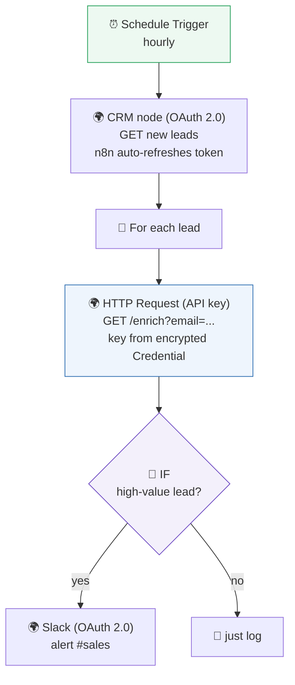

| # | Node | Auth method | What n8n handles for you |
|---|------|-------------|--------------------------|
| 1 | Schedule | none | — |
| 2 | CRM (leads) | **OAuth 2.0** (6.3) | Stores access+refresh tokens; **auto-refreshes** (6.5) when expired; sends Bearer header |
| 3 | HTTP (enrich) | **API key** (6.1) | Injects the key from an encrypted Credential into the header (6.2) — never in the workflow body |
| 4 | IF | — | Branches on lead value |
| 5 | Slack | **OAuth 2.0** | Another scoped token, auto-managed |

**Why it works — and why it's secure:** every secret lives in an **encrypted Credential**, injected only at run time. The OAuth tokens refresh themselves; the API key is scoped and rotatable; no secret appears in the workflow JSON, so exporting or sharing the flow leaks nothing. This mirrors real production integrations, where mixing OAuth and key-based APIs in one flow is the norm.

---

## ⚠️ Common Mistakes (Chapter 6)

**Beginner:**
- **Hard-coding** an API key/token into a node field, expression, or Code node instead of a Credential.
- Forgetting the literal word **`Bearer `** (with a space) before a token.
- Committing a `.env` file or workflow export **containing secrets** to git.

**Intermediate:**
- Confusing **authentication** (who you are) with **authorization** (what you may do) — chasing a `401` fix when the real problem is a `403` (scope/permission).
- Putting a secret in the **URL/query string** (gets logged) instead of a header.
- Assuming a token lasts forever; not handling **expiry/refresh** → sudden `401`s.

**Professional:**
- Granting **over-broad OAuth scopes** ("full access" when read-only would do) — huge blast radius if leaked.
- Storing **refresh tokens** insecurely (they're long-lived skeleton keys).
- Putting **sensitive claims** in a JWT payload, forgetting it's readable by anyone.
- No **key rotation** policy; a leaked key stays valid indefinitely.

## 🏆 Best Practices (Chapter 6)

> [!BEST]
> **Secrets live only in encrypted Credentials — never in workflows, expressions, code, logs, or git.** This single rule prevents the majority of real-world breaches in automation.

> [!BEST]
> **Least privilege, always.** Narrow OAuth scopes, read-only keys where possible, separate test/prod keys, per-service and per-device keys so one leak is contained and revocable.

> [!TIP]
> **Prefer OAuth or Bearer tokens over Basic auth**, and never send *any* credential over plain HTTP — HTTPS only (Part 1). Basic auth is base64, not encryption.

> [!BEST]
> **Rotate credentials on a schedule and immediately on suspected exposure.** Keep a documented rotation runbook. Assume any secret that has ever been pasted, logged, or shared is potentially compromised.

> [!TIP]
> **Let n8n manage token lifecycles.** Use built-in OAuth credentials so access/refresh handling is automatic, rather than hand-rolling auth (and its expiry bugs) in the HTTP node.

---

## ❓ Review Questions

1. Distinguish **authentication** from **authorization** (AuthN vs AuthZ) with a real example, and name the status code tied to each failure.
2. What is an **API key**, and why is it called a "bearer secret"? Where should you place it, and where should you *never*?
3. What does the word **"Bearer"** mean in `Authorization: Bearer …`? Why is **Basic auth** only safe over HTTPS?
4. Explain **OAuth 2.0** with the valet-key analogy. Why is it safer than giving an app your password?
5. Walk through the OAuth **Authorization Code flow** in five steps. At which step (if any) does n8n see your Google password?
6. What are the **three parts** of a **JWT**, and what does the **signature** guarantee (and *not* guarantee)? Why must you never store secrets in the payload?
7. Why do systems issue **access + refresh tokens** as a pair? Compare their lifespans and what happens if each is stolen.
8. How do **cookies and sessions** give a stateless server "memory"? Explain with the coat-check analogy.
9. Compare cookies/sessions vs Bearer tokens: where does the state live, how is each sent, and which does n8n use most?
10. List three professional-level authentication mistakes and the best practice that prevents each.

## 🚀 Mini Project (design the secure auth — don't build it yet)

**"The Multi-Auth Integration Audit."**

You're handed a workflow that connects to three services and told to make it *production-secure*:

- **Service A** — a CRM using **OAuth 2.0** (currently granted "full account access").
- **Service B** — a data API using an **API key** (currently hard-coded into an HTTP node's URL as `?api_key=...`).
- **Service C** — a legacy system using **Basic auth** over **plain HTTP**.

Produce a written audit that, for each service: identifies every security problem, states the exact fix (scope changes, moving the key to a header/Credential, upgrading the transport), and explains the risk if left unfixed. Then draw the corrected flow. Finally, write a short **credential-rotation runbook**: how often to rotate each secret, how to rotate without downtime, and what to do the moment a leak is suspected. *Bonus:* for Service A's OAuth, list the *minimum* scopes if the workflow only needs to **read contacts and create tasks.**

---

## 📝 Summary — Chapter 6 on one page

- Servers ask two questions: **AuthN** ("who are you?") and **AuthZ** ("what may you do?"). `401` = failed AuthN; `403` = failed AuthZ.
- An **API key** is a single secret string identifying your app — a "keycard." Simple but a bearer secret: whoever holds it *is* you. Scope it, separate test/prod, rotate it, and **store it in an encrypted Credential, never hard-coded**.
- A **Bearer token** is the standard way to *present* a secret: `Authorization: Bearer <token>`. **Basic auth** is base64 (reversible!) and safe only inside HTTPS.
- **OAuth 2.0** lets an app act on your behalf *without your password*, via a scoped, revocable token — the "valet key." The Authorization Code flow trades a one-time code for an **access token**; n8n runs the whole dance and never sees your password.
- A **JWT** is a self-describing, signed token (`header.payload.signature`). The signature prevents *tampering*, not *reading* — so it's fast (no DB lookup) but must be short-lived and free of secrets.
- **Access + refresh tokens** balance security and convenience: short-lived access tokens for every call, a guarded long-lived refresh token to silently renew them. n8n manages the pair automatically.
- **Cookies + sessions** add server-side "memory" to stateless HTTP — the "coat-check ticket." Common on traditional websites; rare in API automation, where **tokens** dominate.
- Golden rule throughout: **least privilege, secrets in encrypted Credentials only, HTTPS always, rotate on exposure.**

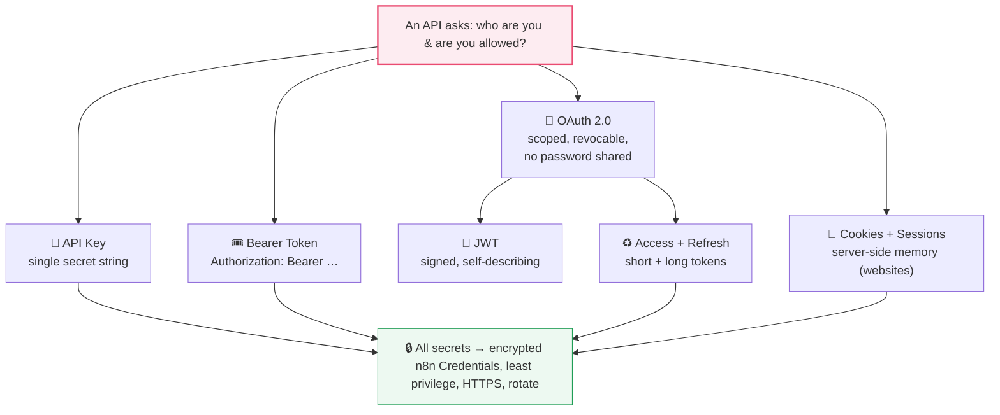

> **You can now prove your identity to any API — safely.** So far your workflows have always been the one *asking*. But how does a workflow react the instant something happens *out there* — a payment, a new message, a form submission — without constantly checking? That's **Part 7: Webhooks & Real-Time Systems**, where n8n stops asking and starts *listening*.
