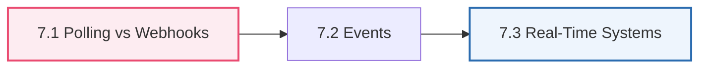
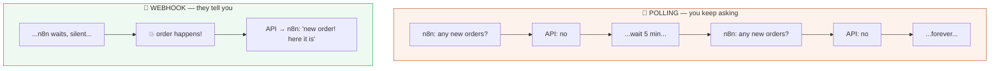
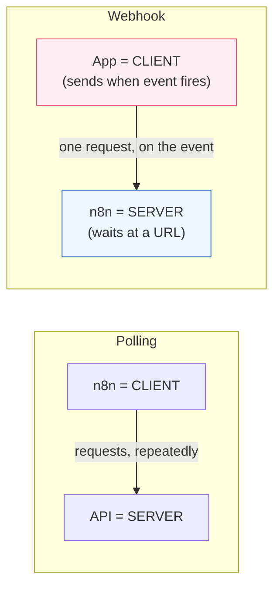
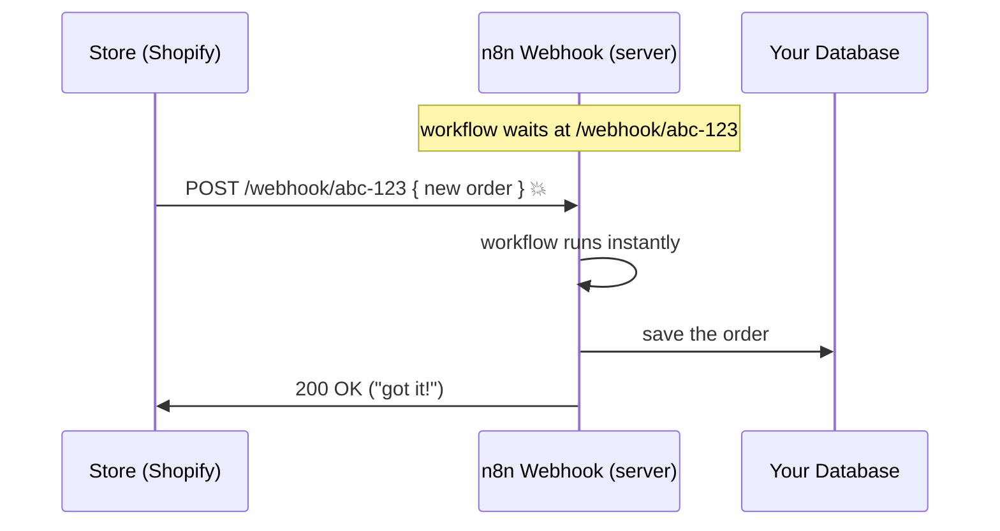
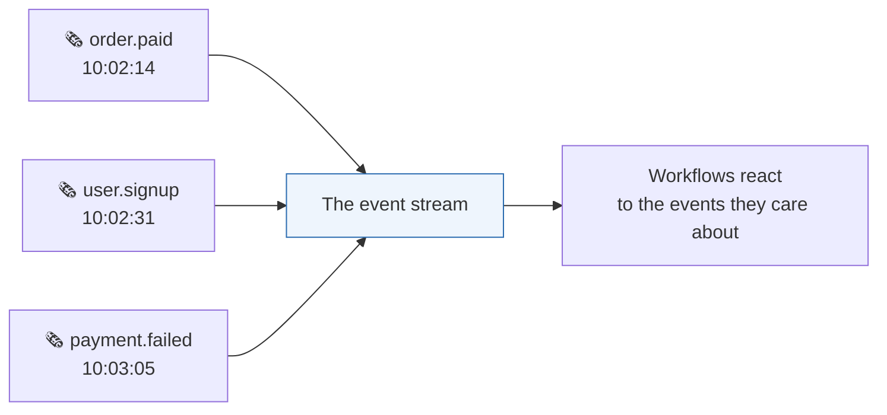
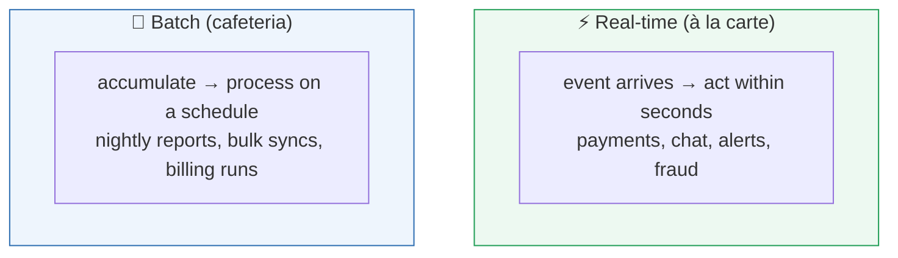
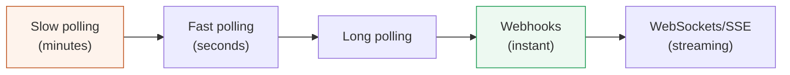
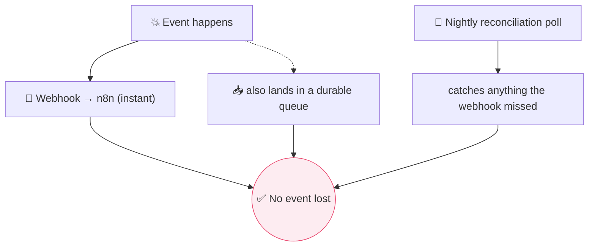
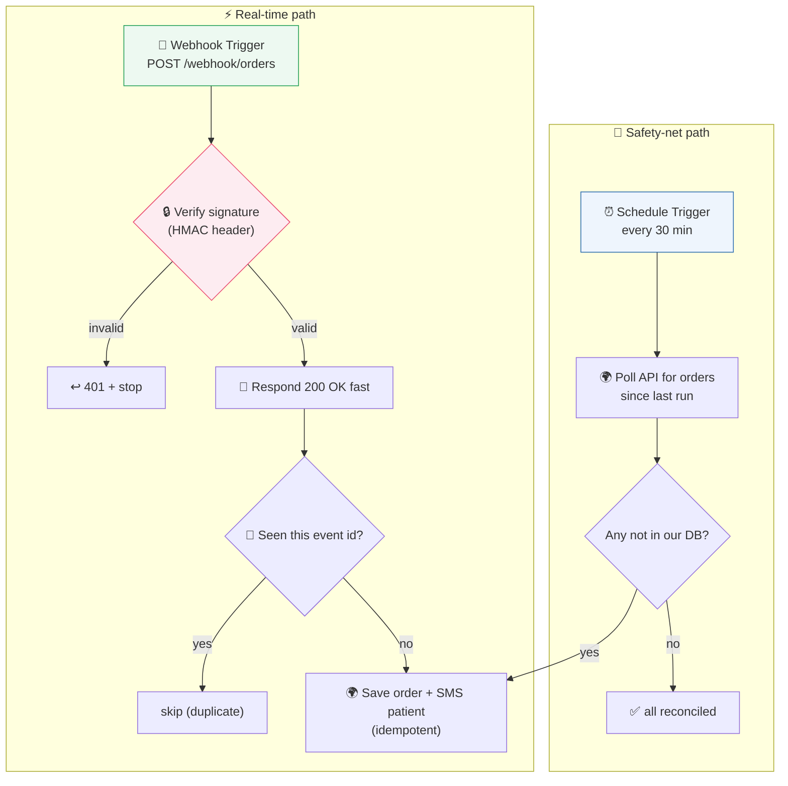
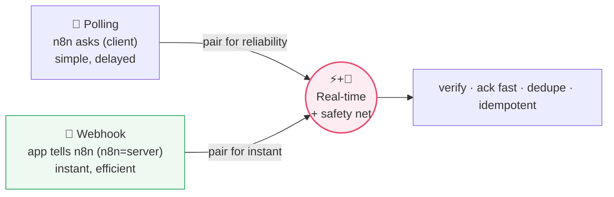

# Webhooks & Real-Time Systems <span class="kicker">Part 7 · Chapter 7</span>

Until now, your workflows have always been the one *knocking* — n8n as the client, asking an API for something (Parts 5–6). But the most powerful automations react the *instant* something happens in the outside world: a payment clears, a customer messages, a form is filled. How does a workflow know *the moment* an event occurs, without standing at the window checking forever?

Two answers exist: **polling** (keep asking) and **webhooks** (get told). This chapter makes the difference unforgettable, and turns n8n from a *caller* into a *listener*.



---

## 7.1 Polling vs Webhooks

### 🧒 What is it?

There are exactly two ways for your workflow to find out that something happened somewhere else:

- **Polling** = *keep asking.* "Any new orders? … Any new orders? … Any new orders?" — over and over, forever, on a timer. You do the checking.
- **Webhooks** = *get told.* "Don't call us, we'll call you." You give the other system your address, and it *sends you a message* the instant something happens. It does the telling.



### 📖 Story — The Impatient Child vs. the Doorbell

**Polling** is the child on a road trip asking *"Are we there yet? … Are we there yet? … Are we there yet?"* every two minutes for six hours. Most of the answers are "no." It's exhausting, wasteful, and the child *still* isn't there any faster. But — it *works*, and it works with any parent (any API), even one that never volunteers information.

**Webhooks** are the **doorbell** (remember Part 2's trigger story). You don't stand at the window watching the street all day. You install a bell, go about your life, and the *instant* a visitor arrives, *they* press it and you know immediately. No wasted effort, and you find out the second it happens.

### 🔬 Under the Hood — who is client, who is server?

This is the beautiful role-reversal from Part 1.3. Watch carefully:

- **Polling:** n8n is the **client**; it repeatedly sends requests *to* the API (the server). Same as everything in Parts 5–6.
- **Webhook:** the roles **flip**. n8n becomes the **server** — it sits and *waits* at a URL. The other system becomes the **client** — it sends a request *to n8n* when the event fires.



This is *exactly* the Slack example from Part 1.3 — n8n calls Slack (client), then Slack later calls n8n's webhook (now Slack is the client, n8n the server). **Client and server are roles, and webhooks are where the role-swap becomes a superpower.**

### 🔬 Polling vs Webhooks — the full comparison

| Aspect | Polling 🔁 | Webhooks 🔔 |
|--------|-----------|-------------|
| **Who initiates** | n8n asks (client) | The app tells n8n (n8n is server) |
| **Timing** | Delayed — up to your interval | Near-instant (real-time) |
| **Efficiency** | Wasteful — most checks find nothing | Efficient — only fires on real events |
| **Load** | Constant requests, burns rate limits (Part 5.10) | One request per actual event |
| **Setup** | Easy — just a Schedule trigger | Needs a public URL + provider config |
| **Works when** | *Any* API you can query | Only apps that *support* sending webhooks |
| **Reliability concern** | You might miss nothing (you re-check) | A missed delivery = lost event (need retries) |

### 🖥️ Inside n8n

**Polling in n8n:** use a **Schedule Trigger** (Part 2.3, 9) that runs every N minutes and calls the API, then filter to "only new since last time" (often by tracking a timestamp or last-seen ID). Many app nodes offer a built-in **"On a schedule" polling trigger** that handles the "what's new" bookkeeping for you (e.g., "Gmail Trigger — every minute").

**Webhooks in n8n:** the **Webhook node** (Part 2.3, 9) is the star. Drop it as your trigger and n8n gives you a **unique URL** like `https://your-n8n.com/webhook/abc-123`. You paste that URL into the other system's settings ("send events here"). From then on, whenever that system has news, it POSTs to your URL and your workflow fires instantly.



> [!NOTE]
> n8n's Webhook node has a **Test URL** and a **Production URL**. While building, use the Test URL and click "Listen for test event" — n8n captures the next incoming request so you can see its exact shape (Part 4) and build against real data. Switch to the **Production URL** and **activate** the workflow (Part 2!) for it to run for real, automatically.

> [!WARNING]
> A webhook needs a **publicly reachable URL.** If you run n8n on your laptop (`localhost`), the outside app *cannot* reach it — `localhost` means "this machine only." For testing you expose it via a tunnel (n8n's `--tunnel` option or a tool like ngrok); in production you host n8n at a real public HTTPS domain (Part 12). "My webhook never fires" is very often "the sender can't reach my URL."

> [!BEST]
> **Respond fast, process later.** When a webhook arrives, reply `200 OK` quickly (n8n can respond immediately) and do heavy work afterward. Senders often **retry** if you're slow or error, which can cause **duplicate** processing. Acknowledge first, then work — and make the work **idempotent** (Part 12) so a duplicate delivery doesn't double-charge anyone.

---

## 7.2 Events

### 🧒 What is it?

**An event is "a thing that happened" — a single, factual notification that something occurred at a moment in time.** "Order #991 was paid." "User ada@x.com signed up." "Temperature crossed 100°C." Events are the *content* that webhooks deliver and that real-time systems are built around.

An event is always **past tense** — it describes something that *already happened*. That's the mental shift: instead of *asking about state* ("what is the order status?"), you *react to events* ("an order-paid event arrived").

### 📖 Story — The Newsroom Wire

Old newsrooms had a **wire service** — a machine that clattered out breaking news the instant it happened: *"BREAKING: election result declared."* Reporters didn't phone every government office every five minutes asking "any news?" (polling). They *listened to the wire* and reacted when a story came across (events + webhooks). Each ticker line was an **event**: a timestamped fact, pushed the moment it was true.



### 🔬 Anatomy of an event

A webhook event payload (JSON, Part 4) typically carries:

```json
{
  "event": "order.paid",
  "id": "evt_88213",
  "createdAt": "2026-07-31T10:02:14Z",
  "data": {
    "orderId": "ord_991",
    "amount": 45.00,
    "customer": { "email": "ada@x.com" }
  }
}
```

| Field | Purpose |
|-------|---------|
| **`event`** (type) | *What* happened — you branch on this (Switch node, Part 9) |
| **`id`** | A unique event ID — used to detect **duplicates** (idempotency) |
| **`createdAt`** | *When* it happened |
| **`data`** | The payload — the details you act on |

### 🔬 Under the Hood — event-driven thinking

Notice a subtle but profound shift. Systems can be built two ways:

- **Request/response (imperative):** "Go check the order status." You pull state on demand.
- **Event-driven (reactive):** "React whenever an order changes." Producers *emit* events; consumers *react*. Nobody has to keep asking.

Event-driven design is how large, responsive systems stay loosely coupled: the store that emits `order.paid` doesn't know or care that your n8n workflow, a warehouse system, and an analytics tool are all listening. It just announces the fact once; anyone interested reacts. This is the foundation of scalable architecture (Part 12) and the mindset behind AI agents reacting to their environment (Part 11).

> [!TIP]
> **Design your webhooks to be event-typed.** Send one webhook endpoint many event types and branch with a **Switch** on the `event` field, rather than making a separate endpoint per event. It's cleaner, easier to secure, and mirrors how providers (Stripe, GitHub, Shopify) actually send events.

> [!WARNING]
> Events can arrive **out of order**, **more than once**, or (rarely) **not at all**. Networks are imperfect. Never assume "I'll receive exactly one `order.paid`, before any `order.refunded`." Design for **at-least-once** delivery: dedupe on the event `id`, and don't rely on arrival order for correctness (check timestamps/state instead).

---

## 7.3 Real-Time Systems

### 🧒 What is it?

**A real-time system is one that reacts to events *as they happen* — within seconds or less — rather than in scheduled batches.** When your phone buzzes the instant a message arrives, when a fraud alert fires mid-transaction, when a dashboard updates live — those are real-time systems. Webhooks and events are the building blocks; "real-time" is the *experience* they create.

### 📖 Story — Batch Kitchen vs. À La Carte

- A **batch** system is a **school cafeteria**: it cooks everything at fixed times (breakfast at 8, lunch at 12). If you're hungry at 9:30, you wait for lunch. Efficient for huge volumes, but *not responsive*. (This is polling on a slow timer, or a nightly job — Part 2.)
- A **real-time** system is an **à la carte restaurant**: you order, and they cook *your* dish *now*. Responsive and immediate — at the cost of needing to be ready to act at any moment.

Most businesses need *both*: real-time for anything a human or customer is waiting on (a payment confirmation, a support reply), and batch for bulk back-office work (nightly reconciliation, weekly reports).



### 🔬 The spectrum of "real-time" mechanisms

"Real-time" isn't one technology — it's a spectrum of techniques, each closing the gap between "event happens" and "you know":

| Technique | How it works | Latency | You'll use in n8n |
|-----------|--------------|---------|-------------------|
| **Slow polling** | Ask every few minutes | Minutes | Schedule Trigger |
| **Fast polling** | Ask every few seconds | Seconds | Schedule Trigger (mind rate limits!) |
| **Webhooks** | Pushed on the event | ~Instant | **Webhook node** (the default choice) |
| **Long polling** | Ask, but the server *holds* the request open until it has news | Near-instant | Some APIs; via HTTP node |
| **WebSockets / SSE** | A persistent open pipe for continuous two-way/streaming updates | Continuous | Specialized; less common in n8n |
| **Message queues** | Events land in a durable queue; workers consume them | Near-instant + reliable | Part 12 (RabbitMQ/Redis) |



### 🔬 Under the Hood — the reliability problem

Real-time systems face a hard truth: **the instant you depend on a message arriving, you must handle it *not* arriving.** Webhooks can be missed (your server was down for 30 seconds; the network hiccuped). Serious systems combine mechanisms:

- **Webhook + retry:** good providers **retry** failed webhook deliveries several times with backoff (Part 5.10). Your endpoint must return `2xx` quickly or risk duplicates.
- **Webhook + reconciliation poll:** belt-and-suspenders — react to webhooks in real time, *and* run a periodic "catch-up" poll to sweep up anything missed. This hybrid is a professional standard.
- **Message queue (Part 12):** for guaranteed delivery, events land in a durable **queue**; if a worker is down, the event waits safely until it recovers. No event is ever lost.



### 🖥️ Inside n8n

- Prefer the **Webhook node** for real-time triggers whenever the source supports it.
- For sources that only offer polling, use a **Schedule Trigger** with sensible intervals (respecting rate limits, Part 5.10) and track a "last seen" marker so you only process new items.
- For mission-critical events (money, health), add a **reconciliation workflow** on a schedule as a safety net, and design every handler to be **idempotent** (Part 12) so replays and duplicates are harmless.
- Respond to webhooks quickly with the **"Respond to Webhook"** node, then continue heavier processing on a separate path.

> [!BEST]
> **Choose the least real-time you can get away with.** True webhooks add public-URL, security, and duplicate-handling complexity. If a nightly batch meets the business need (reports, reconciliations), use it — it's simpler and more robust. Reserve real-time for when a human or customer is genuinely *waiting*. Matching the mechanism to the need is senior-engineer judgment.

> [!WARNING]
> **Secure your webhook endpoints.** A public URL is public — *anyone* can POST to it, including attackers sending fake events. Protect it: verify the provider's **signature** (many send an `X-Signature`/HMAC header you validate against a shared secret), check a secret token/path, and validate the payload shape before acting. An unverified webhook that triggers refunds or record changes is a serious vulnerability (Part 12 security).

---

## 🏢 Business Examples — Webhooks, events & real-time across industries

1. **Healthcare** — A vitals monitor **pushes** an event the instant a reading crosses a danger threshold; an n8n **Webhook** fires a real-time page to the on-call doctor — no polling delay when seconds matter.
2. **Pharmacy** — A prescription platform sends a `prescription.created` **webhook** to Ada's workflow the moment a doctor submits it, so the SMS goes out immediately (vs. checking email every 5 min).
3. **Fintech** — A payment processor sends `charge.succeeded` / `charge.failed` **events**; the workflow reacts in real time to fulfill or retry, and runs a **nightly reconciliation poll** to catch any missed webhooks.
4. **Education** — An LMS **webhook** fires on `assignment.submitted`, timestamping and acknowledging instantly; a weekly **batch** job compiles grade reports.
5. **Government** — A permit portal **webhooks** each new application to route it live, while a daily poll reconciles against the system of record for completeness.
6. **Banking** — Fraud detection is **event-driven**: each transaction emits an event; suspicious ones trigger real-time holds. Durable **queues** (Part 12) guarantee no transaction event is lost.
7. **E-commerce** — Shopify **webhooks** (`orders/create`, `orders/paid`) drive instant fulfillment, customer emails, and inventory decrements; a reconciliation poll sweeps missed events.
8. **Manufacturing** — Machine sensors emit **events** on anomalies; a real-time workflow stops the line and opens a ticket, far faster than a scheduled check would allow.
9. **Logistics** — Carriers **webhook** status changes (`in_transit`, `delivered`); customers get proactive real-time updates instead of the old "poll every 15 minutes" approach.
10. **Customer Support** — New chat messages arrive via **webhook** for instant routing; SLA timers and daily summaries run as **batch** jobs.
11. **AI Startups** — A user's message hits an n8n **Webhook**, an AI agent (Part 11) responds in real time; long-running generations may **stream** back via SSE/WebSocket while a webhook signals completion.

---

## 🛠️ Complete Workflow Example — "Real-Time Order Pipeline with a Safety Net"

An online pharmacy wants instant order handling *and* zero lost orders. This combines a real-time **webhook** path with a **reconciliation poll** — the professional hybrid pattern.



| # | Node | Concept | Why it's here |
|---|------|---------|---------------|
| 1 | Webhook Trigger | **Webhook (7.1)** | n8n as *server*; fires the instant an order is placed |
| 2 | Verify signature | **Security (7.3)** | Rejects forged events (never trust a public URL blindly) |
| 3 | Respond 200 fast | **Ack-first (7.1)** | Prevents the sender from retrying and duplicating |
| 4 | Dedupe on event id | **Idempotency (7.2)** | At-least-once delivery means duplicates *will* happen |
| 5 | Save + SMS | **Action (Part 2)** | The real work — made idempotent so replays are safe |
| 6 | Schedule Trigger | **Polling (7.1)** | The safety net — catches any webhook that never arrived |
| 7 | Poll + compare | **Reconciliation (7.3)** | Fills gaps; guarantees no order is ever silently lost |

**Why it works:** the webhook path gives **instant** response for the happy path; the scheduled reconciliation path gives **reliability** for the unhappy path (missed/failed deliveries). Signature verification gives **security**; dedupe + idempotency give **correctness** under duplicate delivery. This is exactly how serious teams build event-driven pipelines that handle money or health data.

---

## ⚠️ Common Mistakes (Chapter 7)

**Beginner:**
- Testing a webhook against **`localhost`** and wondering why the external app can't reach it (needs a public URL/tunnel).
- Forgetting to **activate** the workflow, so the *production* webhook URL never fires (Part 2).
- Polling **too fast** and blowing through the API's **rate limit** (Part 5.10).

**Intermediate:**
- Assuming a webhook fires **exactly once** — not handling **duplicates** → double SMS, double charge.
- Doing heavy work *before* responding, so the sender times out and **retries**, multiplying the work.
- Relying on webhook **arrival order** for correctness.

**Professional:**
- **No signature verification** on a public webhook → attackers can forge events (trigger refunds, create records).
- **No reconciliation/safety net** for critical events → a brief outage silently loses orders.
- Handlers that aren't **idempotent**, so any replay corrupts data (Part 12).
- Choosing real-time complexity where a simple **batch** job would have sufficed.

## 🏆 Best Practices (Chapter 7)

> [!BEST]
> **Webhook for instant, poll for reliability — use both for anything critical.** React in real time, and run a reconciliation poll as a safety net so no event is ever lost.

> [!BEST]
> **Verify every incoming webhook** (signature/HMAC or secret token) and validate the payload before acting. A public URL is an open door; put a lock on it.

> [!TIP]
> **Acknowledge fast, then process.** Return `2xx` immediately (Respond to Webhook node), do the heavy lifting afterward, and dedupe on the event `id` so retries and duplicates are harmless.

> [!BEST]
> **Make every event handler idempotent** (Part 12): processing the same event twice must produce the same result as once. This is non-negotiable for money/health workflows given at-least-once delivery.

> [!TIP]
> **Match the mechanism to the need.** Don't reach for webhooks/streaming when a nightly batch meets the requirement. The simplest reliable option wins.

---

## ❓ Review Questions

1. Explain **polling** vs **webhooks** using an analogy that is *not* the road-trip child or the doorbell.
2. In a webhook interaction, who is the **client** and who is the **server** — and how is that a reversal of Parts 5–6? Tie it to Part 1's Slack example.
3. Give three concrete advantages of webhooks over polling, and one situation where polling is the *only* option.
4. What is an **event**? Name the four fields a typical event payload carries and what each is used for.
5. Why must you design for **at-least-once** delivery? What two properties (of arrival) can you *not* assume?
6. Define a **real-time system** and contrast it with a **batch** system using the cafeteria vs à la carte analogy. Give a business that needs both.
7. List the spectrum of real-time mechanisms from slow polling to WebSockets, ordered by latency.
8. What is the **reconciliation poll** pattern, and why do serious teams pair it with webhooks?
9. Name two ways to **secure** a public webhook endpoint and the risk of skipping them.
10. Why must webhook handlers be **idempotent**, and what does "acknowledge fast, process later" prevent?

## 🚀 Mini Project (design the reactive system — don't build it yet)

**"The Support Escalation Listener."**

A SaaS company wants real-time handling of urgent support events. Design a workflow (on paper) that:

- receives, via a **Webhook**, events of several types (`ticket.created`, `ticket.updated`, `ticket.escalated`) at a single endpoint,
- **verifies** each event is genuinely from the helpdesk (how? name the header and the check),
- **acknowledges** immediately, then **dedupes** on event id,
- **branches** by event type (which node from Part 9?) — `ticket.escalated` pages the on-call engineer within seconds; `ticket.created` just logs; `ticket.updated` updates a record,
- and includes a **safety-net** path that runs every 15 minutes to catch any escalation events the webhook may have missed.

Deliverables: a labeled flowchart showing both the real-time and safety-net paths; the exact fields you'd read from the event payload; your idempotency strategy; and a short paragraph on *why* you'd (or wouldn't) also add a nightly full reconciliation. **Bonus:** decide which event types truly need real-time vs. which could be batched, and justify the trade-off.

---

## 📝 Summary — Chapter 7 on one page

- There are two ways to learn that something happened elsewhere: **polling** (keep asking — the impatient child) and **webhooks** (get told — the doorbell). Polling is simple and works with any API but is delayed and wasteful; webhooks are instant and efficient but require a public URL and provider support.
- In a **webhook**, the roles from Part 1 **flip**: n8n becomes the **server** waiting at a URL, and the external app becomes the **client** that POSTs an event when it fires. Use n8n's **Webhook node** (Test vs Production URL; activate for production).
- An **event** is a past-tense fact ("order.paid") pushed as JSON, typically carrying a **type**, a unique **id** (for dedupe), a **timestamp**, and a **data** payload. **Event-driven thinking** — react to what happened, don't keep asking about state — underpins scalable systems.
- Assume **at-least-once** delivery: events may arrive **twice**, **out of order**, or **not at all**. Dedupe on `id`, don't trust arrival order, and never assume exactly-once.
- **Real-time systems** react within seconds; **batch systems** process on a schedule (à la carte vs cafeteria). "Real-time" is a spectrum: slow polling → fast polling → long polling → **webhooks** → WebSockets/SSE → queues.
- For anything critical, combine **webhook (instant) + reconciliation poll (reliable)**, **verify** every webhook's signature, **acknowledge fast then process**, and make every handler **idempotent**. Choose the least real-time mechanism that meets the need.



> **n8n can now listen as well as ask.** You've reached a milestone: you understand the web, automation, n8n, data, APIs, security, and real-time events — the entire *conceptual* foundation. From here we go *hands-on and specific*. **Part 8** dissects the single most powerful, most-used node in all of n8n — the **HTTP Request node** — field by field, until no API on Earth can intimidate you.
