# The HTTP Request Node <span class="kicker">Part 8 · Chapter 8</span>

If you learn only one node deeply, learn this one. The **HTTP Request node** is the master key of n8n. Every dedicated app node — Slack, Gmail, Stripe — is really just a friendly costume over an HTTP request. When a service has *no* dedicated n8n node (and thousands don't), the HTTP Request node lets you talk to it anyway. **Master this node and no API on Earth is closed to you.**

You are perfectly prepared for this chapter: Part 1 gave you HTTP, Part 4 gave you JSON, Part 5 gave you APIs, and Part 6 gave you authentication. Now we assemble it all into one node, field by field.


---

## 8.1 What is it & Why it matters

### 🧒 What is it?

**The HTTP Request node sends one HTTP request (Part 1) to any URL and hands you back the response.** That's it — and that's everything. It's "a browser without the screen" (Part 1.5): you tell it the method, the address, what to send, and how to prove who you are; it makes the call and gives you the JSON (Part 4) that comes back.

### 💡 Why was it invented?

n8n ships with hundreds of pre-built app nodes. But there are *millions* of APIs. No tool could ever build a dedicated node for every service on Earth, and new APIs appear daily. The HTTP Request node is the **universal adapter**: it speaks the raw language of the web (HTTP), so it can connect to *anything* that has an API — including a brand-new startup's API released this morning, or your own company's internal service.

### 📖 Story — The Universal Power Adapter

You travel the world with one **universal power adapter**. Japan, Germany, Nigeria, Brazil — every country has a different socket, but your one adapter reconfigures to fit them all. You don't carry a separate device for each country; you carry the adapter and set it correctly for wherever you are.

The HTTP Request node is that universal adapter. Each API is a differently-shaped socket (different URL, auth, body format). You *configure* the one node to fit — and suddenly you're plugged into that service. The dedicated app nodes are like pre-shaped plugs for the most common countries; the HTTP node fits *everywhere else*.

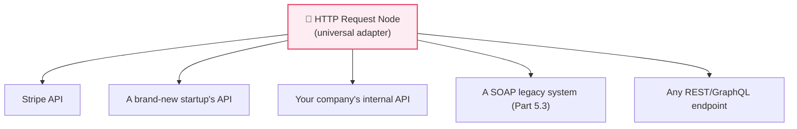

### 🖥️ The node at a glance — the fields you'll configure

Everything in this node maps to something you already learned. Here's the whole node in one map:

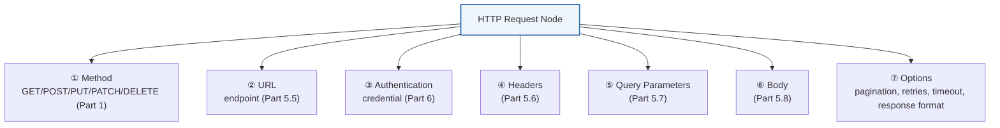

> [!TIP]
> **The single fastest way to configure this node: use "Import cURL."** Most API docs give you a ready-made `curl` command for each endpoint. n8n's HTTP node has an **Import cURL** button — paste the `curl` command and n8n fills in the method, URL, headers, and body *for you*, correctly. Then you swap hard-coded values for expressions and secrets for credentials. This turns a 10-minute setup into 30 seconds and eliminates typos.

---

## 8.2 Method & URL

### 🖥️ The Method field

A dropdown with the HTTP verbs from Part 1: **GET, POST, PUT, PATCH, DELETE** (and HEAD, OPTIONS). Pick the one the endpoint's docs specify. Recall the CRUD mapping:

| Method | Use | Sends a body? |
|--------|-----|:-------------:|
| **GET** | Read/fetch data | No (use query params) |
| **POST** | Create something | Yes |
| **PUT** | Replace something | Yes |
| **PATCH** | Partially update | Yes |
| **DELETE** | Remove something | Sometimes |

### 🖥️ The URL field

The full endpoint (Part 5.5): base + version + path — e.g., `https://api.pharmacy.com/v1/orders`. This field is where expressions shine (Part 3.6): you can build dynamic URLs from prior data.

```
https://api.pharmacy.com/v1/orders/{{ $json.orderId }}
```

At run time, `{{ $json.orderId }}` becomes the real ID (say `ord_991`), producing `.../v1/orders/ord_991`. This is how you fetch, update, or delete a *specific* record whose ID came from an earlier node.

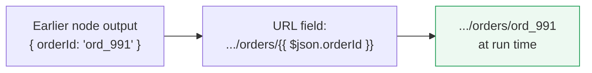

> [!WARNING]
> Put **path parameters** (the ID *in* the URL, like `/orders/991`) directly in the URL field, but put **filters** in the Query Parameters section (8.5), not jammed into the URL string by hand — n8n will URL-encode them correctly there. Mixing these up (`/orders?991` vs `/orders/991`) is a classic `404` (Part 5.5).

> [!DEBUG]
> If your dynamic URL breaks, open the execution (Part 3.3) and look at the **exact URL n8n actually sent** (visible in the request details). Nine times out of ten you'll *see* the bug — a missing slash, an `undefined` where the ID should be (meaning the expression pointed at the wrong field, Part 4.4), or a stray space.

---

## 8.3 Authentication

### 🖥️ The Authentication section

This is where Part 6 plugs in. The node offers three broad choices:

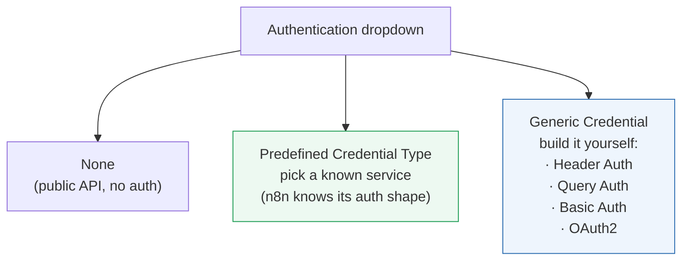

| Choice | When to use |
|--------|-------------|
| **None** | Truly public endpoints (rare) |
| **Predefined Credential Type** | The service is known to n8n — pick it and n8n handles the auth shape (headers/OAuth) for you |
| **Generic → Header Auth** | API key goes in a header like `X-API-Key: …` (Part 6.1) |
| **Generic → Bearer / Header** | `Authorization: Bearer <token>` (Part 6.2) |
| **Generic → Basic Auth** | username + password (Part 6.2 — HTTPS only!) |
| **Generic → OAuth2** | Full OAuth flow (Part 6.3); n8n manages tokens & refresh (Part 6.5) |
| **Generic → Query Auth** | Key in the query string (Part 6.1 — least preferred) |

**Crucially:** whichever you pick, the secret itself lives in a **Credential** (Part 6.1), stored encrypted and injected at run time — *never* typed into a visible field.

> [!BEST]
> Prefer a **Predefined Credential Type** if one exists for your service — it's less error-prone. Otherwise use **Generic → Header Auth** with the credential holding your key. Reserve **Basic** for legacy APIs (HTTPS only), and use the built-in **OAuth2** generic type rather than hand-managing tokens.

> [!DEBUG]
> `401 Unauthorized` (Part 1)? Walk Part 6's checklist: right credential selected? token not expired? literal word `Bearer ` with a space? correct header *name* (`Authorization` vs `X-API-Key` — the docs specify)? test vs prod key? The node's execution view shows the headers it sent (secrets masked) so you can confirm the shape.

---

## 8.4 Headers

### 🖥️ The Headers section

Add `Name: Value` pairs (Part 5.6). The two you'll set most:

- **`Content-Type: application/json`** — when sending a JSON body (8.6). *n8n usually sets this automatically when you choose a JSON body*, but set it explicitly if the API is picky.
- **`Accept: application/json`** — ask for JSON back.

Other common ones: a custom `X-Api-Version` (Part 5.11), `User-Agent`, or app-specific headers the docs require. Values can be expressions: `X-Request-Id: {{ $json.id }}`.

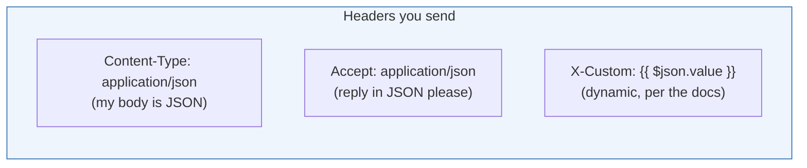

> [!WARNING]
> Don't put your API key in a plain header field as literal text — that hard-codes the secret (Part 6). Use the **Authentication → Header Auth credential** (8.3), which adds the auth header *from the encrypted credential*. Use the Headers section for *non-secret* headers (Content-Type, Accept, versions).

> [!DEBUG]
> A `400`/`415 Unsupported Media Type` on a POST usually means a **missing or wrong `Content-Type`** (Part 5.6) — the server can't tell your JSON is JSON. Set `Content-Type: application/json` explicitly and retry.

---

## 8.5 Query Parameters

### 🖥️ The Query Parameters section

A little table of `key`/`value` pairs (Part 5.7). n8n assembles them into `?key=value&key2=value2` and — importantly — **URL-encodes** them for you, so spaces and special characters don't break the URL.

Use them to filter, sort, and paginate:

| Key | Value | Effect |
|-----|-------|--------|
| `status` | `paid` | filter |
| `sort` | `-createdAt` | newest first |
| `limit` | `100` | page size |
| `page` | `{{ $json.page }}` | dynamic page (8.8) |

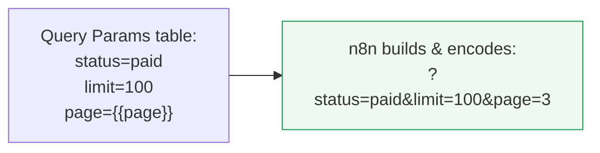

> [!BEST]
> **Always use this table, not a hand-typed query string in the URL field.** The table encodes special characters correctly (Part 5.7's warning) and keeps dynamic paging clean. Hand-built query strings are a top source of subtle bugs.

---

## 8.6 Body

### 🖥️ The Body section

For POST/PUT/PATCH, this is the data you send (Part 5.8). n8n offers several **Body Content Types**:

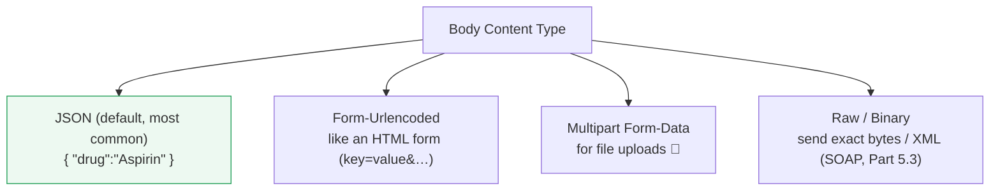

| Body type | Use for | Sets Content-Type to |
|-----------|---------|----------------------|
| **JSON** | Modern REST/GraphQL APIs (default) | `application/json` |
| **Form-Urlencoded** | Older APIs, OAuth token endpoints | `application/x-www-form-urlencoded` |
| **Multipart Form-Data** | Uploading files/images | `multipart/form-data` |
| **Raw** | XML (SOAP), custom formats | you set it |

For **JSON**, you can either build the body **field-by-field** (a table of names→values, each fillable by expression) or paste **raw JSON** with expressions inside:

```json
{
  "drug": "{{ $json.drugName }}",
  "quantity": {{ $json.qty }},
  "patient": { "id": {{ $json.patientId }} }
}
```

Notice: `drug`'s value is in quotes (a string, Part 4.1) but `quantity` and `id` are *not* — because they must be **numbers** (Part 4.1's string-vs-number trap!). Getting these quotes right is exactly the type-discipline Part 4 drilled.

> [!WARNING]
> The #1 body bug: **sending a number as a string** (`"quantity": "30"`) when the API wants a real number (`30`), or vice versa. Read the API docs' schema, and match the JSON types exactly (Part 4.1). A `400 Bad Request` with a message like *"quantity must be an integer"* is this bug — read the **response body** (8.7), it usually names the offending field.

> [!TIP]
> For **file uploads**, use **Multipart Form-Data** and reference n8n **binary data** (a field like `data`) that came from a previous node (e.g., a downloaded file or a form upload). For downloads, see the response section (8.7) — set the response format to **File/Binary**.

---

## 8.7 Response Handling

### 🖥️ The response & its options

After the call, the node outputs the response. Key options control *what* you get:

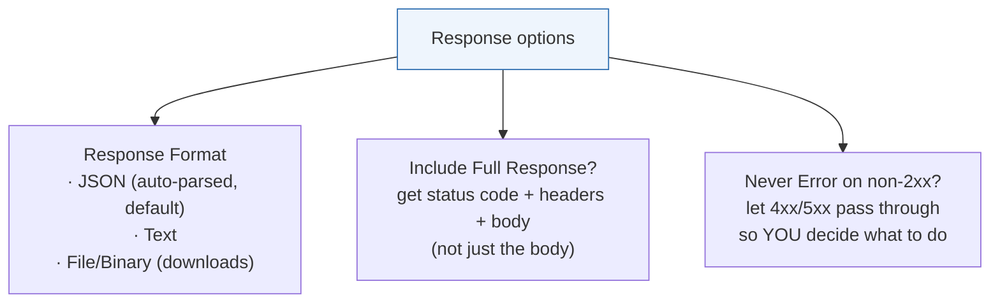

| Option | What it does | Why you'd use it |
|--------|--------------|------------------|
| **Response Format = JSON** | Auto-parses the body into an object (Part 4.5) | Default; navigate with `{{ $json.… }}` |
| **Response Format = File** | Returns the response as binary | Downloading PDFs, images, CSVs |
| **Include Response Headers and Status** | Output also carries `statusCode` + `headers` | Check status codes (Part 1), read rate-limit headers (Part 5.10), get `Set-Cookie` (Part 6.6) |
| **Full Response** | Wraps body under `body`, plus `headers`, `statusCode` | When you need the whole picture |

By default the node **throws an error on non-2xx** (Part 1) — which stops the branch. Often that's what you want. But sometimes you want to *inspect* a `4xx`/`5xx` yourself and branch gracefully:

> [!TIP]
> Enable **"Include Response Headers and Status"** (or an option often called *"Never Error"* / *"Ignore SSL/HTTP errors"* depending on version) when you want to **handle failures in the workflow** instead of crashing the node. Then follow the HTTP node with an **IF** (Part 9) on `{{ $json.statusCode }}` to branch: 2xx → continue, 429 → wait & retry (Part 5.10), 4xx → log & alert. This is how you build resilient flows (Part 12).

> [!DEBUG]
> To debug *any* HTTP call, open the **execution** (Part 3.3) and inspect the node's **request and response**: the exact URL, method, headers sent (secrets masked), the status code, and the raw response body. The response body from a good API almost always contains an **error message pointing at the fix**. Read it before changing anything.

---

## 8.8 Pagination, Retries & Timeouts (the Options)

### 🖥️ Built-in Pagination

The node has a **Pagination** option that automates the loop from Part 5.9 — no manual Loop node needed. You configure:

- **Mode** — e.g., *"Update a parameter each request"* (bump `page`), or *"Response contains next URL"* (follow it), or *"Response contains a cursor"* (pass it as the next `after`).
- **The value/expression** for the next page (`{{ $response.body.nextCursor }}`).
- **A stop condition** — when the response is empty, the cursor is null, or a **max requests** cap is hit.

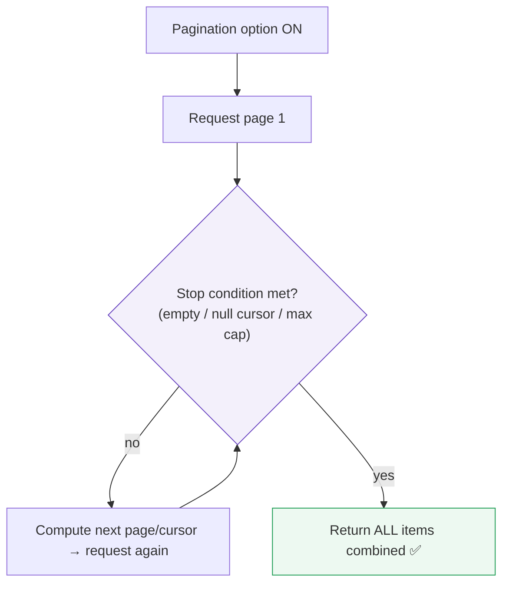

> [!WARNING]
> **Set a max-requests cap** on pagination as a safety net (Part 5.9). A misconfigured stop condition can loop forever, burning rate limits and money. The cap is your circuit breaker.

### 🖥️ Retries & Timeout

Under **Options** you'll find resilience settings (Part 5.10, Part 12):

| Option | What it does | Good default |
|--------|--------------|--------------|
| **Retry On Fail** | Auto-retry failed requests | On, for idempotent GETs |
| **Max Retries** | How many attempts | 3–5 |
| **Retry Interval** | Wait between tries (backoff) | Increasing (Part 5.10) |
| **Timeout** | Give up if no response in N ms | 10–30s |
| **Batching** | Send items in small groups with a pause | Pace to rate limits |

> [!BEST]
> **Turn on retries for read (GET) calls freely.** For **writes (POST that create/charge)**, be careful: a retry after a timeout might create a *duplicate* if the first call actually succeeded. Only auto-retry writes when the endpoint is **idempotent** (Part 7.1, Part 12) — e.g., it accepts an idempotency key or an upsert. Otherwise handle write failures deliberately.

> [!TIP]
> Set a **timeout** on every external call. Without one, a hung server can freeze your workflow indefinitely. A 10–30s timeout plus retries turns a flaky API into a reliable one.

---

## 8.9 Errors & Debugging (the field guide)

Bring together every failure mode into one reference you'll return to for years:

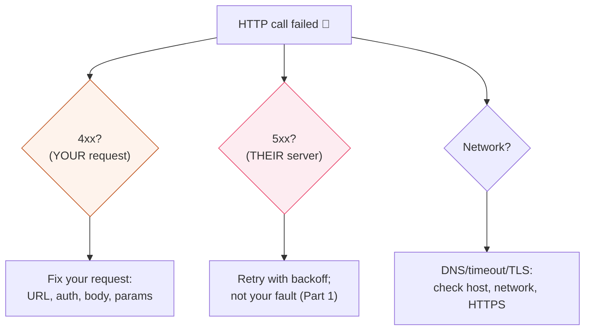

### The HTTP node troubleshooting table

| Symptom | Likely cause | Fix |
|---------|-------------|-----|
| `401 Unauthorized` | Bad/expired/missing credential (Part 6) | Check credential, token expiry, `Bearer ` prefix, header name |
| `403 Forbidden` | Valid identity, no permission (Part 6 AuthZ) | Widen scope/permissions; not an auth *credential* problem |
| `404 Not Found` | Wrong URL/path (Part 5.5) | Compare path char-by-char; check `/v1`, plural, the ID |
| `405 Method Not Allowed` | Wrong verb (Part 5.5) | Match the docs' method (GET vs POST) |
| `400 Bad Request` | Malformed body/params (Part 4, 5.8) | Read response body; fix field names, types, JSON validity |
| `415 Unsupported Media Type` | Missing/wrong Content-Type (Part 5.6) | Set `Content-Type: application/json` |
| `429 Too Many Requests` | Rate limit (Part 5.10) | Honor `Retry-After`; add Wait/backoff/batching |
| `500/502/503` | Server error/overload (Part 1) | Retry with backoff; check provider status page |
| `ENOTFOUND` / DNS | Misspelled host (Part 1.7) | Fix the domain in the URL |
| `ETIMEDOUT` | Server too slow / no timeout set | Set timeout + retries; check network |
| `undefined` in URL/body | Expression points at a missing field (Part 4.4) | Fix the field path; check the input panel |
| Body "not read" | Missing `Content-Type` or wrong body type | Set JSON body type + Content-Type |

> [!DEBUG]
> **The universal HTTP debugging ritual (memorize this):** (1) Open the failed **execution**. (2) Read the **status code** — first digit tells you whose fault (Part 1). (3) Read the **response body** — good APIs name the exact problem. (4) Inspect the **request n8n actually sent** — URL, headers, body — and compare to the docs. (5) Reproduce the working call from the docs with **Import cURL**, then change one thing at a time until yours matches. This ritual solves the vast majority of API bugs in minutes.

---

## 🏢 Business Examples — the HTTP node in the wild

1. **Healthcare** — Connecting to a regional health API with **no dedicated n8n node**; the HTTP node handles OAuth2 (8.3), paginates results (8.8), and downloads PDF lab reports (Response Format = File, 8.7).
2. **Pharmacy** — Ada's flow POSTs orders to a supplier's REST API via the HTTP node with a Header-Auth credential and a JSON body, reading back the new order `id` (8.7).
3. **Fintech** — Calling a payments API with **idempotency keys** and careful **retry** settings (8.8) so a timeout never double-charges a customer.
4. **Education** — Pulling a school district's custom API (form-urlencoded body, 8.6) that predates modern JSON conventions.
5. **Government** — Talking to a **SOAP** legacy system (Part 5.3) by sending a **Raw XML body** (8.6) and parsing the XML response.
6. **Banking** — Nightly cursor-**paginated** (8.8) transaction pulls with a max-request cap and timeouts, feeding reconciliation.
7. **E-commerce** — Hitting a niche shipping-rate API with dynamic **query params** (8.5) built from cart data via expressions.
8. **Manufacturing** — Posting sensor batches to an IoT ingestion endpoint with **batching** (8.8) to respect the ingest rate limit.
9. **Logistics** — Following a carrier's **"next URL" pagination** (8.8) to walk an entire day of shipment events.
10. **Customer Support** — Calling an internal ticketing microservice (no public node) with a **Bearer** credential and status-code branching (8.7).
11. **AI Startups** — Calling any LLM/vector-DB API directly via the HTTP node when a dedicated node doesn't exist yet — the escape hatch that keeps you on the bleeding edge (Part 11).

---

## 🛠️ Complete Workflow Example — "Talk to an Unsupported API, End to End"

Your task: a new analytics startup, **MetricFlow**, has a REST API but *no* n8n node. You must fetch all of yesterday's events (paginated, rate-limited, authenticated), keep only errors, and post a summary to Slack. This uses *every* section of this chapter.

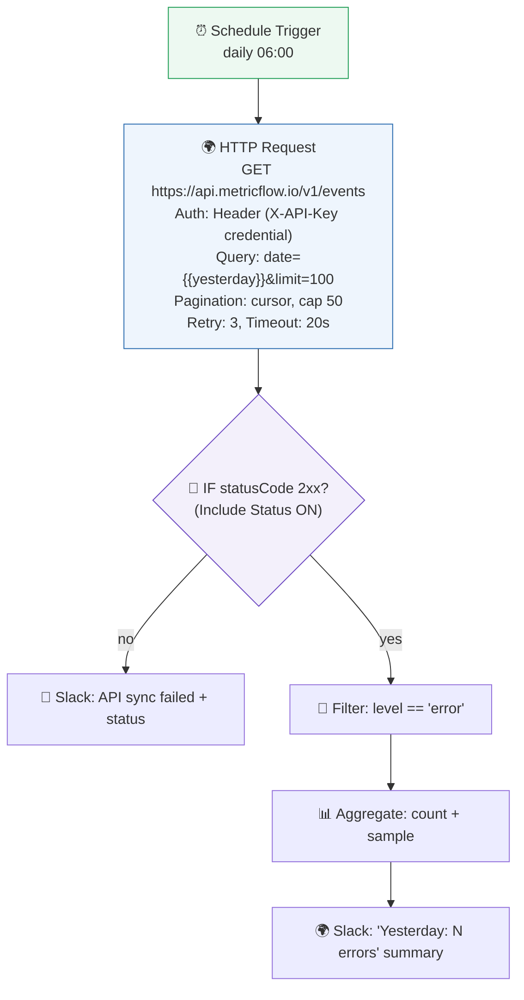

| # | Node | HTTP-node feature used | Why |
|---|------|------------------------|-----|
| 1 | Schedule | — | Runs the sync daily (Part 2) |
| 2 | HTTP Request | **Method+URL** (8.2), **Header Auth** (8.3), **Query params** (8.5), **Pagination + Retry + Timeout** (8.8), **Include Status** (8.7) | The whole call to the unsupported API in one node |
| 3 | IF | Branch on **`statusCode`** (8.7) | Handle failures gracefully instead of crashing |
| 4 | Filter | Data (Part 4) | Keep only error-level events |
| 5 | Aggregate | Data (Part 4.6) | Count and sample for the summary |
| 6 | Slack | App node | Deliver the human-readable result |

**Why it works:** with *no* dedicated node available, the HTTP Request node did everything — authenticated with an encrypted credential, filtered server-side via query params, paginated safely with a cap, retried transient failures, timed out hung calls, and exposed the status code so the flow could branch on success vs. failure. **This is the pattern for integrating literally any API n8n doesn't natively support** — and it's why this one node makes you unstoppable.

---

## ⚠️ Common Mistakes (Chapter 8)

**Beginner:**
- Hard-coding the API key into the URL/Headers instead of a **credential** (Part 6).
- Wrong **method** for the endpoint (GET vs POST) → `405`.
- Forgetting **`Content-Type: application/json`** on a JSON POST → `400/415`.

**Intermediate:**
- Hand-typing query strings (encoding bugs) instead of the **Query Params table** (8.5).
- Sending numbers as strings in the **body** (Part 4.1) → `400` "must be an integer."
- Not enabling **Include Status**, so you can't branch on failures — the node just crashes.

**Professional:**
- **Pagination without a max cap** → infinite loop, runaway cost (8.8).
- Auto-**retrying non-idempotent writes** → duplicate charges/records (8.8, Part 7).
- **No timeout** → a hung server freezes the workflow.
- Ignoring the **response body's error message** and guessing at fixes instead of reading it (8.9).

## 🏆 Best Practices (Chapter 8)

> [!BEST]
> **Import cURL from the docs, then harden it:** swap literals for expressions, secrets for credentials, and add retries/timeout/pagination. Fastest *and* most correct way to build a call.

> [!BEST]
> **Secrets in credentials, filters in query params, correct JSON types in the body, and Include-Status for branching.** These four habits prevent most HTTP-node bugs.

> [!TIP]
> **Always set a timeout and sensible retries; cap pagination; only auto-retry idempotent calls.** Resilience is configured here, per call, not hoped for.

> [!DEBUG]
> **When stuck, read the status code, then the response body, then the exact request n8n sent.** The fix is almost always spelled out in those three places.

---

## ❓ Review Questions

1. Why is the HTTP Request node called "the master key" of n8n? What does it let you do that dedicated app nodes cannot?
2. What is **Import cURL** and why is it the recommended way to configure a new call?
3. When do you put a value in the **URL path** vs the **Query Parameters** table? Give an example of each and the bug that mixing them causes.
4. List the Authentication choices and which Part 6 mechanism each maps to. Where does the actual secret live?
5. Which two **headers** do you set most, and what does each do (Part 5.6)? Why not put your API key in the Headers section as text?
6. Name the four **Body Content Types** and a use case for each. What's the string-vs-number trap in a JSON body?
7. What does **"Include Response Headers and Status"** give you, and how do you then branch on the result? Which node follows the HTTP node?
8. How does the node's built-in **Pagination** work, and what safety setting must you always add?
9. When is it safe to **auto-retry** a call, and when is it dangerous? What concept from Part 7 makes retrying writes safe?
10. Write out the **universal HTTP debugging ritual** in order, and use it to explain how you'd diagnose a `400` on a POST.

## 🚀 Mini Project (configure the whole node on paper — don't build it yet)

**"Integrate the Undocumented Startup API."**

A startup, **ShipFast**, gives you this from their docs (a cURL snippet):

```
curl -X POST https://api.shipfast.io/v2/shipments \
  -H "Authorization: Bearer YOUR_KEY" \
  -H "Content-Type: application/json" \
  -d '{ "orderId": "ord_1", "weightKg": 2, "express": true }'
```

They also mention: results from `GET /v2/shipments` are **cursor-paginated** (`nextCursor` in the response), the rate limit is **120 req/min**, and the API occasionally returns `503`.

Fully specify the HTTP Request node(s) to: (a) **create** a shipment for each order coming from a prior node — mapping `orderId`, `weightKg`, and `express` with expressions and the **correct JSON types** (which fields are numbers/booleans, not strings?); and (b) a second call to **list** all shipments with proper **pagination** (mode, next-value expression, stop condition, max cap), **retries/backoff** for the `503`s, a **timeout**, and **status-code branching** for failures. Write out every field: Method, URL, Authentication type + where the secret lives, Headers, Query Params, Body, and Options. Note *why* you would or wouldn't enable auto-retry on the **create** call.

---

## 📝 Summary — Chapter 8 on one page

- The **HTTP Request node** is n8n's universal adapter: it sends any HTTP request (Part 1) to any URL and returns the response, letting you integrate **any** API — including ones with no dedicated node.
- Configure it via: **Method** (Part 1 verb), **URL** (endpoint, Part 5.5; dynamic with expressions), **Authentication** (Part 6, secret in a credential), **Headers** (Part 5.6; Content-Type/Accept), **Query Params** (Part 5.7; auto-encoded table), **Body** (Part 5.8; JSON/form/multipart/raw, mind the types), and **Options**.
- **Import cURL** from the docs to auto-fill method/URL/headers/body, then harden with expressions, credentials, and options — the fastest, least error-prone setup.
- In **response handling**, JSON is auto-parsed (Part 4.5); enable **Include Status/Headers** to check status codes (Part 1), read rate-limit headers (Part 5.10), and **branch on failure** with an IF instead of crashing.
- **Options** give resilience: built-in **pagination** (with a mandatory max cap), **retries + backoff**, **timeouts**, and **batching** — the Part 5.10/Part 12 patterns configured per call. Auto-retry reads freely; retry writes only when **idempotent** (Part 7).
- **Debug** with the ritual: status code (whose fault, Part 1) → response body (usually names the fix) → the exact request n8n sent → reproduce the docs' cURL and change one thing at a time.

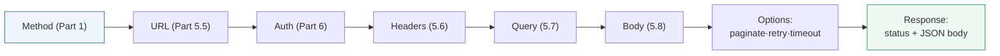

> **You now hold the master key.** With the HTTP node, no API can lock you out. Next, **Part 9** takes you through *every important n8n node* — triggers, logic, data, integrations, and the AI nodes — so you know exactly which tool to reach for, and when, to build anything you can imagine.
