# Every Important n8n Node Part 9 · Chapter 9

You now understand the machinery beneath n8n. This chapter is your **field guide to the tools themselves** — the ~25 nodes you'll reach for again and again. Think of it as learning the instruments in an orchestra: you already know music theory (Parts 1–8); now we meet each instrument, what sound it makes, and when to play it.

We group the nodes into **families** so you learn them by *purpose*, not alphabetically. For each node: what it is, why it exists, its key settings, when to use it, and the traps. Keep this chapter as a reference — you'll flip back to it for years.

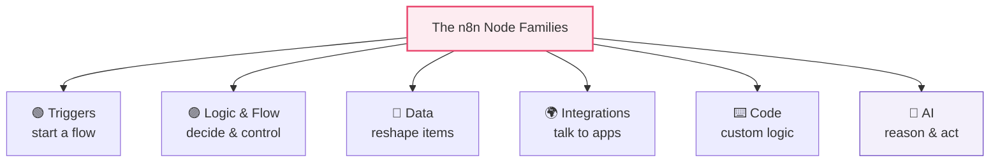

> [!NOTE]
> **The node picker is your friend.** Press `Tab` (Part 3.2) and type what you want in plain words ("if", "wait", "google sheet", "openai"). n8n filters instantly. You don't memorize node names — you memorize *what each family does*, then search. This chapter builds that mental index.

---

## 9.1 The Trigger Family 🟢 — how flows start

Every workflow begins with exactly one trigger (Part 2.3). Here are the four you'll use most.

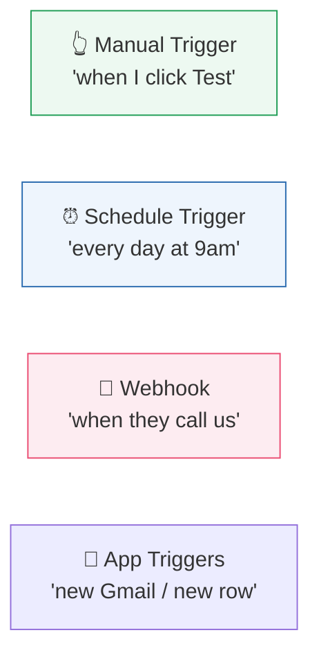

### Manual Trigger

- **What & why:** fires only when you click **Test workflow**. It exists for *building and testing* (Part 3) — never for production.
- **Use it:** while developing every workflow, so you can run and inspect each node's data on demand.

### Schedule Trigger

- **What & why:** fires on a clock — the engine of all **polling** (Part 7.1) and batch jobs (Part 7.3).
- **Key settings:** interval (every N minutes/hours), a specific time, or a **cron expression** for precise timing.

> [!NOTE]
> **Cron** is a five-field time pattern: `minute hour day-of-month month day-of-week`. `0 8 * * 1-5` = "at 08:00, Monday–Friday." `*/15 * * * *` = "every 15 minutes." You'll use cron whenever "every hour" isn't specific enough. Read it left-to-right as *minute, hour, day, month, weekday*.

### Webhook

- **What & why:** makes n8n a **server** that waits at a URL and fires when an external system POSTs to it (Part 7.1). The backbone of **real-time** automation.
- **Key settings:** HTTP method to accept, the path, **Test vs Production URL**, and a **Respond** mode (respond immediately, or with a later "Respond to Webhook" node).
- **Remember (Part 7):** public URL required, verify signatures, acknowledge fast, dedupe.

### App Triggers (Gmail Trigger, Sheets Trigger, etc.)

- **What & why:** convenience triggers that watch a specific app for news ("new email," "new row"). Under the hood they're either **polling** on a schedule or true **webhooks**, but n8n handles the "what's new" bookkeeping for you.
- **Use it:** whenever a dedicated app trigger exists — it's simpler than hand-building polling.

> [!DEBUG]
> Flow "not running on schedule"? Confirm the workflow is **Active** (Part 2) — schedule/webhook triggers only fire automatically when active; "Test" only runs the manual path.

---

## 9.2 The Logic & Flow Family 🟣 — decide and control

These nodes give your workflow a brain and a nervous system (Part 2.5).

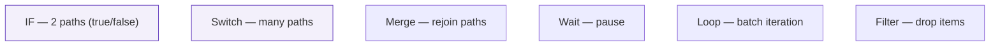

### IF

- **What:** splits the flow into **two** outputs — **true** and **false** — based on a condition (Part 2.5's boolean).
- **Key settings:** one or more conditions combined with **AND/OR**; comparison operators (equals, greater than, contains, is empty…).
- **Trap:** the **type** of the compared values matters (Part 4.1) — comparing string `"100"` to number `100` misbehaves. Set the correct data type in the condition.

### Switch

- **What & why:** like IF but with **many** outputs — route each item down one of several branches by a value. Use it instead of stacking many IFs.
- **Use it:** routing by country, status, event type (Part 7.2), priority.

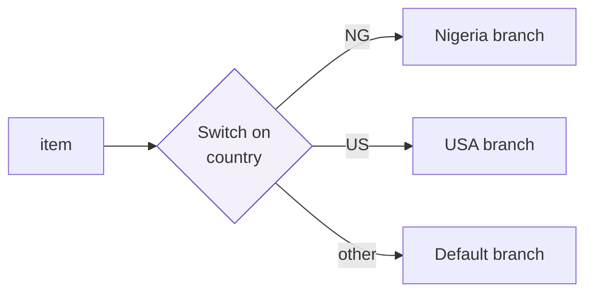

### Merge

- **What & why:** brings **two input streams back together** after they've split — or combines data from two sources. Modes include **append** (stack both), **combine/merge by key** (join like a database, Part 4), and **choose** (pick one branch).
- **Use it:** after an IF where both branches must rejoin (Part 2's "New Customer Welcome"); or to enrich orders with customer data by matching IDs.

### Wait

- **What & why:** **pauses** the workflow — for a fixed time, until a specific moment, or **until a webhook is received**. Essential for pacing (rate limits, Part 5.10), delays ("email 3 days later"), and human-in-the-loop approvals.
- **Use it:** "wait 1s between API calls," "wait 24h then send a follow-up," "wait until the manager clicks Approve."

### Loop Over Items (Split in Batches)

- **What & why:** processes items in **controlled batches** rather than all at once. Most nodes already iterate per item automatically (Part 2.6) — you reach for Loop when you need **explicit batching** (e.g., 50 at a time to respect a rate limit) or a repeated sub-process per batch.
- **Trap:** you usually *don't* need a loop for "do X to each item" — n8n does that natively. Use Loop for batching and pacing.

### Filter

- **What & why:** **drops** items that don't match a condition, passing only the rest (Part 2.5). Simpler than IF when you only want to *remove* items, not branch.
- **Best practice (Part 2):** filter **early** to shrink data before expensive calls.

> [!TIP]
> **IF vs Switch vs Filter:** use **IF** for two paths, **Switch** for many paths, **Filter** to simply remove non-matching items. Reaching for the right one keeps your canvas clean and readable (Part 3.5).

---

## 9.3 The Data Family 🔧 — reshape the traveling package

These transform items (Part 4.6) — the plumbing that is most of real automation work.

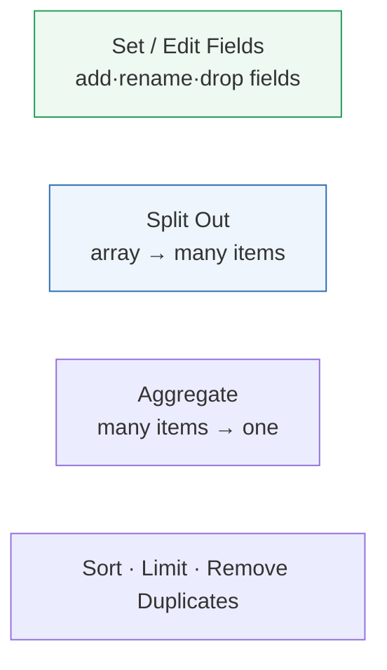

### Set / Edit Fields

- **What & why:** your primary transformation tool (Part 4.6). Add new fields, rename, set values (via expressions), change types, and optionally **keep only** the fields you set (great for stripping sensitive data, Part 6).
- **Use it:** clean/normalize incoming data at the top of nearly every workflow.

### Split Out

- **What & why:** turns **one item containing an array** into **many items** — the fix for a "wrapped array" (Part 4.3). `{ results: [a, b, c] }` → three items.
- **Use it:** whenever an API returns a list nested inside an object and you want to process each element independently.

### Aggregate

- **What & why:** the reverse — combines **many items into one**: sum, count, average, or collect values into a single list.
- **Use it:** totals ("sum all line items," Part 4's order example), building a single summary message, or gathering IDs into one array.

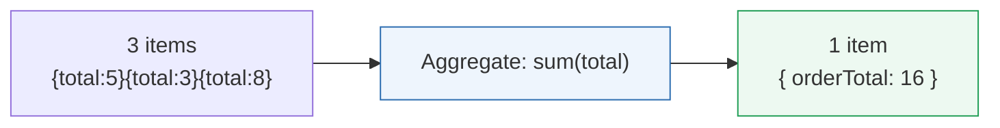

### Sort · Limit · Remove Duplicates

- **Sort:** reorder items (newest first, highest value first).
- **Limit:** keep only the first N items (useful after sorting — "top 10").
- **Remove Duplicates:** dedupe items by a key — critical for webhook idempotency (Part 7.2) and clean data.

> [!TIP]
> **Split Out and Aggregate are opposites** and often used as a pair: Split Out to process each element, then Aggregate to roll the results back into a summary. Recognizing "do I need one item or many here?" is a core data-flow skill (Part 2.6).

---

## 9.4 The Integration Family 🌍 — talk to the world

These are the "app nodes" — friendly wrappers over APIs (Part 5) with auth handled by credentials (Part 6). There are hundreds; here are the ones you'll meet constantly, grouped by kind.

### Spreadsheets & Databases

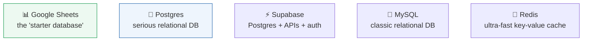

| Node | What it is | Best for | Key operations |
|------|-----------|----------|----------------|
| **Google Sheets** | A spreadsheet as a mini-database | Prototypes, small data, non-technical teams reading it | Append, Read, Update, Lookup rows |
| **Postgres** | A powerful relational database (Part: tables, rows, SQL) | Production apps, structured data, integrity | Insert, Select, Update, Delete, run SQL |
| **Supabase** | Postgres + instant APIs + auth (a "backend in a box") | Modern app backends | Row CRUD, auth, storage |
| **MySQL** | Another popular relational database | Existing MySQL systems | Insert, Select, Update, Delete |
| **Redis** | An in-memory key-value store — blazing fast, often temporary | Caching, rate-limit counters, dedupe keys, queues | Get, Set, Incr, expiring keys |

> [!NOTE]
> **Relational database in one breath:** data lives in **tables** (like sheets), each row is a **record** (an object, Part 4), each column a **field**. You query with **SQL** ("Structured Query Language"): `SELECT * FROM patients WHERE age > 60`. The DB nodes let you run these without leaving n8n. Redis is different — it's a giant, super-fast dictionary of key→value pairs, used for speed and temporary data, not long-term relational storage.

> [!BEST]
> **Use Google Sheets to learn and prototype; graduate to Postgres/Supabase/MySQL for production.** Sheets is wonderful for getting started and for data humans eyeball, but it's slow, size-limited, and not built for concurrency. When real users and real volume arrive, move to a real database (Part 12).

> [!WARNING]
> When writing to databases, prefer **upsert** (insert-or-update on a unique key) for idempotency (Part 7) so re-runs and duplicate events don't create duplicate rows. And never build SQL by string-concatenating untrusted input — use the node's parameterized fields to avoid **SQL injection** (Part 12 security).

### Messaging & Communication

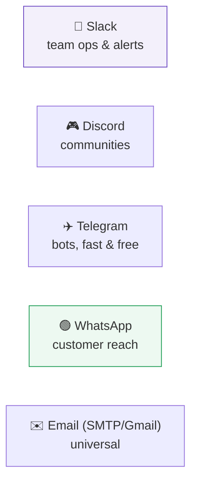

| Node | What it is | Best for | Note |
|------|-----------|----------|------|
| **Slack** | Team chat | Internal alerts, ops dashboards, approvals | Rich messages, buttons, channels |
| **Discord** | Community chat | Communities, gaming, public bots | Webhooks or bot token |
| **Telegram** | Messaging + powerful **bot** API | Fast, free bots; notifications | Great for personal/alert bots |
| **WhatsApp** (Business/Cloud API) | The world's biggest messenger | Customer support & reach, esp. outside the US | Needs Meta Business API + approved templates |
| **Email** (SMTP / Gmail) | Universal messaging | Receipts, reports, external comms | Always available fallback |

> [!NOTE]
> **WhatsApp is special** for business automation because it's the dominant channel in much of the world (Part 13 builds a full WhatsApp support bot). But it's the strictest: you need a Meta **Business API** account, and outbound messages outside a 24-hour window must use **pre-approved templates**. Plan for that approval process — it's a common project blocker.

> [!TIP]
> **Match the channel to the audience:** Slack/Discord for *internal teams*, Telegram for *quick bots and alerts*, WhatsApp/Email for *customers*. Don't spam a customer channel with debug logs, and don't bury an urgent ops alert in email.

---

## 9.5 The Code Family ⌨️ — when nodes aren't enough

### Code node (and the older Function node)

- **What & why:** runs your own **JavaScript** (or Python in recent versions) over the items (Part 10). The escape hatch for logic too custom for standard nodes — complex transforms, custom algorithms, tricky parsing (Part 4.5).
- **Two modes:** *Run Once for All Items* (you get the whole list) or *Run Once per Item* (you get one item at a time).
- **When to use:** only when a built-in node can't do it. Prefer nodes for readability; reach for Code for the genuinely custom 10%.

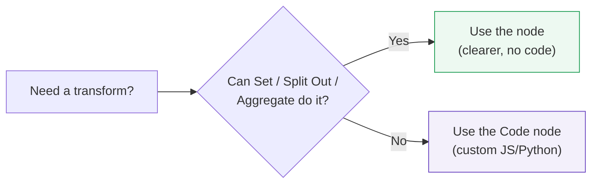

> [!BEST]
> **Prefer built-in nodes over Code when either works.** Nodes are self-documenting, easier for teammates to read, and less likely to hide bugs. Use Code for the truly custom parts — and comment it well (Part 10). A canvas full of Code nodes is a maintenance headache.

> [!WARNING]
> Never paste secrets into a Code node's source (Part 6) — use credentials/expressions. And be careful with heavy loops in Code over large datasets; they can be slow and memory-hungry (Part 12 performance).

---

## 9.6 The AI Family 🤖 — reason and act

These turn workflows from *rule-followers* into *reasoners*. This is a preview — **Part 11** dives deep. Meet the cast:

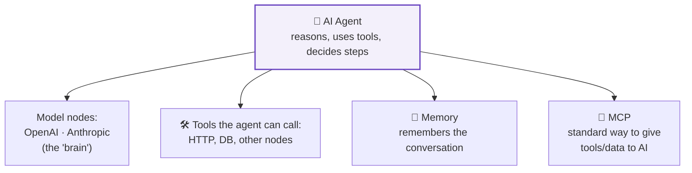

| Node | What it is | Use for |
|------|-----------|---------|
| **OpenAI / Anthropic (Model nodes)** | Call an LLM directly (the "brain") — send a prompt, get text back | Summarize, classify, extract, generate, answer |
| **AI Agent** | An LLM that can **reason in steps and call tools** (other nodes) to accomplish a goal | Multi-step tasks, "figure out how" not just "do X" |
| **Memory** | Gives an agent short/long-term memory of a conversation | Chatbots that remember context (Part 11) |
| **MCP** (Model Context Protocol) | A **standard plug** for connecting tools/data sources to AI models | Reusable, standardized tool/data access for agents (Part 11) |

> [!NOTE]
> **The one-line distinction:** a **Model node** (OpenAI/Anthropic) is a single call — "prompt in, answer out." An **AI Agent** is a *loop* — it thinks, decides which **tool** to use, calls it, reads the result, thinks again, until the goal is met. Model = a smart intern who answers a question; Agent = a smart intern you hand a *goal* and a *toolbox*. Part 11 makes this concrete.

> [!BEST]
> Store AI provider keys as **credentials** (Part 6), watch **rate limits and cost** (Part 5.10 — LLM calls cost money per token, Part 11), and never send sensitive data (patient records, secrets) to an external model without checking your compliance rules (Part 12). AI nodes are powerful and *metered*.

---

## 🏢 Business Examples — picking the right node

1. **Healthcare** — **Schedule Trigger** pulls labs nightly; **Split Out** separates results; **IF** flags abnormals; **Slack** pages the doctor; **Postgres** stores the audit trail.
2. **Pharmacy** — **Webhook** receives prescriptions; **Set** normalizes; **Google Sheets** logs (prototype) then **Supabase** (production); **WhatsApp** notifies the patient.
3. **Fintech** — **Webhook** on payment events; **Switch** routes by event type; **Redis** dedupes by event id; **Wait** + retry paces a flaky partner API.
4. **Education** — **Sheets Trigger** on new submissions; **Filter** to late ones; **Aggregate** class stats; **Email** the teacher a digest.
5. **Government** — **Webhook** for applications; **Switch** by district; **Merge** with a citizen lookup; **Postgres** as system of record.
6. **Banking** — **Schedule** nightly; **Loop** over batches to respect limits; **Aggregate** daily totals; **Slack** the finance channel.
7. **E-commerce** — **Webhook** `order.paid`; **Set** cleans; **Split Out** line items; **HTTP** creates a shipping label; **Merge** back; **Email** the customer.
8. **Manufacturing** — **Webhook** sensor anomalies; **Code** computes rolling averages; **IF** stops the line; **Telegram** alerts the shift lead.
9. **Logistics** — **Schedule** polls carrier; **Remove Duplicates** on shipment id; **WhatsApp** proactive updates.
10. **Customer Support** — **Webhook** new ticket; **AI Agent** drafts a reply using **Memory**; **IF** confidence check; **Slack** escalates the unsure ones.
11. **AI Startups** — **Webhook** user question; **Anthropic** model node answers; **Postgres** logs the conversation; **MCP** exposes internal tools to the agent (Part 11).

---

## 🛠️ Complete Workflow Example — "Smart Order Concierge" (a node from every family)

A pharmacy wants: on each new order, clean it, split its items, check stock in the database, route out-of-stock differently, summarize with AI, notify the patient on WhatsApp, and total the order. This one flow uses a node from **every family** in this chapter.

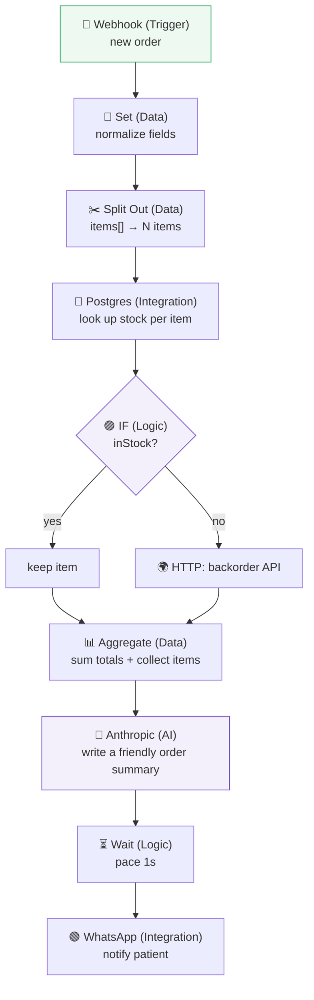

| # | Node | Family | Why it's here |
|---|------|--------|---------------|
| 1 | Webhook | Trigger 🟢 | Fire instantly on a new order (Part 7) |
| 2 | Set | Data 🔧 | Clean/normalize the raw payload (Part 4.6) |
| 3 | Split Out | Data 🔧 | One item per product to check individually (Part 4.3) |
| 4 | Postgres | Integration 🌍 | Look up live stock per item (Part 5/6 under the hood) |
| 5 | IF | Logic 🟣 | Branch in-stock vs out-of-stock (Part 2.5) |
| 6 | HTTP Request | Integration 🌍 | Handle backorders via an external API (Part 8) |
| 7 | Aggregate | Data 🔧 | Total the order and gather items (Part 4.6) |
| 8 | Anthropic | AI 🤖 | Generate a warm, human summary message (Part 11) |
| 9 | Wait | Logic 🟣 | Pace the outbound message (Part 5.10) |
| 10 | WhatsApp | Integration 🌍 | Reach the patient on their preferred channel |

**Why it works:** each family plays its part — triggers start, data nodes reshape, logic decides, integrations reach outward, AI adds human-quality language, and control nodes pace it. Knowing *which family solves which problem* is exactly the skill this chapter builds. You could rebuild this for e-commerce, logistics, or fintech by swapping only the integration nodes — the *shape* stays the same.

---

## ⚠️ Common Mistakes (Chapter 9)

**Beginner:**
- Reaching for a **Loop** to "do X per item" when n8n already iterates automatically (Part 2.6).
- Using **Google Sheets** as a production database and hitting size/speed/concurrency limits.
- Forgetting to **Merge** after an **IF**, so one branch's data never rejoins.

**Intermediate:**
- Stacking many **IF**s where one **Switch** is clearer.
- Not using **Split Out** on a wrapped array (Part 4.3), so a node runs once instead of per element.
- Writing to a DB with plain insert instead of **upsert**, creating duplicates on re-run (Part 7).

**Professional:**
- **SQL injection** by string-building queries from untrusted input — use parameterized fields (Part 12).
- Sending sensitive data to **AI/external nodes** without checking compliance (Part 12).
- Overusing **Code** nodes for things built-in nodes do, hurting readability and maintainability.
- No **dedupe/Remove Duplicates** on webhook-driven flows → double processing (Part 7).

## 🏆 Best Practices (Chapter 9)

> [!BEST]
> **Right node for the job:** IF (2 paths), Switch (many), Filter (drop), Split Out/Aggregate (reshape count), Merge (rejoin). Choosing correctly keeps flows readable and correct.

> [!BEST]
> **Prototype on Sheets, produce on a real database; upsert for idempotency; parameterize SQL.** Graduate your storage as the workload grows (Part 12).

> [!TIP]
> **Match messaging channels to audiences** (internal: Slack/Discord/Telegram; customer: WhatsApp/Email) and pace outbound with **Wait** to respect rate limits.

> [!BEST]
> **Prefer nodes over Code; store all keys as credentials; guard AI calls for cost and compliance.** Powerful nodes still follow the security and performance rules from Parts 6 and 12.

---

## ❓ Review Questions

1. Name the six node families and the core purpose of each.
2. When would you use a **Schedule Trigger** vs a **Webhook**? What must be true for each to fire in production?
3. Explain the difference between **IF**, **Switch**, and **Filter**, with a scenario for each.
4. What does **Split Out** do, and what does **Aggregate** do? Why are they often used as a pair?
5. Compare **Google Sheets**, **Postgres**, and **Redis** — what is each best for, and when do you graduate from Sheets?
6. What is an **upsert**, and why does it matter for webhook-driven flows (Part 7)?
7. Match the messaging channel to the audience: Slack, Telegram, WhatsApp, Email — internal vs customer, and one caveat for WhatsApp.
8. When should you use the **Code** node instead of built-in nodes, and when should you *not*?
9. Explain the difference between a **Model node** (OpenAI/Anthropic) and the **AI Agent** node. What is **MCP** in one sentence?
10. In the "Smart Order Concierge," identify which family each node belongs to and why that family was the right choice.

## 🚀 Mini Project (design it with the right nodes — don't build it yet)

**"The Multi-Channel Incident Responder."**

Design a workflow (on paper, naming the exact node from each family) that:

- fires in **real time** when a monitoring system reports an outage (which trigger?),
- **verifies and dedupes** the incoming event (Part 7 — which data node prevents double-alerts?),
- **routes by severity** — `critical`, `warning`, `info` — to different actions (which logic node fits three-plus paths?),
- for `critical`: pages the on-call engineer on **two channels** at once (which integration nodes? how do you fan out?), waits 5 minutes (which node?), and if unacknowledged, escalates to the manager,
- uses **AI** to write a plain-English incident summary from the raw alert data (which family?),
- logs every incident to a **production database** with an **upsert** keyed on incident id (which node, and why upsert?),
- and at the end of the day, a **scheduled** job **aggregates** all incidents into a summary posted to Slack.

Deliverable: a labeled flowchart naming every node and its family, plus one sentence per node explaining *why that node* (and not an alternative). **Bonus:** where would you add **Wait** and **Remove Duplicates**, and why?

---

## 📝 Summary — Chapter 9 on one page

- Learn nodes by **family and purpose**, then find them with the `Tab` node picker (Part 3.2).
- **Triggers 🟢** start flows: **Manual** (testing), **Schedule** (time/cron, polling & batch), **Webhook** (real-time server, Part 7), **App triggers** (watch an app). Must be **Active** to fire in production.
- **Logic & Flow 🟣** decide and control: **IF** (2 paths), **Switch** (many), **Filter** (drop items), **Merge** (rejoin/join), **Wait** (pause/pace/approve), **Loop** (batching). Mind data **types** in conditions (Part 4.1).
- **Data 🔧** reshape items (Part 4.6): **Set/Edit Fields** (add/rename/drop/keep-only), **Split Out** (array→items), **Aggregate** (items→summary), **Sort/Limit/Remove Duplicates**. Split Out + Aggregate are opposites.
- **Integrations 🌍** talk to apps via credentials (Part 6): **Sheets** (prototype), **Postgres/Supabase/MySQL** (production DBs, use **upsert**, parameterize SQL), **Redis** (fast cache/dedupe), and messaging — **Slack/Discord/Telegram** (internal/bots), **WhatsApp/Email** (customers).
- **Code ⌨️** (Code/Function) runs custom JS/Python (Part 10) — the escape hatch for the custom 10%; prefer nodes otherwise.
- **AI 🤖** adds reasoning: **Model nodes** (OpenAI/Anthropic — prompt in, answer out), the **AI Agent** (reasons and calls **tools** in a loop), **Memory**, and **MCP** (standard tool/data plug). Deep dive in Part 11; mind cost, rate limits, and compliance.

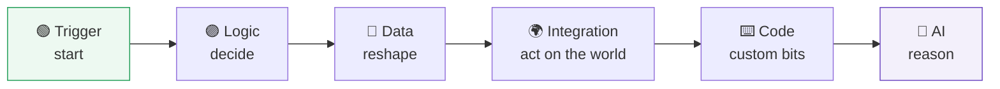

> **You now know which instrument to pick for any note.** Two families still need their own deep chapters. First, the **Code ⌨️** family: **Part 10** teaches exactly the **JavaScript** you need for n8n — no more, no less — so expressions and Code nodes become effortless. Then **Part 11** opens the **AI 🤖** family fully.
