# JavaScript for n8n <span class="kicker">Part 10 · Chapter 10</span>

You've used little bits of JavaScript already — every `{{ $json.name }}` expression (Part 3.6) is JavaScript in disguise. This chapter teaches you *exactly* the JavaScript you need to make expressions and Code nodes effortless — and **nothing more**. This is not a "learn to be a programmer" chapter. It's a "learn the 20% of JavaScript that covers 95% of automation" chapter.

We stay ruthlessly practical: every concept is something you'll type into an n8n field this week.

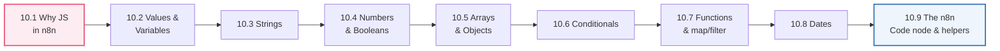

---

## 10.1 Why JavaScript in n8n?

### 🧒 What is it?

**JavaScript is the language n8n "thinks" in.** When you write an expression in `{{ }}`, n8n runs it as a tiny JavaScript program and pastes the result. When a built-in node can't quite do what you need, the **Code node** (Part 9.5) lets you write real JavaScript over your data. You don't need to master JavaScript — you need a small, sharp toolkit.

### 💡 Why learn *any* code if n8n is "no-code"?

n8n is **low-code**, not no-code. 90% of the time, nodes and simple expressions are enough. But that last 10% — a tricky date format, combining fields just so, reshaping an awkward API response (Part 4.5) — needs a *sprinkle* of JavaScript. Learning that sprinkle is the difference between "I'm stuck" and "I'll just write a two-line expression." **A little JavaScript makes you unstoppable; a lot of it is unnecessary.**

### 📖 Story — The Swiss Army Knife

Nodes are your dedicated tools — a screwdriver, a hammer, each perfect for one job. But every seasoned builder also carries a **Swiss Army knife** for the odd job no dedicated tool fits: trimming a wire, opening a bottle, tightening a tiny screw. JavaScript is that Swiss Army knife. You won't build a house with it — you have power tools (nodes) for that — but you'll be grateful for it a dozen small times a day.

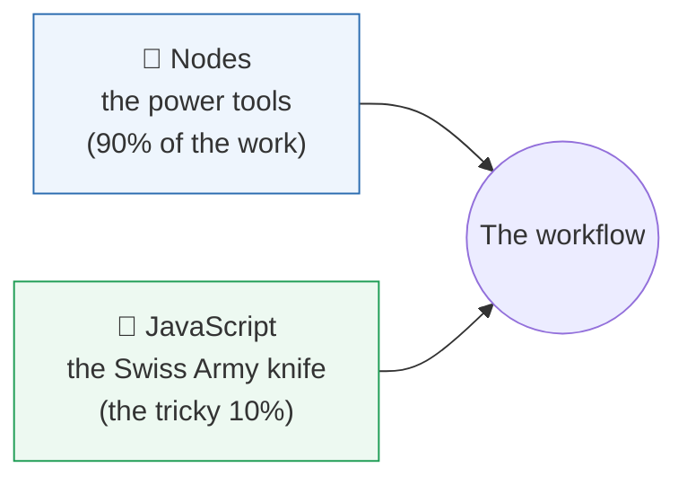

> [!NOTE]
> **Two places you write JavaScript in n8n:** (1) inside **`{{ }}` expressions** in any field — small, one-line snippets; (2) inside the **Code node** — full multi-line scripts over all your items. Same language, different scale. Everything in this chapter works in both.

---

## 10.2 Values & Variables

### 🧒 What is it?

A **value** is a piece of data — the number `30`, the text `"Ada"`, the boolean `true` (all Part 4 types!). A **variable** is a **labeled box that holds a value** so you can reuse it by name. You *store* a value in a variable, then refer to it later.

```javascript
const name = "Ada";      // a box called "name" holding the text "Ada"
const age = 34;          // a box called "age" holding the number 34
const isVIP = true;      // a box called "isVIP" holding a boolean
```

### 🔬 `const` vs `let` (the only two you need)

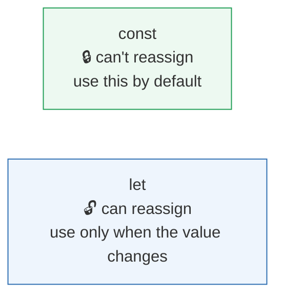

| Keyword | Meaning | When to use |
|---------|---------|-------------|
| **`const`** | A box you won't re-fill (constant) | **Default** — most variables |
| **`let`** | A box you *will* re-fill later | Counters, accumulators that change |

```javascript
const taxRate = 0.075;        // never changes → const
let total = 0;                // will grow in a loop → let
total = total + 10;           // reassigning is allowed with let
```

> [!NOTE]
> You'll also see **`var`** in old code — **ignore it.** Modern JavaScript uses `const` and `let`. Rule of thumb: **reach for `const` first**; switch to `let` only when you actually need to reassign. This habit prevents a whole class of bugs.

> [!TIP]
> **Naming matters.** `const patientPhone = ...` reads far better than `const x = ...`. Use **camelCase** (first word lowercase, later words capitalized: `firstName`, `orderTotal`) — the JavaScript convention. Good names make expressions self-documenting.

---

## 10.3 Strings

### 🧒 What is it?

A **string** is text (Part 4.1) — always in quotes. You'll manipulate strings constantly: building messages, formatting names, cleaning data.

```javascript
const first = "Ada";
const last = "Okafor";
```

### 🔬 The string operations you'll actually use

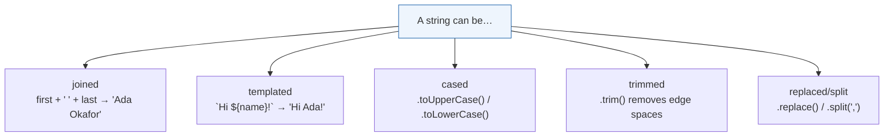

| Operation | Example | Result |
|-----------|---------|--------|
| **Join (concatenate)** | `first + " " + last` | `"Ada Okafor"` |
| **Template literal** (backticks) | `` `Hi ${first}, you are ${age}` `` | `"Hi Ada, you are 34"` |
| **Uppercase / lowercase** | `first.toUpperCase()` | `"ADA"` |
| **Trim spaces** | `"  ada  ".trim()` | `"ada"` |
| **Length** | `first.length` | `3` |
| **Replace** | `"a-b-c".replaceAll("-", " ")` | `"a b c"` |
| **Split into array** | `"a,b,c".split(",")` | `["a","b","c"]` |
| **Includes?** | `"urgent ticket".includes("urgent")` | `true` |
| **Slice** | `"amoxicillin".slice(0,5)` | `"amoxi"` |

**Template literals** (using backticks `` ` `` and `${ }`) are your best friend for building messages:

```javascript
`Dear ${first} ${last}, your order of ${qty} items totals $${total}.`
```

This is *exactly* what you do in n8n expressions — but note the syntax difference:

> [!NOTE]
> **n8n expressions vs raw JavaScript strings:** in an n8n *field*, you write `{{ $json.first }}` and n8n substitutes it. Inside a **Code node** (raw JS), you write `$json.first` (no curly braces) and use JavaScript template literals `` `Hi ${$json.first}` `` for interpolation. The curly-brace `{{ }}` is n8n's field syntax; inside real JS you use `${ }` in backtick strings. Don't mix them up.

> [!DEBUG]
> Getting `"[object Object]"` in a message? You tried to put a whole **object** (Part 4.2) where a string was expected. Reach into it for a specific field (`obj.name`) or use `JSON.stringify(obj)` (Part 4.5) to see it as text. And `undefined` in a string means the field path is wrong (Part 4.4).

---

## 10.4 Numbers & Booleans

### 🔬 Numbers

Numbers (Part 4.1) do math with the usual symbols:

| Operator | Means | Example |
|----------|-------|---------|
| `+ - * /` | add, subtract, multiply, divide | `qty * price` |
| `%` | remainder (modulo) | `n % 2 === 0` → is n even? |
| `**` | power | `2 ** 3` → `8` |

Handy number tricks:

```javascript
Math.round(4.7)          // 5
Math.floor(4.7)          // 4  (round down)
Math.ceil(4.1)           // 5  (round up)
Math.max(3, 9, 5)        // 9
(0.075 * total).toFixed(2)   // "48.38"  → 2 decimal places (returns a STRING)
Number("30")             // 30   → text to number (Part 4.1 fix!)
```

> [!WARNING]
> **The string-vs-number trap, again (Part 4.1).** If a value arrived as text `"30"`, then `"30" + 5` gives `"305"` (string glue!), not `35`. Convert first: `Number("30") + 5` → `35`. When math "goes weird," check whether your values are secretly strings — wrap them in `Number(...)`. This is the single most common Code-node bug.

> [!NOTE]
> `.toFixed(2)` is great for money display but returns a **string** (`"48.38"`). If you need to keep doing math, convert back with `Number(...)`. Format for *display* at the very end, not in the middle of calculations.

### 🔬 Booleans (Part 2.5, 4.1)

`true` / `false`, produced by **comparisons**:

| Comparison | Means | Example → result |
|------------|-------|-------------------|
| `===` | equal (same value **and** type) | `age === 34` → `true` |
| `!==` | not equal | `status !== "paid"` |
| `>` `<` `>=` `<=` | greater/less than | `total > 1000` |
| `&&` | AND (both true) | `isVIP && total > 1000` |
| `\|\|` | OR (either true) | `isUrgent \|\| isVIP` |
| `!` | NOT (flip) | `!isPaid` |

> [!WARNING]
> **Always use `===` (three equals), not `==` (two).** The loose `==` does surprising type-coercion: `0 == ""` is `true`, `"30" == 30` is `true`. The strict `===` checks value *and* type, avoiding a swamp of subtle bugs. Same for `!==` over `!=`. Make `===` a reflex.

```javascript
// combining conditions (Part 2.5's AND/OR/NOT)
const flag = total > 1000 && isNewDevice;      // both must hold
const notify = isUrgent || isVIP;               // either triggers
```

---

## 10.5 Arrays & Objects

You know these shapes from Part 4. Here's how to *manipulate* them in code.

### 🔬 Objects (Part 4.2)

```javascript
const patient = { name: "Ada", age: 34, city: "Lagos" };

patient.name            // "Ada"        → read a field (dot notation)
patient["age"]          // 34           → read via bracket (dynamic keys)
patient.email = "a@x.com";   // add/set a field
Object.keys(patient)    // ["name","age","city"]  → list the keys
```

### 🔬 Arrays (Part 4.3)

```javascript
const drugs = ["Aspirin", "Ibuprofen", "Paracetamol"];

drugs[0]                // "Aspirin"    → first (index 0!)
drugs.length            // 3
drugs.push("Vitamin D") // add to the end
drugs.includes("Aspirin")  // true
drugs.join(", ")        // "Aspirin, Ibuprofen, Paracetamol"
```

### 🔬 The array superpowers: `map`, `filter`, `reduce`

These three are the heart of data work. Learn them and Part 4.6's transformations become one-liners.

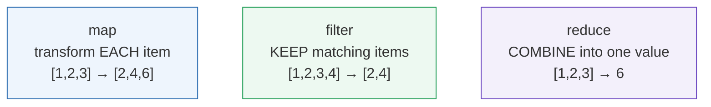

```javascript
const nums = [1, 2, 3, 4];

nums.map(n => n * 2)              // [2, 4, 6, 8]     transform each
nums.filter(n => n % 2 === 0)    // [2, 4]           keep evens
nums.reduce((sum, n) => sum + n, 0)   // 10          add them all up
```

Real examples you'll actually write:

```javascript
// get just the emails from a list of patient objects
patients.map(p => p.email)

// keep only paid orders
orders.filter(o => o.status === "paid")

// sum all line totals (Part 4's order example)
items.reduce((sum, item) => sum + item.price * item.qty, 0)
```

> [!TIP]
> **`map` = Set node per item, `filter` = Filter node, `reduce` = Aggregate node** (Part 9.3). If you understand those nodes, you already understand these functions — they're the same ideas in code. Use nodes when they suffice; use these when you need it all in one Code node.

> [!NOTE]
> **The `=>` is an "arrow function"** — a short way to write a function (10.7). Read `n => n * 2` as "given `n`, return `n * 2`." The value after `=>` is what comes back. It looks strange for a day, then becomes second nature.

---

## 10.6 Conditionals

### 🔬 `if / else`

The code version of the IF node (Part 2.5, 9.2):

```javascript
if (total > 1000) {
  tier = "VIP";
} else if (total > 100) {
  tier = "Regular";
} else {
  tier = "New";
}
```

### 🔬 The ternary — a one-line if (perfect for expressions)

```javascript
const tier = total > 1000 ? "VIP" : "Regular";
//           └── condition ─┘   └true┘   └false┘
```

Read it: *"is total > 1000? if yes → VIP, if no → Regular."* This is the workhorse of n8n **expressions**, where you often need a value, not a block:

```
{{ $json.total > 1000 ? "VIP" : "Regular" }}
```

### 🔬 Guarding against missing data (Part 4.4)

Two operators save you from `undefined` crashes:

```javascript
$json.address?.city          // optional chaining: safe if address is missing → undefined, no crash
$json.city || "Unknown"      // fallback: use "Unknown" if city is empty/missing
$json.address?.city || "N/A" // combine both — the professional pattern
```

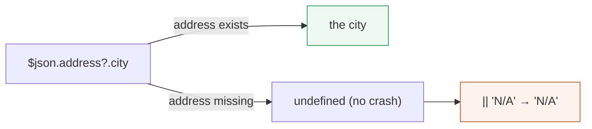

> [!BEST]
> **Always guard nested access with `?.` and provide fallbacks with `||`** (Part 4.4's warning made concrete). Real API data has missing fields, nulls, and surprises. `$json.user?.profile?.email || "no-email"` never crashes; `$json.user.profile.email` crashes the instant `profile` is missing. Defensive expressions are production expressions.

---

## 10.7 Functions & Arrow Functions

### 🧒 What is it?

A **function is a reusable recipe** — you give it inputs, it gives back an output. You've been using built-in ones (`Math.round`, `.map`). You can write your own for logic you repeat.

```javascript
// classic function
function fullName(first, last) {
  return first + " " + last;
}
fullName("Ada", "Okafor");     // "Ada Okafor"

// arrow function (shorter, modern) — same thing
const fullName = (first, last) => first + " " + last;
```

- **Inputs** go in the parentheses (the "parameters").
- **`return`** hands back the result. **No return = you get `undefined`** (a top beginner bug).

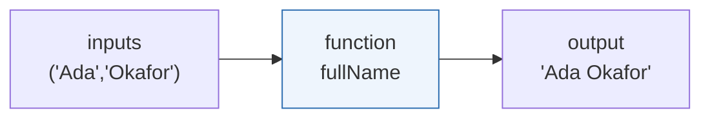

> [!DEBUG]
> Function "returns nothing"? You probably **forgot `return`**, or you put a statement after `return` (code after `return` never runs). In arrow functions, `n => n * 2` returns automatically, but `n => { n * 2 }` (with braces) does **not** return unless you write `return n * 2`. The braces change the rules — a classic trap.

> [!NOTE]
> You rarely *need* to write your own named functions in n8n expressions (they're one-liners), but you'll write arrow functions constantly *inside* `.map()`, `.filter()`, and `.reduce()`. That's where 90% of your "function writing" happens.

---

## 10.8 Dates

### 🧒 What is it?

Dates are famously fiddly in every language. In n8n you'll format timestamps, add/subtract time ("3 days from now"), and compare dates ("is this overdue?"). n8n bundles a friendly date library (**Luxon**) plus the `$now`/`$today` helpers, so you rarely wrestle raw JavaScript `Date`.

### 🔬 The date tools you'll use

```javascript
// n8n helpers (available in expressions)
$now                      // current date-time (a Luxon DateTime)
$today                    // today at midnight
$now.plus({ days: 3 })    // 3 days from now
$now.minus({ hours: 2 })  // 2 hours ago
$now.toFormat("yyyy-MM-dd")        // "2026-07-31"
$now.toFormat("dd LLL yyyy")       // "31 Jul 2026"
$now.diff($today, 'hours').hours   // hours since midnight
```

Common real tasks:

| Task | Expression |
|------|-----------|
| Today's date, formatted | `{{ $now.toFormat("yyyy-MM-dd") }}` |
| Timestamp 7 days out | `{{ $now.plus({ days: 7 }).toISO() }}` |
| Is an invoice overdue? | `{{ $now > DateTime.fromISO($json.dueDate) }}` |
| Days until due | `{{ DateTime.fromISO($json.dueDate).diff($now,'days').days }}` |
| Human-friendly | `{{ $now.toFormat("cccc, dd LLLL yyyy") }}` → "Friday, 31 July 2026" |

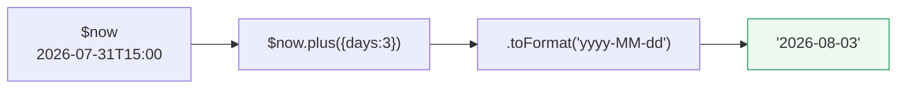

> [!WARNING]
> **Time zones and formats bite everyone.** APIs usually speak **ISO 8601 UTC** (`2026-07-31T15:00:00Z` — the `Z` means UTC/"Zulu" time). Store and compute in UTC; format to local time only for *display* to humans. Mixing a local time string with a UTC one gives silently wrong comparisons (an invoice looks overdue by a few hours when it isn't). When a date bug appears, **check the time zone first.**

> [!TIP]
> Prefer n8n's **`$now`/`$today` and Luxon `DateTime`** helpers over raw JavaScript `new Date()` string-parsing — they're far more predictable across formats and zones. Reach for raw `Date` only when a library isn't available.

---

## 10.9 The Code Node & n8n Helpers

### 🖥️ Inside the Code node (Part 9.5)

The Code node runs your JavaScript over the workflow's items. It has **two modes**:

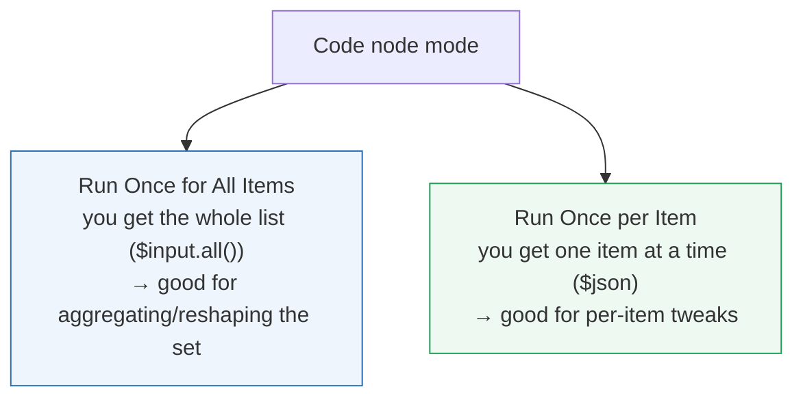

**The golden rule of the Code node: you must `return` items in n8n's shape** — an array of objects, each wrapped in `{ json: {...} }` (Part 2.6, 4.3):

```javascript
// "Run Once for All Items" — reshape every item
const items = $input.all();               // the incoming items
return items.map(item => {
  return {
    json: {
      fullName: item.json.first + " " + item.json.last,
      city: item.json.address?.city || "Unknown",   // guarded (10.6)
      total: Number(item.json.total)                // typed (10.4)
    }
  };
});
```

### 🔬 The n8n helper variables (your toolbox inside code & expressions)

| Helper | What it gives you | Example |
|--------|-------------------|---------|
| **`$json`** | The current item's data (Part 3.6) | `$json.email` |
| **`$input.all()`** | All incoming items (Code node) | loop/aggregate over the set |
| **`$node["Name"].json`** | Output of a *specific* earlier node (Part 3.6) | `$node["Webhook"].json.id` |
| **`$now` / `$today`** | Current date/time (10.8) | `$now.toFormat(...)` |
| **`$item` / `$itemIndex`** | The item / its position | per-item context |
| **`$env`** | Environment variables (config, Part 12) | `$env.BASE_URL` |
| **`$execution`** | Info about this run | `$execution.id` |
| **`JSON.parse / stringify`** | Text ↔ object (Part 4.5) | parse a stringified field |

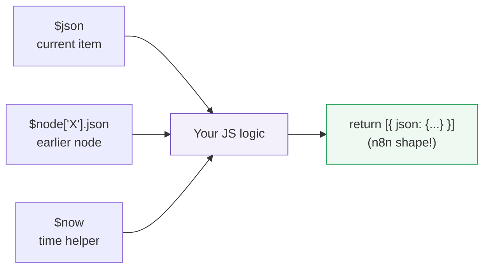

> [!DEBUG]
> Code node "returns nothing" or errors on output? The usual culprits: (1) you **forgot `return`** (10.7); (2) you returned the wrong **shape** — it must be an array of `{ json: {...} }` objects, not a bare object or a plain array of values; (3) an **unguarded** nested access threw (`Cannot read properties of undefined`) — add `?.` (10.6). Use `console.log(...)` inside the Code node (visible in the browser console / n8n logs) to inspect values while debugging.

> [!BEST]
> **Keep Code nodes small, guarded, typed, and commented.** A Code node is real code in your production system: convert types explicitly (`Number(...)`), guard nested access (`?.` + `||`), use `===`, name variables clearly, and add a one-line comment on any non-obvious logic. Future-you (and your teammates) will thank you (Part 12 maintainability).

> [!WARNING]
> **Never put secrets in Code node source** (Part 6) — use credentials or `$env`. And avoid `require()`-ing arbitrary packages or making raw network calls from Code when an **HTTP Request node** (Part 8) would be clearer and safer. The Code node is a scalpel, not a sledgehammer.

---

## 🏢 Business Examples — a sprinkle of JS on the job

1. **Healthcare** — A Code node computes a patient's **age from date of birth** using `$now.diff` (10.8) and flags minors with a ternary (10.6).
2. **Pharmacy** — An expression builds the SMS with a **template literal**: `` `Hi ${$json.name}, your ${$json.drug} is ready.` ``.
3. **Fintech** — `items.reduce(...)` (10.5) sums transaction amounts; `Number(...)` (10.4) fixes string amounts before comparison.
4. **Education** — `.map(s => ({...s, passed: s.score >= 50}))` tags each student pass/fail (10.5, 10.6).
5. **Government** — `.filter(app => app.district === "North")` selects applications for one office (10.5).
6. **Banking** — Date math checks if a statement window has closed (`$now > DateTime.fromISO(...)`, 10.8).
7. **E-commerce** — A ternary sets free shipping: `{{ $json.total >= 50 ? 0 : 5 }}` (10.6).
8. **Manufacturing** — A Code node computes a **rolling average** of sensor readings with `reduce` (10.5).
9. **Logistics** — `.map(s => s.trackingId)` extracts IDs to dedupe (10.5, Part 9.3).
10. **Customer Support** — `$json.subject.toLowerCase().includes("refund")` routes tickets (10.3).
11. **AI Startups** — `JSON.parse($json.modelOutput)` (10.9, Part 4.5) turns an LLM's stringified JSON into a usable object before reading `.answer`.

---

## 🛠️ Complete Workflow Example — "Invoice Aging with a Code Node"

A finance team wants each unpaid invoice tagged with how overdue it is and a human-friendly status message — logic too custom for a single Set node. One Code node does it all, using types, dates, guards, conditionals, and map.

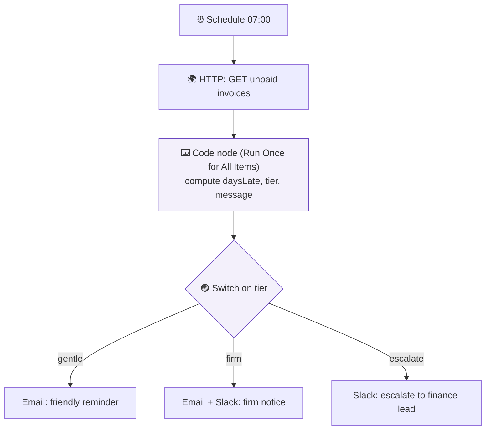

The Code node's script (everything this chapter taught, together):

```javascript
const items = $input.all();                          // 10.9 helper
return items.map(item => {
  const inv = item.json;
  const due = DateTime.fromISO(inv.dueDate);         // 10.8 date parse
  const daysLate = Math.floor($now.diff(due, 'days').days);   // 10.4 + 10.8

  let tier;                                          // 10.2 let (changes)
  if (daysLate <= 7)      tier = "gentle";           // 10.6 conditional
  else if (daysLate <= 30) tier = "firm";
  else                    tier = "escalate";

  const name = inv.customer?.name || "Customer";     // 10.6 guard + fallback
  const amount = Number(inv.amount).toFixed(2);      // 10.4 type + format
  const message = `Hi ${name}, invoice ${inv.id} for $${amount} `
                + `is ${daysLate} day(s) overdue.`;  // 10.3 template literal

  return { json: { ...inv, daysLate, tier, message } };  // 10.9 n8n shape
});
```

| JS concept | Where it appears | Why it's needed |
|------------|------------------|-----------------|
| **Types** (`Number`, `.toFixed`) | `amount` | API sends amounts as strings (Part 4.1) |
| **Dates** (`DateTime`, `$now.diff`) | `daysLate` | Compute overdue-ness (10.8) |
| **Conditionals** (`if/else`) | `tier` | Bucket by lateness (10.6) |
| **Guards** (`?.`, `||`) | `name` | Some invoices lack a customer name (10.6) |
| **Template literal** | `message` | Build the human message (10.3) |
| **`map` + n8n shape** | the whole return | Transform every item correctly (10.5, 10.9) |

**Why it works:** a single Code node did what would take five Set/IF nodes, *because* the logic (date math + bucketing + safe formatting) is genuinely custom. The **Switch** (Part 9) then routes on the `tier` the code produced. This is the ideal division of labor: **nodes for structure, a focused Code node for the tricky computation.**

---

## ⚠️ Common Mistakes (Chapter 10)

**Beginner:**
- Using `==` instead of `===` → subtle type-coercion bugs.
- Forgetting `return` in a function or Code node → `undefined` output.
- String-vs-number confusion (`"30" + 5` = `"305"`) → convert with `Number(...)`.

**Intermediate:**
- Unguarded nested access (`$json.a.b.c`) crashing on missing data → use `?.` and `||` (10.6).
- Mixing n8n's `{{ }}` field syntax with JavaScript's `${ }` template syntax (10.3).
- Returning the wrong **shape** from a Code node (not `[{ json: {...} }]`) (10.9).

**Professional:**
- **Time-zone** bugs — comparing local and UTC times (10.8).
- Secrets in Code source instead of credentials/`$env` (Part 6).
- Over-using Code nodes where clear built-in nodes exist, hurting maintainability (Part 9.5).
- Heavy loops in Code over huge datasets without thought for performance/memory (Part 12).

## 🏆 Best Practices (Chapter 10)

> [!BEST]
> **`const` by default, `===` always, `Number(...)` to type, `?.`+`||` to guard.** These four reflexes prevent most JavaScript bugs in automation.

> [!TIP]
> **Reach for a node first; use JavaScript for the genuinely custom 10%.** `map`/`filter`/`reduce` mirror Set/Filter/Aggregate — prefer the node when it's clearer to a teammate.

> [!BEST]
> **Compute in UTC, format for display last.** Use `$now`/`DateTime` helpers, store ISO 8601, and only convert to local time when showing a human.

> [!DEBUG]
> **Debug Code nodes with `console.log` and by checking three things on failure: `return` present, correct `{ json: {...} }` shape, and guarded nested access.**

---

## ❓ Review Questions

1. Where are the **two places** you write JavaScript in n8n, and how does the syntax differ between them?
2. When do you use `const` vs `let`? Why avoid `var`?
3. Write a **template literal** that says "Hello NAME, you have N new messages" from variables `name` and `n`.
4. Explain the **string-vs-number trap** and how `Number(...)` and `.toFixed(2)` each help (and what `.toFixed` returns).
5. Why must you always use `===` instead of `==`? Give an example where `==` misleads.
6. Explain `map`, `filter`, and `reduce`, and match each to a Part 9 node.
7. Rewrite this as a **ternary**: "if total ≥ 100, ship free (0), otherwise charge 5."
8. What do `?.` and `||` do, and why are they essential for real API data? Write a guarded expression for a nested `user.profile.email` with a fallback.
9. Give two ways to get "3 days from now" formatted as `yyyy-MM-dd`, and explain the time-zone caution.
10. What **shape** must a Code node return, and name three n8n helper variables and what each provides.

## 🚀 Mini Project (write the code — then trace it by hand)

**"The Order Enricher Code Node."**

You receive items shaped like:

```json
{ "id": "ord_1", "customer": { "first": "Ada", "last": "Okafor" },
  "placedAt": "2026-07-20T09:00:00Z",
  "lines": [ { "qty": "2", "price": "5.00" }, { "qty": "1", "price": "3.50" } ] }
```

Write a **single Code node** (Run Once for All Items) that returns, for each order, exactly:

```json
{ "id": "ord_1", "customerName": "Ada Okafor", "itemCount": 3,
  "total": 13.50, "ageDays": 11, "summary": "Ada Okafor — 3 items, $13.50 (placed 11 days ago)" }
```

Requirements you must satisfy with the tools from this chapter: build `customerName` with a **template literal** (10.3), **guarding** for a missing customer (10.6); compute `itemCount` and `total` with **`reduce`**, remembering to convert `qty`/`price` from **strings to numbers** (10.4, 10.5); compute `ageDays` from `placedAt` using **date math** in UTC (10.8); assemble `summary` as a template literal; and **return the correct n8n shape** (10.9). Then, on paper, **trace the code by hand** for the sample input and confirm each output field. **Bonus:** add a `tier` of `"large"` if total ≥ 100 else `"small"` using a ternary, and guard against an order with an empty `lines` array.

---

## 📝 Summary — Chapter 10 on one page

- JavaScript is n8n's underlying language; you write it in **`{{ }}` expressions** (one-liners) and the **Code node** (full scripts). You need a small, sharp subset — the Swiss Army knife for the tricky 10%.
- **Variables:** `const` by default, `let` when it changes; camelCase names; ignore `var`.
- **Strings:** join with `+`, interpolate with **template literals** `` `Hi ${name}` ``, and use `.toUpperCase/.trim/.replace/.split/.includes`. In JS use `${ }`, not n8n's `{{ }}`.
- **Numbers & booleans:** watch the **string-vs-number trap** (`Number(...)`), format money with `.toFixed(2)` (returns a string), and **always use `===`/`!==`** with `&&`/`||`/`!`.
- **Arrays & objects:** read with dot/bracket/index (Part 4); transform with **`map`** (per item), **`filter`** (keep), **`reduce`** (combine) — the code twins of Set/Filter/Aggregate.
- **Conditionals:** `if/else`, the one-line **ternary** `cond ? a : b` (ideal in expressions), and **guards** `?.` + `||` to survive missing data.
- **Functions:** inputs → `return` output; **arrow functions** `x => ...` power `map/filter/reduce`. Forgetting `return` is a top bug.
- **Dates:** use n8n's **`$now`/`$today`** and Luxon **`DateTime`**; add/subtract with `.plus/.minus`, format with `.toFormat`, and **compute in UTC**, formatting to local only for display.
- **Code node:** two modes (all items / per item); **must return `[{ json: {...} }]`**; use helpers **`$json`, `$input.all()`, `$node["X"].json`, `$now`, `$env`**; keep it small, typed, guarded, and commented; never store secrets in source.

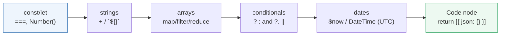

> **You now wield the Swiss Army knife.** Expressions and Code nodes hold no fear. It's time for the most exciting frontier — giving your workflows a *mind*. **Part 11: AI Automation** opens the AI family fully: LLMs, prompting, context engineering, RAG, embeddings, vector databases, memory, MCP, and autonomous AI agents.
