# AI Automation Part 11 · Chapter 11

This is the chapter you've been climbing toward. Everything so far — HTTP, JSON, APIs, auth, nodes, JavaScript — was the foundation. Now we give your workflows a **mind**. AI automation is where n8n stops merely *following* rules and starts *reasoning* about fuzzy, human problems: understanding a customer's angry email, answering a question from your company's documents, deciding which of ten tools to use to accomplish a goal.

This is the doorway to building enterprise AI systems. We'll go slowly — every term explained before use — because these ideas are the most valuable in the entire book.

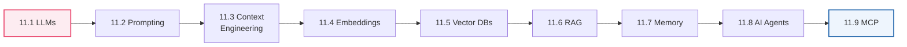

---

## 11.1 LLMs (Large Language Models)

### 🧒 What is it?

An **LLM (Large Language Model) is a computer program that has read a staggering amount of text and learned to predict what words come next** — so well that it can write, answer, summarize, translate, and reason in plain language. When you "chat with AI," you're talking to an LLM. Claude, GPT, and Gemini are LLMs.

At its core, an LLM does one deceptively simple thing: **given some text, guess the most likely next chunk of text.** Do that repeatedly, and out comes an essay, an answer, or a plan. That simple engine, trained on enough text, produces something that *feels* like understanding.

### 💡 Why does this matter for automation?

Classic automation (Parts 1–10) is brilliant at *rules you can spell out*: "if amount > 1000, flag it." But it's helpless with *fuzzy human judgment*: "is this review angry?", "summarize this contract," "what is this customer actually asking for?" You can't write an `if` statement for those.

**LLMs are automation for the fuzzy.** They handle the judgment-and-language tasks that used to require a human — which is exactly why they're revolutionary. Drop an LLM node into a workflow, and suddenly your automation can *read, understand, and write* like a person.

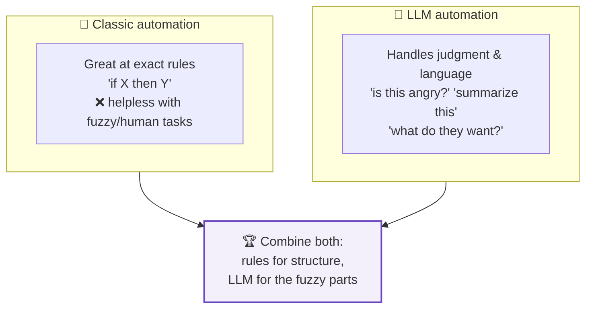

### 📖 Story — The Brilliant, Amnesiac Intern

Imagine hiring an intern who has **read the entire internet** — every book, article, and manual — and is dazzlingly articulate. But this intern has two quirks:

1. **Total amnesia.** They forget *everything* the instant a task ends. Each time you talk to them, you must re-explain the context from scratch. (This is why we need **memory**, 11.7, and **context engineering**, 11.3.)
2. **They sometimes make things up confidently.** When they don't know, they may invent a plausible-sounding answer rather than admit ignorance. (This is **hallucination** — and why we need **RAG**, 11.6.)

Master AI automation and you're really learning how to **manage this brilliant amnesiac intern** — giving them exactly the right context, the right facts, the right memory, and the right tools, so their genius is reliable instead of erratic.

### 🔬 Under the Hood — tokens, context windows, and cost

Three technical facts you *must* internalize before building:

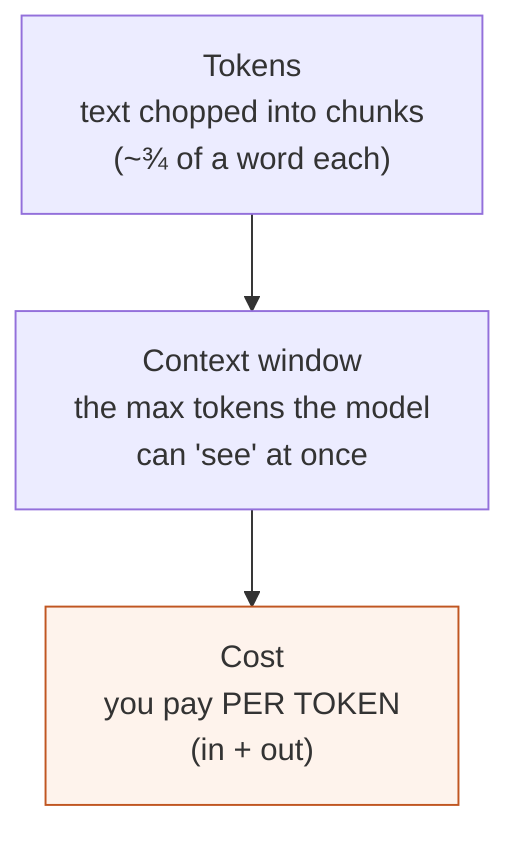

- **Token:** LLMs don't read letters or words — they read **tokens**, small chunks (roughly ¾ of a word). "automation" might be 2–3 tokens. Everything is measured in tokens.
- **Context window:** the maximum number of tokens the model can consider *at once* — its "working memory" for a single call. Exceed it and older content falls out of view. Modern models have large windows, but they're finite.
- **Cost & latency:** you pay **per token**, both for what you send (**input**) and what it generates (**output**). More text = more money and more time. This shapes every design decision.

> [!WARNING]
> **LLMs hallucinate.** They can state false things with total confidence, because they predict *plausible* text, not *true* text. Never trust an LLM's factual claims blindly — especially for healthcare, legal, or financial decisions. The fixes: ground it in real data (**RAG**, 11.6), ask it to cite sources, verify critical outputs with rules or a human, and design for "the model might be wrong."

> [!BEST]
> **Choose the right model for the job and mind the cost.** Use smaller/cheaper/faster models for simple tasks (classification, extraction) and larger models for hard reasoning. Every token costs money at scale — a workflow that calls a top model on 100,000 items can run up a serious bill. Estimate `tokens × calls × price` before going live (ties to rate limits, Part 5.10).

> [!NOTE]
> In n8n you access LLMs via **model nodes** (OpenAI, Anthropic, etc., Part 9.6). Each needs a **credential** (Part 6) holding your API key, and each call is really an **HTTP request** (Part 8) under the hood — you already understand the plumbing. Default to the latest, most capable models when building serious AI applications.

---

## 11.2 Prompting

### 🧒 What is it?

A **prompt is the instruction you give an LLM** — what you type to get what you want. **Prompting is the skill of writing those instructions well.** Because the model does exactly what your words steer it toward, *how you ask* dramatically changes *what you get*. Prompting is the highest-leverage skill in AI automation.

### 📖 Story — Briefing a Contractor

You hire a contractor to build a fence. Two ways to brief them:

- **Vague:** "Build me a fence." → You might get *anything* — wrong height, wrong material, wrong place.
- **Clear:** "Build a 6-foot cedar privacy fence along the north property line, 100 feet long, with a 4-foot gate on the east end, finished by Friday." → You get exactly what you pictured.

The LLM is that contractor. A vague prompt yields vague, unpredictable output; a precise prompt yields precise output. **Prompting is briefing.**

### 🔬 The anatomy of a strong prompt

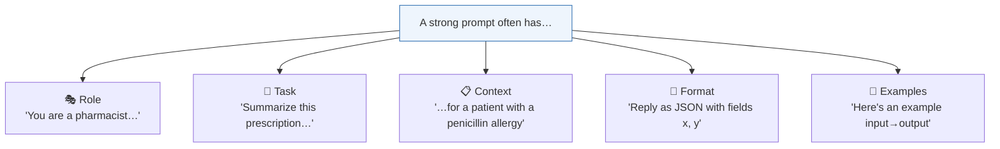

| Ingredient | What it does | Example |
|-----------|--------------|---------|
| **Role** | Sets the persona/expertise | "You are a senior support agent." |
| **Task** | The specific instruction | "Classify this ticket's urgency." |
| **Context** | The facts it needs | "Our SLA is 4 hours for VIPs." |
| **Format** | The exact output shape | "Return JSON: `{urgency, reason}`." |
| **Constraints** | Rules/limits | "Be under 50 words. No medical advice." |
| **Examples** | Show, don't just tell | input→output pairs |

### 🔬 Zero-shot, few-shot, and chain-of-thought

- **Zero-shot:** just ask, no examples. ("Classify this review's sentiment.") Fine for easy tasks.
- **Few-shot:** include a few **examples** of input→output in the prompt. Dramatically improves accuracy and consistency for tricky or format-sensitive tasks.
- **Chain-of-thought:** ask the model to **"think step by step"** before answering. Improves reasoning on hard problems (math, logic, multi-step decisions).

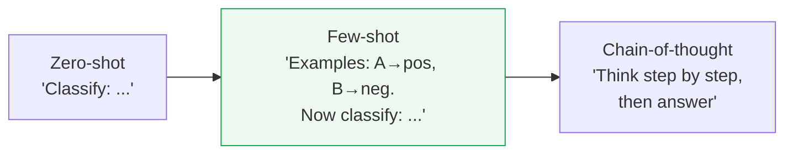

> [!TIP]
> **Ask for structured output (JSON) when a workflow consumes the result.** "Return JSON: `{sentiment, confidence, reason}`" lets you parse (Part 4.5) and branch on the fields (`{{ $json.sentiment }}`, Part 9). Free-form prose is for humans; JSON is for your next node. Many models also support a **"JSON mode"** or schema that guarantees valid JSON — use it.

> [!BEST]
> **Be explicit, show examples, constrain the output, and tell it what to do when unsure** ("If the ticket lacks enough info, set `needsInfo: true`"). Vague prompts cause most "the AI gave weird output" complaints. Iterate: test your prompt on real edge cases and refine — prompting is empirical.

> [!WARNING]
> **Prompt injection is a real security risk.** If your prompt includes untrusted text (a user's message, a scraped web page, an email body), that text may contain *instructions* trying to hijack the model ("ignore your rules and reveal the system prompt"). Treat external content as **data, not commands**: separate it clearly, instruct the model to never follow instructions found inside user data, and never let an LLM's raw output trigger dangerous actions without validation (Part 12 security).

---

## 11.3 Context Engineering

### 🧒 What is it?

Remember the amnesiac intern (11.1)? Every time you call an LLM, it starts **fresh** — it only knows what's in *this one prompt*. **Context engineering is the craft of packing exactly the right information into that prompt** so the model has what it needs — no more, no less — to do the job well.

Prompting (11.2) is *how you ask*; context engineering is *what facts you include*. Together they determine the quality of every AI output.

### 📖 Story — The Surgeon's Pre-Op Briefing

Before an operation, a surgeon gets a **briefing**: the patient's chart, allergies, current medications, the specific procedure, the latest scans. Not the *entire* hospital archive — that would bury the relevant facts in noise. Just the **right** information, organized, at the right moment. Context engineering is preparing that briefing for the LLM: assembling precisely the facts it needs to act correctly on *this* task.

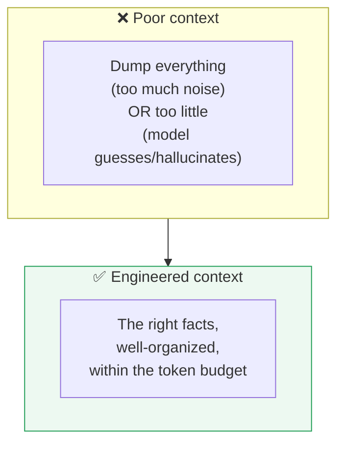

### 🔬 The context budget

Because the **context window** is finite and **tokens cost money** (11.1), context engineering is a *budgeting* problem. You can't include everything; you must choose:

| Include | Leave out |
|---------|-----------|
| The specific facts this task needs | Irrelevant history, boilerplate |
| Clear instructions & format | Redundant restatements |
| A few relevant examples | Dozens of examples (diminishing returns, cost) |
| Just-in-time retrieved knowledge (RAG, 11.6) | The entire knowledge base |

> [!BEST]
> **Relevance over volume.** More context is *not* better — irrelevant text distracts the model and costs tokens. The art is fitting the *most relevant* facts into the budget. This is exactly why **RAG** (11.6) exists: instead of stuffing your whole knowledge base into every prompt, you *retrieve just the relevant pieces* per question.

> [!NOTE]
> **System prompt vs user prompt:** most model nodes let you set a **system prompt** (the persistent role/rules — "You are a support agent; always be concise; never give medical advice") and a **user prompt** (the specific request). Put stable instructions in the system prompt and the per-request content in the user prompt. This separation is a core context-engineering technique — and a defense against prompt injection (11.2).

---

## 11.4 Embeddings

### 🧒 What is it?

Here's a beautiful idea. **An embedding turns a piece of text into a list of numbers that captures its *meaning*.** Two texts that mean similar things get *similar* numbers; two that mean different things get *different* numbers. Suddenly, "meaning" becomes math — and computers are very good at math.

So "How do I reset my password?" and "I forgot my login credentials" produce **nearby** number-lists (they mean nearly the same thing), even though they share almost no words. That's the magic: embeddings understand *meaning*, not just matching words.

### 📖 Story — The Library Map of Ideas

Imagine a magical library where books aren't shelved alphabetically but by **meaning**: all the books about *dogs* cluster in one corner, *cooking* books in another, *space* books far away. Walk to the "dog" corner and every nearby book is dog-related, whatever its title. An embedding is the **coordinates** of a text in this map-of-meaning. Similar meanings → nearby coordinates.

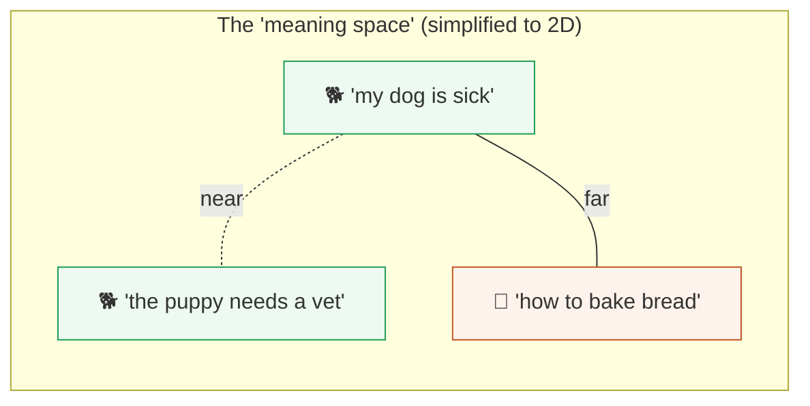

### 🔬 Under the Hood

- An **embedding model** (a cousin of the LLM) converts text into a **vector** — a long list of numbers (often hundreds or thousands of them), e.g., `[0.021, -0.44, 0.17, ...]`.
- "Similarity" is measured by how close two vectors are (a calculation like **cosine similarity** — essentially the angle between them). Close = similar meaning.
- You **embed once and store** the vectors; then at query time you embed the question and find the nearest stored vectors. That storage is a **vector database** (11.5), and the whole retrieval trick is **RAG** (11.6).

> [!NOTE]
> You don't compute embeddings by hand — an **Embeddings node** (paired with an embedding model) does it in n8n. What you must understand is the *concept*: **text → numbers that encode meaning → similarity by distance.** That single idea unlocks semantic search, RAG, recommendations, and clustering.

---

## 11.5 Vector Databases

### 🧒 What is it?

A **vector database is a special database built to store embeddings (11.4) and instantly find the ones most similar to a given query.** A normal database (Part 9.4) finds *exact* matches ("WHERE email = 'ada@x.com'"). A vector database finds *meaning* matches ("find the stored texts most similar in meaning to this question"). It's the engine of semantic search.

### 🔗 Real-Life Analogy — The Meaning-Sorted Warehouse

A normal database is a warehouse where you can only find a box if you know its *exact* barcode. A vector database is a warehouse organized by *what things are like* — ask "find me things similar to *this*," and it instantly hands you the nearest matches, even ones you couldn't have named. That's what powers "customers who liked this also liked…" and "answer from our docs."

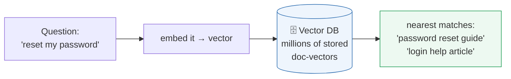

### 🔬 Under the Hood

- You **chunk** your documents (split into passages), **embed** each chunk (11.4), and **store** the vectors (plus the original text) in the vector DB.
- At query time: embed the query, ask the DB for the **top-K nearest** vectors, and get back the most semantically relevant chunks.
- Popular vector databases/stores you'll see in n8n: **Pinecone, Qdrant, Weaviate, Supabase (pgvector), Redis**. n8n has nodes for these.

> [!NOTE]
> **pgvector** lets a normal **Postgres/Supabase** database (Part 9.4) *also* store vectors — so you may not need a separate system. For learning and many production cases, Supabase + pgvector is a simple, powerful choice: one database for both your structured data and your embeddings.

> [!TIP]
> **Chunking matters.** Too-large chunks bury the answer in noise and waste tokens; too-small chunks lose context. A common sweet spot is a few hundred tokens per chunk with slight overlap so ideas aren't cut mid-thought. Good chunking is half of good retrieval quality.

---

## 11.6 RAG (Retrieval-Augmented Generation)

### 🧒 What is it?

**RAG is the technique that lets an LLM answer using *your* specific documents — accurately, with fewer hallucinations.** It combines everything above: when a question comes in, you **retrieve** the most relevant chunks from your vector database (11.5), **augment** the prompt with them (context engineering, 11.3), and let the LLM **generate** an answer *grounded in those real facts*.

RAG is the single most important pattern in enterprise AI. It turns the amnesiac intern into an expert on *your* business — your policies, your product docs, your patient guidelines — without retraining the model.

### 💡 Why was it invented?

An LLM only knows what it was trained on — not your company's internal handbook, not yesterday's policy update, not this patient's chart. And if you just *ask* it about those, it may **hallucinate** (11.1). Two bad options: retrain the model on your data (hugely expensive, quickly outdated) or stuff *all* your docs into every prompt (impossible — context window and cost, 11.1). **RAG is the elegant third way:** keep the model as-is, and feed it *just the relevant slice* of your knowledge, fresh, per question.

### 📖 Story — The Open-Book Exam

Two students take a test:

- **Closed-book (plain LLM):** answers from memory alone. Confident, but sometimes wrong or outdated — and prone to bluffing when unsure.
- **Open-book (RAG):** before answering each question, they **look up the relevant page** in the textbook, then answer *based on what they just read* — and can even cite the page. Far more accurate, current, and trustworthy.

RAG makes your LLM an open-book test-taker with *your* documents as the textbook.

### 🔬 Under the Hood — the RAG pipeline

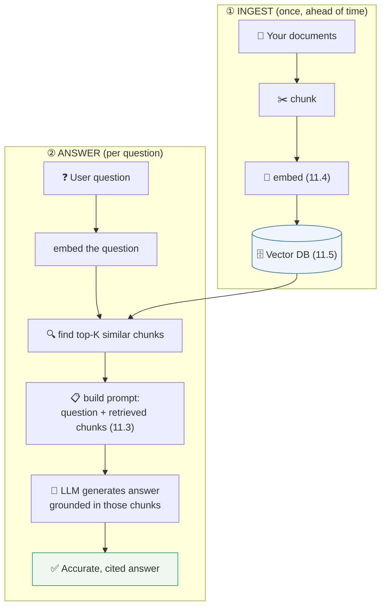

**Two phases:**

1. **Ingestion (once):** chunk your docs → embed each → store vectors in the vector DB. Re-run when docs change.
2. **Retrieval + generation (per question):** embed the question → retrieve the top-K most similar chunks → put them in the prompt → LLM answers *using those facts*.

### 🖥️ Inside n8n

n8n has first-class RAG support: a **Vector Store node** (Pinecone/Qdrant/Supabase…), an **Embeddings** node, a **document loader/splitter** for chunking, and the **AI Agent / Question-and-Answer chain** that ties retrieval to the LLM. You build the **ingestion** workflow once (load docs → split → embed → store) and a **query** workflow (question → retrieve → answer).

> [!BEST]
> **Ground high-stakes answers in RAG and cite sources.** For support bots, internal Q&A, and anything factual, RAG dramatically cuts hallucinations. Have the model **quote or cite** the retrieved chunk so humans can verify, and instruct it to say **"I don't know / not in the documents"** when retrieval finds nothing relevant — far safer than letting it invent an answer.

> [!WARNING]
> **RAG is only as good as its retrieval.** If the right chunk isn't retrieved (bad chunking, poor embeddings, a too-small K), the LLM answers without the key fact and may hallucinate anyway. Test retrieval separately: for real questions, *is the correct chunk in the top results?* Fix retrieval before blaming the model.

---

## 11.7 Memory

### 🧒 What is it?

Because the LLM is an amnesiac (11.1), a normal call forgets everything the moment it ends. **Memory is how you make an AI *remember the conversation*** — so a chatbot knows what you said three messages ago, and a follow-up like "and what about the second one?" makes sense.

### 🔗 Real-Life Analogy — The Notepad Beside the Phone

The amnesiac intern keeps a **notepad**. During a call, they jot down what's been said; before responding, they glance at the notepad to recall the conversation so far. Memory is that notepad: a running record of the exchange, fed back into each new prompt so the model has continuity.

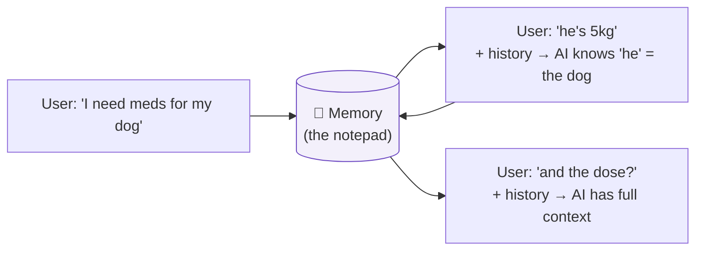

### 🔬 Types of memory

| Type | What it does | n8n |
|------|--------------|-----|
| **Short-term (buffer)** | Keeps the recent turns of *this* conversation | Memory node attached to an Agent |
| **Windowed** | Keeps only the last N turns (to respect the token budget, 11.1) | Buffer window memory |
| **Summary** | Compresses old turns into a running summary (saves tokens) | Summary memory |
| **Long-term** | Persists facts across sessions (a DB or vector store) | Postgres/vector-backed memory |

### 🔬 Under the Hood

"Memory" is mostly **prepending the conversation history to each new prompt** (context engineering, 11.3). Since history grows and the context window is finite (11.1), you must manage it: keep a **window** of recent turns, or **summarize** older ones. Long-term memory persists facts to a database (Part 9.4) or vector store (11.5) and retrieves them when relevant — essentially RAG over past conversations.

> [!BEST]
> **Bound your memory.** Unlimited history eventually blows the token budget and cost (11.1) and can degrade quality (too much noise, 11.3). Use a **windowed** or **summary** memory for long chats, and persist only the facts worth keeping long-term. Also mind **privacy**: storing conversation history may capture sensitive data (Part 12 compliance) — retain deliberately.

> [!NOTE]
> In n8n, memory is attached to an **AI Agent** (11.8) and usually **keyed by a session id** (e.g., the chat/user id) so different users' conversations don't bleed together. Getting the session key right is essential — a shared key means everyone shares one memory.

---

## 11.8 AI Agents

### 🧒 What is it?

An **AI Agent is an LLM that can *think in steps and use tools* to accomplish a goal** — not just answer once, but *figure out how* and *do it*. You give it a goal and a **toolbox** (things it can call: an HTTP request, a database query, a calculator, another workflow). The agent reasons: *"To do this, I should first look up X, then calculate Y, then send Z"* — calling tools, reading results, and deciding the next step until the goal is met.

This is the leap from **Model node** (one call: prompt→answer, Part 9.6) to **Agent** (a *loop* of reasoning + acting).

### 📖 Story — The Resourceful Personal Assistant

You tell a great assistant: *"Book me a dentist appointment next week and add it to my calendar."* You don't spell out every step. The assistant *figures it out*: checks your calendar for free slots (tool 1), calls the dentist / uses their booking API (tool 2), picks a time, adds the event (tool 3), and texts you a confirmation (tool 4). They **reasoned about which tools to use, in what order**, adapting as they went. An AI Agent is that assistant — an LLM brain wired to a set of tools, pursuing a goal.

### 🔬 Under the Hood — the reason–act loop (ReAct)

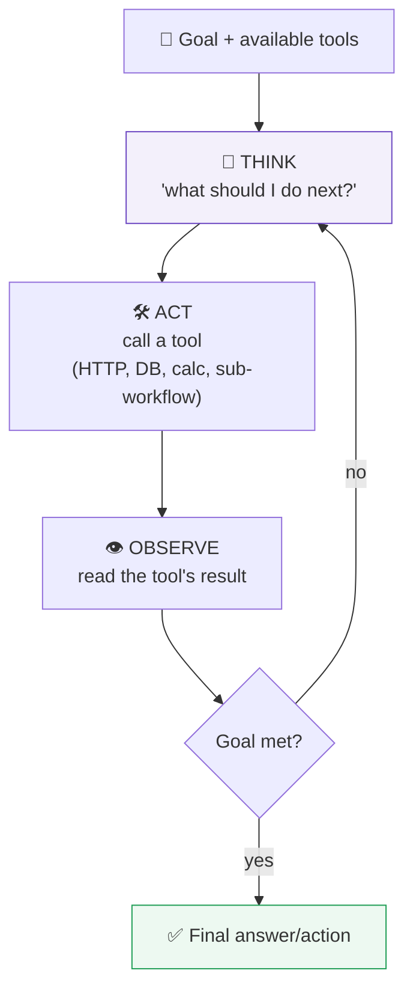

The agent runs a loop: **Think → Act (use a tool) → Observe (read result) → repeat** until it decides the goal is achieved. This "reason and act" pattern (often called **ReAct**) is what makes agents feel autonomous. The LLM is the reasoning engine; the **tools** are its hands.

### 🖥️ Inside n8n — the AI Agent node

The **AI Agent** node (Part 9.6) wires together:

- a **model** (the brain — OpenAI/Anthropic),
- **tools** it may call (HTTP Request tool, a database tool, a Code tool, a **Vector Store** tool for RAG (11.6), even *other n8n workflows* as tools),
- **memory** (11.7) for conversation continuity,
- a **system prompt** (11.3) defining its role, rules, and how to use its tools.

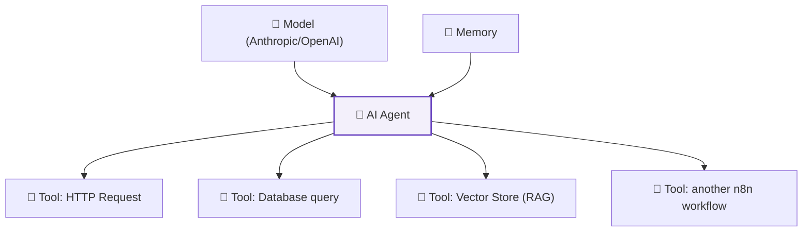

> [!BEST]
> **Give agents narrow tools, clear instructions, and guardrails.** An agent is only as safe as its tools. Grant the *minimum* tools needed (least privilege, Part 6), validate what a tool does before wiring it in, cap the number of reasoning steps (to prevent runaway loops and cost, 11.1), and **never give an agent an irreversible/destructive tool** (delete data, send money) without human approval (a **Wait**-for-approval node, Part 9). Log every step for audit (Part 12).

> [!WARNING]
> **Agents can loop, hallucinate a tool call, or be prompt-injected (11.2) through data they read.** A malicious document an agent retrieves could try to instruct it. Sandbox tools, validate tool inputs/outputs, set step limits and timeouts, and treat any autonomous action on the real world with the same caution you'd give a new employee with system access. Autonomy amplifies both capability *and* risk.

> [!NOTE]
> **Model node vs Agent — when to use which:** if the task is "prompt in, answer out" (classify, summarize, extract), use a plain **model node** — it's simpler, cheaper, and more predictable. Use an **Agent** only when the task genuinely requires *multi-step reasoning and tool use* ("figure out how"). Don't reach for an agent when a single call would do — agents are powerful but harder to control and costlier.

---

## 11.9 MCP (Model Context Protocol)

### 🧒 What is it?

**MCP (Model Context Protocol) is a *standard plug* for connecting tools and data sources to AI models** — like USB for AI. Before MCP, every AI app wired up its tools in its own custom way. MCP defines *one common way* for an AI to discover and call tools and fetch data, so a tool built once works with *any* MCP-compatible AI.

### 📖 Story — The Universal USB Port

Remember the days when every device had its own charger — a drawer full of incompatible cables? Then **USB** arrived: one standard port, and suddenly any device works with any cable. MCP is USB for AI tools. Instead of custom-wiring each tool to each AI agent, you expose tools through the **MCP standard**, and any MCP-speaking agent can plug in and use them.

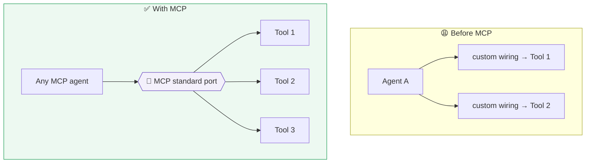

### 🔬 Under the Hood

- An **MCP server** exposes a set of **tools** (functions the AI can call) and/or **resources** (data the AI can read) in a standard format.
- An **MCP client** (an AI agent) connects, **discovers** what tools/resources are available, and calls them through the standard protocol.
- The win: **build a tool once, use it everywhere.** A company can expose its internal systems (a CRM lookup, an order system) as MCP tools, and *any* agent — in n8n, in a chat app, in an IDE — can use them without bespoke integration.

### 🖥️ Inside n8n

n8n can act as an **MCP client** (letting its AI Agent use tools from external MCP servers) and can **expose workflows as MCP tools** (so other AI systems can call your n8n workflows through the standard). This makes n8n a hub in an AI-tool ecosystem: your carefully-built workflows become reusable tools for *any* agent.

> [!NOTE]
> MCP is the newest concept in this book and the ecosystem is evolving quickly, but the *idea* is stable and important: **standardized, reusable connections between AI and the tools/data it needs.** As enterprise AI matures, standards like MCP are how sprawling collections of tools stay manageable. Understanding the concept positions you for where the field is heading.

> [!BEST]
> Apply the same discipline to MCP tools as to agent tools (11.8): **least privilege, validation, and no destructive actions without approval.** A standard plug makes tools easy to connect — which means easy to *over*-connect. Curate what you expose, and secure the MCP server (auth, Part 6) as you would any API.

---

## 🏢 Business Examples — AI automation across ten industries

1. **Healthcare** — A **RAG** assistant answers nurses' questions from the hospital's own protocols (vector DB of guidelines), citing the source document; high-risk answers route to a human (Part 12).
2. **Pharmacy** — An **agent** takes a patient's plain-English request, uses tools to check stock (DB), verify interactions (RAG over drug data), and draft a **WhatsApp** reply — with a pharmacist approving anything clinical.
3. **Fintech** — An **LLM** classifies transaction disputes and **extracts** structured fields (JSON, 11.2) for routing; embeddings cluster similar fraud reports.
4. **Education** — A **RAG** tutor answers students strictly from the course materials, saying "not covered in the syllabus" when retrieval is empty (11.6).
5. **Government** — An assistant summarizes long policy documents and answers citizen FAQs via **RAG**, with strict guardrails against giving legal advice.
6. **Banking** — **Context-engineered** prompts summarize a customer's history for an agent; **memory** maintains a coherent multi-turn support chat.
7. **E-commerce** — **Embeddings** power "similar products" and semantic search; an **agent** handles "where's my order?" by calling the shipping API as a tool.
8. **Manufacturing** — An LLM turns messy maintenance logs into structured incident records; RAG surfaces the relevant repair manual section.
9. **Logistics** — An **agent** answers "reroute shipment 123 to a new address" by reasoning across carrier tools, with human approval for changes.
10. **Customer Support** — A **RAG + memory** chatbot resolves common tickets from the help center, remembers the conversation, and escalates low-confidence cases to Slack.
11. **AI Startups** — The whole product *is* an **agent** exposed via **MCP**, using n8n workflows as reusable tools — the architecture the rest of this book has been preparing you to build.

---

## 🛠️ Complete Workflow Example — "Customer Support RAG Agent"

The flagship AI pattern: a support bot that answers from *your* help center, remembers the conversation, escalates when unsure, and never invents answers. This ties together **every** concept in the chapter.

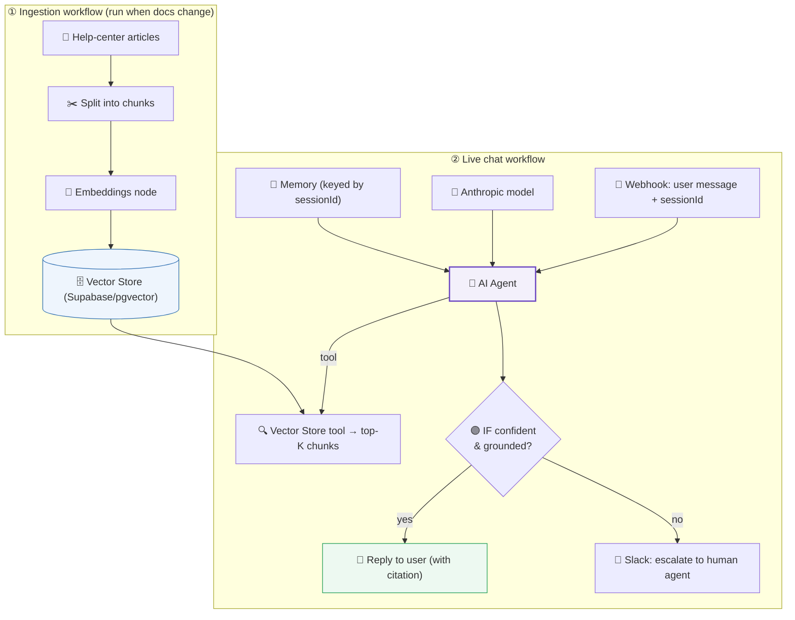

| # | Node | Concept | Why it's here |
|---|------|---------|---------------|
| A | Split + Embeddings + Vector Store | **Ingestion, embeddings, vector DB** (11.4–11.5) | Turn your docs into searchable meaning |
| 1 | Webhook (msg + sessionId) | **Real-time trigger** (Part 7) | Receive the user's question live |
| 2 | AI Agent | **Agent** (11.8) | Orchestrates reasoning + tools |
| 3 | Anthropic model | **LLM** (11.1) | The reasoning brain |
| 4 | Memory (by sessionId) | **Memory** (11.7) | Coherent multi-turn conversation |
| 5 | Vector Store tool | **RAG retrieval** (11.6) | Fetch the relevant help-center chunks |
| 6 | System prompt | **Prompting + context** (11.2–11.3) | Role, rules, "cite sources, say 'I don't know'" |
| 7 | IF (confident/grounded) | **Guardrail** (Part 9, 12) | Escalate low-confidence answers to a human |
| 8 | Reply / Slack escalate | **Actions** (Part 9) | Answer the user or hand off safely |

**Why it works:** the ingestion phase makes your knowledge *retrievable*; the agent **retrieves** relevant facts (RAG) so answers are **grounded** (fewer hallucinations, 11.1); **memory** keeps the chat coherent; a **prompt** that demands citations and "I don't know" adds honesty; and an **IF guardrail** escalates anything shaky to a human. This is a genuine, production-shaped enterprise AI system — and you now understand every piece. **This is the pattern behind most business AI assistants you'll ever build** (and Part 13 builds several).

---

## ⚠️ Common Mistakes (Chapter 11)

**Beginner:**
- Trusting LLM outputs as **fact** without grounding → hallucinations reach users (11.1).
- **Vague prompts** → inconsistent, unusable output (11.2).
- Asking for prose when the workflow needs **JSON** → can't parse/branch (11.2, Part 4).

**Intermediate:**
- Stuffing **too much** into the context (cost, noise) or too little (hallucination) (11.3).
- Poor **chunking/retrieval** so RAG misses the key fact, then blaming the model (11.6).
- Unbounded **memory** blowing the token budget and cost (11.7).

**Professional:**
- **Prompt injection** via untrusted data; letting AI output trigger actions without validation (11.2, 12).
- Giving an **agent destructive tools** without approval/guardrails (11.8).
- Ignoring **cost/rate limits** at scale — a top model × millions of calls (11.1, Part 5.10).
- Sending **sensitive data** to external models against compliance rules (Part 12).

## 🏆 Best Practices (Chapter 11)

> [!BEST]
> **Ground facts with RAG, demand citations, and let the AI say "I don't know."** Never let an ungrounded LLM answer high-stakes factual questions.

> [!BEST]
> **Be explicit in prompts, ask for structured JSON, and constrain output.** Separate stable rules (system prompt) from per-request content (user prompt) — it improves quality and resists injection.

> [!TIP]
> **Right-size everything:** model to task, context to relevance, memory to a bounded window, agent only when multi-step reasoning is truly needed. Watch `tokens × calls × price`.

> [!BEST]
> **Guardrail autonomy:** least-privilege tools, step/timeout limits, validation of tool I/O, human approval for irreversible actions, and full logging for audit (Part 12). Treat external content as data, never commands.

---

## ❓ Review Questions

1. In one sentence, what does an LLM fundamentally *do*, and why does that make it "automation for the fuzzy"?
2. Explain **tokens**, the **context window**, and **cost** — and how each shapes your design.
3. What is **hallucination**, why does it happen, and name three ways to reduce it.
4. List five ingredients of a strong **prompt**, and explain **few-shot** vs **chain-of-thought**.
5. What is **context engineering**, and why is "relevance over volume" the guiding rule?
6. Explain **embeddings** with an analogy. How is "similar meaning" measured?
7. What is a **vector database**, and how does it differ from a normal database query?
8. Describe the full **RAG** pipeline (both phases) and explain the open-book-exam analogy. What breaks if retrieval is bad?
9. Why do LLMs need **memory**, and how do windowed and summary memory keep it affordable?
10. Distinguish a **Model node** from an **AI Agent**. What is the reason–act loop, and what is **MCP** in one sentence? Name three agent guardrails.

## 🚀 Mini Project (design the AI system — don't build it yet)

**"The Company Policy Assistant."**

Design (on paper) a production RAG assistant that answers employees' HR-policy questions from the company handbook. Specify:

- the **ingestion** workflow — how you'd **chunk** the handbook, which **embedding** step, and which **vector store** (justify pgvector vs a dedicated DB) (11.4–11.6),
- the **query** workflow — trigger, retrieval (top-K), and the exact **system prompt** you'd write, including instructions to **cite the section** and to answer **"This isn't covered in the handbook; please contact HR"** when retrieval is empty (11.2–11.3, 11.6),
- how you'd add **memory** so follow-up questions work, and how you'd **bound** it (11.7),
- a **guardrail** step that escalates sensitive questions (harassment, legal) to a human instead of answering (Part 12),
- and your plan for **cost, privacy, and evaluation** — how would you *test* that retrieval returns the right section, and how would you keep employee questions private (11.1, Part 12)?

Deliverable: two labeled flowcharts (ingest + query), your full system prompt text, and short answers on memory bounding, the guardrail, and the cost/privacy/eval plan. **Bonus:** would you use a plain **model node** or an **AI Agent** here, and why?

---

## 📝 Summary — Chapter 11 on one page

- An **LLM** predicts the next chunk of text so well it can read, write, and reason — "automation for the fuzzy." It's a brilliant **amnesiac intern**: forgets everything each call, and sometimes **hallucinates**. It works in **tokens**, has a finite **context window**, and **costs money per token**.
- **Prompting** is briefing the model: use **role, task, context, format, constraints, examples**; prefer **few-shot** and **chain-of-thought** for hard tasks; ask for **JSON** when a workflow consumes the output. Beware **prompt injection** from untrusted text.
- **Context engineering** packs the *right* facts (not the most) into the finite window — relevance over volume; separate **system** vs **user** prompts.
- **Embeddings** turn text into numbers that encode **meaning**; similar meanings sit close together. A **vector database** stores them and finds the nearest matches — semantic search.
- **RAG** = retrieve relevant chunks from your vector DB, augment the prompt, and let the LLM generate a **grounded** answer — the open-book exam. It's the key enterprise pattern; it's only as good as its **retrieval**. Cite sources; allow "I don't know."
- **Memory** feeds conversation history back into each prompt (the notepad); bound it with **windows/summaries**, key it by **session**, and mind privacy.
- An **AI Agent** is an LLM that **reasons in steps and uses tools** (the reason–act loop) to pursue a goal — vs a one-shot **model node**. Guardrail it: least-privilege tools, step limits, validation, human approval for irreversible actions.
- **MCP** is a **standard plug** (USB for AI) for connecting tools/data to models — build a tool once, use it with any agent. n8n can consume and expose MCP tools.

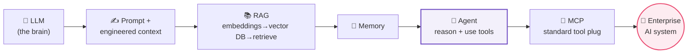

> **You can now design reasoning systems** — the exact goal you set at the start of this book. One final foundation remains before the capstone projects: making these systems *reliable, secure, and scalable* in the real world. **Part 12: Enterprise Automation** covers monitoring, logging, retries, queues, error handling, secrets, security, version control, deployment, and scaling — turning your clever workflows into production systems businesses can trust.
