# Enterprise Automation Part 12 · Chapter 12

A workflow that works on your laptop when you click "Test" is a *demo*. A workflow that runs unattended for a year, handling real money, real patients, and real customers — surviving outages, bad data, traffic spikes, and 3 a.m. failures — is a **production system**. This chapter is the bridge between the two. It's the difference between a hobbyist and a **Principal Automation Engineer**.

Everything here answers one question: *"How do I make this reliable, secure, and scalable enough that a business can bet on it?"*

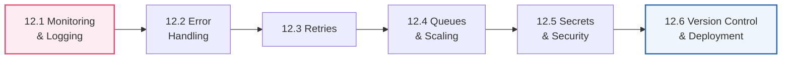

> [!NOTE]
> The umbrella term for this whole chapter is **"production-grade"** or **"enterprise-ready."** In software culture it overlaps with **DevOps** and **SRE** (Site Reliability Engineering) — the disciplines of running systems reliably. You don't need the jargon; you need the *habits*. This chapter installs them.

---

## 12.1 Monitoring & Logging

### 🧒 What is it?

- **Logging** is writing down *what happened* as your workflow runs — a diary of events. ("Received order 991. Charged card. Sent SMS. Done.")
- **Monitoring** is *watching those logs and metrics in real time* to know if the system is healthy — and getting *alerted* when it isn't. ("Error rate just spiked — wake someone up.")

Logging is the black box; monitoring is the air-traffic controller watching all the black boxes.

### 📖 Story — The Hospital Patient Monitor

In an ICU, every patient is wired to a **monitor** showing heart rate, oxygen, blood pressure — *continuously*. Nurses don't stare at every screen; the monitor **alarms** the instant a vital goes out of range. And every reading is **recorded** so doctors can review what happened before an event.

Your production automations need the same: **logs** (the recorded readings) and **monitoring with alerts** (the alarm that summons a human when something's wrong). Without them, you find out your workflow has been silently failing for three days when an angry customer calls.

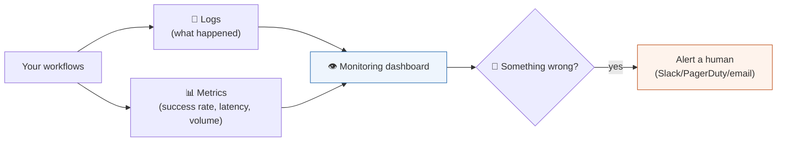

### 🔬 What to log, and the levels

Logs come in **levels** so you can filter signal from noise:

| Level | Meaning | Example |
|-------|---------|---------|
| **DEBUG** | Fine detail for developers | "Query returned 42 rows" |
| **INFO** | Normal events worth recording | "Order 991 processed" |
| **WARN** | Something odd but handled | "Retried API call (attempt 2)" |
| **ERROR** | A failure that needs attention | "Payment API returned 500" |

### 🖥️ Inside n8n

- **Executions view** (Part 3.3) is your built-in log — every run, every node's data, success/error. Set **retention** deliberately (privacy vs debuggability, Part 3.3).
- For real monitoring, **push key events out**: log important steps to a database (Part 9.4) or a logging service, and send **alerts** to Slack/email/PagerDuty on failures (via the Error Workflow, 12.2).
- Track **metrics**: success rate, execution time, volume, and error counts over time. A sudden change is your early warning.

> [!BEST]
> **If it runs in production, it must be observable.** You cannot fix — or even *notice* — what you can't see. At minimum: record every execution, alert a human on failures, and track your success rate. "It's probably fine" is not a monitoring strategy. The goal: *you* find out about a problem before your *customer* does.

> [!WARNING]
> **Never log secrets or sensitive data** (Part 6): API keys, passwords, tokens, full card numbers, patient records. Logs get stored, shared, and shipped to third-party services — a secret in a log is a secret leaked. **Redact** sensitive fields before logging (mask all but the last 4 digits, drop tokens). This is both a security and a compliance requirement (12.5).

---

## 12.2 Error Handling

### 🧒 What is it?

**Error handling is deciding — in advance — what your workflow does when something goes wrong.** Because in production, things *will* go wrong: an API returns `500` (Part 1), data is malformed (Part 4), a network times out (Part 8), a rate limit hits (Part 5.10). The question is never "what if it fails?" but "*when* it fails, does it fail *gracefully* or *catastrophically*?"

### 📖 Story — The Restaurant's "86'd" Plan

A good restaurant has a plan for when the kitchen runs out of salmon ("86 the salmon"). The waiter doesn't panic or freeze — they smoothly say "the salmon's unavailable tonight; may I suggest the sea bass?" The failure is *anticipated and handled*. A bad restaurant's waiter vanishes into the kitchen and never returns, leaving you starving and confused.

Error handling is your workflow's "86'd" plan: a graceful, pre-planned response to failure instead of a silent crash.

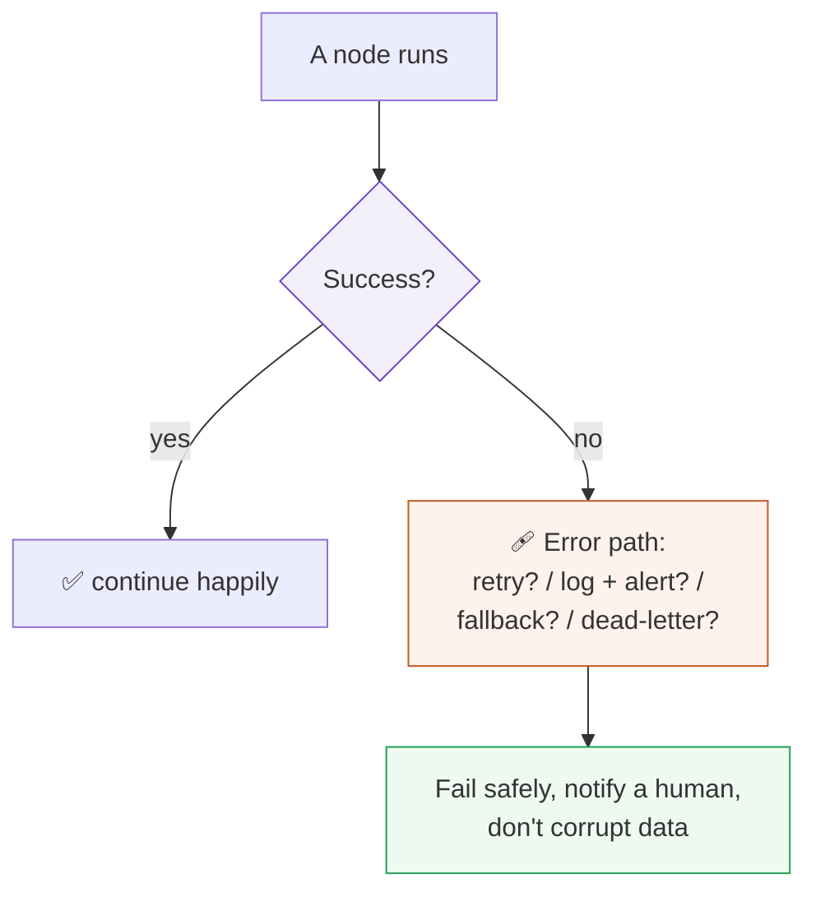

### 🖥️ Inside n8n — the tools

| Tool | What it does |
|------|--------------|
| **Error Workflow** | A special workflow that runs automatically whenever *any* workflow fails — your global safety net. Set it to alert Slack/email with the error and which workflow/node broke. |
| **Error Trigger node** | Starts that error workflow; gives you the failed execution's details. |
| **"Continue On Fail"** (node setting) | Let a node keep going on error, so you can handle the failure downstream (branch on it) instead of crashing the whole run. |
| **IF on status code** (Part 8.7) | Branch on `4xx/5xx` to handle failures deliberately. |
| **Try/Catch pattern** | Route the "error output" of a node to a handling path. |

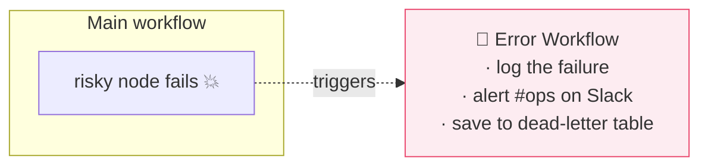

### 🔬 The dead-letter pattern

When an item can't be processed even after retries, don't drop it silently. Send it to a **dead-letter queue** — a "failed items" table or list — so it's *preserved* for a human to inspect and reprocess later. Nothing is ever lost; failures become a to-do list, not a mystery.

> [!BEST]
> **Every production workflow needs a global Error Workflow** that alerts a human with enough detail to act (which workflow, which node, the error, the input). Silent failure is the cardinal sin of automation — a workflow that fails *loudly* is fixable; one that fails *quietly* erodes trust and loses data.

> [!WARNING]
> **Distinguish "retry-able" from "fatal" errors.** A `500`/timeout/`429` (Part 1, 5.10) is *transient* — retry it (12.3). A `400`/`401`/`404` (your request is wrong) is *fatal* — retrying just fails again; alert a human instead. Blindly retrying fatal errors wastes resources and hammers APIs; never retrying transient ones makes you fragile. Branch on the error type.

---

## 12.3 Retries

### 🧒 What is it?

A **retry is simply trying again after a failure** — because many failures are *temporary*. A server hiccuped, a network blipped, a rate limit passed. Waiting a moment and retrying often just… works. Retries turn flaky dependencies into reliable ones.

### 🔬 Exponential backoff with jitter (Part 5.10, revisited)

You met this in Part 5.10 — now formalize it. Don't retry instantly and endlessly; **wait longer between each attempt**, and add randomness:

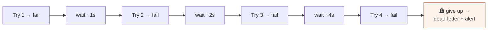

- **Backoff** (1s → 2s → 4s → 8s): gives a struggling server room to recover instead of piling on.
- **Jitter** (add a little randomness): so many clients don't all retry at the *same instant* and re-collide (the "thundering herd").
- **A max attempts cap**: after N tries, stop and **dead-letter** it (12.2). Infinite retries are a bug, not resilience.

### 🖥️ Inside n8n

- Nodes (especially **HTTP Request**, Part 8.8) have **Retry On Fail**, **Max Retries**, and **Retry Interval** settings.
- For custom logic, build the loop with **Wait** (Part 9.2) + a counter + an IF, incrementing the wait.
- Combine with the **dead-letter pattern** (12.2) for items that exhaust their retries.

> [!WARNING]
> **Only auto-retry idempotent operations** (Part 7.1). Retrying a **GET** or an **upsert** is safe. Retrying a raw **"create charge"/"send email"** after a *timeout* is dangerous — the first attempt might have *succeeded* (you just didn't get the response), so a retry **double-charges** or **double-sends**. Make writes idempotent (idempotency keys, upserts) *before* enabling retries on them. This is the most expensive lesson in the chapter — learn it here, not in production.

> [!BEST]
> **Retry transient failures with capped exponential backoff + jitter; dead-letter what's left; make writes idempotent first.** This trio is the backbone of resilient automation. Configure it deliberately per call, not by hope.

---

## 12.4 Queues & Scaling

### 🧒 What is it?

- A **queue is a waiting line for work** — tasks line up and get processed one (or a few) at a time, in order, so a flood of work doesn't overwhelm the system.
- **Scaling is handling *more* work** — more executions, more data, more users — without falling over.

Together they answer: *"What happens when 10,000 orders arrive in a minute instead of 10?"*

### 📖 Story — The Bank Queue vs. the Stampede

Picture a bank at opening time. Without a **queue**, 200 customers stampede three tellers — chaos, crushed people, no one served. *With* a rope-line **queue**, customers wait in an orderly line, and tellers serve them steadily. Nobody is lost; the system stays calm under load. Need to serve faster? **Add more tellers** (scale out).

A message queue is that rope line for tasks; scaling is adding tellers.

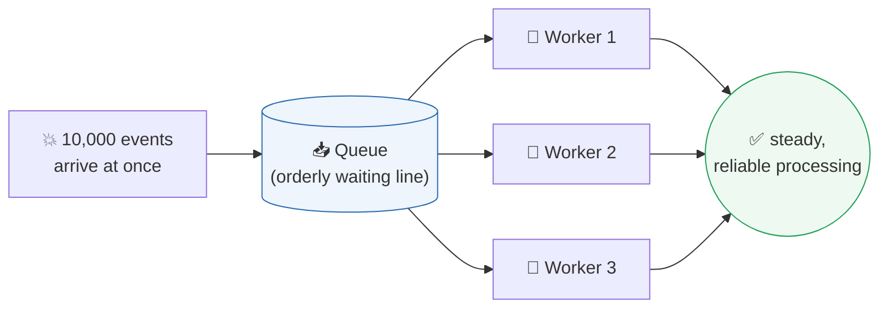

### 🔬 Under the Hood — why queues make systems robust

- **Buffering:** a queue absorbs spikes. If work arrives faster than you can process, it *waits safely* instead of being dropped or crashing the system.
- **Durability:** a good queue (RabbitMQ, Redis, SQS) **persists** tasks — if a worker crashes mid-task, the task returns to the queue and another worker picks it up. **No work is lost** (ties to Part 7's reliability).
- **Decoupling:** the part that *receives* work (a webhook, Part 7) is separated from the part that *does* it. The receiver just drops the task in the queue and instantly returns `200 OK`; workers process at their own pace. This is why "acknowledge fast, process later" (Part 7.1) works.

### 🔬 Scaling: up vs out

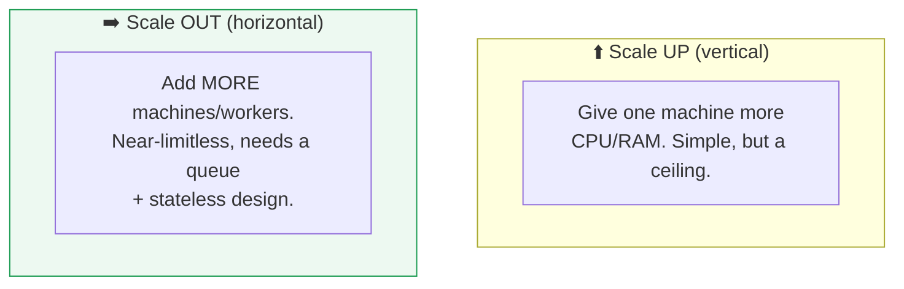

- **Scale up (vertical):** a bigger machine. Easy, but there's a hard ceiling and a single point of failure.
- **Scale out (horizontal):** *more* machines/workers sharing the load via a queue. This is how you handle serious volume — and why **stateless, idempotent** design (Parts 5, 7) matters: any worker must be able to handle any task.

### 🖥️ Inside n8n

- n8n offers a **queue mode** (using **Redis**) where a **main** instance hands executions to multiple **worker** instances — horizontal scaling for high volume. This is the standard way to run n8n at enterprise scale.
- Within a single workflow, pace and batch with **Loop/Split in Batches** and **Wait** (Part 9) to respect downstream limits.
- Offload slow work: a webhook workflow that responds instantly (Part 7.1) and pushes heavy processing to a second, queue-fed workflow.

> [!BEST]
> **Design stateless and idempotent from day one, even before you need scale.** If every execution is self-contained (carries all it needs, Part 5's statelessness) and safe to repeat (Part 7's idempotency), then scaling out is just "add workers." Retro-fitting these properties onto a stateful, non-idempotent system is painful. Build for horizontal scale early; enable it when volume demands.

> [!NOTE]
> **Don't over-engineer.** Most workflows never need queue mode or horizontal scaling — a single well-built instance handles enormous volume. Add queues and workers when *measured* load requires it (12.1's metrics tell you), not because it sounds impressive. Premature scaling is wasted complexity. Match the machinery to the real need (echoing Part 7.3).

---

## 12.5 Secrets & Security

### 🧒 What is it?

**A secret is any sensitive value that must stay private** — API keys, passwords, tokens (Part 6), database credentials, encryption keys. **Security** is the whole practice of protecting your system and its data from unauthorized access, leaks, and attacks. In enterprise automation — where you touch money, health, and identity — this isn't optional; it's the license to operate.

### 🔬 Secrets management

You met the golden rule in Part 6: **secrets live only in encrypted credential stores, never in workflows, code, logs, or git.** Enterprise adds structure:

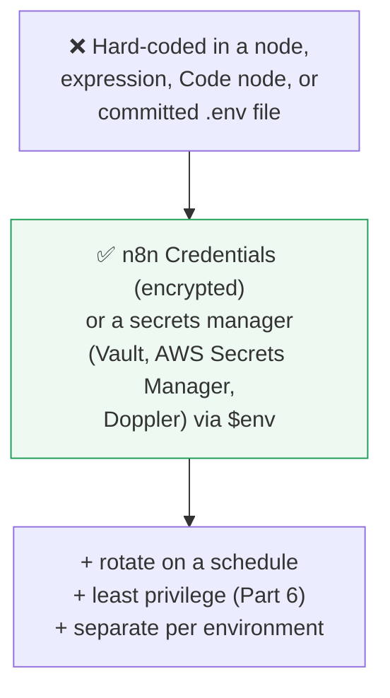

- **n8n Credentials** encrypt secrets at rest and inject them at run time (Part 6.1).
- **Environment variables (`$env`, Part 10.9)** hold config and can pull from a **secrets manager** (HashiCorp Vault, AWS Secrets Manager, Doppler) so secrets never touch the workflow file.
- **Separate secrets per environment** (dev/staging/prod) so a test key can't touch production data.

### 🔬 The security checklist for production workflows

| Threat | Defense |
|--------|---------|
| **Leaked secrets** | Credentials/secrets manager; never in logs/git; rotate (Part 6) |
| **Unauthorized access** | Auth on every endpoint; least privilege (Part 6); n8n user roles |
| **Webhook forgery** | Verify signatures/HMAC (Part 7.3) |
| **SQL injection** | Parameterized queries, never string-built SQL (Part 9.4) |
| **Prompt injection** | Treat AI inputs as data, validate AI outputs (Part 11.2) |
| **Data in transit** | HTTPS/TLS everywhere (Part 1.9) |
| **Data at rest** | Encrypt databases and backups |
| **Over-exposure** | Send/store only the minimal data needed (Part 4.6, 6) |
| **Compliance** | Follow GDPR/HIPAA/PCI as applicable; control data retention (12.1) |

### 📖 Story — The Bank Vault, Not the Sticky Note

A bank doesn't write the vault combination on a sticky note stuck to the vault door. It's held in a controlled system, changed regularly, known only to those who need it, with every access logged. Yet developers routinely "sticky-note" secrets — pasting API keys into code, committing `.env` files, printing tokens in logs. Treat every secret like the vault combination: encrypted, least-privilege, rotated, audited.

> [!BEST]
> **Least privilege, encrypted secrets, HTTPS everywhere, validate all input, and retain only what you must.** These five habits prevent the vast majority of real incidents. Security isn't a feature you add at the end — it's a property you design in from the first node (Parts 1, 6, 7, 9, 11 all fed this).

> [!WARNING]
> **Compliance is a legal, not just technical, matter.** Handling health data (HIPAA), EU personal data (GDPR), or card data (PCI-DSS) imposes strict rules on storage, access, retention, and where data may physically live. This is a major reason to **self-host** n8n (Part 3.1) — so regulated data never leaves your control. When money or health is involved, confirm the rules *before* you build, and design retention/redaction (12.1) accordingly.

---

## 12.6 Version Control & Deployment

### 🧒 What is it?

- **Version control** keeps a *history* of every change to your workflows, so you can see what changed, who changed it, and **roll back** if a change breaks something. **Git** (the tool you've been pushing to this whole book!) is the standard.
- **Deployment** is the disciplined process of moving a workflow from *development* to *production* — safely, testably, reversibly — rather than editing live and praying.

### 📖 Story — The Manuscript with Track Changes vs. the Overwritten File

An author writing a book uses **track changes** and saved versions: every edit is recorded, mistakes are undoable, and they can always return to yesterday's good draft. Now imagine an author who edits *one file*, overwriting it, with no history — one bad save and a chapter is gone forever. Editing production workflows with no version control is that second author. **Git is track-changes for your automations.**

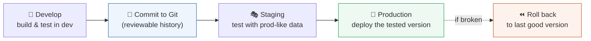

### 🔬 The environments ladder

Serious teams don't develop in production. They use a **ladder of environments**:

| Environment | Purpose | Data |
|-------------|---------|------|
| **Development** | Build and experiment | Fake/sample data |
| **Staging** | Test like production | Prod-*like* data, safe |
| **Production** | The real thing | Real users, real money |

Changes flow **up** the ladder, tested at each rung, so bugs are caught before they reach real users.

### 🖥️ Inside n8n

- Workflows are stored internally as **JSON** (Part 2.2) — so you can **export** them and commit to **Git**, gaining full history, diffs, code review, and rollback.
- n8n's **source control** feature (on some tiers) syncs workflows to a Git repo directly, and supports **environments** (dev → prod promotion).
- Use **CI/CD** concepts: test workflows in staging, then promote the exact tested version to production. Keep **credentials out of the exported JSON** (Part 6) — they're referenced, not embedded.

> [!BEST]
> **Version-control your workflows and never edit production directly.** Build in dev, review the change (Git diff), test in staging, promote to prod, and keep the ability to roll back in seconds. "I'll just tweak it live" is how a five-minute change becomes a three-hour outage. Treat workflows like the production code they are.

> [!NOTE]
> **Document as you go.** Name workflows and nodes clearly (Part 3), add sticky notes explaining non-obvious logic, and keep a short README per critical workflow (what it does, its trigger, its dependencies, who owns it). The best-documented workflow is the one a teammate can fix at 3 a.m. without calling you. Maintainability *is* a production requirement.

---

## 🏢 Business Examples — production discipline across industries

1. **Healthcare** — Self-hosted n8n (HIPAA), **redacted logs**, an **Error Workflow** paging on-call, **encrypted** patient data, and strict **retention** limits (12.1, 12.5).
2. **Pharmacy** — **Idempotent** order writes (12.3), a **dead-letter** table for failed prescriptions, and **Slack alerts** on any failure so nothing is silently dropped.
3. **Fintech** — **Queue mode** for transaction spikes (12.4), **exponential backoff** on partner APIs, PCI-compliant secret handling, and full **audit logs** (12.1, 12.5).
4. **Education** — **Staging** environment mirrors production before each term's enrollment surge; workflows in **Git** with rollback (12.6).
5. **Government** — Every action **logged for audit**, **least-privilege** access, **signature-verified** webhooks (12.5, Part 7.3).
6. **Banking** — Horizontal **scaling** with stateless workers, **circuit breakers** on flaky downstreams, and rehearsed **rollback** procedures (12.4, 12.6).
7. **E-commerce** — **Buffering queue** absorbs Black Friday spikes; a **reconciliation** safety net (Part 7) plus **monitoring** dashboards on order success rate (12.1, 12.4).
8. **Manufacturing** — **Retry + dead-letter** for intermittent sensor gateways; alerts when the error rate crosses a threshold (12.1–12.3).
9. **Logistics** — **Metrics** track carrier-API success over time; a drop triggers an alert *before* customers notice missing updates (12.1).
10. **Customer Support** — **Version-controlled** bot workflows, **prompt-injection** defenses on AI inputs, and a human-escalation guardrail (12.5, Part 11).
11. **AI Startups** — Secrets in a **secrets manager**, **cost/rate monitoring** on LLM calls (Part 11), CI/CD promotion of agent workflows, and step-limited agents for safety (12.4–12.6).

---

## 🛠️ Complete Workflow Example — "Hardening the Payment Pipeline"

Take a naive "charge card on order" flow and make it **production-grade**, applying every section of this chapter. Watch a demo become a system a bank could trust.

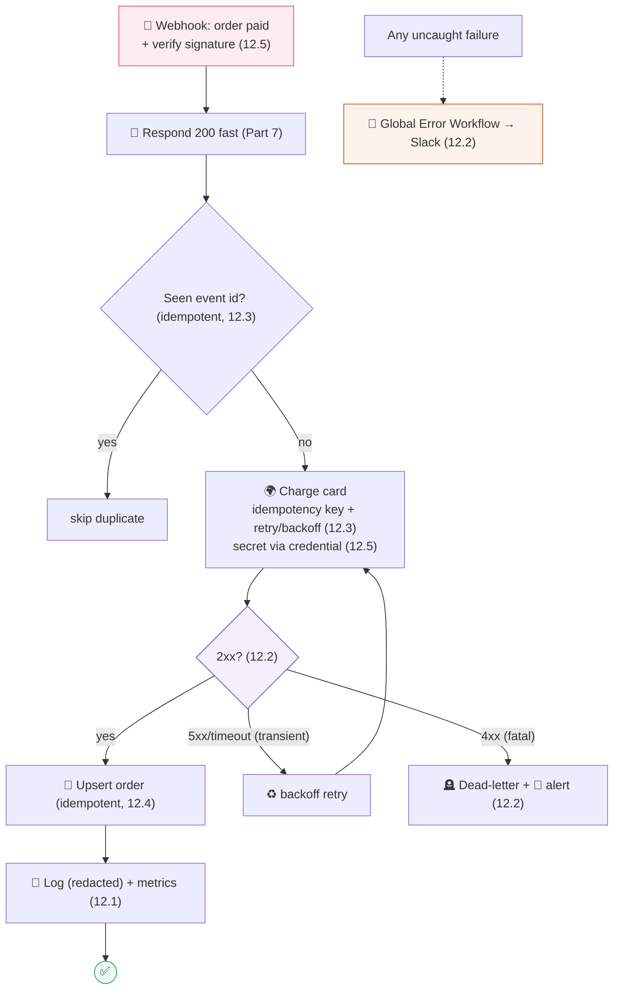

| Concern | How this flow addresses it | Section |
|---------|---------------------------|---------|
| **Security** | Verify webhook signature; secret in credential; redact logs | 12.5, Part 7 |
| **Idempotency** | Dedupe on event id; idempotency key on charge; upsert | 12.3–12.4, Part 7 |
| **Error handling** | Branch 2xx/5xx/4xx; global Error Workflow | 12.2 |
| **Retries** | Backoff on transient 5xx/timeout only; fatal 4xx → dead-letter | 12.3 |
| **Reliability** | Dead-letter preserves failed charges for review | 12.2 |
| **Observability** | Redacted logs + success/latency metrics + alerts | 12.1 |
| **Scalability** | Fast ack + idempotent, stateless steps → queue-mode ready | 12.4 |
| **Deployment** | Built in dev, tested in staging, promoted via Git, rollback-able | 12.6 |

**Why it works:** the *same* business logic as the naive version now **verifies** its inputs, **never double-charges** (idempotency), **distinguishes** transient from fatal failures, **retries** the former and **preserves** the latter, **alerts** humans, **logs** safely, and is **ready to scale**. That transformation — from "works in a demo" to "a bank can trust it" — *is* enterprise automation. This is the standard every Part 13 project should meet.

---

## ⚠️ Common Mistakes (Chapter 12)

**Beginner:**
- **No monitoring/alerts** — discovering failures days later from an angry customer (12.1).
- **No error handling** — one bad item kills the whole run silently (12.2).
- Editing **production** workflows live with no backup or history (12.6).

**Intermediate:**
- **Retrying fatal errors** (4xx) forever, or **not retrying** transient ones (12.2–12.3).
- **Logging secrets/PII** (12.1, 12.5).
- Retrying **non-idempotent** writes → double charges/emails (12.3).

**Professional:**
- **Premature scaling** (queue mode you don't need) — or the opposite, **no plan** for a known spike (12.4).
- Secrets in **git/env files**; no rotation; shared prod/test keys (12.5).
- **No dead-letter** path — failed items vanish (12.2).
- **No staging**; no rollback plan; undocumented workflows only one person understands (12.6).

## 🏆 Best Practices (Chapter 12)

> [!BEST]
> **Observe everything, fail loudly, never lose data.** Log (redacted) + monitor + alert; a global Error Workflow; dead-letter what can't be processed. You should learn of problems before your customers do.

> [!BEST]
> **Retry transient failures with capped backoff + jitter; make writes idempotent first; branch fatal vs transient.** Resilience is designed, not hoped for.

> [!BEST]
> **Design stateless + idempotent so scaling out is trivial; add queues/workers only when metrics demand it.** Match machinery to measured need.

> [!BEST]
> **Secrets in encrypted stores, least privilege, HTTPS, validated input, minimal retention, compliance-aware.** Security and privacy are designed in from node one.

> [!BEST]
> **Version-control workflows; promote dev → staging → prod; never edit production directly; keep rollback one step away; document for the 3 a.m. teammate.**

---

## ❓ Review Questions

1. Distinguish **logging** from **monitoring**. What is the minimum observability every production workflow needs, and what must you *never* log?
2. What is an **Error Workflow**, and why is "failing loudly" better than "failing silently"? Describe the **dead-letter** pattern.
3. Explain the difference between a **transient** and a **fatal** error, with a status-code example of each and the correct response to each (Part 1).
4. What is **exponential backoff with jitter**, and why each part? What must be true of an operation before you auto-retry it, and why?
5. What problem does a **queue** solve? Explain buffering, durability, and decoupling with the bank-queue analogy.
6. Compare **scaling up** vs **scaling out**. Why do **stateless** and **idempotent** design make scaling out easy?
7. Where should secrets live, and where must they *never* live? List five items from the production security checklist.
8. Why is **compliance** (HIPAA/GDPR/PCI) a reason to self-host, and how does it affect logging and retention?
9. Why must you **version-control** workflows and use a **dev → staging → prod** ladder instead of editing production directly?
10. Take the naive "charge card on order" flow and name five specific things that make the hardened version production-grade.

## 🚀 Mini Project (harden a real workflow — design it, don't build it)

**"Production-Proof the Appointment Reminder."**

You're given a fragile workflow: *a Schedule trigger fetches tomorrow's appointments and sends each patient an SMS reminder.* It has no error handling, logs full phone numbers, uses a hard-coded SMS API key, retries every failure five times instantly, and is edited live. Redesign it to be production-grade. Your written deliverable must specify:

- **Observability:** what you log (and what you **redact**), what **metrics** you track, and how you get **alerted** on failure (12.1),
- **Error handling:** a global **Error Workflow**, how you branch **transient vs fatal** SMS failures, and a **dead-letter** plan for unreachable patients (12.2),
- **Retries:** the exact backoff schedule and why you must confirm the SMS send is **idempotent** before enabling them (12.3),
- **Scaling:** how you'd handle a clinic that grows from 50 to 50,000 daily reminders — what makes the flow **stateless/idempotent**, and *when* you'd introduce queue mode (12.4),
- **Security:** how the API key is stored, **least-privilege**, and any **compliance** concerns for patient contact data (12.5),
- **Deployment:** how you'd move this into **Git**, test in **staging**, and **roll back** a bad change (12.6).

Deliverable: a hardened flowchart plus a short paragraph per bullet above. **Bonus:** which single change would most reduce the risk of *double-texting* a patient, and why?

---

## 📝 Summary — Chapter 12 on one page

- **Monitoring & logging** make a system **observable**: log (redacted!) what happens, track metrics, and **alert a human** on failure — so *you* find problems before customers do. Never log secrets/PII.
- **Error handling** is your pre-planned "86'd" response to inevitable failure: a global **Error Workflow**, branch on error type, "continue on fail" where useful, and a **dead-letter** path so nothing is lost. Fail *loudly*, never silently.
- **Retries** turn flaky dependencies reliable via **capped exponential backoff + jitter** — but only for **transient** errors (5xx/timeout/429) and only on **idempotent** operations, or you double-charge.
- **Queues** buffer spikes, guarantee durability, and decouple receiving from processing; **scaling out** (more workers via a queue) handles serious volume — easy *if* you designed **stateless + idempotent**. Don't over-engineer; scale on measured need.
- **Secrets & security:** secrets only in encrypted stores/secrets managers (never git/logs/code), **least privilege**, HTTPS everywhere, validate all input (SQL/prompt injection, webhook signatures), minimal retention, and **compliance** (HIPAA/GDPR/PCI) — a key reason to self-host.
- **Version control & deployment:** treat workflows as code — commit to **Git**, promote **dev → staging → prod**, never edit production live, keep **rollback** one step away, and document for the 3 a.m. teammate.

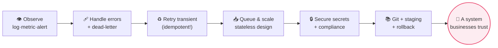

> **You now think like a Principal Automation Engineer** — not just "does it work?" but "will it survive production?" Every foundation is laid: the web, automation, n8n, data, APIs, auth, real-time, the HTTP node, every node, JavaScript, AI, and enterprise discipline. It's time to *build*. **Part 13** is the capstone: ten real, end-to-end projects — from a Pharmacy AI Assistant to an AI Research Agent — where you assemble everything you've learned into systems that solve genuine business problems.
