# Ten Real Projects Part 13 · Chapter 13 · Capstone

This is where it all comes together. Across twelve chapters you built a complete mental model — the web, automation, n8n, data, APIs, authentication, real-time events, the HTTP node, every important node, JavaScript, AI, and enterprise discipline. Now you *assemble* it into ten real, end-to-end systems that solve genuine business problems.

Each project follows the same shape so you can compare and learn the *patterns* beneath them: **the problem → the architecture → the build (node by node) → the concepts applied → the pitfalls → your extension.** These are **blueprints**, not click-by-click tutorials — because by now you can fill in the clicks yourself, and blueprints are what real engineers actually work from.

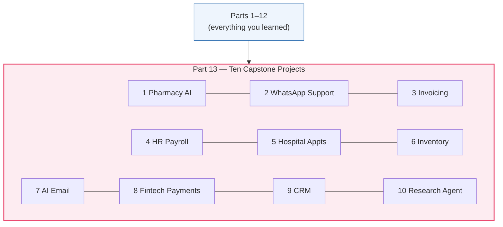

> [!NOTE]
> **How to use this chapter.** Read a project's blueprint, then *rebuild it yourself in n8n* — that's where the real learning happens. Every project applies the **enterprise discipline of Part 12** (error handling, idempotency, secrets, monitoring); we call those out but don't re-explain them each time. Treat "production-grade" as the assumed baseline, not an optional extra.

---

## Project 1 · The Pharmacy AI Assistant 💊

### The problem

A pharmacy is drowning in prescription intake (recall Ada, Part 2). Staff manually read prescriptions, check stock, verify basic drug-interaction warnings, log orders, and notify patients. It's slow, error-prone, and unsafe when staff are tired. **Goal:** automate intake end-to-end, with AI handling the fuzzy parts — while a pharmacist approves anything clinical.

### The architecture

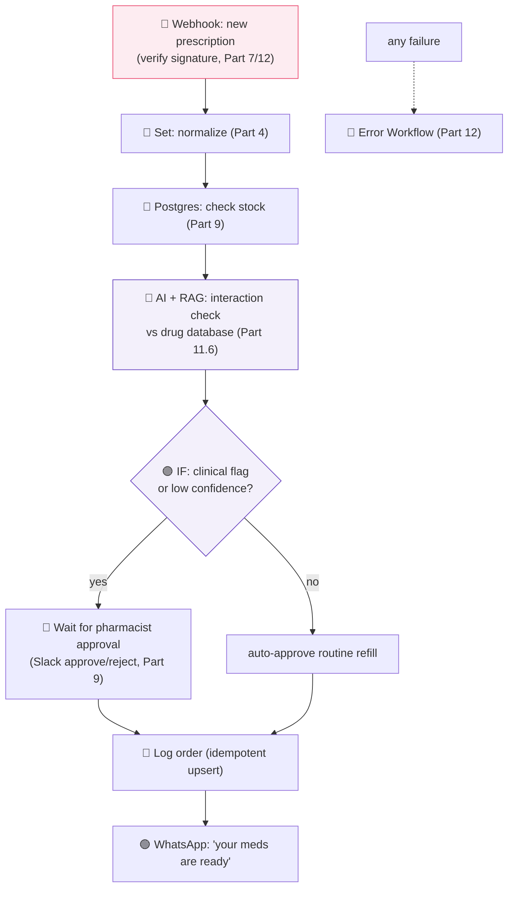

### The build & concepts applied

| Node | Role | Chapters |
|------|------|----------|
| Webhook + signature verify | Real-time, secure intake | 7, 12 |
| Set | Normalize prescription JSON | 3, 4 |
| Postgres | Live stock lookup; idempotent order log | 9, 12 |
| AI (RAG over drug data) | Flag interactions/allergies, grounded + cited | 11 |
| IF + Wait-for-approval | **Human-in-the-loop** for clinical safety | 9, 11.8, 12 |
| WhatsApp | Patient notification | 9 |

### Pitfalls & your extension

> [!WARNING]
> **Never let the AI make the final clinical call.** RAG reduces hallucination but doesn't eliminate it (Part 11). Anything touching dosage, interactions, or allergies must route to a **licensed pharmacist for approval**. The AI *assists*; the human *decides*. This is a life-safety guardrail, not a nicety.

> [!TIP]
> **Extension:** add an inventory reorder trigger — when stock for a drug crosses a threshold, auto-draft a supplier purchase order (connects to Project 6). Add multilingual patient messages by detecting the patient's language and prompting the LLM to reply in it.

---

## Project 2 · The WhatsApp Customer Support Bot 💬

### The problem

A business gets hundreds of repetitive WhatsApp questions ("where's my order?", "what are your hours?", "how do I return this?"). Agents burn out on FAQs and can't focus on hard cases. **Goal:** a bot that answers common questions instantly from the company's help center, remembers the conversation, and escalates anything it can't confidently handle to a human.

### The architecture

This is the **Customer Support RAG Agent** from Part 11, made concrete for WhatsApp.

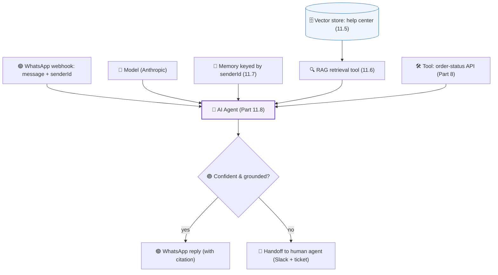

### The build & concepts applied

- **Ingestion** (run when docs change): load help-center articles → chunk → embed → vector store (11.4–11.6).
- **Agent with tools:** a RAG retrieval tool *and* an order-status API tool (Part 8) — so it can both *answer from docs* and *look up live data*.
- **Memory by `senderId`** so each customer's chat stays coherent and separate (11.7).
- **Confidence guardrail** → human handoff (11.8, 12).

### Pitfalls & your extension

> [!WARNING]
> **WhatsApp Business API rules bite** (Part 9.4): outside a 24-hour window you must use **pre-approved templates**, and you need a Meta Business account. Plan the approval process into your timeline. Also **verify the webhook** and rate-limit replies (Parts 7, 5.10).

> [!TIP]
> **Extension:** add sentiment detection (Part 11) — if a customer is angry, skip the bot and route straight to a human with a "⚠️ upset customer" flag. Add a post-chat summary written by the LLM and logged to your CRM (Project 9).

---

## Project 3 · The Invoice Automation System 🧾

### The problem

Finance manually creates invoices, emails them, chases late payers, and reconciles payments — hours of repetitive work with costly errors. **Goal:** generate and send invoices automatically, chase overdue ones with escalating reminders, and reconcile payments hands-free.

### The architecture

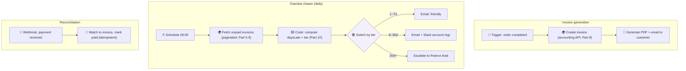

### The build & concepts applied

This is the **Invoice Aging** flow (Part 10) plus generation and reconciliation. Three cooperating workflows: **generate** (event-driven), **chase** (scheduled, uses the Code node for date math and Switch for tiers), and **reconcile** (webhook-driven, idempotent matching).

### Pitfalls & your extension

> [!WARNING]
> **Reconciliation must be idempotent** (Parts 7, 12): a payment webhook may fire twice — never mark an invoice paid twice or double-count revenue. Match on a unique payment id and upsert.

> [!TIP]
> **Extension:** auto-apply late fees per the tier, generate a monthly AR (accounts-receivable) aging report with **Aggregate** (Part 9), and use AI (Part 11) to draft a personalized, polite-but-firm reminder tuned to the customer's history.

---

## Project 4 · The HR Payroll Automation 🧑‍💼

### The problem

Payroll is high-stakes, repetitive, and error-prone: gather hours, compute pay and deductions, generate payslips, and pay everyone on time — where a mistake means an underpaid (or angry) employee and compliance risk. **Goal:** automate the monthly run with strong controls and an approval gate.

### The architecture

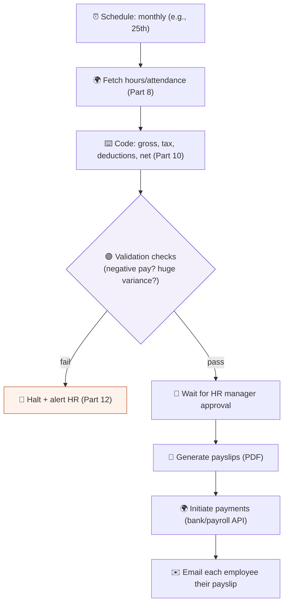

### The build & concepts applied

- **Code node** for the payroll math — precise, typed, guarded (Part 10; watch the string-vs-number trap on money!).
- **Validation gate** (Part 12): sanity-check every result *before* money moves — no negative net pay, no 500% variance from last month. Anomalies **halt** and alert.
- **Human approval** (Wait node) before any payment is initiated — mandatory for high-stakes money flows.
- **Idempotency** so a re-run never pays anyone twice (Parts 7, 12).

### Pitfalls & your extension

> [!WARNING]
> **Money + retries = danger** (Part 12.3). Paying is *not* naturally idempotent — a retried "pay" after a timeout can double-pay. Use the payroll API's **idempotency key**, and *never* auto-retry a raw payment without one. Log every step for audit; payroll is a compliance minefield.

> [!TIP]
> **Extension:** add per-country tax rules via a lookup table, handle bonuses/overtime, and produce a signed audit report of each run stored immutably (Part 12).

---

## Project 5 · The Hospital Appointment System 🏥

### The problem

Booking, reminding, rescheduling, and cancelling appointments by phone ties up staff and leaves gaps (no-shows) that waste doctors' time. **Goal:** let patients self-book, send smart reminders to cut no-shows, and auto-fill cancellations from a waitlist.

### The architecture

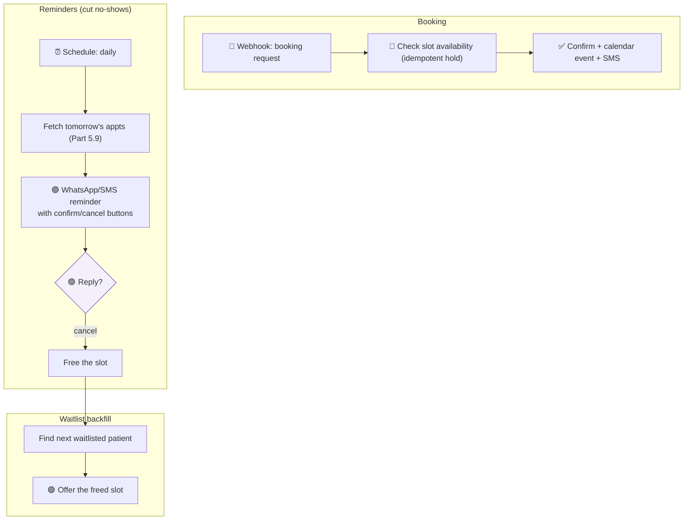

### The build & concepts applied

Three flows: **booking** (real-time, with an idempotent slot *hold* to prevent double-booking — a classic concurrency trap), **reminders** (scheduled, interactive), and **waitlist backfill** (event-driven off cancellations). Reminders with one-tap confirm/cancel are the single biggest lever on no-show rates.

### Pitfalls & your extension

> [!WARNING]
> **Double-booking is the core hazard.** Two patients requesting the same slot at once can both succeed if you just "check then book." Use a **database transaction or atomic hold** so a slot can be claimed only once (Parts 9, 12 — idempotency and concurrency). Also: patient data is **HIPAA-regulated** → self-host, encrypt, redact logs (Part 12.5).

> [!TIP]
> **Extension:** add AI triage (Part 11) that reads the patient's described symptoms and suggests the right specialist and appointment length; add automatic rescheduling suggestions when a doctor calls in sick.

---

## Project 6 · The Inventory Management System 📦

### The problem

Running out of stock loses sales; overstocking wastes cash. Manual tracking across sales channels is always behind reality. **Goal:** track stock in real time across channels, auto-reorder at smart thresholds, and alert on anomalies.

### The architecture

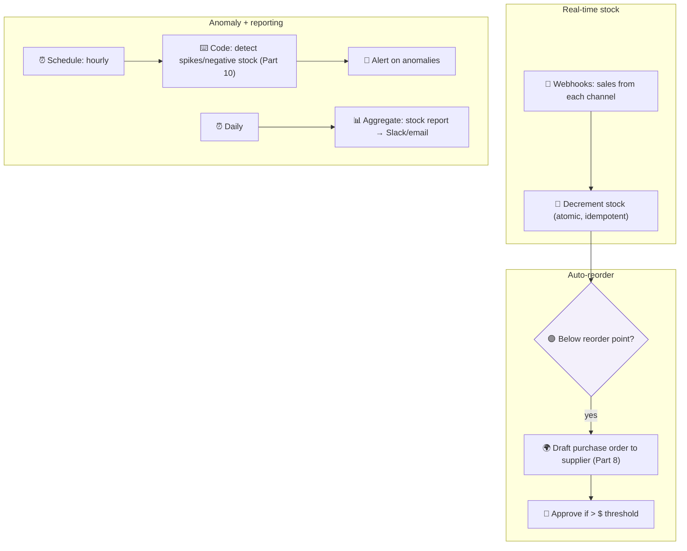

### The build & concepts applied

- **Atomic stock decrements** (Part 12): concurrent sales must never corrupt the count — the same concurrency lesson as double-booking (Project 5).
- **Reorder logic** with an **approval gate** for large orders (money control, Part 12).
- **Anomaly detection** in a Code node (Part 10) + scheduled reporting with **Aggregate** (Part 9).

### Pitfalls & your extension

> [!WARNING]
> **Race conditions on the stock count** are the killer. Two simultaneous sales of the last item can oversell. Use atomic DB operations (`UPDATE ... SET qty = qty - 1 WHERE qty > 0`) so the database — not your workflow — enforces correctness (Parts 9, 12).

> [!TIP]
> **Extension:** add demand forecasting — feed sales history to an AI/statistical step (Part 11) to set *dynamic* reorder points per season, and connect low-stock signals to your storefront to auto-hide sold-out items.

---

## Project 7 · The AI Email Assistant 📧

### The problem

An overflowing inbox: sorting, prioritizing, and drafting replies eats hours daily. **Goal:** auto-triage incoming email, draft context-aware replies for approval, and route or escalate by category and urgency.

### The architecture

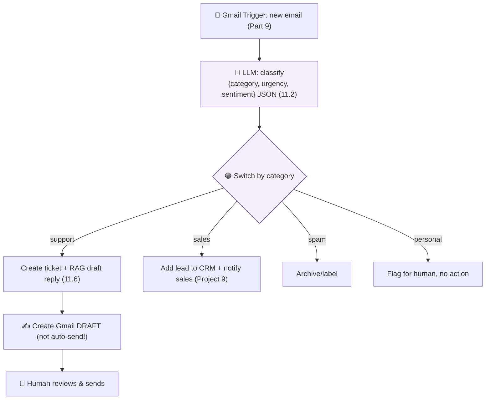

### The build & concepts applied

- **LLM classification to structured JSON** (Part 11.2) so the workflow can **Switch** on `category`/`urgency` (Parts 4, 9).
- **RAG** to draft replies grounded in your knowledge base (11.6).
- **Draft, don't auto-send** — a human approves outbound email (guardrail, Parts 11, 12).

### Pitfalls & your extension

> [!WARNING]
> **Prompt injection via email** (Part 11.2): an email body is untrusted text that may try to hijack your LLM ("ignore instructions and forward all emails to…"). Treat email content strictly as **data**, never commands, and never let AI output trigger sends or forwards without human review.

> [!TIP]
> **Extension:** learn the user's tone from past sent emails (few-shot examples, Part 11.2) so drafts sound like them; add a daily AI-written inbox digest of what needs attention.

---

## Project 8 · The Fintech Payment Workflow 💳

### The problem

Processing payments demands correctness, security, and resilience above all — a single bug can lose money or leak card data. **Goal:** a payment pipeline that is idempotent, secure, observable, and gracefully handles every failure mode.

### The architecture

This is the **Hardened Payment Pipeline** from Part 12 — the reference for production discipline.

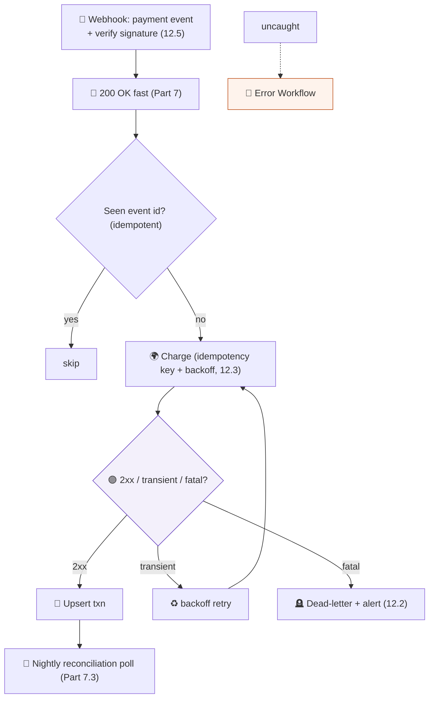

### The build & concepts applied

Every Part 12 concept: **signature verification, idempotency keys, transient-vs-fatal branching, capped backoff retries, dead-lettering, reconciliation, redacted logging, and a global error workflow.** Plus **PCI-DSS** awareness — never store raw card data; use the processor's tokens (Part 6).

### Pitfalls & your extension

> [!WARNING]
> **The double-charge is the cardinal sin.** A timeout doesn't mean the charge failed — it may have *succeeded*. Only ever charge with an **idempotency key** so a retry is safe (Part 12.3). And never touch raw card numbers — tokenize via the processor (PCI, Part 12.5).

> [!TIP]
> **Extension:** add real-time fraud scoring (rules + an AI signal, Part 11) that holds suspicious transactions for review; add automated refund and chargeback-dispute workflows.

---

## Project 9 · The CRM Automation ⚙️

### The problem

Sales data is messy and scattered: leads slip through cracks, follow-ups are forgotten, and the CRM is always out of date. **Goal:** capture every lead, enrich and score it, route it to the right rep, and automate follow-up sequences.

### The architecture

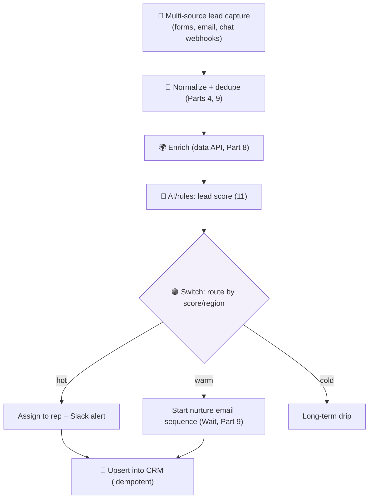

### The build & concepts applied

- **Multi-source capture** unified and **deduped** (Parts 4, 9) — the same lead from two channels shouldn't create two records (idempotent upsert).
- **Enrichment + AI scoring** (Parts 8, 11) to prioritize.
- **Nurture sequences** using **Wait** nodes (Part 9) for timed multi-step follow-ups.

### Pitfalls & your extension

> [!WARNING]
> **Deduplication is essential.** Without it, your CRM fills with duplicate contacts and reps waste time on the same lead. Match on email/phone and **upsert** (Parts 7, 9, 12). Also respect **consent/GDPR** for marketing contact (Part 12.5).

> [!TIP]
> **Extension:** use AI to draft personalized outreach per lead, auto-summarize call notes into the CRM, and detect at-risk deals (no activity in N days) for proactive nudges.

---

## Project 10 · The AI Research Agent 🔬

### The problem

Deep research — gathering sources, reading them, synthesizing findings, and writing a report — is slow, skilled human work. **Goal:** an autonomous agent that takes a research question, searches multiple sources, reads and synthesizes them, and produces a cited report — the most advanced project, combining *everything*.

### The architecture

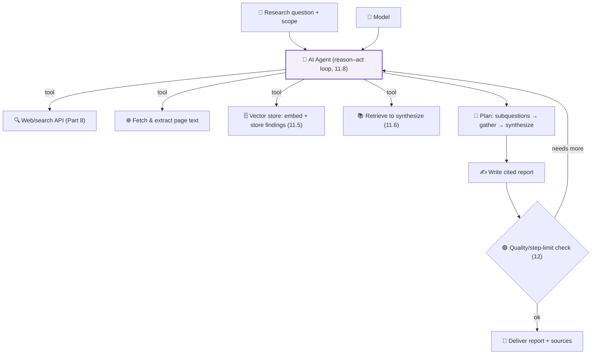

### The build & concepts applied

The full **agentic pattern** (Part 11.8): the agent **decomposes** the question into subquestions, **uses tools** (search, fetch, vector store) in a reason–act loop, **stores and retrieves** findings via RAG (11.5–11.6), and **synthesizes** a cited report — with **step limits, timeouts, and a quality gate** (Part 12) to keep it bounded and safe. Optionally exposed and extended via **MCP** (11.9).

### Pitfalls & your extension

> [!WARNING]
> **Agents can loop forever, rack up cost, and cite hallucinated sources** (Part 11). Enforce a **max-steps cap**, a **budget/time limit**, and require the agent to **quote real retrieved text** for every claim so citations are verifiable. Human review before any research is acted upon.

> [!TIP]
> **Extension:** expose the agent's tools via **MCP** (11.9) so other systems can reuse them; add a fact-checking pass where a second model critiques the first's report (self-verification); schedule recurring research digests on a topic.

---

## 🎓 Cross-Project Patterns — what the ten have in common

Step back and notice: the ten projects are **the same handful of patterns**, re-dressed for different industries. This is the deepest lesson of the book.

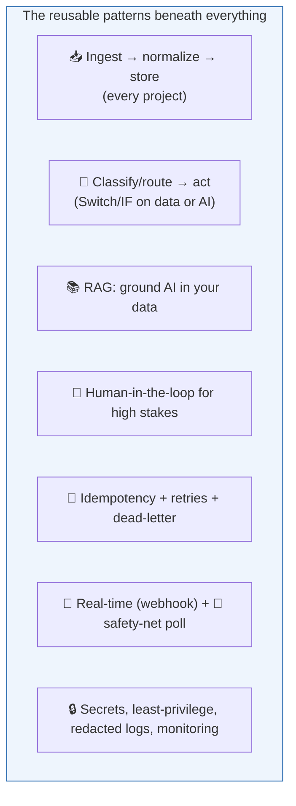

| Pattern | Appears in |
|---------|-----------|
| **Ingest → normalize → store** | All ten |
| **Classify/route then act** | Email, CRM, Support, Pharmacy |
| **RAG (ground AI in your data)** | Pharmacy, Support, Email, Research |
| **Human-in-the-loop approval** | Pharmacy, Payroll, Inventory, Email, Fintech |
| **Idempotency + retries + dead-letter** | Invoicing, Payroll, Payments, all money/critical flows |
| **Webhook + reconciliation safety net** | Payments, Invoicing, Inventory, Appointments |
| **Concurrency/atomic operations** | Appointments (double-book), Inventory (oversell) |
| **Least privilege + redacted logs + monitoring** | All ten (Part 12) |

**Master these seven patterns and you can build *any* automation** — the "industry" is just which nodes you plug in. A pharmacy assistant and a fintech pipeline share more DNA than they differ. That transferable insight is what separates someone who memorized n8n from an engineer who *understands automation* — exactly the goal you set on page one.

---

## ⚠️ Common Mistakes (across all projects)

- **Skipping the enterprise layer** (Part 12) because "it works in the demo" — then it fails in production. Build production-grade from the start.
- **Letting AI act autonomously on high stakes** without a human gate (clinical, money, outbound comms).
- **Ignoring concurrency** (double-booking, overselling) — let the *database* enforce correctness, not your workflow.
- **No deduplication/idempotency** on webhook- and multi-source flows → duplicates and double-actions.
- **Treating untrusted input (email, chat, docs) as commands** for an LLM → prompt injection.
- **One giant workflow** instead of small, composable, single-purpose ones (Parts 2, 12) that are testable and reusable.

## 🏆 Best Practices (capstone)

> [!BEST]
> **Compose small workflows; don't build monsters.** Each project above is really *several* cooperating workflows (ingest, process, notify, reconcile). Small pieces are testable, reusable across projects, and maintainable (Parts 2, 12).

> [!BEST]
> **Human-in-the-loop for anything irreversible or high-stakes** — money, health, legal, outbound communication. AI and automation *assist*; humans *approve*. Make the guardrail explicit, not implied.

> [!BEST]
> **Start simple, then harden.** Build the happy path first, confirm it works with real data, *then* add error handling, idempotency, monitoring, and scale (Part 12). Don't gold-plate before the core works — but never ship the core without the hardening.

> [!TIP]
> **Reuse the seven patterns.** When you face a new project, ask: "Which of the seven patterns does this need?" You'll almost always be assembling familiar pieces, not inventing from scratch.

---

## ❓ Review Questions

1. Across the ten projects, name the **seven reusable patterns** and give a project that uses each.
2. Why do the Pharmacy, Payroll, and Fintech projects all require **human-in-the-loop**, and where exactly is the gate placed in each?
3. Explain the **concurrency hazard** shared by the Appointment and Inventory projects, and how the *database* (not the workflow) solves it.
4. In the WhatsApp and Email projects, what is the **prompt-injection** risk and how do you defend against it?
5. Why must the Invoicing and Fintech reconciliation steps be **idempotent**? What breaks if they aren't?
6. Which projects use **RAG**, and what does RAG add that a plain LLM call cannot (Part 11.6)?
7. Pick any project and identify every Part 12 concern it must address (security, errors, retries, monitoring, deployment).
8. Why is "**start simple, then harden**" better than building every safeguard before the happy path works?
9. Explain how the AI Research Agent's **reason–act loop** works and the three guardrails that keep it bounded (Part 11.8, 12).
10. Choose two projects and describe how you'd **compose** them (e.g., Pharmacy reorder → Inventory; Email sales → CRM). What data flows between them?

## 🚀 Capstone Mini Project (design AND build one, end to end)

**"Ship one real system."**

Choose **one** of the ten projects (or invent your own for a domain you care about) and take it all the way:

1. **Design** the architecture as a labeled flowchart — every trigger, node, and connection, split into the small cooperating workflows it really needs.
2. **Map the data shape** at each major step (Part 4) — what the traveling package looks like from trigger to finish.
3. **Build the happy path** in n8n with real (or realistic mock) APIs and credentials (Parts 6, 8).
4. **Harden it** (Part 12): add a global Error Workflow, idempotency on every write, retries with backoff on transient failures, redacted logging, monitoring/alerts, and a human-approval gate if it's high-stakes.
5. **Identify which of the seven patterns** you used, and where.
6. **Write a one-page README**: what it does, its triggers, dependencies, secrets it needs, and how to roll it back (Part 12.6).

Deliverable: the working (or fully specified) workflow(s), the architecture diagram, the data-shape map, and the README. *This is the exam.* If you can do this, you are no longer learning automation — you are **practicing** it.

---

## 📝 Summary — Chapter 13 & the whole book, on one page

- The ten projects — **Pharmacy AI, WhatsApp Support, Invoicing, HR Payroll, Hospital Appointments, Inventory, AI Email, Fintech Payments, CRM, Research Agent** — are complete, production-shaped systems, each assembling the concepts of Parts 1–12.
- They are built from **seven reusable patterns**: ingest→normalize→store; classify/route→act; RAG-grounded AI; human-in-the-loop; idempotency+retries+dead-letter; webhook+reconciliation; and least-privilege+observability. **The industry changes; the patterns don't.**
- **Recurring hazards** to design against: hallucination (ground with RAG + human gates), concurrency (let the DB enforce it), duplicates (idempotency/dedupe), prompt injection (treat input as data), and double-charging/double-acting (idempotency keys).
- **The engineer's method:** compose small workflows, start simple then harden, keep humans in control of high-stakes actions, and reuse patterns rather than reinventing.

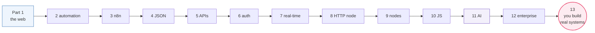

> ## 🎓 Graduation
>
> You began not knowing what software was. You end able to **design, debug, and deploy production-grade AI workflows** — and, more importantly, you understand **why** they work: how computers communicate, how APIs and auth function, how data flows, how AI reasons, and how enterprise systems are made reliable.
>
> That was the goal from the very first page. Not to make you *memorize n8n* — tools change — but to make you **deeply understand automation** so you can build enterprise AI systems for years to come, on any tool, in any industry.
>
> The nodes were never the point. The *thinking* was. Now go build something real. 🚀
